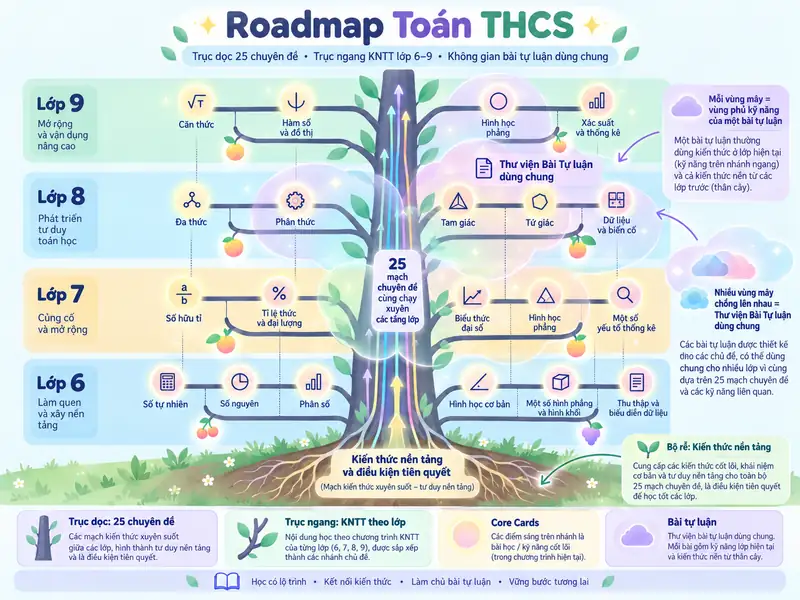
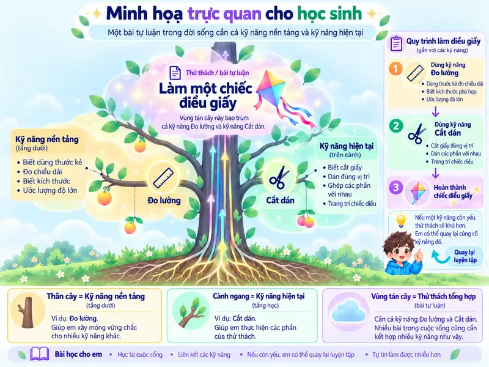
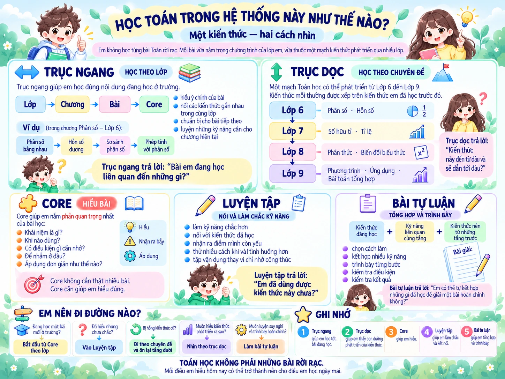
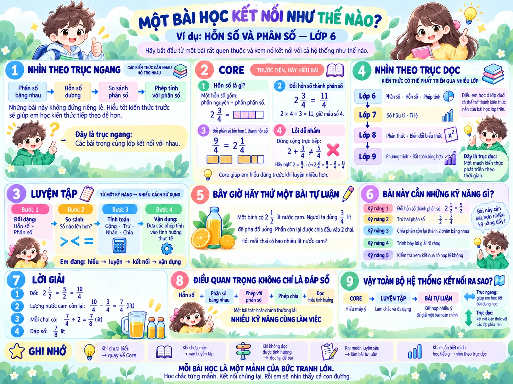

---
hide:
  - navigation
  - toc
---

  KHÔNG GIAN HỌC CỦA BẠN
  
<button type="button" class="home-style-choice" data-home-select="standard" aria-pressed="true">◈ Giao diện chuẩn</button><button type="button" class="home-style-choice" data-home-select="playful" aria-pressed="false">✦ Giao diện vui nhộn</button>

  

  <section class="home-style-panel" role="dialog" aria-modal="true" aria-labelledby="home-style-title" aria-describedby="home-style-description" tabindex="-1">
    <button class="home-style-close" type="button" data-home-dismiss aria-label="Đóng hộp chọn giao diện">×</button>
    🎨<h2 id="home-style-title">Chọn phong cách học tập</h2>
    
Cùng một kho kiến thức, hai không gian. Bạn có thể đổi bất cứ lúc nào.

    

      <button type="button" data-home-select="standard" class="home-style-card">
        Hiểu bản chất. Tiến bộ từng chặng.25Số học · Đại số · Hình học
        <strong>Giao diện chuẩn</strong><small>Hiện đại, gọn gàng, tập trung vào nội dung.</small>Dùng giao diện này →
      </button>
      <button type="button" data-home-select="playful" class="home-style-card home-style-card-playful">
        
        <strong>Giao diện vui nhộn</strong><small>Góc học tập rực rỡ cùng cô bé ngủ gật đáng yêu.</small>Dùng giao diện này →
      </button>
    

    
Không ảnh hưởng tiến độ học hoặc dữ liệu luyện tập.

  </section>

<section class="home-hero" aria-labelledby="home-title">
  

     SELF-LEARNING MATH · TOÁN THCS LỚP 6–9
    <h1 id="home-title">Hiểu bản chất. Tiến bộ từng chặng.</h1>
    
Self-Learning Math — không gian tự học Toán từ nền tảng đến ôn thi vào lớp 10: học qua hình ảnh, luyện đúng kỹ năng và biết cần ôn lại điều gì sau mỗi lần làm bài.

    

      <a class="home-button home-button-primary" href="kien-thuc/">Khám phá 25 chuyên đề ↗</a>
      <a class="home-button home-button-ghost" href="roadmap/">Xem lộ trình học →</a>
    

    
Luyện tập có giải thích · Theo dõi tiến độ theo kỹ năng · Không khóa quyền học tiếp

  

  

    

      

      
HÀNH TRÌNH<strong>25</strong>chuyên đề

      
01<strong>Số học</strong><small>Khởi đầu</small>

      
02<strong>Đại số</strong><small>Phát triển</small>

      
03<strong>Hình học</strong><small>Trực quan</small>

      
04<strong>Vận dụng</strong><small>Kết nối</small>

    

  

  

    
📖 GÓC HỌC TẬPMột chút phép màu ✦

    <button type="button" class="study-wake-button" data-study-wake aria-label="Đánh thức cô bé đang ngủ gật để bắt đầu học">
      
        
      
      Suỵt… bạn ấy ngủ gật rồi! <strong>Chạm để đánh thức ✨</strong>Bạn ấy tỉnh rồi! Cùng bắt đầu học nào ✨
    </button>
    

      
Chào mừng vào lớp học!

      
<a href="kien-thuc/">📘 Vào học</a><a href="roadmap/">🧭 Xem Roadmap</a><a href="kien-thuc/23-xac-suat/bai-tap/">✏️ Luyện tập</a>

    

    
Bạn vẫn có thể chọn <strong>Khám phá 25 chuyên đề</strong> để vào thẳng.

  

</section>

  
<strong>25</strong>chuyên đề có nội dung

  
<strong>4</strong>mạch kiến thức

  
<strong>6–9</strong>lộ trình theo lớp

  
<strong>3</strong>bước học – luyện – kiểm tra

<section class="home-section home-start-section" aria-labelledby="home-paths">
  

BẮT ĐẦU TỪ ĐÂU?<h2 id="home-paths">Hiểu hệ thống · Chọn lối vào</h2>
Xem nhanh cách kiến thức kết nối, sau đó chọn điểm vào phù hợp với việc em đang cần làm.

  

    

      <article class="home-slide home-slide-tree is-active" data-home-slide aria-hidden="false">
        

          01 · NHÌN TOÀN BỘ BẢN ĐỒ
          <h3>Cây Toán học</h3>
          
<strong>Đi ngang</strong> để học bài hiện tại. <strong>Đi dọc</strong> để thấy kiến thức nền và con đường phát triển qua nhiều lớp.

          <a href="#hieu-cach-hoc">Xem Cây Toán học đầy đủ ↓</a>
        

        

          KIẾN THỨC NỀN
          
          <i>Lớp 6</i><b></b><b></b>
          <i>Lớp 7</i><b></b><b></b>
          <i>Lớp 8</i><b></b><b></b>
          <i>Lớp 9</i><b></b><b></b>
          Bài tự luận <small>kết nối nhiều kỹ năng</small>
        

      </article>

      <article class="home-slide home-slide-paths" data-home-slide aria-hidden="true" hidden>
        

          02 · HAI LỘ TRÌNH
          <h3>Hai đường đi · Một hệ kiến thức</h3>
          
Em có thể bắt đầu từ bài đang học ở trường hoặc đi theo một chuyên đề xuyên nhiều lớp. Hai cách học dùng chung kiến thức và kỹ năng.

        

        

          
📘<strong>Học theo lớp</strong><small>Lớp → Chương → Bài → Core</small><a href="hoc-theo-lop/">KNTT lớp 6–9 →</a>

          
🧭<strong>Học theo chuyên đề</strong><small>25 mạch kiến thức xuyên lớp</small><a href="roadmap/">Mở Vertical Spine →</a>

        

      </article>

      <article class="home-slide home-slide-cycle" data-home-slide aria-hidden="true" hidden>
        

          03 · TỪ HIỂU ĐẾN TỰ LÀM
          <h3>Core → Luyện tập → Tự kiểm tra</h3>
          
Mỗi không gian có một nhiệm vụ khác nhau: hiểu đúng, làm chắc và cuối cùng thử sức độc lập không cần trợ giúp.

        

        

          
💡<strong>CORE</strong><small>Hiểu</small>
<i aria-hidden="true">→</i>
          
✎<strong>LUYỆN TẬP</strong><small>Làm chắc & kết nối</small>
<i aria-hidden="true">→</i>
          
✓<strong>TỰ KIỂM TRA</strong><small>Tự làm độc lập</small>

        

      </article>

      <article class="home-slide home-slide-written" data-home-slide aria-hidden="true" hidden>
        

          04 · BÀI TỰ LUẬN KẾT NỐI KỸ NĂNG
          <h3>Nhiều kỹ năng cùng làm việc</h3>
          
Một bài tự luận có thể cần kỹ năng đang học trên cành ngang và kiến thức nền từ những tầng trước. Nếu còn yếu, em có thể quay lại củng cố.

          <a href="#hieu-cach-hoc">Xem bộ hướng dẫn đầy đủ ↓</a>
        

        

          Kiến thức nền
          Kỹ năng hiện tại
          ↗
          ↖
          BÀI TỰ LUẬN<small>Tổng hợp · lựa chọn cách làm · trình bày</small>
        

      </article>
    

    

      <button type="button" class="home-slider-arrow" data-home-slider-prev aria-label="Xem trang hướng dẫn trước">←</button>
      

        <button type="button" data-home-slider-dot="0" class="is-active" aria-label="Trang 1: Cây Toán học" aria-pressed="true"></button>
        <button type="button" data-home-slider-dot="1" aria-label="Trang 2: Hai lộ trình" aria-pressed="false"></button>
        <button type="button" data-home-slider-dot="2" aria-label="Trang 3: Core, Luyện tập, Tự kiểm tra" aria-pressed="false"></button>
        <button type="button" data-home-slider-dot="3" aria-label="Trang 4: Bài tự luận kết nối kỹ năng" aria-pressed="false"></button>
      

      <button type="button" class="home-slider-arrow" data-home-slider-next aria-label="Xem trang hướng dẫn tiếp theo">→</button>
    

  

  <nav class="home-quick-paths" aria-label="Bốn điểm vào học tập">
    <a class="home-quick-path home-quick-class" href="hoc-theo-lop/">📘<strong>Học theo lớp</strong><small>KNTT lớp 6–9</small><i aria-hidden="true">→</i></a>
    <a class="home-quick-path home-quick-topic" href="roadmap/">🧭<strong>Học theo chuyên đề</strong><small>25 chuyên đề xuyên lớp</small><i aria-hidden="true">→</i></a>
    <a class="home-quick-path home-quick-practice" href="luyen-tap/">✎<strong>Luyện tập</strong><small>Làm chắc kỹ năng</small><i aria-hidden="true">→</i></a>
    <a class="home-quick-path home-quick-exam" href="kien-thuc/25-tong-hop-on-thi-10/">◎<strong>Ôn thi vào 10</strong><small>Vận dụng & tổng hợp</small><i aria-hidden="true">→</i></a>
  </nav>
</section>

<section class="home-section home-guide-section" id="hieu-cach-hoc" aria-labelledby="home-guide-title">
  

    

      HIỂU CÁCH HỌC
      <h2 id="home-guide-title">Bốn hình · Một bản đồ học tập</h2>
      
Đi từ bức tranh tổng thể đến một bài Toán thật. Em không cần nhớ tất cả — chỉ cần biết mình đang ở đâu, cần củng cố gì và nên đi tiếp theo hướng nào.

    

  

  

    <button class="home-guide-card" type="button" data-home-guide-open
      data-guide-src="assets/images/learning-guide/01-tree-math-roadmap.webp"
      data-guide-title="Nhìn toàn bộ bản đồ"
      data-guide-copy="Đi ngang để học theo lớp; đi dọc để thấy kiến thức nền và con đường phát triển. Vùng mây cho thấy bài tự luận có thể huy động nhiều kỹ năng cùng lúc.">
      
        
      
      <small>01 · NHÌN TOÀN BỘ BẢN ĐỒ</small><strong>Cây Toán học</strong>Trục dọc · Trục ngang · Core Cards · Bài tự luận
      Chạm để xem ảnh lớn ↗
    </button>

    <button class="home-guide-card" type="button" data-home-guide-open
      data-guide-src="assets/images/learning-guide/02-kite-skill-example.webp"
      data-guide-title="Hiểu bằng ví dụ đời sống"
      data-guide-copy="Làm một chiếc diều giấy cần cả kỹ năng nền như đo lường và kỹ năng hiện tại như cắt dán. Nếu một kỹ năng còn yếu, em có thể quay lại củng cố.">
      
        
      
      <small>02 · HIỂU BẰNG VÍ DỤ ĐỜI SỐNG</small><strong>Làm một chiếc diều giấy</strong>Kỹ năng nền + kỹ năng hiện tại → thử thách tổng hợp
      Chạm để xem ảnh lớn ↗
    </button>

    <button class="home-guide-card" type="button" data-home-guide-open
      data-guide-src="assets/images/learning-guide/03-how-to-learn-system.webp"
      data-guide-title="Biết cách chọn đường học"
      data-guide-copy="Khi nào học theo lớp, khi nào đi theo chuyên đề, và Core – Luyện tập – Bài tự luận giúp em làm gì? Hình này là hướng dẫn sử dụng hệ thống.">
      
        
      
      <small>03 · BIẾT CÁCH CHỌN ĐƯỜNG HỌC</small><strong>Học Toán trong hệ thống này như thế nào?</strong>Hiểu · Luyện · Kết nối · Tổng hợp
      Chạm để xem ảnh lớn ↗
    </button>

    <button class="home-guide-card" type="button" data-home-guide-open
      data-guide-src="assets/images/learning-guide/04-fraction-lesson-connection.webp"
      data-guide-title="Xem một bài Toán thật"
      data-guide-copy="Ví dụ Hỗn số và Phân số lớp 6 cho thấy một kiến thức đi từ Core sang Luyện tập rồi kết nối nhiều kỹ năng trong bài tự luận như thế nào.">
      
        
      
      <small>04 · XEM MỘT BÀI TOÁN THẬT</small><strong>Hỗn số và phân số · Lớp 6</strong>Từ một ý → nhiều kỹ năng cùng làm việc
      Chạm để xem ảnh lớn ↗
    </button>
  

  
<strong>Em không cần thuộc cả bản đồ.</strong> Hãy dùng nó như biển chỉ đường: chưa hiểu → về Core; chưa chắc → Luyện tập; hổng gốc → quay xuống tầng kiến thức trước; muốn luyện sâu → Bài tự luận.

</section>

  

  <section class="home-guide-dialog-panel" role="dialog" aria-modal="true" aria-labelledby="home-guide-dialog-title" aria-describedby="home-guide-dialog-copy" tabindex="-1">
    <button class="home-guide-dialog-close" type="button" data-home-guide-close aria-label="Đóng infographic">×</button>
    

      HIỂU CÁCH HỌC
      <h2 id="home-guide-dialog-title" data-home-guide-dialog-title></h2>
      

    

    

  </section>

<section class="home-section home-feature-panel" aria-labelledby="home-process">
  

PHƯƠNG PHÁP HỌC<h2 id="home-process">Mỗi chuyên đề là một hành trình nhỏ</h2>
Không chỉ đọc bài rồi chuyển trang: mỗi bước đều có mục đích rõ ràng.

<a class="home-text-link" href="huong-dan/nguyen-tac-hoc-moi-chuyen-de/">Xem hướng dẫn học ↗</a>

  

    
01▤<h3>Học để hiểu</h3>
Kiến thức cốt lõi, hình minh họa, ví dụ mẫu và lỗi thường gặp.

    
02✎<h3>Luyện có phản hồi</h3>
Trả lời câu hỏi, xem hướng dẫn khi sai và luyện lại đúng kỹ năng.

    
03✓<h3>Tự kiểm tra</h3>
Đối chiếu kết quả, chữa lỗi và chủ động quyết định chặng tiếp theo.

  

</section>

<section class="home-section" aria-labelledby="home-subjects">
  

KHÁM PHÁ NỘI DUNG<h2 id="home-subjects">Bốn mạch kiến thức, một bức tranh thống nhất</h2>
Chọn mạch đang học hoặc mở toàn bộ danh mục để xem 25 chuyên đề.

<a class="home-text-link" href="kien-thuc/">Toàn bộ chuyên đề ↗</a>

  

    
x²<h3>Số & Đại số</h3>
Từ số và phép tính đến hàm số, căn thức và phương trình.
<a href="kien-thuc/04-bieu-thuc-dai-so/">Biểu thức đại số ↗</a><a href="kien-thuc/08-phuong-trinh-bat-phuong-trinh/">Phương trình ↗</a>

    
△<h3>Hình học</h3>
Góc, tam giác, tứ giác, đồng dạng và đường tròn.
<a href="kien-thuc/14-tam-giac/">Tam giác ↗</a><a href="kien-thuc/19-duong-tron/">Đường tròn ↗</a>

    
%<h3>Thống kê & Xác suất</h3>
Đọc dữ liệu, diễn giải biểu đồ và hiểu phép thử ngẫu nhiên.
<a href="kien-thuc/21-thong-ke/">Thống kê ↗</a><a href="kien-thuc/23-xac-suat/">Xác suất ↗</a>

    
→<h3>Ứng dụng & Tổng hợp</h3>
Mô hình hóa tình huống và luyện liên chuyên đề.
<a href="kien-thuc/24-bai-toan-thuc-te/">Bài toán thực tế ↗</a><a href="kien-thuc/25-tong-hop-on-thi-10/">Ôn thi vào 10 ↗</a>

  

</section>

<section class="home-bottom-cta">
SẴN SÀNG BẮT ĐẦU?<h2>Không cần học tất cả cùng lúc.</h2>
Bắt đầu từ kiến thức đang cần, học chắc một bước rồi tiếp tục bước tiếp theo.

<a class="home-button home-button-primary" href="kien-thuc/">Mở danh mục 25 chuyên đề →</a><a class="home-bottom-secondary" href="huong-dan/lo-trinh-tu-hoc/">Hướng dẫn tự học</a>
</section>

