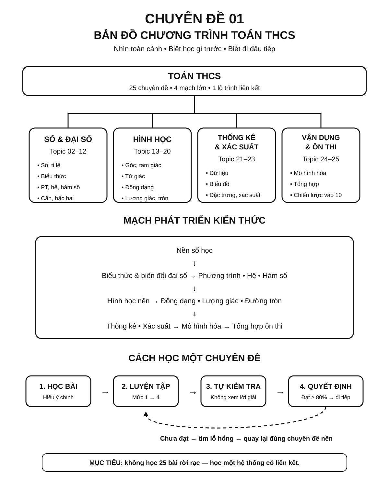

# Chuyên đề 01 – Bản đồ chương trình Toán THCS

> **Trạng thái:** Roadmap 25/25 chuyên đề đã hoàn tất kiểm định học thuật và tổng kiểm cấu trúc.
>
> **Lớp trọng tâm:** 6–9
> **Mạch kiến thức:** Tổng hợp
> **Mức ưu tiên:** ⭐⭐⭐⭐⭐

---

## 🧭 1. Bản đồ kiến thức

```text
TOÁN THCS – BẢN ĐỒ 25 CHUYÊN ĐỀ
│
├── A. SỐ & ĐẠI SỐ
│   ├── 02. Số và phép tính
│   ├── 03. Tỉ lệ – Tỉ lệ thức – Đại lượng tỉ lệ
│   ├── 04. Biểu thức và biến đổi đại số
│   ├── 05. 7 Hằng đẳng thức đáng nhớ
│   ├── 06. Phân tích đa thức thành nhân tử
│   ├── 07. Phân thức đại số
│   ├── 08. Phương trình và bất phương trình
│   ├── 09. Hệ phương trình bậc nhất hai ẩn
│   ├── 10. Hàm số và đồ thị
│   ├── 11. Căn thức và biến đổi căn thức
│   └── 12. Phương trình bậc hai & Viète – chuẩn bị THPT
│
├── B. HÌNH HỌC
│   ├── 13. Góc và quan hệ giữa các đường thẳng
│   ├── 14. Tam giác
│   ├── 15. Các đường đồng quy trong tam giác
│   ├── 16. Tứ giác và các hình đặc biệt
│   ├── 17. Định lý Thales và tam giác đồng dạng
│   ├── 18. Hệ thức lượng trong tam giác vuông
│   ├── 19. Đường tròn
│   └── 20. Hình học tổng hợp, đo lường và hình khối
│
├── C. THỐNG KÊ & XÁC SUẤT
│   ├── 21. Thống kê và thu thập dữ liệu
│   ├── 22. Các đại lượng đặc trưng của dữ liệu
│   └── 23. Xác suất
│
└── D. VẬN DỤNG & ÔN THI
    ├── 24. Bài toán thực tế và mô hình hóa
    └── 25. Bản đồ tổng hợp & chiến lược ôn thi vào 10
```

Roadmap không nên được học như 25 bài tách rời. Mạch chính là:

```text
Nền số học
   ↓
Biểu thức và biến đổi đại số
   ↓
Phương trình – hệ – hàm số
   ↓
Hình học nền
   ↓
Đồng dạng – lượng giác – đường tròn
   ↓
Thống kê – xác suất
   ↓
Mô hình hóa thực tế
   ↓
Tổng hợp ôn thi vào 10
```

> Chuyên đề 01 là **bản đồ định hướng**. Khi chưa rõ nên học gì tiếp theo, hãy quay lại đây để xác định vị trí hiện tại trong toàn bộ hệ thống.

### Infographic – Tổng quan Roadmap Toán THCS



---

## 🎯 2. Mục tiêu cần đạt

Sau khi hoàn thành chuyên đề, học sinh cần:

- [ ] Nhìn được toàn cảnh các mạch kiến thức Toán THCS.
- [ ] Biết mỗi chuyên đề nằm ở đâu trong Roadmap 25 chuyên đề.
- [ ] Hiểu quan hệ tiên quyết giữa các nhóm kiến thức.
- [ ] Biết chọn chuyên đề tiếp theo dựa trên kiến thức đã có.
- [ ] Phân biệt giai đoạn học nền, luyện chuyên đề và tổng hợp ôn thi.
- [ ] Biết quay lại đúng chuyên đề khi phát hiện một lỗ hổng kiến thức.

---

## 📖 3. Kiến thức cốt lõi

### 3.1. Cấu trúc toàn bộ Roadmap

Roadmap gồm bốn mạch lớn:

| Mạch | Chuyên đề | Vai trò |
|---|---|---|
| Số & Đại số | 02–12 | Nền biến đổi, phương trình, hàm số |
| Hình học | 13–20 | Suy luận hình, độ dài, góc, đường tròn |
| Thống kê & Xác suất | 21–23 | Đọc dữ liệu, đại lượng đặc trưng, xác suất |
| Vận dụng & Ôn thi | 24–25 | Mô hình hóa và tổng hợp kiến thức |

### 3.2. Mạch Số & Đại số

Thứ tự tư duy nên đi từ nền tới tổng hợp:

`Số → phân số/tỉ lệ → biểu thức → hằng đẳng thức → nhân tử → phân thức → phương trình → hệ → hàm số → căn thức → bậc hai`

Điểm quan trọng:
- biểu thức và biến đổi đại số là nền cho phương trình;
- phương trình và hệ là nền cho nhiều bài toán thực tế;
- hàm số và bậc hai là phần trọng tâm ở lớp 9.

### 3.3. Mạch Hình học

Thứ tự phát triển:

`Góc → tam giác → đường đặc biệt → tứ giác → Thales/đồng dạng → hệ thức lượng → đường tròn → tổng hợp`

Điểm quan trọng:
- góc, song song, vuông góc là “ngôn ngữ nền”;
- đồng dạng là cầu nối rất mạnh giữa góc và độ dài;
- đường tròn thường kết hợp đồng dạng, nội tiếp và tiếp tuyến;
- hình học tổng hợp đòi hỏi nối nhiều chuyên đề cùng lúc.

### 3.4. Mạch Thống kê & Xác suất

Thứ tự:

`Thu thập dữ liệu → bảng/biểu đồ → trung bình/trung vị/mốt → xác suất`

Mạch này cần:
- đọc dữ liệu chính xác;
- biết chọn đại lượng đại diện;
- hiểu cách đếm kết quả và xác suất đơn giản.

### 3.5. Mạch Vận dụng & Ôn thi

Chuyên đề 24 dùng kiến thức từ nhiều mạch để mô hình hóa tình huống thực tế.

Chuyên đề 25 dùng toàn bộ Roadmap để:
- hệ thống hóa;
- xác định ưu tiên;
- luyện đề;
- chữa lỗi;
- xây chiến lược thi.

### 3.6. Quan hệ tiên quyết quan trọng

| Nếu đang yếu ở... | Nên quay lại |
|---|---|
| Phương trình | Biểu thức, hằng đẳng thức, phân tích nhân tử |
| Hệ phương trình | Phương trình và biến đổi đại số |
| Hàm số bậc hai | Hàm số, phương trình bậc hai |
| Tam giác đồng dạng | Góc, tam giác |
| Hệ thức lượng | Tam giác vuông, đồng dạng |
| Đường tròn | Góc, đồng dạng, hệ thức lượng |
| Bài toán thực tế | Phương trình/hệ, phần trăm, lượng giác |
| Ôn thi tổng hợp | Chuyên đề đang gây lỗi trong đề luyện |

### 3.7. Ba trạng thái học

**Chưa học**
- đọc mục tiêu;
- học kiến thức cốt lõi;
- làm bài nhận biết.

**Đang củng cố**
- luyện dạng bài;
- sửa lỗi;
- làm tự kiểm tra.

**Đã hoàn thành**
- đạt tiêu chí cuối chuyên đề;
- chuyển sang chuyên đề tiếp theo;
- vẫn quay lại nếu lỗi tái xuất hiện.

### 3.8. Cách dùng Roadmap hiệu quả

Không nhất thiết lúc nào cũng học đúng số thứ tự tuyệt đối.

Nguyên tắc:
1. bảo đảm kiến thức tiên quyết;
2. học chuyên đề hiện tại;
3. tự kiểm tra;
4. nếu chưa đạt, quay lại lỗ hổng;
5. nếu đạt, chuyển tiếp;
6. khi vào giai đoạn thi, ưu tiên theo đề địa phương và kết quả luyện đề.

---

## 🔗 4. Kiến thức liên quan

- **Kiến thức nên ôn trước:** không yêu cầu; đây là điểm bắt đầu của hệ thống.
- **Chuyên đề sử dụng tiếp:** bắt đầu từ [02 – Số và phép tính](../02-so-va-phep-tinh/index.md), sau đó đi theo mạch phù hợp trong [Blueprint 25 chuyên đề](../../roadmap/blueprint-25-chuyen-de.md).

---

## 🧩 5. Các dạng bài cần nắm vững

Chuyên đề 01 không tập trung vào một dạng toán riêng mà vào **kỹ năng định hướng học tập**.

### Dạng 1. Xác định vị trí kiến thức

Cho một nội dung như “phương trình”, “đường tròn”, “trung vị”; xác định nó thuộc mạch và chuyên đề nào.

### Dạng 2. Xác định kiến thức tiên quyết

Ví dụ:
- muốn học đồng dạng → cần chắc góc và tam giác;
- muốn học hệ thức lượng → cần chắc tam giác vuông và đồng dạng.

### Dạng 3. Tạo lộ trình cá nhân

Dựa vào kết quả hiện tại, chọn nhóm chuyên đề:
- cần học mới;
- cần củng cố;
- đã hoàn thành.

### Dạng 4. Truy nguyên lỗi

Khi sai một câu, không chỉ sửa câu đó mà xác định chuyên đề gốc gây lỗi.

### Dạng 5. Lập kế hoạch ôn tập

Chọn chuyên đề theo:
- mức độ yếu;
- mức độ xuất hiện trong đề;
- thời gian còn lại;
- cấu trúc đề địa phương.

---

## 🚀 6. Dạng bài thi vào lớp 10

Chuyên đề 01 không trực tiếp tạo một câu thi riêng. Vai trò của nó là giúp tổ chức toàn bộ quá trình chuẩn bị thi.

Khi ôn vào 10, dùng bản đồ này để:
1. xác định câu sai thuộc chuyên đề nào;
2. tìm kiến thức tiên quyết cần ôn lại;
3. tránh học dàn trải;
4. kết nối với [Chuyên đề 25 – Chiến lược ôn thi](../25-tong-hop-on-thi-10/index.md).

Mức ưu tiên: **⭐⭐⭐⭐⭐** vì đây là bản đồ điều hướng toàn bộ hệ thống.

---

## ⚠️ 7. Lỗi sai thường gặp

| Lỗi sai | Cách tránh |
|---|---|
| Học từng bài rời rạc | Luôn xác định bài thuộc mạch nào |
| Học phần nâng cao khi nền còn yếu | Kiểm tra kiến thức tiên quyết |
| Sai phương trình nhưng chỉ luyện thêm đề | Quay lại biểu thức và biến đổi nếu cần |
| Sai hình tổng hợp nhưng không biết thiếu gì | Truy ngược về góc, đồng dạng, đường tròn |
| Cố học theo đúng thứ tự dù đã có nền | Có thể bỏ qua phần đã đạt tiêu chí |
| Ôn thi dàn trải | Dùng Chuyên đề 25 và kết quả đề luyện để ưu tiên |

---

## 📝 8. Luyện tập

### Mức 1 – Nhận biết

1. Roadmap có mấy mạch kiến thức lớn?
2. Chuyên đề 17 thuộc mạch nào?
3. Chuyên đề 21–23 thuộc nhóm kiến thức nào?
4. Chuyên đề nào dùng để tổng hợp chiến lược ôn thi?

### Mức 2 – Thông hiểu

5. Vì sao nên học biểu thức trước phương trình?
6. Vì sao đồng dạng là kiến thức quan trọng trước hình học tổng hợp?
7. Nếu yếu bài phần trăm thực tế, nên kiểm tra lại những chuyên đề nào?

### Mức 3 – Vận dụng

8. Một học sinh sai nhiều bài hệ phương trình do biến đổi đại số yếu. Hãy đề xuất đường quay lại Roadmap.
9. Một học sinh yếu đường tròn vì không nhận ra các cặp góc bằng nhau. Nên củng cố gì trước?
10. Tạo danh sách 5 chuyên đề cần ưu tiên dựa trên một đề thi thử.

### Mức 4 – Tổng hợp

11. Tự đánh dấu 25 chuyên đề thành ba nhóm: chưa học / đang củng cố / đã hoàn thành.
12. Từ kết quả trên, lập lộ trình 4 tuần có thứ tự và lý do rõ ràng.

---

## ✅ 9. Tự kiểm tra

Hãy tự trả lời không nhìn tài liệu:

1. Bốn mạch lớn của Roadmap là gì?
2. Nhóm chuyên đề 02–12 tập trung vào mạch nào?
3. Nhóm 13–20 tập trung vào mạch nào?
4. Vì sao kiến thức tiên quyết quan trọng?
5. Nếu sai bài đường tròn do đồng dạng yếu, nên làm gì?
6. Chuyên đề 24 có vai trò gì?
7. Chuyên đề 25 có vai trò gì?
8. Khi nào nên quay lại một chuyên đề đã học?

**Tiêu chí đạt:** đúng ít nhất `7/8` câu và tự xây được một lộ trình học/ôn ngắn dựa trên trạng thái kiến thức hiện tại.

---

## 🔄 10. Liên kết Roadmap

- **← Trước:** không có; đây là điểm bắt đầu.
- **→ Bắt đầu học:** [02 – Số và phép tính](../02-so-va-phep-tinh/index.md)
- **→ Bản thiết kế đầy đủ:** [Blueprint 25 chuyên đề](../../roadmap/blueprint-25-chuyen-de.md)
- **→ Điểm kết thúc:** [25 – Tổng hợp & chiến lược ôn thi vào 10](../25-tong-hop-on-thi-10/index.md)

Xem toàn bộ hệ thống tại [Blueprint 25 chuyên đề](../../roadmap/blueprint-25-chuyen-de.md).

---

## 🏁 11. Điều kiện hoàn thành

Chuyên đề được xem là hoàn thành khi học sinh:

- [ ] Kể được bốn mạch lớn của Roadmap.
- [ ] Xác định được vị trí của một chuyên đề bất kỳ.
- [ ] Biết ít nhất ba quan hệ tiên quyết quan trọng.
- [ ] Biết cách quay lại chuyên đề gốc khi gặp lỗi.
- [ ] Tự phân loại được trạng thái học của các chuyên đề.
- [ ] Lập được một lộ trình học hoặc ôn tập ngắn.
- [ ] Đạt ít nhất `7/8` câu tự kiểm tra.
