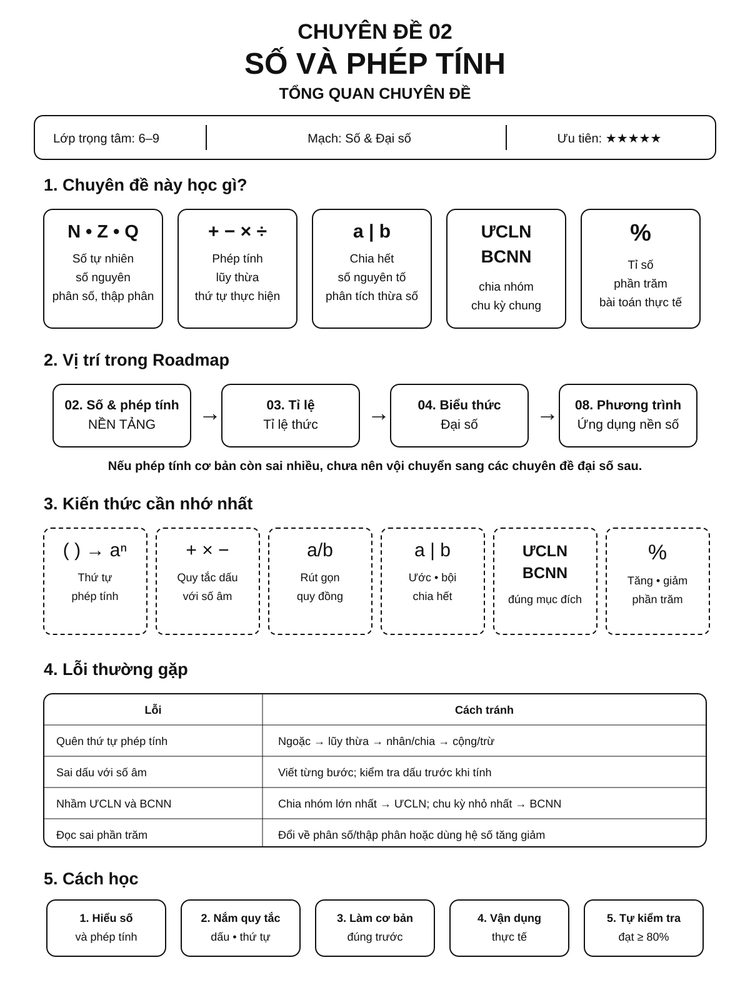
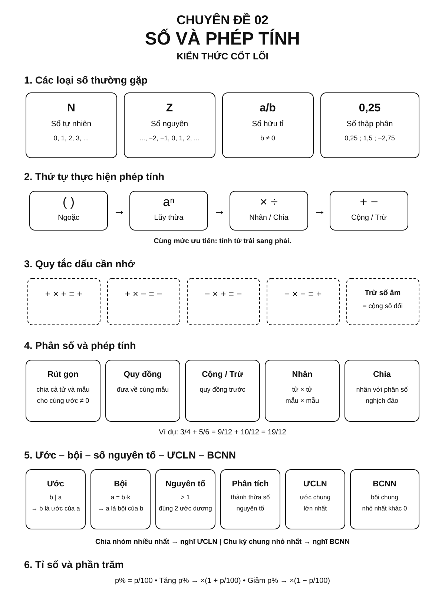
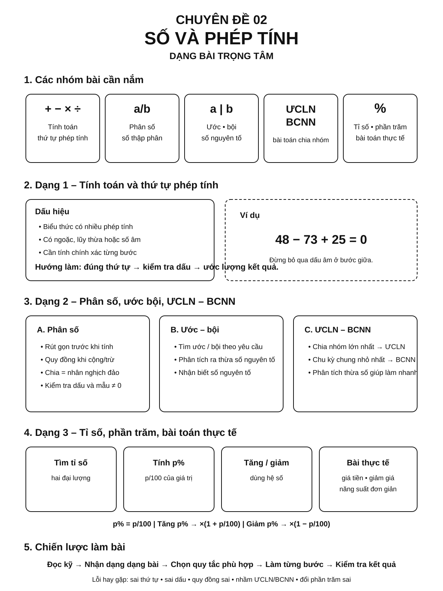

# Chuyên đề 02 – Số và phép tính


> **Trạng thái:** Đã kiểm định nội dung học thuật; cấu trúc Roadmap chuẩn 11 mục.
>
> **Lớp trọng tâm:** 6–9
> **Mạch kiến thức:** Số
> **Mức ưu tiên:** ⭐⭐⭐⭐⭐

> **Vai trò trong Roadmap:** nền tảng số học xuyên suốt THCS, làm cơ sở cho tỉ lệ, biểu thức đại số, căn thức, xác suất và các bài toán thực tế.
>

!!! info "Học từ lớp 6"
    Em nên bắt đầu bằng **5 chặng học tương tác** ở phía trên, theo SGK KNTT lớp 6 (Bài 1–17, 23–31). Phần kiến thức trong bài dài này còn có nội dung lớp 7 và các liên hệ học sau: em chỉ cần học đúng phần phù hợp với lớp của mình. Nếu muốn học trước, hãy hỏi AI Tutor về kiến thức nền cần thiết.

---

<span id="core-journey"></span>

## 🧭 1. Bản đồ kiến thức

### Infographic 1 – Tổng quan chuyên đề



> Dùng infographic này để nhìn nhanh **chuyên đề học gì, nằm ở đâu trong Roadmap, kiến thức nào cần nhớ nhất và lỗi nào cần tránh**.

```text
SỐ VÀ PHÉP TÍNH
│
├── 1. Các tập hợp số
│   ├── Số tự nhiên
│   ├── Số nguyên
│   ├── Số hữu tỉ
│   └── Số thực
│
├── 2. Phép tính
│   ├── Cộng – trừ
│   ├── Nhân – chia
│   ├── Lũy thừa
│   └── Thứ tự thực hiện phép tính
│
├── 3. Chia hết
│   ├── Dấu hiệu chia hết
│   ├── Số nguyên tố – hợp số
│   ├── ƯCLN
│   └── BCNN
│
├── 4. Phân số – số hữu tỉ
│   ├── Rút gọn
│   ├── Quy đồng
│   ├── So sánh
│   └── Phép tính
│
├── 5. Số thập phân – phần trăm
│   ├── Chuyển đổi dạng số
│   ├── Tỉ số phần trăm
│   └── Bài toán tăng – giảm
│
└── 6. Giá trị tuyệt đối – căn bậc hai
    ├── Khoảng cách trên trục số
    ├── So sánh số
    └── Chuẩn bị cho căn thức lớp 9
```

---

## 🎯 2. Mục tiêu cần đạt

Sau khi hoàn thành chuyên đề, học sinh cần có thể:

- [ ] Phân biệt được các tập hợp số thường gặp trong THCS.
- [ ] Thực hiện đúng các phép tính với số nguyên, phân số và số hữu tỉ; nhận biết, so sánh và ước lượng số thực ở mức nền tảng.
- [ ] Vận dụng đúng thứ tự thực hiện phép tính.
- [ ] Sử dụng thành thạo dấu hiệu chia hết, ƯCLN và BCNN.
- [ ] Rút gọn, quy đồng và so sánh phân số chính xác.
- [ ] Chuyển đổi linh hoạt giữa phân số, số thập phân và phần trăm.
- [ ] Hiểu ý nghĩa của giá trị tuyệt đối trên trục số.
- [ ] Biết làm tròn, ước lượng và kiểm tra tính hợp lí của kết quả.

---

## 📖 3. Kiến thức cốt lõi

### Infographic 2 – Kiến thức cốt lõi



> Dùng infographic này để ôn nhanh **loại số, thứ tự phép tính, quy tắc dấu, phân số, ước–bội, ƯCLN–BCNN và phần trăm** trước khi làm bài.

### 3.1. Các tập hợp số

Các tập hợp số quan trọng:

- `N`: số tự nhiên.
- `Z`: số nguyên.
- `Q`: số hữu tỉ.
- `R`: số thực.

Quan hệ bao hàm:

```text
N ⊂ Z ⊂ Q ⊂ R
```

Ví dụ:

- `5 ∈ N, Z, Q, R`
- `-3 ∈ Z, Q, R`
- `2/7 ∈ Q, R`
- `√2 ∈ R` nhưng `√2 ∉ Q`

### 3.2. Số đối và giá trị tuyệt đối

Hai số có tổng bằng 0 gọi là hai số đối nhau.

Ví dụ: `5` và `-5`.

Giá trị tuyệt đối của `a`, kí hiệu `|a|`, là khoảng cách từ điểm biểu diễn `a` đến 0 trên trục số.


> Trên trục số, `−5` và `5` nằm đối xứng qua `0`. Hai điểm đều cách `0` đúng `5` đơn vị, nên `|−5| = |5| = 5`.

```text
|5| = 5
|-5| = 5
|0| = 0
```

Quy tắc:

- nếu `a ≥ 0` thì `|a| = a`;
- nếu `a < 0` thì `|a| = -a`.

### 3.3. Quy tắc dấu với số nguyên

#### Cộng hai số cùng dấu

Cộng hai giá trị tuyệt đối rồi giữ nguyên dấu.

```text
(-4) + (-7) = -11
```

#### Cộng hai số khác dấu

Lấy giá trị tuyệt đối lớn trừ giá trị tuyệt đối nhỏ và giữ dấu của số có giá trị tuyệt đối lớn hơn.

```text
8 + (-13) = -5
```

#### Nhân và chia

- cùng dấu → kết quả dương;
- khác dấu → kết quả âm.

```text
(-3)·(-5) = 15
(-18):6 = -3
```

### 3.4. Thứ tự thực hiện phép tính

Không có ngoặc:

```text
Lũy thừa → Nhân/Chia → Cộng/Trừ
```

Có ngoặc:

```text
( ) → [ ] → { }
```

Các phép cùng mức ưu tiên thực hiện từ trái sang phải.

Ví dụ:

```text
18 - 2·3² = 18 - 18 = 0
```

### 3.5. Lũy thừa

Với số mũ tự nhiên, các quy tắc cơ bản:

```text
a^m · a^n = a^(m+n)
(a^m)^n = a^(mn)
(ab)^n = a^n b^n
```

Riêng phép chia cần `a ≠ 0`; khi `m ≥ n`:

```text
a^m : a^n = a^(m-n)
```

Ngoài ra, với `a ≠ 0`:

```text
a^0 = 1
```

Cần đặc biệt phân biệt:

```text
(-2)^4 = 16
-2^4 = -16
```

vì dấu âm trong biểu thức thứ hai không nằm trong cơ số lũy thừa.

### 3.6. Dấu hiệu chia hết cơ bản

Một số chia hết cho:

- `2` nếu chữ số tận cùng chẵn;
- `5` nếu chữ số tận cùng là `0` hoặc `5`;
- `10` nếu chữ số tận cùng là `0`;
- `3` nếu tổng các chữ số chia hết cho `3`;
- `9` nếu tổng các chữ số chia hết cho `9`.

### 3.7. Số nguyên tố và phân tích ra thừa số nguyên tố

Số nguyên tố là số tự nhiên lớn hơn 1 chỉ có đúng hai ước dương: `1` và chính nó.

Ví dụ:

```text
60 = 2²·3·5
84 = 2²·3·7
```

Phân tích ra thừa số nguyên tố là công cụ quan trọng để tìm ƯCLN, BCNN và rút gọn phân số.

### 3.8. ƯCLN và BCNN

Với hai số dương:

- ƯCLN: lấy các thừa số nguyên tố chung với số mũ nhỏ nhất.
- BCNN: lấy tất cả thừa số nguyên tố xuất hiện với số mũ lớn nhất.

Ví dụ:

```text
60 = 2²·3·5
84 = 2²·3·7
```

nên:

```text
ƯCLN(60,84) = 2²·3 = 12
BCNN(60,84) = 2²·3·5·7 = 420
```

### 3.9. Phân số

Hai phân số bằng nhau nếu:

```text
a/b = c/d  ⇔  ad = bc
```

với `b ≠ 0`, `d ≠ 0`.

#### Rút gọn

Chia cả tử và mẫu cho một ước chung khác 1.

```text
18/24 = 3/4
```

#### Cộng – trừ

Cùng mẫu:

```text
a/m ± b/m = (a ± b)/m
```

Khác mẫu: quy đồng trước.

#### Nhân – chia

```text
a/b · c/d = ac/bd

a/b : c/d = a/b · d/c
```

với các mẫu và số chia khác 0.

### 3.10. Số hữu tỉ

Số hữu tỉ là số viết được dưới dạng `a/b` với `a, b ∈ Z`, `b ≠ 0`.

Số thập phân hữu hạn và số thập phân vô hạn tuần hoàn đều là số hữu tỉ.

Ví dụ:

```text
0,25 = 1/4
0,333... = 1/3
```

#### Số vô tỉ và số thực

Ngoài số hữu tỉ còn có **số vô tỉ**: các số không viết được dưới dạng `a/b` với `a, b ∈ Z`, `b ≠ 0`.

Ví dụ:

```text
√2, √3, π
```

Dạng thập phân của một số vô tỉ là **vô hạn không tuần hoàn**. Tập hợp số thực `R` gồm toàn bộ số hữu tỉ và số vô tỉ.

Trên trục số, mỗi số thực tương ứng với một điểm; vì vậy có thể dùng vị trí trên trục số để so sánh và ước lượng các số thực.

> Không được kết luận một số là vô tỉ chỉ vì phần thập phân viết ra rất dài; cần dựa vào bản chất hoặc dữ kiện đã biết của số đó.

#### Làm tròn và giá trị gần đúng

Trong đo lường và bài toán thực tế, kết quả thường cần làm tròn đến một hàng xác định.

Ví dụ:

```text
3,146 ≈ 3,15  (làm tròn đến hàng phần trăm)
7,84  ≈ 7,8   (làm tròn đến hàng phần mười)
```

Quy tắc cơ bản: nhìn chữ số ngay bên phải hàng cần làm tròn; nếu chữ số đó từ `5` trở lên thì tăng chữ số ở hàng làm tròn thêm `1`, nếu nhỏ hơn `5` thì giữ nguyên.

Khi dùng số gần đúng, cần phân biệt **giá trị chính xác** với **giá trị đã làm tròn**, và không nên làm tròn quá sớm trong một phép tính nhiều bước vì sai số có thể tích lũy.

### 3.11. Phần trăm

```text
p% = p/100
```

Ví dụ:

```text
25% = 0,25 = 1/4
```

Tìm `p%` của `A`:

```text
A·p/100
```

Tăng `p%`:

```text
A mới = A(1 + p/100)
```

Giảm `p%`:

```text
A mới = A(1 - p/100)
```

> Tăng 20% rồi giảm 20% **không** trở lại giá trị ban đầu vì hai lần tính phần trăm trên hai cơ sở khác nhau.

### 3.12. Căn bậc hai – mức nền tảng

Với `a ≥ 0`, `√a` là số không âm có bình phương bằng `a`.

```text
√25 = 5
√49 = 7
```

Không viết `√25 = ±5`; kí hiệu `√25` chỉ giá trị không âm.

---

## 🔗 4. Kiến thức liên quan

- [01. Bản đồ chương trình Toán THCS](../01-ban-do-chuong-trinh/index.md)
- [03. Tỉ lệ – Tỉ lệ thức – Đại lượng tỉ lệ](../03-ti-le-ti-le-thuc/index.md)
- [04. Biểu thức và biến đổi đại số](../04-bieu-thuc-dai-so/index.md)
- [11. Căn thức và biến đổi căn thức](../11-can-thuc/index.md)
- [23. Xác suất](../23-xac-suat/index.md)
- [24. Bài toán thực tế và mô hình hóa](../24-bai-toan-thuc-te/index.md)

---

## 🧩 5. Các dạng bài cần nắm vững

### Infographic 3 – Dạng bài trọng tâm



> Dùng infographic này trước khi luyện tập để nhận dạng nhanh **dạng bài → quy tắc cần dùng → lỗi cần kiểm tra**.

### Dạng 1 – Thực hiện phép tính

**Dấu hiệu:** biểu thức chỉ chứa số và các phép toán.

**Quy trình:**

1. Xác định ngoặc và lũy thừa.
2. Thực hiện nhân/chia.
3. Thực hiện cộng/trừ.
4. Kiểm tra dấu và ước lượng kết quả.

Ví dụ:

```text
A = 24 - 3·2² + 18:3
  = 24 - 12 + 6
  = 18
```

### Dạng 2 – Tính nhanh, tính hợp lí

Tận dụng tính chất giao hoán, kết hợp, phân phối.

Ví dụ:

```text
37·25 + 63·25
= (37 + 63)·25
= 100·25
= 2500
```

### Dạng 3 – Bài toán chia hết

Thường yêu cầu tìm chữ số, chứng minh chia hết hoặc xác định số dư.

Ví dụ: tìm chữ số `a` để số `35a` chia hết cho 3.

Ta có:

```text
3 + 5 + a = 8 + a
```

phải chia hết cho 3, nên `a ∈ {1,4,7}`.

### Dạng 4 – ƯCLN, BCNN và bài toán thực tế

Nhận dạng:

- chia thành các nhóm lớn nhất giống nhau → ƯCLN;
- các chu kì gặp lại → BCNN.

Ví dụ: hai đèn chớp theo chu kì 6 giây và 8 giây. Sau bao lâu cùng chớp lại?

```text
BCNN(6,8) = 24
```

Sau 24 giây.

### Dạng 5 – Rút gọn và so sánh phân số

Nên rút gọn trước nếu có thể.

Ví dụ:

```text
18/24 = 3/4
15/20 = 3/4
```

nên hai phân số bằng nhau.

### Dạng 6 – Biểu thức phân số nhiều bước

Ưu tiên rút gọn trước khi nhân.

Ví dụ:

```text
14/15 · 25/28
= 1/2 · 5/3
= 5/6
```

### Dạng 7 – Phần trăm

Ví dụ: giá 800 000 đồng giảm 15%.

```text
Số tiền giảm = 800000·15% = 120000
Giá mới = 680000 đồng
```

### Dạng 8 – Tìm số chưa biết

Ví dụ:

```text
x + 3/5 = 7/10
x = 7/10 - 6/10 = 1/10
```

Đây là cầu nối sang phương trình.

### Dạng 9 – Giá trị tuyệt đối

> **Mức mở rộng:** bài toán tìm `x` từ biểu thức giá trị tuyệt đối dùng để rèn tư duy và chuẩn bị cho đại số; không nên hiểu là yêu cầu cốt lõi của mọi lớp THCS.

Ví dụ:

```text
|x| = 5  ⇒  x = 5 hoặc x = -5
```

### Dạng 10 – Ước lượng và kiểm tra kết quả

Nếu:

```text
49,8·2,01
```

thì có thể ước lượng gần:

```text
50·2 = 100
```

Kết quả chính xác phải xấp xỉ 100. Nếu máy tính cho 10 hoặc 1000 thì cần kiểm tra lại thao tác.

---

## 🚀 6. Dạng bài thi vào lớp 10

Chuyên đề số học thường không đứng riêng thành một câu lớn nhưng xuất hiện xuyên suốt trong mọi phần tính toán.

### Trọng tâm 1 – Tính chính xác biểu thức ⭐⭐⭐⭐⭐

Sai số học có thể làm sai toàn bộ bài đại số hoặc hình học sau đó.

### Trọng tâm 2 – Phân số, tỉ số, phần trăm ⭐⭐⭐⭐

Thường xuất hiện trong bài toán thực tế, thống kê và mô hình hóa.

### Trọng tâm 3 – Giá trị tuyệt đối và căn bậc hai ⭐⭐⭐⭐

Là nền cho số thực ở lớp 7 và căn thức ở lớp 9.

### Trọng tâm 4 – Chia hết, số nguyên ⭐⭐⭐

Có thể xuất hiện trong các bài số học nâng cao hoặc bài chứng minh.

---

## ⚠️ 7. Lỗi sai thường gặp

### ❌ Lỗi 1: Sai thứ tự phép tính

Sai:

```text
8 + 2·3 = 10·3 = 30
```

Đúng:

```text
8 + 2·3 = 8 + 6 = 14
```

### ❌ Lỗi 2: Nhầm dấu khi nhân số âm

```text
(-3)(-4) = 12
```

không phải `-12`.

### ❌ Lỗi 3: Cộng cả tử và mẫu

Sai:

```text
1/2 + 1/3 = 2/5
```

Đúng:

```text
1/2 + 1/3 = 3/6 + 2/6 = 5/6
```

### ❌ Lỗi 4: Chia phân số nhưng không nghịch đảo số chia

```text
2/3 : 4/5 = 2/3 · 5/4 = 5/6
```

### ❌ Lỗi 5: Nhầm `-2²` với `(-2)²`

```text
-2² = -4
(-2)² = 4
```

### ❌ Lỗi 6: Quên rút gọn kết quả

Kết quả phân số nên đưa về dạng tối giản nếu đề không yêu cầu khác.

### ❌ Lỗi 7: Nhầm phần trăm với điểm phần trăm

Từ 20% lên 25% là tăng 5 **điểm phần trăm**, nhưng tăng tương đối 25% so với mức 20% ban đầu.

### ❌ Lỗi 8: Viết `√25 = ±5`

Đúng là:

```text
√25 = 5
```

Còn phương trình `x² = 25` mới có hai nghiệm `x = ±5`.

---

## 📝 8. Luyện tập tiếp theo

Bộ **5 chặng học lớp 6** ở đầu trang có 15 câu kiểm tra nhanh (Base → Trap → Apply), cho phản hồi và gợi ý. Nếu muốn luyện thêm theo dạng bài hoặc tự trình bày trên vở, hãy vào **Practice Room**.

[🎯 Mở Practice Room – Chuyên đề 02](bai-tap.md){ .md-button .md-button--primary }

!!! info "Phạm vi lớp 6 và lớp 7"
    5 chặng và bài Readiness mới chỉ đo **Core số học lớp 6**. Ngân hàng 120 câu của CĐ02 là ngân hàng xuyên lớp chưa phân loại chính xác từng câu theo lớp; không mặc định cả ngân hàng thuộc lớp 6. Phần số hữu tỉ, số thực và căn bậc hai được học ở lớp 7, không phải điều kiện hoàn thành lớp 6.

---

## ✅ 9. Tự kiểm tra mức độ sẵn sàng

Khi đã luyện, em làm **Core Readiness Check – phần lớp 6**: 10 câu độc lập, không gợi ý/Tutor trong khi làm, chỉ phản hồi sau khi nộp bài.

[✅ Bắt đầu Core Readiness lớp 6](tu-kiem-tra.md){ .md-button .md-button--primary }

Kết quả giúp em nhận ra nhóm kỹ năng cần ôn, không phải chứng nhận hoàn thành toàn bộ CĐ02 lớp 6–9 và **không khóa quyền học tiếp**.

Bài tự luận cũ được giữ thành [bài kiểm tra tự luận bổ sung](tu-kiem-tra-tu-luan.md), không cộng vào điểm Readiness tương tác.

---

## 🔄 10. Liên kết Roadmap

```text
01. Bản đồ chương trình
          ↓
02. SỐ VÀ PHÉP TÍNH
     ┌────┼────────────┐
     ↓    ↓            ↓
    03    04           11
 Tỉ lệ  Biểu thức    Căn thức
     │    │            │
     └────┴──────┬─────┘
                 ↓
          Đại số THCS nâng cao
```

- **← Trước:** [01. Bản đồ chương trình Toán THCS](../01-ban-do-chuong-trinh/index.md)
- **→ Tiếp theo:** [03. Tỉ lệ – Tỉ lệ thức](../03-ti-le-ti-le-thuc/index.md)
- **→ Liên hệ mạnh:** [04. Biểu thức đại số](../04-bieu-thuc-dai-so/index.md)
- **→ Liên hệ lớp 9:** [11. Căn thức](../11-can-thuc/index.md)

Xem toàn bộ hệ thống tại [Blueprint 25 chuyên đề](../../roadmap/blueprint-25-chuyen-de.md).

---

## 🏁 11. Điều kiện hoàn thành

Chuyên đề được xem là hoàn thành khi học sinh:

- [ ] Thực hiện đúng phép tính với số nguyên, phân số và số hữu tỉ.
- [ ] Không còn sai thường xuyên về thứ tự phép tính và quy tắc dấu.
- [ ] Tìm được ƯCLN, BCNN và biết khi nào cần dùng mỗi công cụ.
- [ ] Chuyển đổi được giữa phân số, số thập phân và phần trăm.
- [ ] Giải được các bài phần trăm cơ bản và thực tế.
- [ ] Hiểu giá trị tuyệt đối và căn bậc hai ở mức nền tảng.
- [ ] Đã làm **Core Readiness – phần lớp 6**, hiểu và sửa được những lỗi còn lại; không cần đạt 100% mới được học tiếp.

## ➡️ Tiếp tục học

<div class="topic-workspace-actions" markdown>

[🎯 Sang Phòng Luyện Tập](bai-tap.md){ .md-button .md-button--primary }

[✅ Kiểm Tra Độ Sẵn Sàng](tu-kiem-tra.md){ .md-button }

[→ CĐ03 – Tỉ số và phần trăm](../03-ti-le-ti-le-thuc/index.md){ .md-button }

</div>
