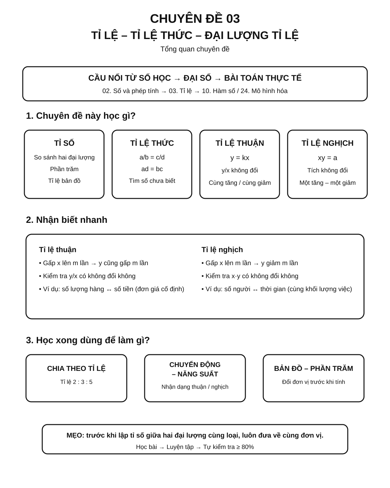
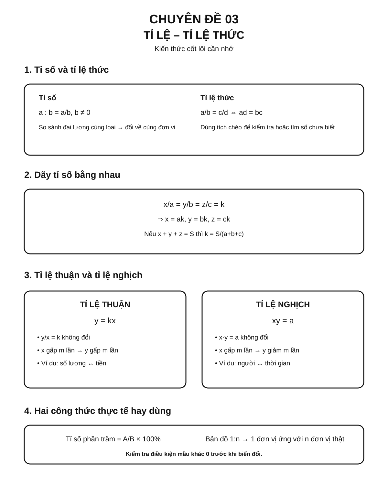
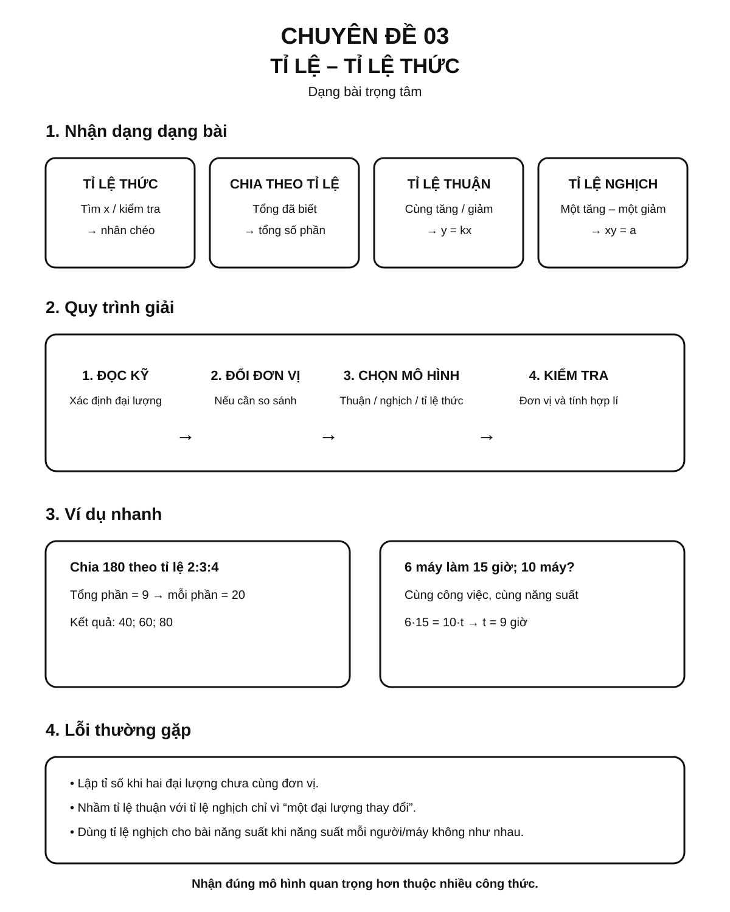

# Chuyên đề 03 – Tỉ lệ – Tỉ lệ thức – Đại lượng tỉ lệ


> **Trạng thái:** Đã kiểm định nội dung học thuật; cấu trúc Roadmap chuẩn 11 mục.
>
> **Lớp trọng tâm:** 6–7
> **Mạch kiến thức:** Số / Đại số
> **Mức ưu tiên:** ⭐⭐⭐⭐

> **Vai trò trong Roadmap:** cầu nối từ số học sang đại số và bài toán thực tế; là nền cho hàm số, mô hình hóa, phần trăm, chuyển động và các bài toán năng suất.
>
> **Phạm vi học:** kiến thức cốt lõi tập trung ở lớp 6–7; các ví dụ chuyển động, năng suất, đồng dạng và mô hình hóa được dùng để kết nối với những chuyên đề học sau.

---

## 🧭 1. Bản đồ kiến thức



> **Xem nhanh:** infographic trên giúp xác định các nhánh chính và phân biệt sớm tỉ lệ thuận với tỉ lệ nghịch. Phần bên dưới giữ vai trò bản đồ chữ chi tiết để tra cứu.

```text
TỈ LỆ – TỈ LỆ THỨC – ĐẠI LƯỢNG TỈ LỆ
│
├── 1. Tỉ số
│   ├── So sánh hai đại lượng
│   ├── Tỉ số phần trăm
│   └── Tỉ lệ bản đồ / thực tế
│
├── 2. Tỉ lệ thức
│   ├── a/b = c/d
│   ├── ad = bc
│   ├── Tìm số chưa biết
│   └── Dãy tỉ số bằng nhau
│
├── 3. Đại lượng tỉ lệ thuận
│   ├── y = kx
│   ├── Hệ số tỉ lệ
│   └── Bảng giá trị
│
├── 4. Đại lượng tỉ lệ nghịch
│   ├── xy = a
│   ├── y = a/x
│   └── Bảng giá trị
│
└── 5. Bài toán thực tế
    ├── Năng suất
    ├── Chuyển động
    ├── Chia theo tỉ lệ
    ├── Bản đồ – kích thước
    └── Mô hình hóa
```

---

## 🎯 2. Mục tiêu cần đạt

Sau khi hoàn thành chuyên đề, học sinh cần có thể:

- [ ] Hiểu tỉ số của hai số; khi dùng tỉ số để so sánh hai đại lượng cùng loại thì biết đưa về cùng đơn vị trước khi tính.
- [ ] Lập và biến đổi đúng tỉ lệ thức.
- [ ] Sử dụng tính chất `ad = bc` để tìm số chưa biết.
- [ ] Vận dụng dãy tỉ số bằng nhau để giải bài toán chia theo tỉ lệ.
- [ ] Nhận biết được đại lượng tỉ lệ thuận và tỉ lệ nghịch.
- [ ] Xác định hệ số tỉ lệ từ bảng hoặc dữ kiện.
- [ ] Lập công thức giữa hai đại lượng.
- [ ] Giải được các bài toán thực tế bằng tỉ lệ và mô hình hóa đơn giản.

---

## 📖 3. Kiến thức cốt lõi



> Dùng infographic này để ôn nhanh công thức và dấu hiệu nhận biết. Khi chưa hiểu bản chất, đọc tiếp từng mục 3.1–3.11 bên dưới.

### 3.1. Tỉ số

Tỉ số của hai số `a` và `b` (`b ≠ 0`) là thương:

```text
a/b
```

Ví dụ: lớp có 12 học sinh nam và 18 học sinh nữ.

Tỉ số số học sinh nam so với nữ là:

```text
12/18 = 2/3
```

Tỉ số nữ so với tổng số học sinh là:

```text
18/30 = 3/5 = 60%
```

> Khi so sánh hai đại lượng có đơn vị, cần đưa về **cùng đơn vị** trước khi lập tỉ số.

Ví dụ:

```text
2 m : 50 cm = 200 cm : 50 cm = 4
```

không phải `2:50`.

### 3.2. Tỉ lệ thức

Tỉ lệ thức là đẳng thức của hai tỉ số:

```text
a/b = c/d
```

với `b ≠ 0`, `d ≠ 0`.

Tính chất cơ bản:

```text
a/b = c/d  ⇔  ad = bc
```

Ví dụ:

```text
3/5 = 12/20
```

vì:

```text
3·20 = 5·12 = 60
```

### 3.3. Tìm số chưa biết trong tỉ lệ thức

Ví dụ:

```text
x/6 = 5/9
```

Suy ra:

```text
9x = 30
x = 10/3
```

Quy tắc quan trọng: luôn kiểm tra mẫu khác 0 trước khi nhân chéo.

### 3.4. Dãy tỉ số bằng nhau

Với `a, b, c ≠ 0`, nếu:

```text
x/a = y/b = z/c = k
```

thì:

```text
x = ak
y = bk
z = ck
```

Và khi `a + b + c ≠ 0`:

```text
x/a = y/b = z/c = (x+y+z)/(a+b+c)
```

Ví dụ: chia 120 thành ba phần tỉ lệ `2:3:5`.

Đặt:

```text
x/2 = y/3 = z/5 = k
```

Khi đó:

```text
x+y+z = 10k = 120
k = 12
```

nên:

```text
x = 24, y = 36, z = 60
```

### 3.5. Đại lượng tỉ lệ thuận

Hai đại lượng `x` và `y` tỉ lệ thuận nếu:

```text
y = kx
```

với `k ≠ 0` là hệ số tỉ lệ.

Khi `x` tăng gấp `m` lần thì `y` cũng tăng gấp `m` lần.

Ví dụ: giá 1 kg táo là 40 000 đồng.

```text
Tiền = 40000 · khối lượng
```

Khối lượng tăng gấp đôi thì số tiền cũng tăng gấp đôi.

### 3.6. Tính chất tỉ lệ thuận

Nếu `y = kx`, thì với các cặp giá trị tương ứng:

```text
y1/x1 = y2/x2 = k
```

và:

```text
y1/y2 = x1/x2
```

Ví dụ:

```text
x:  2   3   5
y:  8  12  20
```

Ta có:

```text
y/x = 4
```

nên `y = 4x`.

### 3.7. Đại lượng tỉ lệ nghịch

Hai đại lượng `x` và `y` tỉ lệ nghịch nếu:

```text
xy = a
```

với `a ≠ 0`. Khi `x ≠ 0`, có thể viết tương đương:

```text
y = a/x
```

Khi `x` tăng gấp `m` lần thì `y` giảm `m` lần.

Ví dụ: cùng một quãng đường, vận tốc và thời gian tỉ lệ nghịch:

```text
s = vt
```

Nếu `s` cố định:

```text
v·t = s
```

### 3.8. Tính chất tỉ lệ nghịch

Nếu `x` và `y` tỉ lệ nghịch:

```text
x1y1 = x2y2 = a
```

và:

```text
y1/y2 = x2/x1
```

Ví dụ: một công việc cần 12 người làm trong 10 ngày, năng suất mỗi người như nhau.

Nếu có 15 người thì:

```text
12·10 = 15·t
```

suy ra:

```text
t = 8 ngày
```

### 3.9. Tỉ lệ bản đồ

Tỉ lệ `1:n` nghĩa là 1 đơn vị độ dài trên bản đồ ứng với `n` đơn vị cùng loại ngoài thực tế.

Ví dụ: bản đồ tỉ lệ `1:100000`.

1 cm trên bản đồ ứng với:

```text
100000 cm = 1 km
```

### 3.10. Tỉ số phần trăm

Tỉ số phần trăm của `A` so với `B` (`B ≠ 0`) là:

```text
A/B · 100%
```

Ví dụ: 18 học sinh đạt loại tốt trong 30 học sinh:

```text
18/30 · 100% = 60%
```

### 3.11. Phân biệt tỉ lệ thuận và tỉ lệ nghịch

| Dấu hiệu | Tỉ lệ thuận | Tỉ lệ nghịch |
|---|---|---|
| Công thức | `y = kx` | `xy = a` |
| Khi `x` gấp đôi | `y` gấp đôi | `y` còn một nửa |
| Đại lượng bất biến | `y/x` | `xy` |
| Ví dụ | tiền và số lượng | vận tốc và thời gian khi quãng đường cố định |

---

## 🔗 4. Kiến thức liên quan

- [02. Số và phép tính](../02-so-va-phep-tinh/index.md)
- [04. Biểu thức và biến đổi đại số](../04-bieu-thuc-dai-so/index.md)
- [10. Hàm số và đồ thị](../10-ham-so-do-thi/index.md)
- [24. Bài toán thực tế và mô hình hóa](../24-bai-toan-thuc-te/index.md)

Tư duy tỉ lệ cũng xuất hiện trong:

- chuyển động;
- năng suất;
- phần trăm;
- hình học đồng dạng;
- xác suất và thống kê;
- biểu đồ và dữ liệu.

---

## 🧩 5. Các dạng bài cần nắm vững



> Trước khi tính, hãy xác định bài thuộc **tỉ lệ thức**, **chia theo tỉ lệ**, **tỉ lệ thuận** hay **tỉ lệ nghịch**. Nhận đúng mô hình thường quan trọng hơn thao tác tính toán.

### Dạng 1 – Lập và kiểm tra tỉ lệ thức

Ví dụ: kiểm tra `6/9 = 10/15`.

```text
6·15 = 90
9·10 = 90
```

nên tỉ lệ thức đúng.

### Dạng 2 – Tìm số chưa biết

Ví dụ:

```text
4/x = 6/15
```

Suy ra:

```text
6x = 60
x = 10
```

### Dạng 3 – Chia một số theo tỉ lệ

Ví dụ: chia 180 theo tỉ lệ `2:3:4`.

Tổng phần:

```text
2 + 3 + 4 = 9
```

Mỗi phần:

```text
180:9 = 20
```

Ba số là:

```text
40, 60, 80
```

### Dạng 4 – Đại lượng tỉ lệ thuận

Ví dụ: 3 m vải giá 240 000 đồng. Hỏi 5 m cùng loại giá bao nhiêu?

Giá 1 m:

```text
240000:3 = 80000
```

5 m:

```text
80000·5 = 400000 đồng
```

### Dạng 5 – Đại lượng tỉ lệ nghịch

> Chỉ mô hình hóa tỉ lệ nghịch khi **khối lượng công việc không đổi** và các máy có **cùng năng suất**.

Ví dụ: 6 máy làm xong cùng một công việc trong 15 giờ. Nếu 10 máy cùng năng suất thì cần bao lâu?

```text
6·15 = 10·t
```

suy ra:

```text
t = 9 giờ
```

### Dạng 6 – Bài toán phần trăm

Ví dụ: lớp có 40 học sinh, 14 học sinh tham gia câu lạc bộ.

Tỉ lệ:

```text
14/40·100% = 35%
```

### Dạng 7 – Tỉ lệ bản đồ

Bản đồ tỉ lệ `1:50000`, hai điểm cách nhau 6 cm.

Khoảng cách thực tế:

```text
6·50000 = 300000 cm = 3 km
```

### Dạng 8 – Nhận dạng từ bảng số liệu

Cho:

```text
x: 1   2   4   5
y: 6  12  24  30
```

Vì `y/x = 6` không đổi nên `y` tỉ lệ thuận với `x` theo hệ số 6.

### Dạng 9 – Tìm công thức liên hệ

Nếu `y` tỉ lệ thuận với `x` và `y = 15` khi `x = 3`:

```text
15 = 3k
k = 5
```

nên:

```text
y = 5x
```

### Dạng 10 – Bài toán nhiều bước

Ví dụ: một ô tô đi 180 km trong 3 giờ với vận tốc không đổi. Nếu tăng vận tốc 20% thì thời gian đi cùng quãng đường bằng bao nhiêu?

Vận tốc ban đầu:

```text
180:3 = 60 km/h
```

Vận tốc mới:

```text
60·1,2 = 72 km/h
```

Thời gian mới:

```text
180:72 = 2,5 giờ
```

---

## 🚀 6. Dạng bài thi vào lớp 10

### Trọng tâm 1 – Bài toán thực tế ⭐⭐⭐⭐⭐

Tư duy tỉ lệ là công cụ thường dùng trong các bài:

- chuyển động;
- năng suất;
- phần trăm;
- pha trộn;
- tăng giảm;
- chi phí và sản lượng.

### Trọng tâm 2 – Hàm số ⭐⭐⭐⭐⭐

Tỉ lệ thuận là nền trực tiếp của hàm số dạng:

```text
y = ax
```

và giúp học sinh chuyển từ bảng số liệu sang công thức.

### Trọng tâm 3 – Hình học đồng dạng ⭐⭐⭐⭐

Các bài tam giác đồng dạng và Thales sử dụng tỉ số các đoạn thẳng liên tục.

### Trọng tâm 4 – Mô hình hóa ⭐⭐⭐⭐

Nhiều bài không cho sẵn công thức; học sinh phải nhận ra quan hệ tỉ lệ từ ngữ cảnh.

---

## ⚠️ 7. Lỗi sai thường gặp

### ❌ Lỗi 1: Chưa đổi về cùng đơn vị

Sai:

```text
2 m : 50 cm = 2/50
```

Đúng:

```text
200 cm : 50 cm = 4
```

### ❌ Lỗi 2: Nhân chéo sai vị trí

Từ:

```text
a/b = c/d
```

phải suy ra:

```text
ad = bc
```

### ❌ Lỗi 3: Nhầm tỉ lệ thuận với tỉ lệ nghịch

Nếu số người tăng mà thời gian hoàn thành cùng một công việc giảm, đó thường là tỉ lệ nghịch, không phải tỉ lệ thuận.

### ❌ Lỗi 4: Chia theo tỉ lệ nhưng quên cộng tổng số phần

Chia 120 theo `2:3:5` không phải lấy `120:2`, `120:3`, `120:5`.

Phải dùng tổng:

```text
2+3+5 = 10
```

### ❌ Lỗi 5: Dùng quy tắc tam suất máy móc

Trước khi nhân chéo cần xác định quan hệ là thuận hay nghịch.

### ❌ Lỗi 6: Nhầm phần trăm tăng và giá trị mới

Tăng 15% không có nghĩa giá trị mới bằng 15% giá trị cũ.

Giá trị mới bằng:

```text
115% giá trị cũ
```

### ❌ Lỗi 7: Không kiểm tra kết quả bằng trực giác

Nếu số công nhân tăng mà kết quả lại cho thời gian tăng trong một bài cùng khối lượng công việc, cần kiểm tra lại mô hình.

---

## 📝 8. Luyện tập

### Mức 1 – Nhận biết

1. Rút gọn tỉ số `18:24`.
2. Kiểm tra `4/7 = 12/21` có phải tỉ lệ thức không.
3. Tìm `x`: `x/8 = 3/4`.
4. Cho `y = 5x`. Tính `y` khi `x = 7`.
5. Cho `xy = 36`. Tính `y` khi `x = 9`.

### Mức 2 – Thông hiểu

1. Chia 150 theo tỉ lệ `2:3`.
2. Ba số tỉ lệ `2:3:5` và có tổng 200. Tìm ba số.
3. 4 kg gạo giá 96 000 đồng. Tính giá 7 kg cùng loại.
4. 8 người làm xong một việc trong 12 ngày. Tính thời gian nếu có 6 người, giả sử năng suất như nhau.
5. Bản đồ tỉ lệ `1:200000`, hai điểm cách nhau 3,5 cm. Tính khoảng cách thực tế.

### Mức 3 – Vận dụng

1. Một xe đi 240 km trong 4 giờ. Nếu vận tốc tăng 25%, tính thời gian đi cùng quãng đường.
2. 12 máy sản xuất 3600 sản phẩm trong 5 giờ. Với cùng năng suất, 15 máy trong 8 giờ sản xuất bao nhiêu sản phẩm?
3. Một số tăng từ 80 lên 92. Tính tỉ lệ phần trăm tăng.
4. Tìm `x, y` biết `x:y = 3:5` và `2x + y = 88`.
5. Cho `y` tỉ lệ nghịch với `x`. Biết `x = 4` thì `y = 15`. Tính `y` khi `x = 10`.

### Mức 4 – Nâng cao / tổng hợp

1. Ba đội có số công nhân tỉ lệ `2:3:4`. Tổng số công nhân là 108. Sau khi chuyển 6 người từ đội 3 sang đội 1, tính tỉ lệ mới.
2. Một công việc theo kế hoạch cần 18 người làm 20 ngày. Sau 5 ngày, bổ sung thêm 6 người có cùng năng suất. Hỏi công việc hoàn thành sau tổng cộng bao nhiêu ngày?
3. Một cửa hàng tăng giá 10% rồi giảm giá 10%. So sánh giá cuối với giá ban đầu.
4. Hai đại lượng `x, y` tỉ lệ thuận. Khi `x` tăng 20% thì `y` thay đổi thế nào? Nếu chúng tỉ lệ nghịch thì sao?
5. Từ một bảng số liệu, xác định đại lượng là tỉ lệ thuận, tỉ lệ nghịch hay không thuộc hai loại trên và giải thích.

---

## ✅ 9. Tự kiểm tra

### Mini quiz

1. `12:18` rút gọn thành tỉ số nào?
2. Nếu `x/6 = 4/9`, tính `x`.
3. Chia 100 theo tỉ lệ `2:3`, phần lớn hơn bằng bao nhiêu?
4. Nếu `y = 4x`, `x = 6` thì `y = ?`
5. Nếu `xy = 30`, `x = 5` thì `y = ?`
6. 5 kg hàng giá 150 000 đồng, 8 kg giá bao nhiêu nếu giá/kg không đổi?
7. 10 người làm việc trong 6 ngày; 12 người cùng năng suất cần bao nhiêu ngày?
8. 15 trên 60 bằng bao nhiêu phần trăm?
9. Bản đồ `1:100000`, 2 cm ứng với bao nhiêu km?
10. Khi `x` tăng gấp đôi và `y` giảm một nửa, quan hệ thường là tỉ lệ gì?

### Đáp án

1. `2:3`
2. `8/3`
3. `60`
4. `24`
5. `6`
6. `240 000 đồng`
7. `5 ngày`
8. `25%`
9. `2 km`
10. Tỉ lệ nghịch

### Tự đánh giá

- **9–10 câu đúng:** nắm chắc tư duy tỉ lệ.
- **7–8 câu đúng:** đạt yêu cầu, nên luyện thêm bài thực tế.
- **5–6 câu đúng:** cần phân biệt lại tỉ lệ thuận và nghịch.
- **Dưới 5 câu:** nên ôn lại kiến thức cốt lõi trước khi học hàm số và mô hình hóa.

---

## 🔄 10. Liên kết Roadmap

```text
02. SỐ VÀ PHÉP TÍNH
          ↓
03. TỈ LỆ – TỈ LỆ THỨC
     ┌────┼───────────┐
     ↓    ↓           ↓
    04    10          24
 Biểu thức Hàm số  Bài toán thực tế
```

- **← Trước:** [02. Số và phép tính](../02-so-va-phep-tinh/index.md)
- **→ Đại số:** [04. Biểu thức và biến đổi đại số](../04-bieu-thuc-dai-so/index.md)
- **→ Hàm số:** [10. Hàm số và đồ thị](../10-ham-so-do-thi/index.md)
- **→ Ứng dụng:** [24. Bài toán thực tế và mô hình hóa](../24-bai-toan-thuc-te/index.md)

Xem toàn bộ hệ thống tại [Blueprint 25 chuyên đề](../../roadmap/blueprint-25-chuyen-de.md).

---

## 🏁 11. Điều kiện hoàn thành

Chuyên đề được xem là hoàn thành khi học sinh:

- [ ] Lập và biến đổi đúng tỉ lệ thức.
- [ ] Tìm được số chưa biết bằng tính chất nhân chéo.
- [ ] Giải được bài chia theo tỉ lệ và dãy tỉ số bằng nhau.
- [ ] Phân biệt chắc tỉ lệ thuận và tỉ lệ nghịch.
- [ ] Lập được công thức liên hệ giữa hai đại lượng từ dữ kiện.
- [ ] Giải được bài thực tế về giá tiền, chuyển động, năng suất và bản đồ.
- [ ] Đạt ít nhất **8/10** ở phần tự kiểm tra.