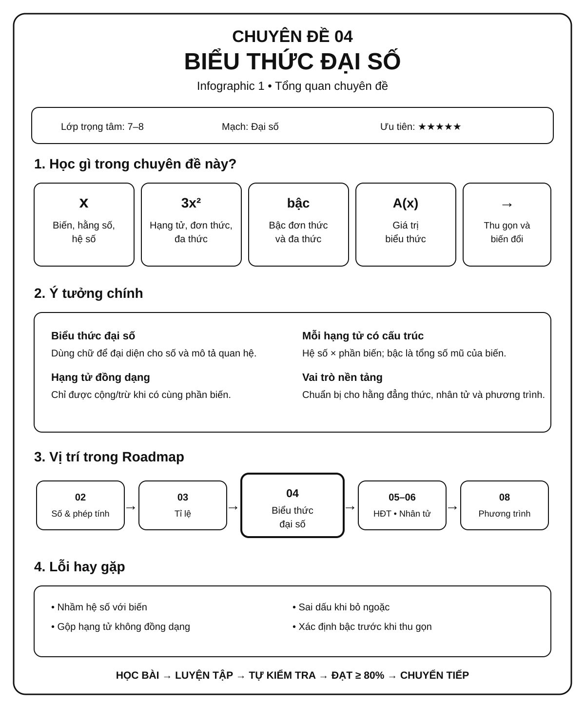
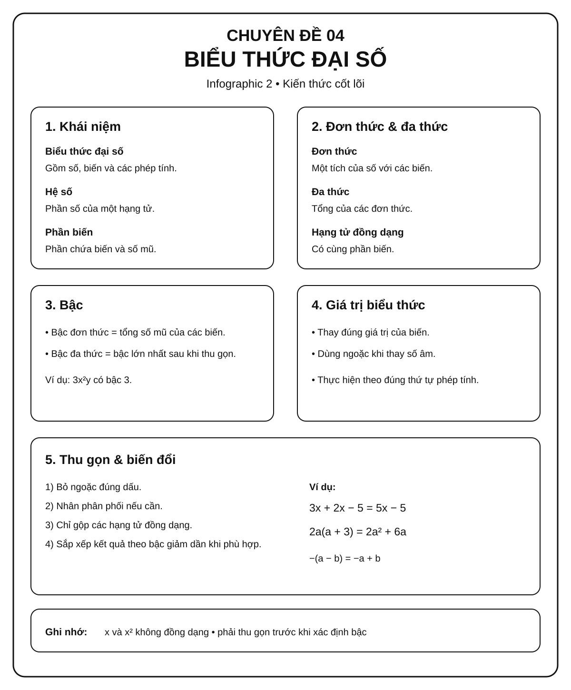
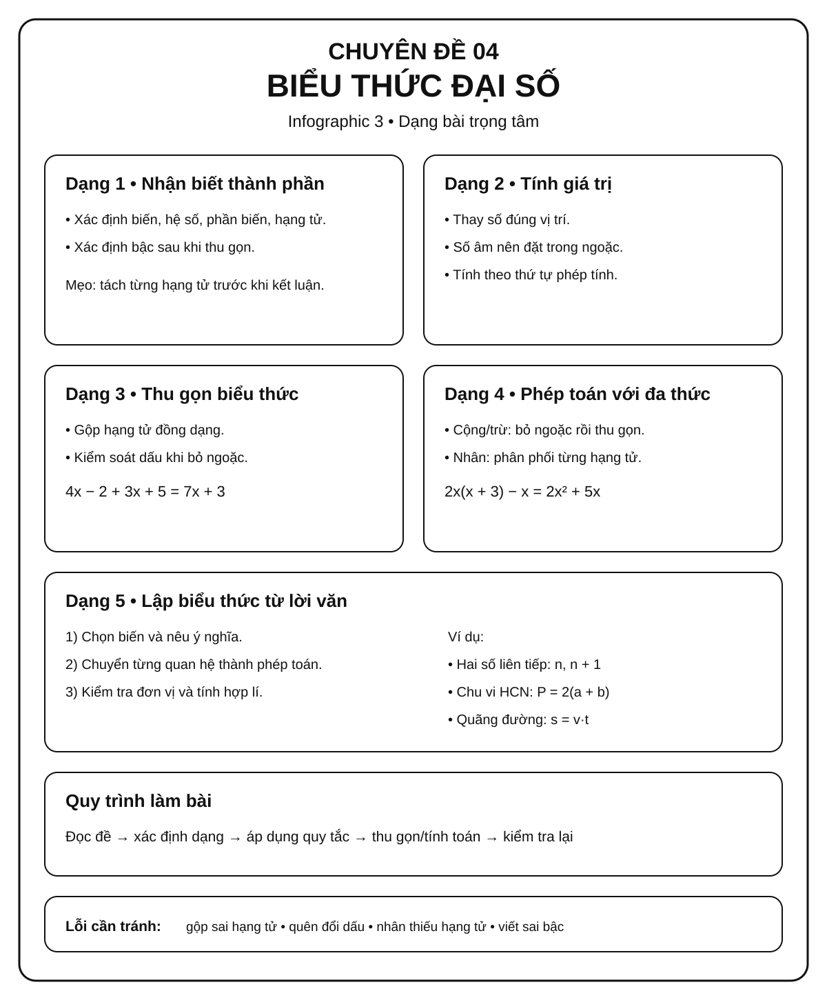

# Chuyên đề 04 – Biểu thức và biến đổi đại số


> **Trạng thái:** Đã kiểm định nội dung học thuật; cấu trúc Roadmap chuẩn 11 mục.
>
> **Lớp trọng tâm:** 7–8
> **Mạch kiến thức:** Đại số
> **Mức ưu tiên:** ⭐⭐⭐⭐⭐

> **Vai trò trong Roadmap:** nền tảng trực tiếp cho Chuyên đề 05 → 06 → 07 → 08.
>
> **Mục tiêu:** học sinh không chỉ biết thực hiện phép biến đổi mà phải hiểu **vì sao biến đổi được**, biết điều kiện xác định và biết chọn phương pháp phù hợp.

---

## 🧭 1. Bản đồ kiến thức

### Infographic 1 – Tổng quan chuyên đề



```text
BIỂU THỨC VÀ BIẾN ĐỔI ĐẠI SỐ
│
├── 1. Ngôn ngữ đại số
│   ├── Biến, hằng số, hệ số
│   ├── Đơn thức
│   └── Đa thức
│
├── 2. Phép tính với biểu thức
│   ├── Thu gọn
│   ├── Cộng – trừ
│   ├── Nhân đơn thức với đa thức
│   ├── Nhân đa thức với đa thức
│   └── Chia đơn thức / đa thức trong trường hợp phù hợp
│
├── 3. Giá trị của biểu thức
│   ├── Thay giá trị của biến
│   ├── Tính giá trị
│   └── Biểu thức có điều kiện xác định
│
└── 4. Biến đổi đại số
    ├── Nhóm hạng tử
    ├── Đưa về dạng tích
    ├── Khai triển
    └── Chuẩn bị cho hằng đẳng thức và phân tích đa thức
```

---

## 🎯 2. Mục tiêu cần đạt

Sau khi hoàn thành chuyên đề, học sinh cần có thể:

- [ ] Nhận diện đúng đơn thức, đa thức và bậc của chúng.
- [ ] Thu gọn biểu thức mà không làm thay đổi giá trị.
- [ ] Thực hiện thành thạo cộng, trừ và nhân các đa thức cơ bản.
- [ ] Thay giá trị biến và tính giá trị biểu thức chính xác.
- [ ] Nhận biết khi nào biểu thức có điều kiện xác định.
- [ ] Trình bày biến đổi theo từng bước, hạn chế nhảy bước gây sai dấu.
- [ ] Nhìn thấy cấu trúc biểu thức để chuẩn bị cho hằng đẳng thức và phân tích đa thức.

---

## 📖 3. Kiến thức cốt lõi

### Infographic 2 – Kiến thức cốt lõi



### 3.1. Đơn thức

Đơn thức là biểu thức đại số chỉ gồm một tích của một số với các biến có số mũ nguyên không âm.

Ví dụ:

- `3x²`
- `-5xy³`
- `7`

#### Hệ số và phần biến

Với `-5x²y`, ta có:

- Hệ số: `-5`
- Phần biến: `x²y`
- Bậc: `2 + 1 = 3`

---

### 3.2. Đa thức

Đa thức là tổng của các đơn thức.

Ví dụ:

`P(x) = 3x³ - 2x² + 5x - 7`

#### Bậc của đa thức

Bậc của đa thức khác 0 là bậc lớn nhất của các hạng tử sau khi đã thu gọn.

> ⚠️ **Lưu ý:** phải thu gọn trước khi xác định bậc nếu các hạng tử đồng dạng có thể triệt tiêu nhau. Đa thức `0` không có bậc theo quy ước dùng trong chương trình phổ thông.

---

### 3.3. Các phép biến đổi quan trọng

#### Thu gọn đơn thức

Gộp các thừa số số với nhau và các lũy thừa cùng biến.

Ví dụ:

`2x² · (-3x³y) = -6x⁵y`

---

#### Thu gọn đa thức

Chỉ cộng hoặc trừ được **các hạng tử đồng dạng**.

Ví dụ:

`3x² + 5x - 2x² + 7 = x² + 5x + 7`

##### Quy tắc vàng

> **Đồng dạng mới được gộp.**

`x²` và `x` **không** đồng dạng.

---

#### Cộng – trừ đa thức

Thực hiện theo hai bước:

1. Bỏ ngoặc đúng dấu.
2. Thu gọn các hạng tử đồng dạng.

Ví dụ:

`(2x² - 3x + 1) - (x² + 2x - 4)`

`= 2x² - 3x + 1 - x² - 2x + 4`

`= x² - 5x + 5`

> ⚠️ Khi trước ngoặc là dấu `−`, **tất cả các dấu trong ngoặc phải đổi**.

---

#### Nhân đơn thức với đa thức

Dùng tính phân phối:

`A(B + C) = AB + AC`

Ví dụ:

`2x(3x² - x + 4) = 6x³ - 2x² + 8x`

---

#### Nhân đa thức với đa thức

Mỗi hạng tử của đa thức thứ nhất phải nhân với **từng hạng tử** của đa thức thứ hai.

Ví dụ:

`(x + 2)(x + 3)`

`= x² + 3x + 2x + 6`

`= x² + 5x + 6`

Đây là kỹ năng nền tảng để học **7 hằng đẳng thức đáng nhớ** ở Chuyên đề 05.

---

#### Chia đơn thức và đa thức trong trường hợp chia hết

Với đơn thức, phép chia thực hiện được trong phạm vi đa thức khi phần biến của số bị chia chứa đủ các lũy thừa của phần biến ở số chia.

Ví dụ:

```text
12x^5y^3 : 3x^2y = 4x^3y^2
```

Với đa thức chia cho đơn thức, nếu **mỗi hạng tử** đều chia hết cho đơn thức đó thì chia từng hạng tử rồi cộng các thương:

```text
(6x^3 - 9x^2 + 3x) : 3x
= 2x^2 - 3x + 1
```

Ở đây `3x` được hiểu là một đơn thức khác đa thức `0`. Nếu biểu thức được viết dưới dạng phân thức và thay một giá trị cụ thể cho `x`, vẫn phải giữ điều kiện mẫu khác `0`.

> Không được “chia/rút gọn” xuyên qua dấu cộng hoặc trừ. Chẳng hạn `(x + 2)/x` không thể rút `x` với riêng hạng tử `x` ở tử. Đây là cầu nối quan trọng sang Chuyên đề 07.

### 3.4. Điều kiện xác định và giá trị biểu thức

Ở mức kết nối sang Chuyên đề 07, khi biểu thức có mẫu chứa biến, cần tìm điều kiện để mẫu khác 0 **trước khi biến đổi**.

Ví dụ:

`A = (x + 1)/(x - 2)`

Điều kiện:

`x - 2 ≠ 0 ⇒ x ≠ 2`

> ⚠️ Không được quên điều kiện xác định rồi mới kết luận kết quả.

---

### 3.5. Ví dụ mẫu

#### Ví dụ 1 – Thu gọn

Rút gọn:

`A = 3x² - 2x + 5 - x² + 7x - 3`

**Giải:**

`A = (3x² - x²) + (-2x + 7x) + (5 - 3)`

`A = 2x² + 5x + 2`

---

#### Ví dụ 2 – Nhân và thu gọn

Rút gọn:

`B = 2x(x - 3) + (x + 1)(x - 2)`

`= 2x² - 6x + x² - x - 2`

`= 3x² - 7x - 2`

---

#### Ví dụ 3 – Tính giá trị

Cho:

`P = x² - 3x + 2`

Tính `P` tại `x = 2`.

`P = 2² - 3·2 + 2 = 4 - 6 + 2 = 0`

---

## 🔗 4. Kiến thức liên quan

```text
03. Tỉ lệ – Tỉ lệ thức
          │
          ↓
04. BIỂU THỨC & BIẾN ĐỔI ĐẠI SỐ
          │
     ┌────┼────────┐
     ↓    ↓        ↓
    05    06       07
  HĐT   PTĐT     PTĐS
     │    │        │
     └────┼────────┘
          ↓
08. PHƯƠNG TRÌNH & BẤT PHƯƠNG TRÌNH
          │
      ┌───┴────┐
      ↓        ↓
     09       10
    HPT    Hàm số
```

#### Liên kết trực tiếp

- ← [03. Tỉ lệ – Tỉ lệ thức – Đại lượng tỉ lệ](../03-ti-le-ti-le-thuc/index.md)
- → [05. 7 Hằng đẳng thức đáng nhớ](../05-7-hang-dang-thuc/index.md)
- → [06. Phân tích đa thức thành nhân tử](../06-phan-tich-da-thuc/index.md)
- → [07. Phân thức đại số](../07-phan-thuc-dai-so/index.md)
- → [08. Phương trình và bất phương trình](../08-phuong-trinh-bat-phuong-trinh/index.md)

---

## 🧩 5. Các dạng bài cần nắm vững

### Infographic 3 – Dạng bài trọng tâm



| Dạng bài | Mức độ | Ưu tiên luyện |
|---|:---:|:---:|
| Nhận biết đơn thức, đa thức | ⭐ | ⭐⭐⭐⭐ |
| Xác định hệ số, phần biến, bậc | ⭐ | ⭐⭐⭐⭐ |
| Thu gọn đơn thức | ⭐ | ⭐⭐⭐⭐⭐ |
| Thu gọn đa thức | ⭐ | ⭐⭐⭐⭐⭐ |
| Cộng – trừ đa thức | ⭐⭐ | ⭐⭐⭐⭐⭐ |
| Nhân đơn thức với đa thức | ⭐⭐ | ⭐⭐⭐⭐⭐ |
| Nhân đa thức với đa thức | ⭐⭐ | ⭐⭐⭐⭐⭐ |
| Tính giá trị biểu thức | ⭐⭐ | ⭐⭐⭐⭐⭐ |
| Biểu thức có điều kiện xác định | ⭐⭐ | ⭐⭐⭐⭐ |
| Biến đổi nhiều bước | ⭐⭐⭐ | ⭐⭐⭐⭐ |
| Nhận dạng cấu trúc để đưa về dạng tích | ⭐⭐⭐ | ⭐⭐⭐⭐ |

---

## 🚀 6. Dạng bài thi vào lớp 10

### Dạng 1 – Biến đổi nhiều lớp

Học sinh phải kết hợp:

`bỏ ngoặc → nhân → thu gọn → nhóm hạng tử`

Mục tiêu không phải tính thật nhanh mà là **kiểm soát dấu và cấu trúc**.

### Dạng 2 – Bài toán có tham số

Một dạng luyện nền có thể gặp trong các bài tổng hợp là xác định tham số từ điều kiện của biểu thức.

Ví dụ:

> Cho biểu thức `P(x)`. Tìm `m` để hệ số của `x²` bằng một giá trị cho trước.

### Dạng 3 – Nhìn cấu trúc để chuẩn bị phân tích nhân tử

Ví dụ:

`ax + ay = a(x + y)`

Đây là cầu nối trực tiếp sang **Chuyên đề 06 – Phân tích đa thức thành nhân tử**.

---

## ⚠️ 7. Lỗi sai thường gặp

#### ❌ Lỗi 1: Gộp hạng tử không đồng dạng

Sai:

`2x + 3x² = 5x³`

Đúng:

`2x + 3x²` đã ở dạng thu gọn.

#### ❌ Lỗi 2: Quên đổi dấu khi bỏ ngoặc

Sai:

`5 - (2x - 3) = 5 - 2x - 3`

Đúng:

`5 - (2x - 3) = 5 - 2x + 3`

#### ❌ Lỗi 3: Nhân thiếu hạng tử

Khi tính `(x + 2)(x + 3)`, không được bỏ sót `2·x` hoặc `2·3`.

#### ❌ Lỗi 4: Quên điều kiện xác định

Với phân thức, phải kiểm tra mẫu khác 0 trước khi kết luận.

#### ❌ Lỗi 5: Thay số quá sớm

Với bài có nhiều biến đổi, nên thu gọn trước rồi mới thay giá trị nếu cách đó giúp giảm sai sót.

---

## 📝 8. Luyện tập tiếp theo

Micro-practice trong các Learning Cards dùng để kiểm tra nhanh ngay sau khi học. Khi muốn luyện sâu hơn, luyện từng skill hoặc làm bài tự luận, hãy chuyển sang **Practice Room**.

[🎯 Mở Practice Room – Chuyên đề 04](bai-tap.md){ .md-button .md-button--primary }

Trong Practice Room:

- **Luyện nhanh tương tác:** Practice Engine chọn câu từ ngân hàng lớn, có feedback, gợi ý và Tutor.
- **Luyện tự luận & trình bày:** tự giải trên giấy/vở rồi mở gợi ý hoặc lời giải để tự đối chiếu.
- Core / Entrance10 / Challenge được tách rõ.

!!! info "Phân biệt mục đích"
    Micro-practice kiểm tra hiểu ngay; Practice Room dùng để **rèn kỹ năng**. Kết quả luyện tập là formative evidence, không phải điểm kiểm tra cuối chuyên đề.

---

## ✅ 9. Tự kiểm tra mức độ sẵn sàng

Khi đã luyện tương đối chắc, hãy làm **Core Readiness Check**.

[✅ Bắt đầu Core Readiness Check](tu-kiem-tra.md){ .md-button .md-button--primary }

Trong Readiness Check:

- không hint và không Tutor khi đang làm;
- không báo đúng/sai từng câu;
- chỉ chấm sau khi bấm **Nộp bài**;
- kết quả phân tích theo assessed skill;
- là **Soft Mastery**: không khóa chuyên đề tiếp theo;
- Entrance10 / Challenge không tính vào Core readiness.

---

## 🔄 10. Liên kết Roadmap

- **← Trước:** [03 – Tỉ lệ, tỉ lệ thức, đại lượng tỉ lệ](../03-ti-le-ti-le-thuc/index.md)
- **→ Tiếp theo:** [05 – 7 Hằng đẳng thức đáng nhớ](../05-7-hang-dang-thuc/index.md)

**Mạch nội dung:**

`03 – Tỉ lệ, tỉ lệ thức, đại lượng tỉ lệ`
→ `04 – Biểu thức và biến đổi đại số`
→ `05 – 7 Hằng đẳng thức đáng nhớ`

#### ⭐ Mức độ ưu tiên

**⭐⭐⭐⭐⭐ – Nền tảng rất quan trọng**

Chuyên đề này xuất hiện dưới dạng kỹ năng nền trong rất nhiều bài Đại số THCS và là tiền đề trực tiếp cho các chuyên đề 05–12.

---

## 🏁 11. Điều kiện hoàn thành

Chuyên đề được xem là **đủ sẵn sàng để học tiếp** khi học sinh có phần lớn các bằng chứng sau:

- [ ] Hiểu và giải thích được các quy tắc Core của chuyên đề.
- [ ] Làm tương đối ổn định các skill Core trong Practice Room.
- [ ] Không lặp lại ổn định cùng một lỗi nền tảng sau khi đã được chữa.
- [ ] Core Readiness Check đạt khoảng **80%** hoặc học sinh đã hiểu và chữa được các lỗi còn lại.
- [ ] Có thể trình bày ít nhất một số bài tự luận Core mà không mở lời giải trước.

!!! note "Soft Mastery"
    Không cần đạt 100% mới được học tiếp. Nếu Readiness Check cho thấy một vài kỹ năng còn yếu, hệ thống khuyến nghị luyện lại đúng kỹ năng đó; học sinh vẫn có thể chuyển sang chuyên đề tiếp theo.

!!! warning "Core độc lập Extension"
    Entrance10 và Specialized-Challenge không phải điều kiện để hoàn thành KNTT Core.

---

## ➡️ Tiếp tục học

<div class="topic-workspace-actions" markdown>

[🎯 Sang Phòng Luyện Tập](bai-tap.md){ .md-button .md-button--primary }

[✅ Kiểm Tra Độ Sẵn Sàng](tu-kiem-tra.md){ .md-button }

[→ 05 – 7 Hằng đẳng thức đáng nhớ](../05-7-hang-dang-thuc/index.md){ .md-button }

</div>
