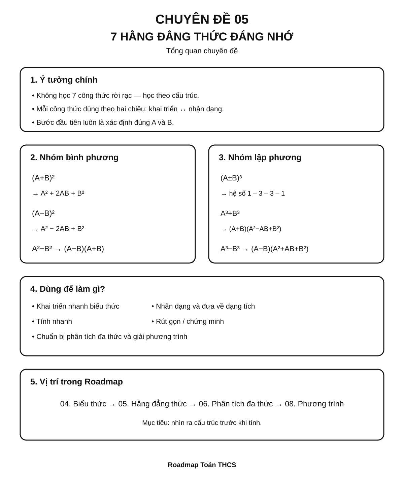
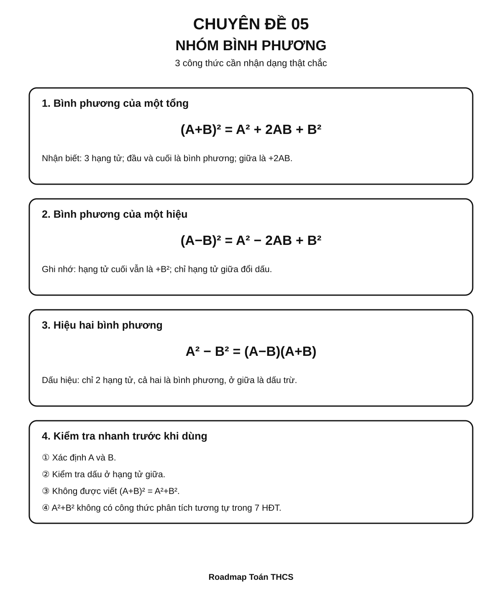
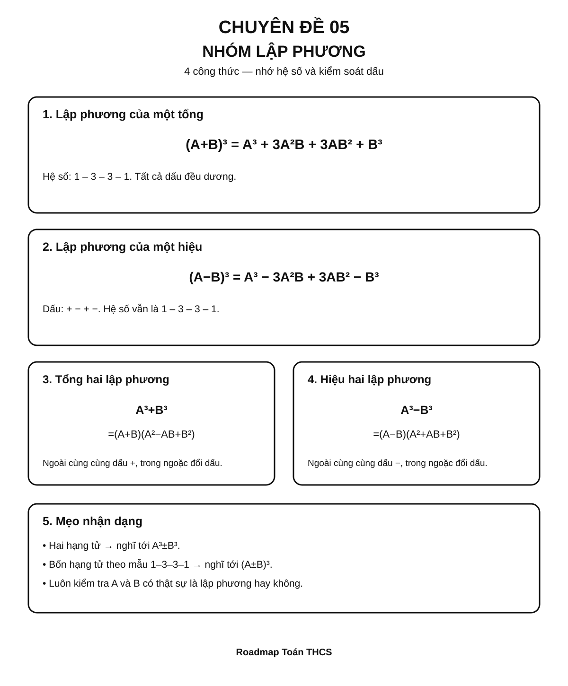
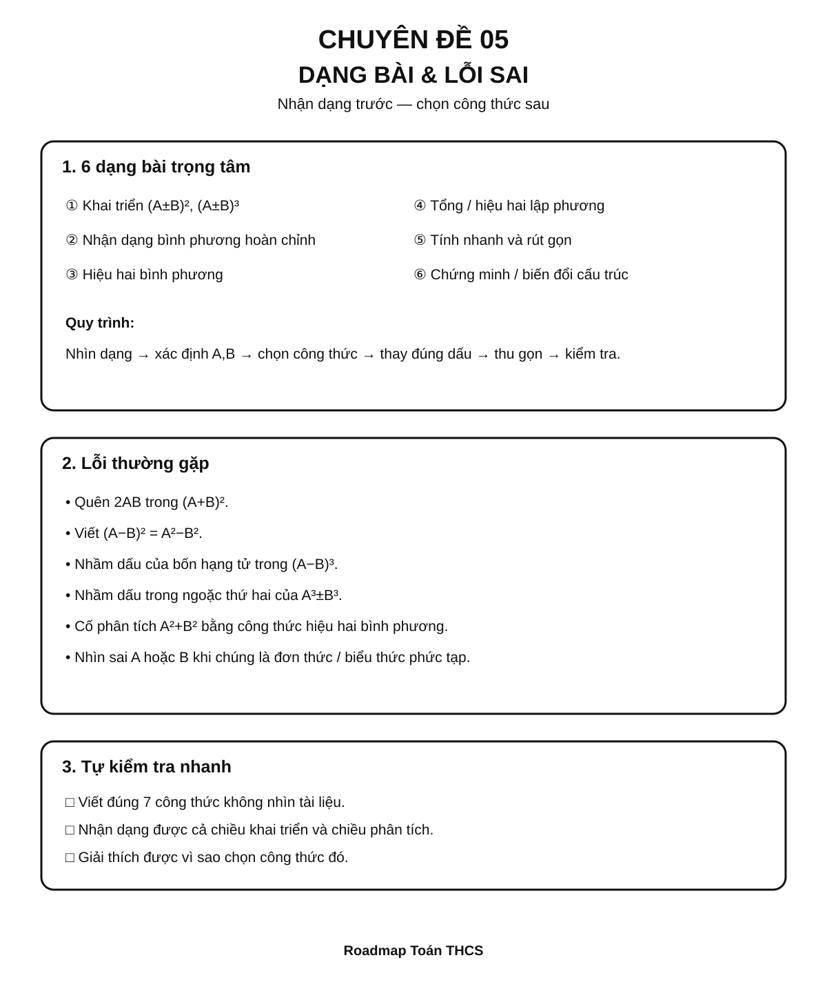

# Chuyên đề 05 – 7 Hằng đẳng thức đáng nhớ


> **Trạng thái:** Đã kiểm định nội dung học thuật; cấu trúc Roadmap chuẩn 11 mục.
>
> **Lớp trọng tâm:** 8
> **Mạch kiến thức:** Đại số
> **Mức ưu tiên:** ⭐⭐⭐⭐⭐

> **Vai trò trong Roadmap:** cầu nối trực tiếp từ phép nhân đa thức sang phân tích đa thức thành nhân tử, rút gọn biểu thức và giải phương trình.
>

---

## 🧭 1. Bản đồ kiến thức

### Infographic 1 – Tổng quan chuyên đề



```text
7 HẰNG ĐẲNG THỨC ĐÁNG NHỚ
│
├── Nhóm bình phương
│   ├── (A + B)²
│   ├── (A - B)²
│   └── A² - B²
│
├── Nhóm lập phương
│   ├── (A + B)³
│   ├── (A - B)³
│   ├── A³ + B³
│   └── A³ - B³
│
├── Hai chiều sử dụng
│   ├── Khai triển: dạng tích → dạng tổng
│   └── Nhận dạng: dạng tổng → dạng tích
│
└── Ứng dụng
    ├── Tính nhanh
    ├── Rút gọn biểu thức
    ├── Phân tích đa thức
    ├── Chứng minh đẳng thức
    └── Chuẩn bị giải phương trình
```

Điều quan trọng nhất của chuyên đề không phải là học thuộc bảy dòng công thức rời rạc, mà là **nhìn ra cấu trúc** của biểu thức.

---

## 🎯 2. Mục tiêu cần đạt

Sau khi hoàn thành chuyên đề, học sinh cần có thể:

- [ ] Viết đúng cả 7 hằng đẳng thức theo hai chiều.
- [ ] Phân biệt được bình phương của một tổng và tổng các bình phương.
- [ ] Nhận dạng được `A`, `B` ngay cả khi chúng là đơn thức hoặc biểu thức phức tạp.
- [ ] Khai triển biểu thức bằng hằng đẳng thức thay vì nhân dài dòng khi phù hợp.
- [ ] Nhận dạng biểu thức để đưa từ dạng tổng về dạng tích.
- [ ] Vận dụng hằng đẳng thức để tính nhanh, rút gọn và chứng minh.
- [ ] Biết kiểm tra dấu ở các công thức có phép trừ.
- [ ] Phân biệt được tổng hai lập phương với hiệu hai lập phương.
- [ ] Kết nối kiến thức này với phân tích đa thức thành nhân tử và phương trình.

---

## 📖 3. Kiến thức cốt lõi

> **Ghi nhớ:** hằng đẳng thức là đẳng thức đúng với mọi giá trị của các biến làm cho hai vế có nghĩa. Trong các công thức dưới đây, `A` và `B` có thể là số, đơn thức hoặc biểu thức đại số.

### Infographic 2 – Nhóm bình phương



### 3.1. Bình phương của một tổng

$$
(A+B)^2=A^2+2AB+B^2
$$

**Cách đọc:** bình phương biểu thức thứ nhất + hai lần tích hai biểu thức + bình phương biểu thức thứ hai.

Ví dụ:

$$
(x+3)^2=x^2+6x+9
$$

Vì:

- `A = x`
- `B = 3`
- `2AB = 2·x·3 = 6x`

---

### 3.2. Bình phương của một hiệu

$$
(A-B)^2=A^2-2AB+B^2
$$

Ví dụ:

$$
(2x-5)^2=4x^2-20x+25
$$

> ⚠️ Hạng tử cuối vẫn là `+B²`, không phải `-B²`.

---

### 3.3. Hiệu hai bình phương

$$
A^2-B^2=(A-B)(A+B)
$$

Ví dụ:

$$
x^2-16=(x-4)(x+4)
$$

Đây là một trong những công thức quan trọng nhất khi học **phân tích đa thức thành nhân tử**.

---

### Infographic 3 – Nhóm lập phương



### 3.4. Lập phương của một tổng

$$
(A+B)^3=A^3+3A^2B+3AB^2+B^3
$$

Ví dụ:

$$
(x+2)^3=x^3+6x^2+12x+8
$$

Một cách nhớ theo hệ số:

```text
1 – 3 – 3 – 1
```

---

### 3.5. Lập phương của một hiệu

$$
(A-B)^3=A^3-3A^2B+3AB^2-B^3
$$

Ví dụ:

$$
(x-2)^3=x^3-6x^2+12x-8
$$

Dấu của bốn hạng tử lần lượt là:

```text
+   −   +   −
```

---

### 3.6. Tổng hai lập phương

$$
A^3+B^3=(A+B)(A^2-AB+B^2)
$$

Ví dụ:

$$
x^3+8=x^3+2^3=(x+2)(x^2-2x+4)
$$

---

### 3.7. Hiệu hai lập phương

$$
A^3-B^3=(A-B)(A^2+AB+B^2)
$$

Ví dụ:

$$
8x^3-27=(2x)^3-3^3=(2x-3)(4x^2+6x+9)
$$

---

### 3.8. Bảng tổng hợp 7 công thức

| # | Hằng đẳng thức |
|---:|---|
| 1 | `(A + B)² = A² + 2AB + B²` |
| 2 | `(A − B)² = A² − 2AB + B²` |
| 3 | `A² − B² = (A − B)(A + B)` |
| 4 | `(A + B)³ = A³ + 3A²B + 3AB² + B³` |
| 5 | `(A − B)³ = A³ − 3A²B + 3AB² − B³` |
| 6 | `A³ + B³ = (A + B)(A² − AB + B²)` |
| 7 | `A³ − B³ = (A − B)(A² + AB + B²)` |

---

## 🔗 4. Kiến thức liên quan

### 4.1. Vì sao `(A+B)²` có hạng tử `2AB`?

Từ phép nhân đa thức:

$$
(A+B)^2=(A+B)(A+B)
$$

Khai triển:

$$
=A^2+AB+AB+B^2
$$

Do đó:

$$
=A^2+2AB+B^2
$$

Vì vậy:

> **Bình phương của một tổng không bằng tổng các bình phương.**

Sai:

$$
(A+B)^2=A^2+B^2
$$

Đúng:

$$
(A+B)^2=A^2+2AB+B^2
$$

### 4.2. Hằng đẳng thức dùng theo hai chiều

**Chiều khai triển:**

```text
(A + B)² → A² + 2AB + B²
```

**Chiều nhận dạng / phân tích:**

```text
A² + 2AB + B² → (A + B)²
```

Học sinh cần thành thạo cả hai chiều. Chỉ biết khai triển là chưa đủ.

### 4.3. Kiến thức cần biết trước

- Phép nhân đơn thức và đa thức.
- Thu gọn hạng tử đồng dạng.
- Lũy thừa.
- Quy tắc dấu.

Xem lại [Chuyên đề 04 – Biểu thức và biến đổi đại số](../04-bieu-thuc-dai-so/index.md).

### 4.4. Kiến thức sẽ dùng tiếp

Hằng đẳng thức là công cụ trực tiếp cho:

- [Chuyên đề 06 – Phân tích đa thức thành nhân tử](../06-phan-tich-da-thuc/index.md)
- [Chuyên đề 07 – Phân thức đại số](../07-phan-thuc-dai-so/index.md)
- [Chuyên đề 08 – Phương trình và bất phương trình](../08-phuong-trinh-bat-phuong-trinh/index.md)

---

## 🧩 5. Các dạng bài cần nắm vững

### Infographic 4 – Dạng bài trọng tâm & lỗi sai



### Dạng 1 – Khai triển bằng hằng đẳng thức

**Dấu hiệu nhận biết:** biểu thức có dạng bình phương hoặc lập phương của một tổng/hiệu.

**Phương pháp:**

1. Xác định `A`, `B`.
2. Chọn đúng công thức.
3. Thay vào từng thành phần.
4. Thu gọn nếu cần.

Ví dụ:

$$
(3x+2)^2
$$

Ta có `A = 3x`, `B = 2`:

$$
(3x+2)^2=9x^2+12x+4
$$

---

### Dạng 2 – Nhận dạng bình phương hoàn chỉnh

**Dấu hiệu:** biểu thức có ba hạng tử, trong đó:

- hạng tử đầu là một bình phương;
- hạng tử cuối là một bình phương;
- hạng tử giữa bằng `±2AB`.

Ví dụ:

$$
x^2+10x+25
$$

Ta có:

- `x² = A²`
- `25 = 5² = B²`
- `10x = 2·x·5`

Do đó:

$$
x^2+10x+25=(x+5)^2
$$

---

### Dạng 3 – Phân tích hiệu hai bình phương

**Dấu hiệu:** hai hạng tử đều là bình phương và ở giữa là dấu trừ.

Ví dụ:

$$
9x^2-25=(3x)^2-5^2=(3x-5)(3x+5)
$$

> `A² + B²` không có công thức phân tích tương tự trong 7 hằng đẳng thức.

---

### Dạng 4 – Tổng hoặc hiệu hai lập phương

**Dấu hiệu:** hai hạng tử đều viết được dưới dạng lập phương.

Ví dụ:

$$
27x^3+8=(3x)^3+2^3
$$

Suy ra:

$$
27x^3+8=(3x+2)(9x^2-6x+4)
$$

---

### Dạng 5 – Tính nhanh

**Dấu hiệu:** các số gần số tròn chục, tròn trăm hoặc tạo được cấu trúc hằng đẳng thức.

Ví dụ:

$$
99^2=(100-1)^2
$$

$$
=10000-200+1=9801
$$

Ví dụ khác:

$$
103·97=(100+3)(100-3)=100^2-3^2=9991
$$

---

### Dạng 6 – Rút gọn biểu thức

Ví dụ:

$$
A=(x+2)^2-(x-2)^2
$$

Khai triển:

$$
A=(x^2+4x+4)-(x^2-4x+4)=8x
$$

Có thể nhìn nhanh hơn bằng hiệu hai bình phương:

$$
A=[(x+2)-(x-2)][(x+2)+(x-2)]=4·2x=8x
$$

---

### Dạng 7 – Chứng minh đẳng thức

**Nguyên tắc:** biến đổi một vế về vế còn lại, hoặc biến đổi cả hai vế về cùng một biểu thức bằng các phép biến đổi tương đương.

> Cần phân biệt **hằng đẳng thức** với **phương trình**: hằng đẳng thức đúng với mọi giá trị thích hợp của biến, còn phương trình chỉ đúng với những giá trị thỏa mãn nó.

Ví dụ, chứng minh:

$$
(a+b)^2+(a-b)^2=2a^2+2b^2
$$

Ta có:

$$
(a+b)^2+(a-b)^2
$$

$$
=a^2+2ab+b^2+a^2-2ab+b^2
$$

$$
=2a^2+2b^2
$$

---

### Dạng 8 – Tìm giá trị chưa biết nhờ cấu trúc

Ví dụ:

Cho `x + y = 10`, `xy = 21`. Tính `x² + y²`.

Từ:

$$
(x+y)^2=x^2+2xy+y^2
$$

Suy ra:

$$
x^2+y^2=(x+y)^2-2xy=100-42=58
$$

---

## 🚀 6. Dạng bài thi vào lớp 10

| Dạng | Mức ưu tiên Roadmap | Vai trò |
|---|:---:|---|
| Khai triển và thu gọn | ⭐⭐⭐⭐ | Kỹ năng nền |
| Phân tích bằng hiệu hai bình phương | ⭐⭐⭐⭐⭐ | Rất quan trọng cho biến đổi đại số |
| Nhận dạng bình phương hoàn chỉnh | ⭐⭐⭐⭐⭐ | Dùng trong rút gọn, phương trình, bất đẳng thức |
| Tổng/hiệu hai lập phương | ⭐⭐⭐⭐ | Công cụ quan trọng khi phân tích đa thức |
| Rút gọn biểu thức nhiều bước | ⭐⭐⭐⭐⭐ | Kết nối với phân thức và căn thức |
| Tính nhanh / biến đổi thông minh | ⭐⭐⭐ | Rèn nhận dạng cấu trúc |
| Chứng minh đẳng thức | ⭐⭐⭐⭐ | Kiểm tra năng lực biến đổi |

> Mức sao thể hiện **mức ưu tiên ôn tập trong Roadmap**, không phải cam kết dạng bài xuất hiện trong mọi đề thi.

---

## ⚠️ 7. Lỗi sai thường gặp

### ❌ Lỗi 1 – Bình phương của tổng thành tổng bình phương

Sai:

$$
(a+b)^2=a^2+b^2
$$

Đúng:

$$
(a+b)^2=a^2+2ab+b^2
$$

**Cách tự kiểm tra:** thử `a = b = 1`. Vế trái bằng `4`, còn biểu thức sai chỉ bằng `2`.

---

### ❌ Lỗi 2 – Sai dấu ở `(A-B)²`

Sai:

$$
(A-B)^2=A^2-2AB-B^2
$$

Đúng:

$$
(A-B)^2=A^2-2AB+B^2
$$

Vì `(-B)² = B²`.

---

### ❌ Lỗi 3 – Nhầm công thức tổng hai lập phương

Sai:

$$
A^3+B^3=(A+B)(A^2+AB+B^2)
$$

Đúng:

$$
A^3+B^3=(A+B)(A^2-AB+B^2)
$$

Mẹo kiểm tra: nhân ngược lại để xem hai hạng tử giữa có triệt tiêu hay không.

---

### ❌ Lỗi 4 – Nhìn thấy hai số chính phương là áp dụng hiệu hai bình phương

Công thức:

$$
A^2-B^2=(A-B)(A+B)
$$

chỉ dùng cho **hiệu**, không dùng trực tiếp cho `A² + B²`.

---

### ❌ Lỗi 5 – Không đặt ngoặc khi `A` hoặc `B` là biểu thức

Nếu `A = 2x`, thì:

$$
A^2=(2x)^2=4x^2
$$

không phải `2x²`.

---

### ❌ Lỗi 6 – Học thuộc công thức nhưng không nhận dạng được

Ví dụ:

$$
4x^2+12xy+9y^2
$$

Phải nhìn ra:

- `4x² = (2x)²`
- `9y² = (3y)²`
- `12xy = 2·2x·3y`

nên:

$$
4x^2+12xy+9y^2=(2x+3y)^2
$$

---

## 📝 8. Luyện tập

### Mức 1 – Nhận biết

1. Khai triển `(x + 4)²`.
2. Khai triển `(2x - 3)²`.
3. Phân tích `x² - 49` thành nhân tử.
4. Viết `8x³ + 27` dưới dạng tích.
5. Điền hạng tử còn thiếu: `x² + … + 16 = (x + 4)²`.

### Mức 2 – Thông hiểu

1. Rút gọn `(x + 5)² - 10x`.
2. Phân tích `25x² - 4y²` thành nhân tử.
3. Phân tích `x³ - 64` thành nhân tử.
4. Chứng minh `(a+b)²-(a-b)²=4ab`.
5. Tính nhanh `98²`.

### Mức 3 – Vận dụng

1. Rút gọn `A=(2x+1)²-(2x-1)²`.
2. Cho `x+y=12`, `xy=20`. Tính `x²+y²`.
3. Cho `a-b=5`, `ab=6`. Tính `a²+b²`.
4. Phân tích `16x⁴-81` thành nhân tử tối đa bằng các kiến thức đã học.
5. Tính nhanh `1003·997`.

### Mức 4 – Vận dụng cao / tổng hợp

1. Chứng minh `x⁴+4=(x²-2x+2)(x²+2x+2)`.
2. Rút gọn `B=(x+y)³+(x-y)³`.
3. Biết `x+y=7`, `x²+y²=29`. Tính `xy` và `x³+y³`.
4. Tìm `x` nếu `(x+3)²-(x-3)²=36`.
5. Chứng minh rằng nếu `a+b+c=0` thì `a³+b³+c³=3abc`.

---

## ✅ 9. Tự kiểm tra

### Checklist

Hãy đánh dấu khi bạn có thể làm độc lập:

- [ ] Viết đúng 7 hằng đẳng thức không nhìn tài liệu.
- [ ] Giải thích được vì sao `(A+B)²` có `2AB`.
- [ ] Nhận dạng được bình phương hoàn chỉnh.
- [ ] Phân tích được hiệu hai bình phương.
- [ ] Phân biệt đúng tổng và hiệu hai lập phương.
- [ ] Dùng hằng đẳng thức để tính nhanh.
- [ ] Rút gọn được biểu thức có nhiều hằng đẳng thức.
- [ ] Kiểm tra được kết quả bằng cách nhân ngược hoặc khai triển ngược.

### Mini quiz

**Câu 1.** Kết quả của `(x-5)²` là gì?

A. `x²-25`
B. `x²-10x+25`
C. `x²+10x+25`
D. `x²-10x-25`

**Câu 2.** `9x²-16` bằng:

A. `(3x-4)²`
B. `(3x-4)(3x+4)`
C. `(9x-4)(x+4)`
D. Không phân tích được

**Câu 3.** `x³+27` bằng:

A. `(x+3)(x²+3x+9)`
B. `(x+3)(x²-3x+9)`
C. `(x-3)(x²+3x+9)`
D. `(x+3)³`

**Câu 4.** Nếu `a+b=8`, `ab=15` thì `a²+b²` bằng bao nhiêu?

**Câu 5.** Rút gọn `(x+2)²-(x-2)²`.

### Đáp án nhanh

1. B
2. B
3. B
4. `34`
5. `8x`

---

## 🔄 10. Liên kết Roadmap

```text
04. Biểu thức và biến đổi đại số
                 │
                 ↓
       05. 7 HẰNG ĐẲNG THỨC
                 │
          ┌──────┴──────┐
          ↓             ↓
06. Phân tích       07. Phân thức
    đa thức             đại số
          └──────┬──────┘
                 ↓
08. Phương trình và bất phương trình
```

- **← Trước:** [04. Biểu thức và biến đổi đại số](../04-bieu-thuc-dai-so/index.md)
- **→ Tiếp theo:** [06. Phân tích đa thức thành nhân tử](../06-phan-tich-da-thuc/index.md)
- **Liên hệ:** [07. Phân thức đại số](../07-phan-thuc-dai-so/index.md)
- **Ứng dụng tiếp:** [08. Phương trình và bất phương trình](../08-phuong-trinh-bat-phuong-trinh/index.md)

Xem toàn bộ hệ thống tại [Blueprint 25 chuyên đề](../../roadmap/blueprint-25-chuyen-de.md).

---

## 🏁 11. Điều kiện hoàn thành

Chuyên đề 05 được xem là hoàn thành khi học sinh:

- [ ] Viết chính xác 7 hằng đẳng thức theo cả hai chiều.
- [ ] Đạt ít nhất **8/10** bài cơ bản và thông hiểu mà không xem công thức.
- [ ] Làm được ít nhất **3/5** bài vận dụng.
- [ ] Đạt ít nhất **4/5** câu mini quiz.
- [ ] Tự phát hiện được lỗi dấu khi kiểm tra lời giải.
- [ ] Nhận dạng được khi nào nên dùng hằng đẳng thức thay vì nhân trực tiếp.
- [ ] Sẵn sàng chuyển sang Chuyên đề 06 – Phân tích đa thức thành nhân tử.