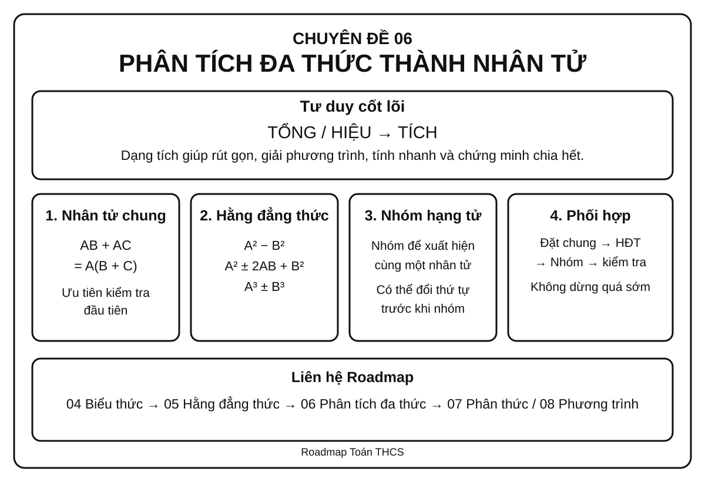
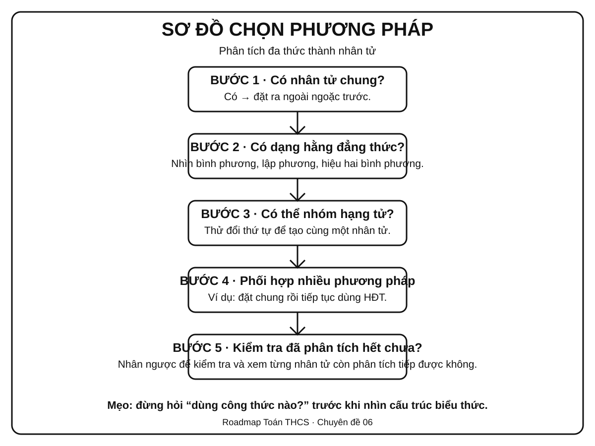
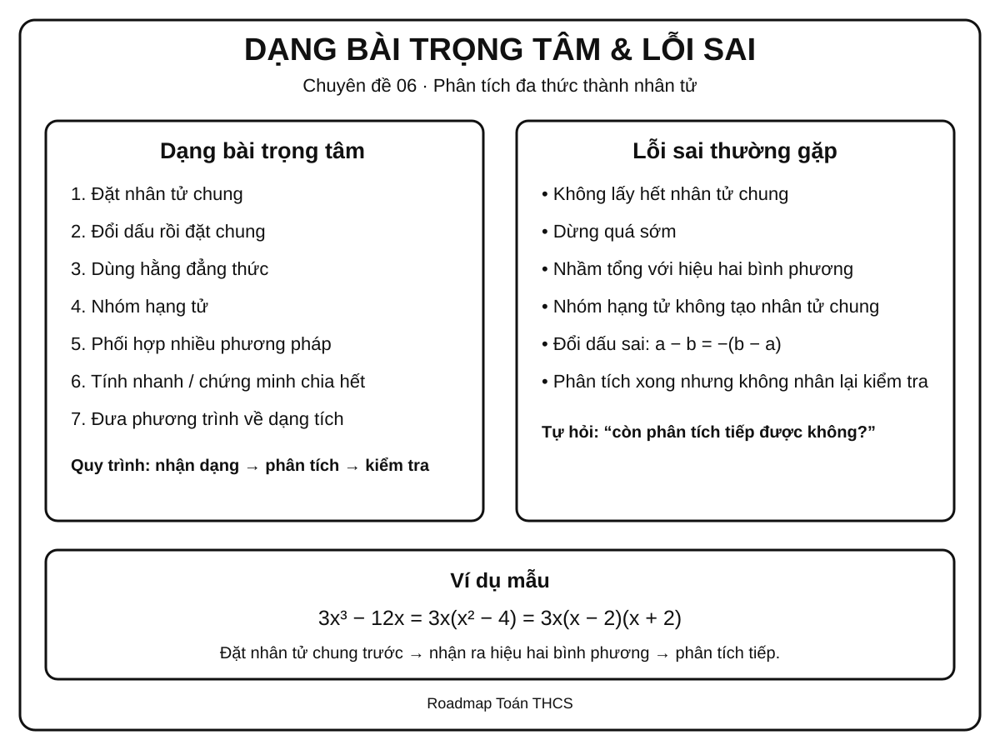

# Chuyên đề 06 – Phân tích đa thức thành nhân tử


> **Trạng thái:** Đã kiểm định nội dung học thuật; cấu trúc Roadmap chuẩn 11 mục.
>
> **Lớp trọng tâm:** 8
> **Mạch kiến thức:** Đại số
> **Mức ưu tiên:** ⭐⭐⭐⭐⭐

> **Vai trò trong Roadmap:** cầu nối trực tiếp từ biến đổi đại số và hằng đẳng thức sang phân thức, phương trình và nhiều bài toán tổng hợp.
>

---

## 🧭 1. Bản đồ kiến thức

### Infographic 1 – Tổng quan chuyên đề



```text
PHÂN TÍCH ĐA THỨC THÀNH NHÂN TỬ
│
├── 1. Đặt nhân tử chung
│   ├── Nhân tử số
│   ├── Nhân tử chứa biến
│   └── Đổi dấu để xuất hiện nhân tử chung
│
├── 2. Dùng hằng đẳng thức
│   ├── Hiệu hai bình phương
│   ├── Bình phương một tổng / hiệu
│   └── Tổng / hiệu hai lập phương
│
├── 3. Nhóm hạng tử
│   ├── Nhóm để xuất hiện nhân tử chung
│   ├── Nhóm để xuất hiện hằng đẳng thức
│   └── Đổi thứ tự hạng tử trước khi nhóm
│
├── 4. Phối hợp nhiều phương pháp
│   ├── Đặt nhân tử chung trước
│   ├── Sau đó dùng HĐT hoặc nhóm
│   └── Kiểm tra xem có thể phân tích tiếp không
│
└── 5. Vận dụng
    ├── Rút gọn biểu thức
    ├── Tính nhanh
    ├── Chứng minh chia hết
    ├── Tìm x
    └── Chuẩn bị cho phân thức và phương trình
```

### Tư duy cốt lõi

Phân tích đa thức thành nhân tử nghĩa là biến một **tổng hoặc hiệu** thành một **tích**.

Ví dụ:

`6x² - 9x = 3x(2x - 3)`

Hai biểu thức ở hai vế bằng nhau, nhưng dạng tích thường hữu ích hơn vì có thể:

- rút gọn phân thức;
- giải phương trình tích;
- nhận ra cấu trúc hằng đẳng thức;
- chứng minh chia hết;
- tính nhanh.

---

## 🎯 2. Mục tiêu cần đạt

Sau khi hoàn thành chuyên đề, học sinh cần có thể:

- [ ] Hiểu đúng ý nghĩa của việc phân tích đa thức thành nhân tử.
- [ ] Nhận ra và đặt được nhân tử chung lớn nhất hợp lý.
- [ ] Nhận dạng được các hằng đẳng thức thường dùng khi phân tích.
- [ ] Biết nhóm hạng tử để tạo nhân tử chung hoặc hằng đẳng thức; ở mức vận dụng, biết tách một hạng tử phù hợp để tạo nhóm.
- [ ] Phối hợp nhiều phương pháp trong một bài.
- [ ] Kiểm tra được kết quả bằng cách nhân trở lại.
- [ ] Dùng dạng tích để rút gọn, tính nhanh và giải phương trình đơn giản.
- [ ] Nhận biết khi nào đa thức còn có thể tiếp tục phân tích bằng các phương pháp đã học trong phạm vi THCS.

---

## 📖 3. Kiến thức cốt lõi

### Infographic 2 – Sơ đồ chọn phương pháp



### 3.1. Phân tích đa thức thành nhân tử là gì?

Phân tích đa thức thành nhân tử là biến đổi đa thức thành một tích của các nhân tử đa thức có giá trị bằng đa thức ban đầu.

Ví dụ:

`x² - 5x = x(x - 5)`

`x² - 9 = (x - 3)(x + 3)`

### 3.2. Vì sao cần dạng tích?

Một đa thức ở dạng tổng có thể khó xử lý, còn dạng tích giúp nhìn thấy các nhân tử rõ ràng.

Ví dụ:

`x² - 5x = 0`

Phân tích:

`x(x - 5) = 0`

Từ đó:

`x = 0` hoặc `x = 5`.

> **Nguyên tắc:** khi mục tiêu bài toán liên quan đến nghiệm, chia hết hoặc rút gọn, hãy nghĩ đến việc đưa biểu thức về dạng tích.

---

### 3.3. Phương pháp 1 – Đặt nhân tử chung

Nếu mọi hạng tử đều chứa một nhân tử giống nhau, đưa nhân tử đó ra ngoài ngoặc.

Dạng tổng quát:

`AB + AC = A(B + C)`

Ví dụ:

`6x² + 9x = 3x(2x + 3)`

#### Cách tìm nhân tử chung hợp lý

1. Tìm ước chung lớn nhất của các hệ số.
2. Với mỗi biến, lấy số mũ nhỏ nhất xuất hiện ở tất cả các hạng tử.

Ví dụ:

`12x³y² - 18x²y³`

- ƯCLN của `12` và `18` là `6`.
- Với `x`: số mũ nhỏ nhất là `2`.
- Với `y`: số mũ nhỏ nhất là `2`.

Do đó:

`12x³y² - 18x²y³ = 6x²y²(2x - 3y)`

#### Đổi dấu để tạo nhân tử chung

Nhớ rằng:

`a - b = -(b - a)`

Ví dụ:

`x(a - b) + y(b - a)`

Vì `b - a = -(a - b)` nên:

`= x(a - b) - y(a - b)`

`= (a - b)(x - y)`

---

### 3.4. Phương pháp 2 – Dùng hằng đẳng thức

Các hằng đẳng thức thường gặp nhất khi phân tích đa thức:

#### Hiệu hai bình phương

`A² - B² = (A - B)(A + B)`

Ví dụ:

`x² - 25 = (x - 5)(x + 5)`

`9x² - 4y² = (3x - 2y)(3x + 2y)`

#### Bình phương một tổng

`A² + 2AB + B² = (A + B)²`

Ví dụ:

`x² + 6x + 9 = (x + 3)²`

#### Bình phương một hiệu

`A² - 2AB + B² = (A - B)²`

Ví dụ:

`4x² - 12x + 9 = (2x - 3)²`

#### Tổng hai lập phương

`A³ + B³ = (A + B)(A² - AB + B²)`

Ví dụ:

`x³ + 8 = (x + 2)(x² - 2x + 4)`

#### Hiệu hai lập phương

`A³ - B³ = (A - B)(A² + AB + B²)`

Ví dụ:

`8x³ - 27 = (2x - 3)(4x² + 6x + 9)`

> Khi dùng hằng đẳng thức, việc khó nhất không phải nhớ công thức mà là **nhìn ra A và B**.

---

### 3.5. Phương pháp 3 – Nhóm hạng tử

Dùng khi toàn bộ đa thức chưa có nhân tử chung, nhưng có thể chia thành các nhóm để tạo nhân tử chung.

Ví dụ:

`ax + ay + bx + by`

Nhóm:

`= a(x + y) + b(x + y)`

`= (x + y)(a + b)`

#### Có thể cần đổi thứ tự trước khi nhóm

Ví dụ:

`x² + 3x + 2x + 6`

`= (x² + 3x) + (2x + 6)`

`= x(x + 3) + 2(x + 3)`

`= (x + 3)(x + 2)`

> Không có một cách nhóm duy nhất. Mục tiêu là tạo được **cùng một nhân tử** ở các nhóm.

---

### 3.6. Mở rộng – Tách hạng tử để tạo nhóm

Đây là kỹ thuật **vận dụng**, hữu ích với một số tam thức bậc hai chưa xuất hiện nhân tử chung hay hằng đẳng thức ngay lập tức.

Với biểu thức dạng:

```text
x^2 + bx + c
```

nếu tìm được hai số `p`, `q` sao cho:

```text
p + q = b
pq = c
```

thì có thể tách:

```text
bx = px + qx
```

rồi nhóm hạng tử.

Ví dụ:

```text
x^2 - 5x + 6
= x^2 - 2x - 3x + 6
= x(x - 2) - 3(x - 2)
= (x - 2)(x - 3)
```

vì `-2 + (-3) = -5` và `(-2)(-3) = 6`.

> Không nên thử cặp số một cách máy móc trong mọi bài. Kỹ thuật này chỉ nên dùng khi cặp `p, q` dễ nhận ra; sau khi phân tích phải nhân trở lại để kiểm tra.

### 3.7. Phương pháp 4 – Phối hợp nhiều phương pháp

Nhiều bài không thể giải chỉ bằng một bước.

Quy trình nên thử:

```text
Bước 1: Có nhân tử chung không?
        ↓
Bước 2: Có hằng đẳng thức không?
        ↓
Bước 3: Có thể nhóm hạng tử không?
        ↓
Bước 4: Sau khi phân tích, còn phân tích tiếp được không?
```

Ví dụ:

`2x³ - 18x`

Đặt nhân tử chung:

`= 2x(x² - 9)`

Dùng hiệu hai bình phương:

`= 2x(x - 3)(x + 3)`

Không nên dừng ở `2x(x² - 9)` nếu đề yêu cầu tiếp tục phân tích bằng các phương pháp đã học.

---

## 🔗 4. Kiến thức liên quan

### Cần biết trước

- [04. Biểu thức và biến đổi đại số](../04-bieu-thuc-dai-so/index.md)
- [05. 7 Hằng đẳng thức đáng nhớ](../05-7-hang-dang-thuc/index.md)

### Sẽ dùng tiếp

- [07. Phân thức đại số](../07-phan-thuc-dai-so/index.md)
- [08. Phương trình và bất phương trình](../08-phuong-trinh-bat-phuong-trinh/index.md)

### Mạch tư duy

```text
04. Biến đổi đại số
        ↓
05. Hằng đẳng thức
        ↓
06. PHÂN TÍCH ĐA THỨC THÀNH NHÂN TỬ
        ↓
   ┌────┴────┐
   ↓         ↓
07. Phân thức   08. Phương trình
```

---

## 🧩 5. Các dạng bài cần nắm vững

### Infographic 3 – Dạng bài trọng tâm & lỗi sai



### Dạng 1 – Đặt nhân tử chung trực tiếp

**Dấu hiệu:** mọi hạng tử đều có một phần giống nhau.

Ví dụ:

`15x³y - 10x²y²`

Ta có:

`= 5x²y(3x - 2y)`

**Tự kiểm tra:** nhân `5x²y` trở lại hai hạng tử trong ngoặc.

---

### Dạng 2 – Đổi dấu rồi đặt nhân tử chung

Ví dụ:

`3x(x - 2) + 5(2 - x)`

Vì:

`2 - x = -(x - 2)`

nên:

`= 3x(x - 2) - 5(x - 2)`

`= (x - 2)(3x - 5)`

---

### Dạng 3 – Nhận dạng hiệu hai bình phương

Ví dụ:

`25x² - 16`

`= (5x)² - 4²`

`= (5x - 4)(5x + 4)`

**Dấu hiệu:** hai số hạng, có dấu trừ, cả hai đều là bình phương.

---

### Dạng 4 – Nhận dạng bình phương hoàn chỉnh

Ví dụ:

`x² - 10x + 25`

Ta có:

- `x² = x²`
- `25 = 5²`
- `-10x = -2·x·5`

Do đó:

`x² - 10x + 25 = (x - 5)²`

---

### Dạng 5 – Nhóm hạng tử

Ví dụ:

`x² - 3x + 2x - 6`

`= x(x - 3) + 2(x - 3)`

`= (x - 3)(x + 2)`

---

### Dạng 6 – Đặt nhân tử chung rồi dùng hằng đẳng thức

Ví dụ:

`3x³ - 12x`

`= 3x(x² - 4)`

`= 3x(x - 2)(x + 2)`

Đây là dạng rất quan trọng vì học sinh thường dừng quá sớm.

---

### Dạng 7 – Nhóm rồi tiếp tục phân tích

Ví dụ:

`x³ + x² - 4x - 4`

Nhóm:

`= x²(x + 1) - 4(x + 1)`

`= (x + 1)(x² - 4)`

Tiếp tục:

`= (x + 1)(x - 2)(x + 2)`

---

### Dạng 8 – Dùng dạng tích để tính nhanh

Ví dụ:

`99² - 1`

`= (99 - 1)(99 + 1)`

`= 98·100 = 9800`

---

### Dạng 9 – Dùng dạng tích để chứng minh chia hết

Ví dụ: chứng minh `n² - n` chia hết cho `2` với mọi số nguyên `n`.

Ta có:

`n² - n = n(n - 1)`

Hai số nguyên liên tiếp `n` và `n - 1` luôn có một số chẵn, nên tích của chúng chia hết cho `2`.

---

### Dạng 10 – Dùng phân tích nhân tử để tìm x

> Đây là phần kết nối sang Chuyên đề 08. Sau khi đưa phương trình về dạng tích bằng 0, dùng tính chất: nếu `A·B = 0` thì `A = 0` hoặc `B = 0`.

Ví dụ:

`x² - 7x = 0`

`x(x - 7) = 0`

Suy ra:

`x = 0` hoặc `x = 7`.

> Dạng này là tiền đề trực tiếp cho phương trình tích ở Chuyên đề 08.

---

## 🚀 6. Dạng bài thi vào lớp 10

Mức sao dưới đây thể hiện **mức ưu tiên ôn tập của Roadmap**.

| Dạng | Mức ưu tiên |
|---|:---:|
| Đặt nhân tử chung | ⭐⭐⭐⭐ |
| Dùng hằng đẳng thức | ⭐⭐⭐⭐⭐ |
| Nhóm hạng tử | ⭐⭐⭐⭐ |
| Phối hợp nhiều phương pháp | ⭐⭐⭐⭐⭐ |
| Rút gọn biểu thức bằng phân tích nhân tử | ⭐⭐⭐⭐⭐ |
| Giải phương trình bằng đưa về tích | ⭐⭐⭐⭐⭐ |
| Chứng minh chia hết / tính nhanh | ⭐⭐⭐⭐ |

### Kỹ năng cần ưu tiên

Trong bài thi tổng hợp, phân tích nhân tử có thể xuất hiện như **một bước trung gian** trong quá trình biến đổi biểu thức hoặc giải phương trình.

Ví dụ mạch bài:

```text
Biểu thức
   ↓
Phân tích tử / mẫu
   ↓
Rút gọn
   ↓
Thay giá trị hoặc giải phương trình
```

Do đó, học sinh cần đạt mức **nhận dạng nhanh phương pháp**, không chỉ làm được khi đề ghi rõ “phân tích đa thức thành nhân tử”.

---

## ⚠️ 7. Lỗi sai thường gặp

### ❌ Lỗi 1 – Không lấy hết nhân tử chung

Ví dụ:

`12x² - 18x`

Viết:

`= 2x(6x - 9)`

là đúng, nhưng còn có thể tiếp tục đặt nhân tử chung.

Dạng gọn hơn:

`= 6x(2x - 3)`

---

### ❌ Lỗi 2 – Dừng quá sớm

`x³ - 9x = x(x² - 9)`

Nếu yêu cầu phân tích hoàn toàn thì phải tiếp tục:

`= x(x - 3)(x + 3)`

---

### ❌ Lỗi 3 – Nhầm hiệu hai bình phương với tổng hai bình phương

`x² - 9 = (x - 3)(x + 3)`

nhưng:

`x² + 9`

không thể áp dụng công thức hiệu hai bình phương trong phạm vi số thực THCS.

---

### ❌ Lỗi 4 – Nhận sai bình phương hoàn chỉnh

`x² + 6x + 8`

không phải `(x + 3)²` vì `(x + 3)² = x² + 6x + 9`.

Cần kiểm tra đủ cả ba hạng tử.

---

### ❌ Lỗi 5 – Nhóm hạng tử nhưng không tạo được cùng nhân tử

Nhóm chỉ có ý nghĩa nếu sau khi đặt nhân tử chung ở từng nhóm, xuất hiện cùng một biểu thức.

---

### ❌ Lỗi 6 – Sai dấu khi đổi thứ tự

Nhớ:

`a - b = -(b - a)`

Một dấu âm bị quên có thể làm sai toàn bộ kết quả.

---

### ❌ Lỗi 7 – Không kiểm tra bằng phép nhân ngược

Sau khi có kết quả dạng tích, hãy nhân nhanh trở lại để kiểm tra, đặc biệt khi có nhiều dấu âm.

---

## 📝 8. Luyện tập tiếp theo

Micro-practice trong các Learning Cards dùng để kiểm tra nhanh ngay sau khi học. Khi muốn luyện sâu hơn, luyện từng skill hoặc làm bài tự luận, hãy chuyển sang **Practice Room**.

[🎯 Mở Practice Room – Chuyên đề 06](bai-tap.md){ .md-button .md-button--primary }

Trong Practice Room:

- **Luyện nhanh tương tác:** Practice Engine chọn câu từ ngân hàng lớn, có feedback, gợi ý và Tutor.
- **Luyện tự luận & trình bày:** tự giải trên giấy/vở rồi mở gợi ý hoặc lời giải để tự đối chiếu.
- Core / Entrance10 / Challenge được tách rõ.

!!! info "Phân biệt mục đích"
    Micro-practice kiểm tra hiểu ngay; Practice Room dùng để **rèn kỹ năng**. Kết quả luyện tập là formative evidence, không phải điểm kiểm tra cuối chuyên đề.

---

## ✅ 9. Tự kiểm tra mức độ sẵn sàng

Khi đã luyện tương đối chắc, hãy làm **Core Readiness Check**.

[✅ Bắt đầu Core Readiness Check](tu-kiem-tra.md){ .md-button .md-button--primary }

Trong Readiness Check:

- không hint và không Tutor khi đang làm;
- không báo đúng/sai từng câu;
- chỉ chấm sau khi bấm **Nộp bài**;
- kết quả phân tích theo assessed skill;
- là **Soft Mastery**: không khóa chuyên đề tiếp theo;
- Entrance10 / Challenge không tính vào Core readiness.

---

## 🔄 10. Liên kết Roadmap

- **← Trước:** [04. Biểu thức và biến đổi đại số](../04-bieu-thuc-dai-so/index.md)
- **← Trực tiếp:** [05. 7 Hằng đẳng thức đáng nhớ](../05-7-hang-dang-thuc/index.md)
- **→ Tiếp theo:** [07. Phân thức đại số](../07-phan-thuc-dai-so/index.md)
- **→ Ứng dụng quan trọng:** [08. Phương trình và bất phương trình](../08-phuong-trinh-bat-phuong-trinh/index.md)

Xem toàn bộ hệ thống tại [Blueprint 25 chuyên đề](../../roadmap/blueprint-25-chuyen-de.md).

---

## 🏁 11. Điều kiện hoàn thành

Chuyên đề được xem là **đủ sẵn sàng để học tiếp** khi học sinh có phần lớn các bằng chứng sau:

- [ ] Hiểu và giải thích được các quy tắc Core của chuyên đề.
- [ ] Làm tương đối ổn định các skill Core trong Practice Room.
- [ ] Không lặp lại ổn định cùng một lỗi nền tảng sau khi đã được chữa.
- [ ] Core Readiness Check đạt khoảng **80%** hoặc học sinh đã hiểu và chữa được các lỗi còn lại.
- [ ] Có thể trình bày ít nhất một số bài tự luận Core mà không mở lời giải trước.

!!! note "Soft Mastery"
    Không cần đạt 100% mới được học tiếp. Nếu Readiness Check cho thấy một vài kỹ năng còn yếu, hệ thống khuyến nghị luyện lại đúng kỹ năng đó; học sinh vẫn có thể chuyển sang chuyên đề tiếp theo.

!!! warning "Core độc lập Extension"
    Entrance10 và Specialized-Challenge không phải điều kiện để hoàn thành KNTT Core.

---

## ➡️ Tiếp tục học

<div class="topic-workspace-actions" markdown>

[🎯 Sang Phòng Luyện Tập](bai-tap.md){ .md-button .md-button--primary }

[✅ Kiểm Tra Độ Sẵn Sàng](tu-kiem-tra.md){ .md-button }

[→ 07 – Phân thức đại số](../07-phan-thuc-dai-so/index.md){ .md-button }

</div>
