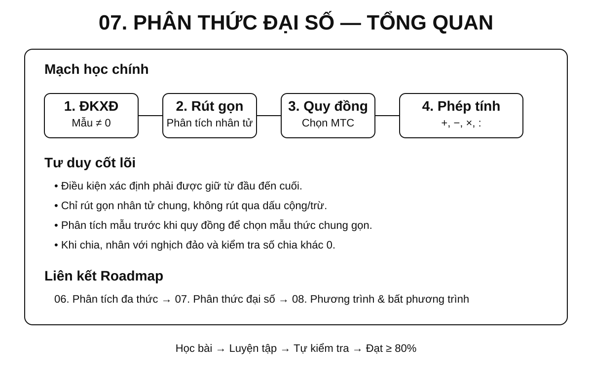
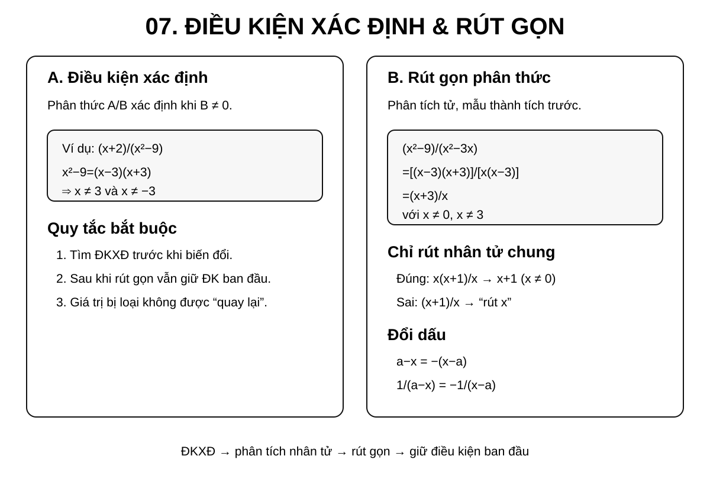
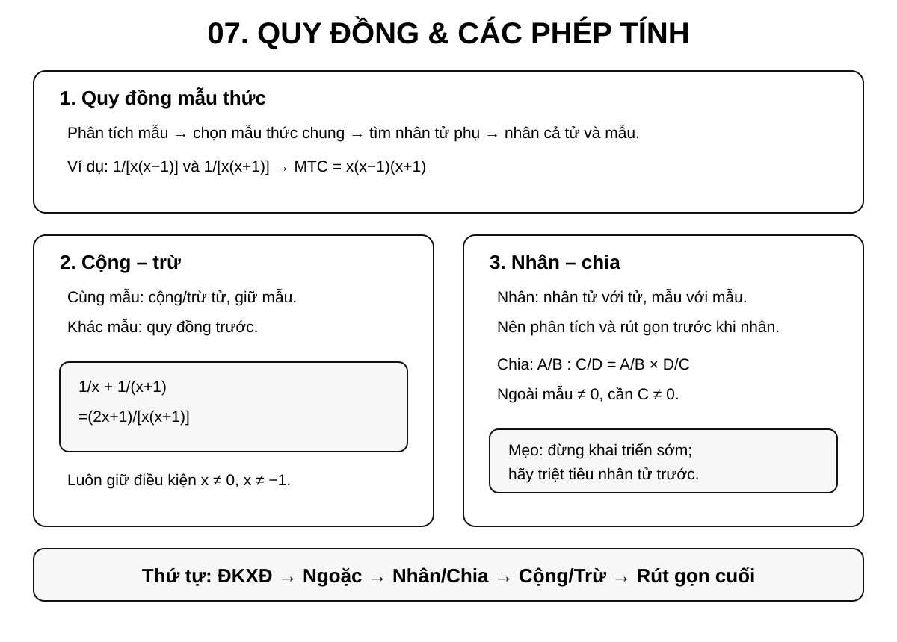
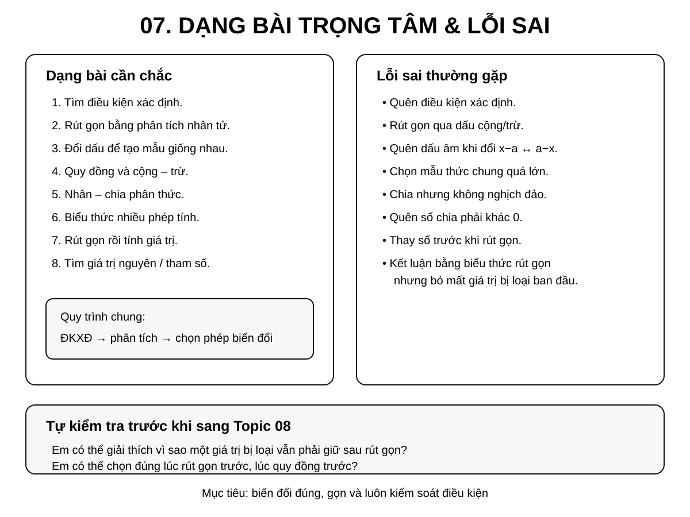

# Chuyên đề 07 – Phân thức đại số


> **Trạng thái:** Đã kiểm định nội dung học thuật; cấu trúc Roadmap chuẩn 11 mục.
>
> **Lớp trọng tâm:** 8
> **Mạch kiến thức:** Đại số
> **Mức ưu tiên:** ⭐⭐⭐⭐⭐

> **Vai trò trong Roadmap:** cầu nối trực tiếp từ phân tích đa thức thành nhân tử sang phương trình chứa ẩn ở mẫu và các phép biến đổi đại số phức tạp.
>

---

## 🧭 1. Bản đồ kiến thức

### Infographic 1 – Tổng quan chuyên đề



```text
PHÂN THỨC ĐẠI SỐ
│
├── 1. Khái niệm và điều kiện xác định
│   ├── Tử thức – mẫu thức
│   ├── Mẫu khác 0
│   └── Hai phân thức bằng nhau
│
├── 2. Tính chất cơ bản
│   ├── Nhân cả tử và mẫu với cùng một đa thức khác 0
│   ├── Chia cả tử và mẫu cho nhân tử chung
│   └── Đổi dấu
│
├── 3. Rút gọn phân thức
│   ├── Phân tích tử, mẫu thành nhân tử
│   ├── Tìm nhân tử chung
│   └── Rút gọn nhưng không làm mất điều kiện xác định
│
├── 4. Quy đồng mẫu thức
│   ├── Phân tích mẫu
│   ├── Chọn mẫu thức chung
│   └── Tìm nhân tử phụ
│
├── 5. Phép tính
│   ├── Cộng – trừ
│   ├── Nhân
│   ├── Chia
│   └── Biểu thức nhiều phép tính
│
└── 6. Ứng dụng
    ├── Tính giá trị biểu thức
    ├── Chứng minh đẳng thức
    ├── Tìm giá trị nguyên
    └── Chuẩn bị phương trình chứa ẩn ở mẫu
```

---

## 🎯 2. Mục tiêu cần đạt

Sau khi hoàn thành chuyên đề, học sinh cần có thể:

- [ ] Nhận biết đúng phân thức đại số và xác định tử thức, mẫu thức.
- [ ] Tìm điều kiện xác định trước khi thực hiện các phép biến đổi.
- [ ] Hiểu và sử dụng đúng tính chất cơ bản của phân thức.
- [ ] Rút gọn phân thức bằng cách phân tích đa thức thành nhân tử.
- [ ] Quy đồng mẫu thức của hai hoặc nhiều phân thức.
- [ ] Thực hiện đúng cộng, trừ, nhân, chia phân thức.
- [ ] Biến đổi biểu thức hữu tỉ nhiều bước theo thứ tự hợp lý.
- [ ] Tính giá trị biểu thức sau khi rút gọn và kiểm tra điều kiện.
- [ ] Nhận diện các lỗi sai do rút gọn sai, đổi dấu sai hoặc quên điều kiện xác định.
- [ ] Chuẩn bị tốt cho Chuyên đề 08 – Phương trình và bất phương trình.

---

## 📖 3. Kiến thức cốt lõi

### Infographic 2 – Điều kiện xác định và rút gọn



### Infographic 3 – Quy đồng và các phép tính



### 3.1. Phân thức đại số là gì?

Phân thức đại số có dạng:

`A/B`

trong đó `A`, `B` là các đa thức và `B` là **đa thức khác đa thức 0**.

- `A` gọi là **tử thức**.
- `B` gọi là **mẫu thức**.

Khi thay biến bằng một giá trị cụ thể, còn phải bảo đảm **giá trị của mẫu thức khác 0**.

Ví dụ:

- `(x + 1)/(x - 2)`
- `(2x² - 3x + 1)/(x² - 9)`
- `5/(x + 4)`

Một đa thức cũng có thể xem là một phân thức có mẫu bằng `1`.

---

### 3.2. Điều kiện xác định

Với một giá trị cụ thể của biến, phân thức xác định khi giá trị của mẫu thức khác `0`.

Ví dụ:

`A = (x + 1)/(x - 3)`

Điều kiện xác định:

`x - 3 ≠ 0 ⇒ x ≠ 3`

Với:

`B = (x + 2)/(x² - 9)`

Ta có:

`x² - 9 = (x - 3)(x + 3)`

nên:

`x ≠ 3` và `x ≠ -3`.

!!! warning "Quy tắc bắt buộc"
    Với bài có phân thức chứa biến ở mẫu, hãy tìm **điều kiện xác định trước khi rút gọn hoặc biến đổi**.

---

### 3.3. Hai phân thức bằng nhau

Với `B`, `D` là các đa thức khác đa thức `0`, hai phân thức

`A/B` và `C/D`

bằng nhau khi:

`A·D = B·C`

như một đẳng thức đa thức. Khi thay biến bằng giá trị cụ thể, chỉ được so sánh trên **miền xác định chung**, tức là các giá trị làm cả `B` và `D` khác `0`.

Ví dụ:

`(x + 1)/(x - 2) = (2x + 2)/(2x - 4)`

trên miền xác định `x ≠ 2`.

---

### 3.4. Tính chất cơ bản của phân thức

Với `M` là một đa thức khác đa thức `0`:

`A/B = (A·M)/(B·M)`

Khi xét giá trị của biểu thức, cần giữ các điều kiện để cả hai mẫu thức đều khác `0`.

Nếu `N` là nhân tử chung khác đa thức `0` của cả tử và mẫu thì có thể rút gọn:

`(A·N)/(B·N) = A/B`

trên các giá trị của biến mà phân thức ban đầu xác định.

Đây là cơ sở của hai thao tác quan trọng:

- **quy đồng**: nhân thêm nhân tử;
- **rút gọn**: chia đi nhân tử chung.

---

!!! warning "Miền xác định không tự mở rộng"
    Khi nhân cả tử và mẫu với một đa thức `M`, biểu thức mới có thể thêm các giá trị bị loại tại nghiệm của `M`. Ngược lại, khi rút gọn một nhân tử chung, không được lấy lại các giá trị đã bị loại ở phân thức ban đầu. Vì vậy mọi đẳng thức biến đổi phân thức phải được hiểu trên **miền xác định chung** của các biểu thức đang so sánh.

### 3.5. Quy tắc đổi dấu

Ta có:

`A/B = (-A)/(-B)`

và:

`A/(-B) = (-A)/B = -(A/B)`.

Đặc biệt:

`x - a = -(a - x)`.

Ví dụ:

`1/(x - 2) = -1/(2 - x)`.

Đây là kỹ năng rất quan trọng khi quy đồng mẫu thức.

---

## 🔗 4. Kiến thức liên quan

### Kiến thức cần nắm trước

- [Chuyên đề 04 – Biểu thức và biến đổi đại số](../04-bieu-thuc-dai-so/index.md)
- [Chuyên đề 05 – 7 Hằng đẳng thức đáng nhớ](../05-7-hang-dang-thuc/index.md)
- [Chuyên đề 06 – Phân tích đa thức thành nhân tử](../06-phan-tich-da-thuc/index.md)

### Kiến thức sẽ sử dụng tiếp

- [Chuyên đề 08 – Phương trình và bất phương trình](../08-phuong-trinh-bat-phuong-trinh/index.md)

Chuỗi kiến thức chính:

```text
04. Biểu thức đại số
        ↓
05. Hằng đẳng thức
        ↓
06. Phân tích đa thức thành nhân tử
        ↓
07. PHÂN THỨC ĐẠI SỐ
        ↓
08. Phương trình và bất phương trình
```

---

## 🧩 5. Các dạng bài cần nắm vững

### Infographic 4 – Dạng bài trọng tâm và lỗi sai



### Dạng 1 – Tìm điều kiện xác định

**Dấu hiệu:** mẫu thức có chứa biến.

**Cách làm:**

1. Cho từng mẫu thức khác `0`.
2. Phân tích mẫu thành nhân tử nếu cần.
3. Loại các giá trị làm mẫu bằng `0`.

**Ví dụ:**

Tìm điều kiện xác định của:

`A = (x + 2)/(x² - 5x + 6)`

Ta có:

`x² - 5x + 6 = (x - 2)(x - 3)`

Vậy:

`x ≠ 2`, `x ≠ 3`.

---

### Dạng 2 – Rút gọn phân thức

**Dấu hiệu:** tử và mẫu có thể phân tích thành nhân tử chung.

**Quy trình:**

`phân tích tử, mẫu → nhận nhân tử chung → rút gọn → giữ nguyên điều kiện xác định ban đầu`

**Ví dụ:**

`A = (x² - 9)/(x² - 3x)`

Điều kiện:

`x ≠ 0`, `x ≠ 3`.

Phân tích:

`x² - 9 = (x - 3)(x + 3)`

`x² - 3x = x(x - 3)`

Suy ra:

`A = [(x - 3)(x + 3)]/[x(x - 3)] = (x + 3)/x`

với **điều kiện ban đầu**:

`x ≠ 0`, `x ≠ 3`.

!!! danger "Không được làm mất điều kiện"
    Sau khi rút gọn, mẫu mới chỉ còn `x`, nhưng giá trị `x = 3` vẫn phải loại vì phân thức ban đầu không xác định tại đó.

---

### Dạng 3 – Đổi dấu để tạo mẫu giống nhau

Ví dụ:

`A = 1/(x - 2) + 1/(2 - x)`

Vì:

`2 - x = -(x - 2)`

nên:

`1/(2 - x) = -1/(x - 2)`

Do đó:

`A = 0`

với `x ≠ 2`.

---

### Dạng 4 – Quy đồng mẫu thức

**Quy trình chuẩn:**

1. Phân tích các mẫu thành nhân tử.
2. Chọn mẫu thức chung.
3. Xác định nhân tử phụ của từng mẫu.
4. Nhân cả tử và mẫu với nhân tử phụ tương ứng.

**Ví dụ:**

Quy đồng:

`1/[x(x - 1)]` và `1/[x(x + 1)]`.

Mẫu thức chung:

`x(x - 1)(x + 1)`.

Ta được:

`1/[x(x - 1)] = (x + 1)/[x(x - 1)(x + 1)]`

`1/[x(x + 1)] = (x - 1)/[x(x - 1)(x + 1)]`.

---

### Dạng 5 – Cộng, trừ phân thức

#### Cùng mẫu

`A/M + B/M = (A + B)/M`

`A/M - B/M = (A - B)/M`

#### Khác mẫu

Phải quy đồng trước.

**Ví dụ:**

`A = 1/x + 1/(x + 1)`

Điều kiện:

`x ≠ 0`, `x ≠ -1`.

Quy đồng:

`A = (x + 1)/[x(x + 1)] + x/[x(x + 1)]`

`= (2x + 1)/[x(x + 1)]`.

---

### Dạng 6 – Nhân phân thức

Quy tắc:

`A/B · C/D = (A·C)/(B·D)`.

Nên **phân tích thành nhân tử và rút gọn trước khi nhân khai triển**.

**Ví dụ:**

`A = (x² - 4)/(x² - x - 2) · (x - 2)/(x + 2)`

Điều kiện xác định:

`x ≠ 2`, `x ≠ -1`, `x ≠ -2`.

Phân tích:

`x² - 4 = (x - 2)(x + 2)`

`x² - x - 2 = (x - 2)(x + 1)`

Do đó:

`A = [(x - 2)(x + 2)]/[(x - 2)(x + 1)] · (x - 2)/(x + 2)`

`= (x - 2)/(x + 1)`

với điều kiện ban đầu `x ≠ 2`, `x ≠ -1`, `x ≠ -2`.

Ví dụ này cho thấy nên phân tích và rút gọn nhân tử trước khi nghĩ đến khai triển.

---

### Dạng 7 – Chia phân thức

Quy tắc:

`A/B : C/D = A/B · D/C`

Ngoài điều kiện các mẫu khác `0`, cần thêm điều kiện **phân thức bị chia khác `0`**.

Ví dụ:

`A/B : C/D`

cần:

- `B ≠ 0`
- `D ≠ 0`
- `C ≠ 0`

vì `C/D` không được bằng `0`.

---

### Dạng 8 – Biểu thức nhiều phép tính

**Thứ tự ưu tiên:**

1. Điều kiện xác định.
2. Ngoặc.
3. Nhân – chia.
4. Cộng – trừ.
5. Rút gọn cuối cùng.

Không nên quy đồng toàn bộ biểu thức quá sớm nếu có thể rút gọn từng cụm trước.

**Chiến lược tốt:**

`phân tích → rút gọn cục bộ → thực hiện phép tính → rút gọn toàn biểu thức`

---

### Dạng 9 – Tính giá trị biểu thức sau khi rút gọn

**Quy trình:**

1. Tìm điều kiện xác định.
2. Rút gọn biểu thức.
3. Kiểm tra giá trị cần thay có thỏa điều kiện không.
4. Thay số vào biểu thức đã rút gọn.

Ví dụ:

`A = (x² - 4)/(x - 2)` với `x ≠ 2`.

Rút gọn:

`A = x + 2` với `x ≠ 2`.

Tại `x = 5`:

`A = 7`.

Không được tính tại `x = 2`, dù biểu thức rút gọn `x + 2` có nghĩa tại `2`.

---

### Dạng 10 – Tìm giá trị nguyên của biểu thức

> **Mức vận dụng:** dạng này dùng để kết nối phân thức với tính chia hết và không phải là yêu cầu cơ bản của mọi bài về phân thức.

Một hướng xử lý là biến đổi biểu thức về dạng:

`A = k + m/(x - a)`

Muốn `A` nguyên, cần phân tích điều kiện để `x - a` là ước của `m`.

Ví dụ dạng:

`A = 2 + 3/(x - 1)`.

Nếu `x` nguyên và `A` nguyên thì `x - 1` phải là ước nguyên của `3`.

Đây là dạng vận dụng tốt để kết nối đại số với tính chia hết.

---

## 🚀 6. Dạng bài thi vào lớp 10

Trong bài toán tổng hợp, kiến thức phân thức đại số có thể được dùng trong **rút gọn biểu thức**, **tính giá trị**, **tìm điều kiện xác định** hoặc làm nền cho **phương trình chứa ẩn ở mẫu**.

| Nhóm kỹ năng | Mức ưu tiên Roadmap |
|---|:---:|
| Tìm điều kiện xác định | ⭐⭐⭐⭐⭐ |
| Phân tích mẫu thành nhân tử | ⭐⭐⭐⭐⭐ |
| Rút gọn biểu thức hữu tỉ | ⭐⭐⭐⭐⭐ |
| Quy đồng và cộng – trừ | ⭐⭐⭐⭐⭐ |
| Nhân – chia phân thức | ⭐⭐⭐⭐ |
| Tính giá trị sau rút gọn | ⭐⭐⭐⭐⭐ |
| Biểu thức nhiều bước | ⭐⭐⭐⭐⭐ |
| Tìm giá trị nguyên / tham số | ⭐⭐⭐⭐ |
| Chuẩn bị phương trình chứa ẩn ở mẫu | ⭐⭐⭐⭐⭐ |

### Mẫu tư duy cần hình thành

Khi gặp biểu thức hữu tỉ phức tạp, không nên bắt đầu tính ngay. Hãy hỏi:

1. **Điều kiện xác định là gì?**
2. **Có thể phân tích tử hoặc mẫu thành nhân tử không?**
3. **Có nhân tử nào triệt tiêu được không?**
4. **Có cần đổi dấu để tạo cùng mẫu không?**
5. **Nên rút gọn trước hay quy đồng trước?**

---

## ⚠️ 7. Lỗi sai thường gặp

### ❌ Lỗi 1 – Quên điều kiện xác định

Sai khi chỉ rút gọn mà không ghi giá trị bị loại.

**Cách tránh:** viết điều kiện ngay ở dòng đầu tiên.

---

### ❌ Lỗi 2 – Rút gọn các hạng tử thay vì nhân tử

Sai:

`(x + 2)/x` → “rút `x` với `x`”.

Không thể rút gọn vì `x` không phải nhân tử chung của toàn bộ tử `x + 2`.

Chỉ được rút gọn khi tử và mẫu ở dạng tích có nhân tử chung.

---

### ❌ Lỗi 3 – Rút gọn qua dấu cộng hoặc trừ

Sai:

`(x² + x)/x = x² + 1`.

Đúng:

`(x² + x)/x = x(x + 1)/x = x + 1`, với `x ≠ 0`.

---

### ❌ Lỗi 4 – Quên đổi dấu

`x - a` và `a - x` không giống nhau mà đối nhau:

`a - x = -(x - a)`.

---

### ❌ Lỗi 5 – Quy đồng sai mẫu thức chung

Mẫu thức chung không phải lúc nào cũng là tích nguyên xi của mọi mẫu. Hãy phân tích các mẫu trước để tránh lặp thừa nhân tử.

---

### ❌ Lỗi 6 – Chia nhưng quên nghịch đảo

Sai:

`A/B : C/D = AC/BD`.

Đúng:

`A/B : C/D = A/B · D/C`.

---

### ❌ Lỗi 7 – Bỏ quên điều kiện của số chia

Trong phép chia phân thức, phân thức đứng sau dấu `:` phải khác `0`.

---

### ❌ Lỗi 8 – Thay số trước khi rút gọn

Với biểu thức dài, thay số quá sớm thường làm phép tính nặng và tăng nguy cơ sai. Nếu đề cho phép, hãy rút gọn đại số trước.

---

## 📝 8. Luyện tập tiếp theo

Phần **micro-practice** trong 5 Learning Cards dùng để kiểm tra nhanh ngay sau khi học. Khi muốn luyện sâu hơn và lặp lại theo kỹ năng, hãy chuyển sang **Practice Room**.

[🎯 Mở Practice Room – Chuyên đề 07](bai-tap.md){ .md-button .md-button--primary }

Trong Practice Room có hai chế độ:

- **Luyện nhanh tương tác:** Practice Engine chọn câu từ ngân hàng lớn, có feedback, gợi ý, Tutor và luyện điểm yếu.
- **Luyện tự luận & trình bày:** tự giải trên giấy/vở rồi mở gợi ý hoặc lời giải để tự đối chiếu từng bước.

!!! info "Phân biệt mục đích"
    Micro-practice dùng để kiểm tra hiểu ngay khi học; Practice Room dùng để **rèn kỹ năng**. Kết quả luyện tập là learner evidence dạng formative, không phải một bài thi cuối chuyên đề.

---

## ✅ 9. Tự kiểm tra mức độ sẵn sàng

Khi đã luyện tương đối chắc, hãy làm **Core Readiness Check** để xem mình có thể giải độc lập đến đâu.

[✅ Bắt đầu Core Readiness Check](tu-kiem-tra.md){ .md-button .md-button--primary }

Trong Readiness Check:

- không có gợi ý và không có Tutor khi đang làm;
- không báo đúng/sai từng câu;
- chỉ chấm sau khi bấm **Nộp bài**;
- kết quả được phân tích theo kỹ năng;
- đây là **soft mastery**: kết quả thấp sẽ gợi ý ôn đúng phần yếu, nhưng không khóa chuyên đề tiếp theo.

Phần **Entrance10 / Challenge** không tính vào kết quả hoàn thành KNTT Core.

---

## 🔄 10. Liên kết Roadmap

**← Kiến thức nền:**

- [04. Biểu thức và biến đổi đại số](../04-bieu-thuc-dai-so/index.md)
- [05. 7 Hằng đẳng thức đáng nhớ](../05-7-hang-dang-thuc/index.md)
- [06. Phân tích đa thức thành nhân tử](../06-phan-tich-da-thuc/index.md)

**→ Tiếp theo:**

- [08. Phương trình và bất phương trình](../08-phuong-trinh-bat-phuong-trinh/index.md)

Xem toàn bộ hệ thống tại [Blueprint 25 chuyên đề](../../roadmap/blueprint-25-chuyen-de.md).

---

## 🏁 11. Điều kiện hoàn thành

Chuyên đề được xem là **đủ sẵn sàng để học tiếp** khi học sinh có phần lớn các bằng chứng sau:

- [ ] Hiểu và giải thích được các quy tắc Core của phân thức đại số.
- [ ] Tìm đúng điều kiện xác định trong các bài Core.
- [ ] Rút gọn, quy đồng và thực hiện được cộng – trừ – nhân – chia phân thức cơ bản.
- [ ] Không lặp lại ổn định cùng một lỗi sai nền tảng sau khi đã được chữa.
- [ ] Practice evidence cho thấy các kỹ năng Core đang tương đối ổn định.
- [ ] Core Readiness Check đạt khoảng **80%** hoặc học sinh đã hiểu và chữa được các lỗi còn lại.

!!! note "Soft Mastery"
    Không cần đạt 100% mới được học tiếp. Nếu Readiness Check cho thấy một vài kỹ năng còn yếu, hệ thống sẽ khuyến nghị luyện lại đúng kỹ năng đó; học sinh vẫn có thể chuyển sang chuyên đề tiếp theo.

!!! warning "Core độc lập Extension"
    Bài Entrance10 hoặc Specialized-Challenge không phải điều kiện để hoàn thành KNTT Core của chuyên đề.

---

## ➡️ Tiếp tục học

<div class="topic-workspace-actions" markdown>

[🎯 Sang Phòng Luyện Tập](bai-tap.md){ .md-button .md-button--primary }

[✅ Kiểm Tra Độ Sẵn Sàng](tu-kiem-tra.md){ .md-button }

</div>
