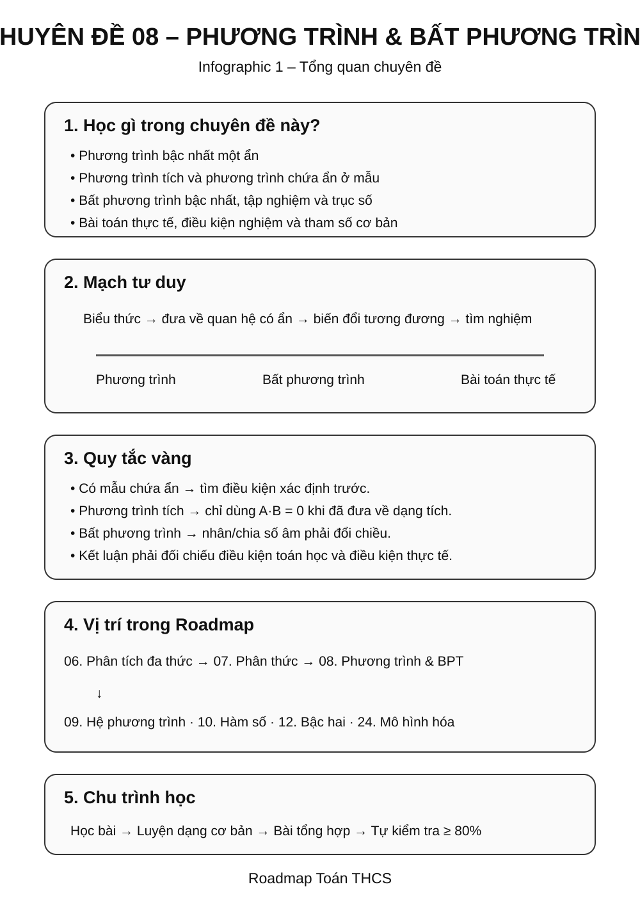
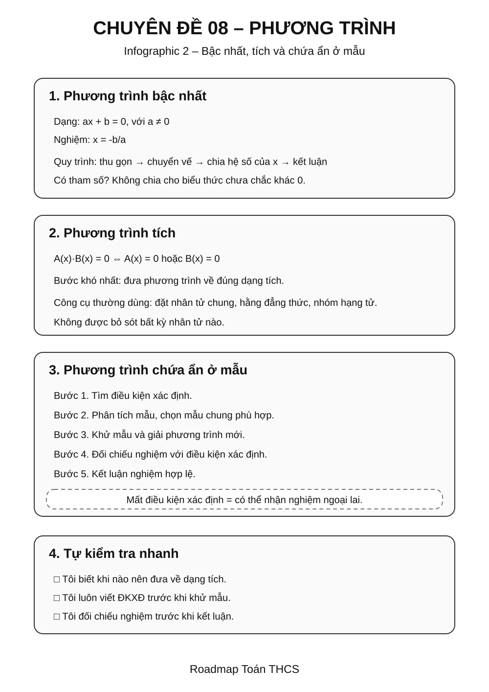
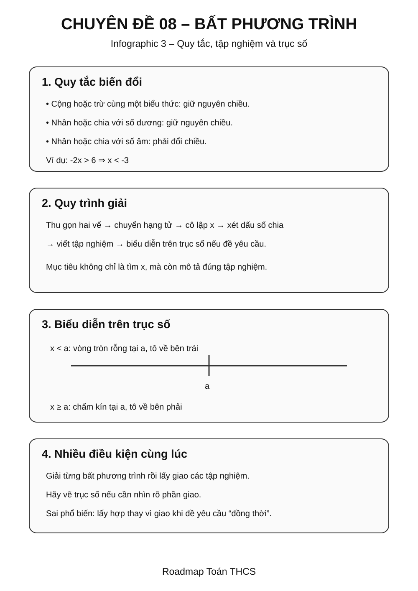
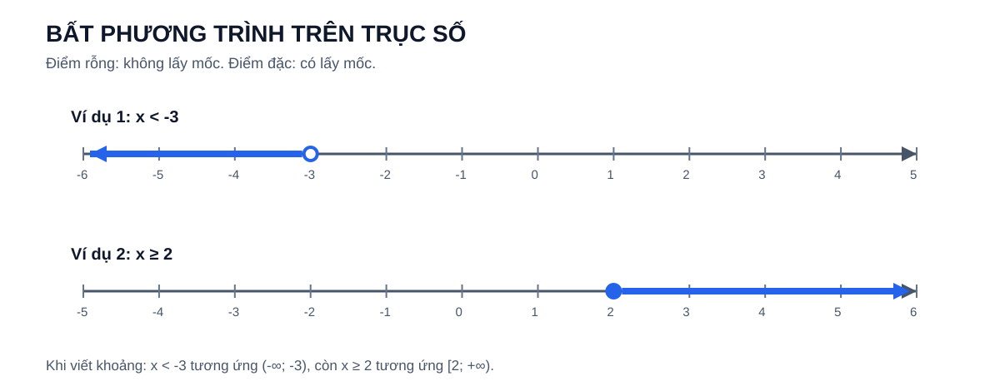
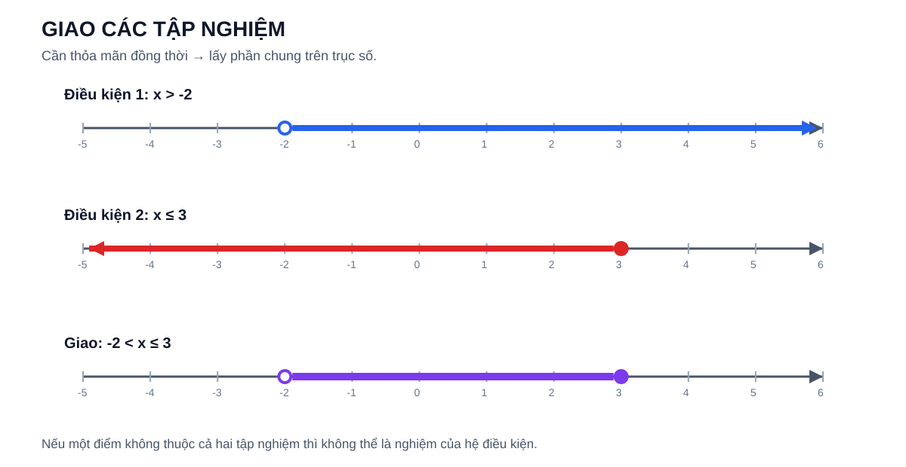
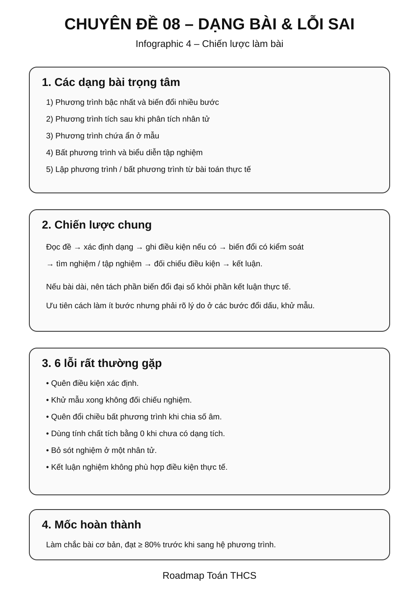

# Chuyên đề 08 – Phương trình và bất phương trình


> **Trạng thái:** Đã kiểm định nội dung học thuật; cấu trúc Roadmap chuẩn 11 mục.
>
> **Lớp trọng tâm:** 8–9
> **Mạch kiến thức:** Đại số
> **Mức ưu tiên:** ⭐⭐⭐⭐⭐

> **Vai trò:** Chuyên đề trọng tâm của Đại số THCS, kết nối trực tiếp với hệ phương trình, hàm số và bài toán thực tế.

---

## 🧭 1. Bản đồ kiến thức

### Infographic – Tổng quan chuyên đề



```text
PHƯƠNG TRÌNH & BẤT PHƯƠNG TRÌNH
│
├── Phương trình bậc nhất
│   ├── Quy tắc biến đổi
│   └── Biện luận nghiệm cơ bản
│
├── Phương trình tích
│   ├── Đưa về dạng tích
│   └── Dùng tính chất tích bằng 0
│
├── Phương trình chứa ẩn ở mẫu
│   ├── Điều kiện xác định
│   ├── Quy đồng / khử mẫu
│   └── Đối chiếu điều kiện
│
├── Bất phương trình bậc nhất
│   ├── Quy tắc biến đổi
│   └── Đổi chiều khi nhân/chia số âm
│
├── Mở rộng: nhiều bất phương trình cùng điều kiện
│   └── Giao các tập nghiệm
│
└── Bài toán thực tế
    ├── Lập phương trình
    └── Lập bất phương trình
```

## 🎯 2. Mục tiêu cần đạt

### Bắt buộc

- Hiểu nghiệm của phương trình và bất phương trình.
- Biết các phép biến đổi tương đương cơ bản và điều kiện để phép biến đổi giữ nguyên tập nghiệm.
- Giải thành thạo phương trình bậc nhất một ẩn.
- Nhận dạng và giải phương trình tích.
- Giải phương trình chứa ẩn ở mẫu đúng quy trình.
- Giải bất phương trình bậc nhất một ẩn.
- Biết biểu diễn tập nghiệm trên trục số.

### Vận dụng

- Kết hợp nhiều phép biến đổi.
- Giải bài toán bằng cách lập phương trình/bất phương trình.
- Kiểm tra điều kiện và loại nghiệm không phù hợp.
- Chuyển đổi linh hoạt giữa biểu thức, phương trình và bài toán thực tế.

---

## 📖 3. Kiến thức cốt lõi

### Infographic – Phương trình



### Infographic – Bất phương trình



### 3.1. Phương trình bậc nhất một ẩn

Dạng tổng quát:

$$ax+b=0,\quad a\ne0$$

Nghiệm:

$$x=-\frac ba$$

Các phép biến đổi tương đương thường dùng:

- cộng hoặc trừ cùng một biểu thức vào hai vế;
- nhân hoặc chia hai vế cho cùng một **số khác 0**.

**Quy trình:** thu gọn → chuyển vế → chia cho hệ số khác 0 của $x$ → kiểm tra nếu cần.

> Nếu xuất hiện tham số làm hệ số của $x$ có thể bằng `0`, phải xét riêng trường hợp đó; không được chia ngay cho một biểu thức chưa biết có khác `0` hay không.

#### Mở rộng / Entrance10 – Khi hệ số của ẩn có thể bằng 0

Trong bài có tham số, sau khi thu gọn thường xuất hiện dạng:

```text
A x + B = 0
```

trong đó `A`, `B` có thể phụ thuộc tham số. Phải xét đủ ba trường hợp:

- `A ≠ 0` → có đúng một nghiệm `x = -B/A`;
- `A = 0` và `B = 0` → phương trình trở thành `0 = 0`, có vô số nghiệm;
- `A = 0` và `B ≠ 0` → phương trình trở thành một mệnh đề sai như `0 = 3`, nên vô nghiệm.

> **Phân tầng:** biện luận tham số là nội dung Entrance10/Extension trong Golden Template hiện tại, không tính vào Core Readiness. Nguyên tắc dưới đây được giữ làm tài liệu tham khảo.
>
> Đây là nguyên tắc nền khi biện luận phương trình có tham số; không được dùng công thức `x = -B/A` trước khi biết `A ≠ 0`.

### 3.2. Phương trình tích

Nếu:

$$A(x)B(x)=0$$

thì:

$$A(x)=0\quad\text{hoặc}\quad B(x)=0.$$

Điểm quan trọng là phải **đưa phương trình về dạng tích** trước khi áp dụng tính chất.

### 3.3. Phương trình chứa ẩn ở mẫu

Quy trình bắt buộc:

1. Tìm **điều kiện xác định**.
2. Quy đồng hoặc nhân hai vế với mẫu chung phù hợp.
3. Giải phương trình sau khi khử mẫu.
4. Đối chiếu nghiệm với điều kiện xác định.
5. Kết luận.

!!! warning "Khử mẫu chỉ tương đương trên miền xác định"
    Khi nhân hai vế với mẫu chung, phép biến đổi chỉ được hiểu trên các giá trị đã thỏa **điều kiện xác định**. Vì vậy giá trị bị loại từ đầu không được lấy lại dù sau khi khử mẫu biểu thức mới có nghĩa tại giá trị đó.

### 3.4. Bất phương trình bậc nhất một ẩn

Khi cộng hoặc trừ cùng một biểu thức vào hai vế, chiều bất phương trình được giữ nguyên. Khi nhân hoặc chia hai vế với một **số dương**, chiều được giữ nguyên; với một **số âm**, phải **đổi chiều bất phương trình**.

Ví dụ:

$$-2x>6\Rightarrow x<-3.$$

> Nếu nhân hoặc chia hai vế cho một **biểu thức chứa ẩn hoặc tham số** mà chưa biết dấu, không được tự động giữ hay đổi chiều. Trước hết phải xác định dấu của biểu thức đó hoặc chia bài toán thành các trường hợp. Ở mức cốt lõi, chỉ nên nhân/chia bất phương trình với số đã biết dấu.

#### Trực quan – biểu diễn tập nghiệm trên trục số



Hình trên giúp phân biệt nhanh:

- dấu `<`, `>` → **không lấy mốc** nên dùng điểm rỗng;
- dấu `≤`, `≥` → **có lấy mốc** nên dùng điểm đặc;
- phần tô về phía nào cho biết các giá trị được nhận về phía đó.

> Khi biểu diễn trên trục số, cần kiểm tra đồng thời **mốc biên** và **hướng của tập nghiệm**; chỉ đúng một trong hai vẫn là sai.

### 3.5. Mở rộng – nhiều bất phương trình cùng điều kiện

Khi cần tìm các giá trị thỏa mãn đồng thời nhiều bất phương trình một ẩn, giải từng bất phương trình rồi lấy **giao** các tập nghiệm.

> Phần này dùng để rèn tư duy về giao tập nghiệm và hỗ trợ bài toán có nhiều điều kiện; không xem là trọng tâm cốt lõi ngang với phương trình và bất phương trình bậc nhất một ẩn.

#### Trực quan – giao các tập nghiệm



Nếu bài toán yêu cầu nhiều điều kiện phải đúng **đồng thời**, ta chỉ giữ phần nằm trong **tất cả** các tập nghiệm. Ví dụ trên:

`x > -2` và `x ≤ 3`  →  `-2 < x ≤ 3`.

Đây chính là ý nghĩa trực quan của phép **giao** các tập nghiệm.

---

## 🔗 4. Kiến thức liên quan

**Cần nắm trước:**

- [04. Biểu thức và biến đổi đại số](../04-bieu-thuc-dai-so/index.md)
- [06. Phân tích đa thức thành nhân tử](../06-phan-tich-da-thuc/index.md)
- [07. Phân thức đại số](../07-phan-thuc-dai-so/index.md)
- Biến đổi và rút gọn biểu thức

**Học tiếp / liên hệ:**

- [09. Hệ phương trình bậc nhất hai ẩn](../09-he-phuong-trinh/index.md)
- [10. Hàm số và đồ thị](../10-ham-so-do-thi/index.md)
- [12. Phương trình bậc hai & Viète](../12-phuong-trinh-bac-hai-viete/index.md)
- [24. Bài toán thực tế và mô hình hóa](../24-bai-toan-thuc-te/index.md)

**Mạch kiến thức:**

`04 Biểu thức` → `06 Phân tích đa thức` → **`08 Phương trình & bất phương trình`** → `09 Hệ phương trình` / `10 Hàm số` → `24 Mô hình hóa`.

---

## 🧩 5. Các dạng bài cần nắm vững

### Infographic – Dạng bài và lỗi sai



=== "Mức 1 — Nhận biết"

    - Giải phương trình bậc nhất.
    - Nhận dạng phương trình tích.
    - Tìm điều kiện xác định.
    - Giải bất phương trình đơn giản.
    - Biểu diễn tập nghiệm trên trục số.

=== "Mức 2 — Thông hiểu"

    - Phương trình cần thu gọn nhiều bước.
    - Phương trình tích sau khi phân tích nhân tử.
    - Phương trình chứa ẩn ở mẫu.
    - Bài toán nhiều điều kiện, lấy giao các tập nghiệm (mở rộng).

=== "Mức 3 — Vận dụng"

    - Phương trình kết hợp nhiều kỹ thuật.
    - Bài toán lập phương trình.
    - Bài toán lập bất phương trình.
    - Bài toán có điều kiện nghiệm.

=== "Mức 4 — Nâng cao"

    - Phương trình có tham số.
    - Bài toán biện luận nghiệm.
    - Kết hợp phương trình với điều kiện thực tế.
    - Bài toán liên hệ với hàm số hoặc đồ thị.

---

### Ví dụ mẫu

#### Ví dụ 1 — Phương trình bậc nhất

$$3x-5=10$$

$$3x=15\Rightarrow x=5.$$

#### Ví dụ 2 — Phương trình tích

$$x(x-3)=0$$

$$x=0\quad\text{hoặc}\quad x=3.$$

#### Ví dụ 3 — Bất phương trình

$$-2x+4>0$$

$$-2x>-4\Rightarrow x<2.$$

> Khi nhân/chia với số âm, **đổi chiều**.

---

## 🚀 6. Dạng bài thi vào lớp 10

| Dạng | Ưu tiên | Kỹ năng cần đạt |
|---|---:|---|
| Phương trình cơ bản | ⭐⭐⭐⭐⭐ | Giải nhanh, chính xác |
| Phương trình tích | ⭐⭐⭐⭐ | Phân tích và giải đúng |
| Phương trình chứa ẩn ở mẫu | ⭐⭐⭐⭐⭐ | ĐKXĐ + khử mẫu + đối chiếu |
| Bất phương trình | ⭐⭐⭐⭐ | Biến đổi và biểu diễn nghiệm |
| Nhiều bất phương trình cùng điều kiện (mở rộng) | ⭐⭐⭐ | Lấy giao tập nghiệm |
| Lập phương trình từ bài toán | ⭐⭐⭐⭐⭐ | Mô hình hóa |
| Bài toán tham số/nâng cao | ⭐⭐⭐ | Biện luận |

> ⭐ là **mức độ ưu tiên ôn tập của Roadmap**, không phải cam kết dạng bài sẽ xuất hiện trong mọi đề thi địa phương.

---

## ⚠️ 7. Lỗi sai thường gặp

!!! warning "5 lỗi cần kiểm tra trước khi nộp bài"

    1. Quên điều kiện xác định khi mẫu chứa ẩn.
    2. Khử mẫu nhưng không kiểm tra nghiệm với điều kiện xác định.
    3. Quên đổi chiều bất phương trình khi nhân/chia với số âm.
    4. Phân tích tích sai dấu hoặc bỏ sót nghiệm.
    5. Lập phương trình đúng nhưng kết luận không phù hợp với điều kiện thực tế.

---

## 📝 8. Luyện tập tiếp theo

Micro-practice trong các Learning Cards dùng để kiểm tra nhanh ngay sau khi học. Khi muốn luyện sâu hơn, luyện từng skill hoặc làm bài tự luận, hãy chuyển sang **Practice Room**.

[🎯 Mở Practice Room – Chuyên đề 08](bai-tap.md){ .md-button .md-button--primary }

Trong Practice Room:

- **Luyện nhanh tương tác:** Practice Engine chọn câu từ ngân hàng lớn, có feedback, gợi ý và Tutor.
- **Luyện tự luận & trình bày:** tự giải trên giấy/vở rồi mở gợi ý hoặc lời giải để tự đối chiếu.
- Core / Entrance10 / Challenge được tách rõ.

!!! info "Phân biệt mục đích"
    Micro-practice kiểm tra hiểu ngay; Practice Room dùng để **rèn kỹ năng**. Kết quả luyện tập là formative evidence, không phải điểm kiểm tra cuối chuyên đề.

---

## ✅ 9. Tự kiểm tra mức độ sẵn sàng

Khi đã luyện tương đối chắc, hãy làm **Core Readiness Check**.

[✅ Bắt đầu Core Readiness Check](tu-kiem-tra.md){ .md-button .md-button--primary }

Trong Readiness Check:

- không hint và không Tutor khi đang làm;
- không báo đúng/sai từng câu;
- chỉ chấm sau khi bấm **Nộp bài**;
- kết quả phân tích theo assessed skill;
- là **Soft Mastery**: không khóa chuyên đề tiếp theo;
- Entrance10 / Challenge không tính vào Core readiness.

---

## 🔄 10. Liên kết Roadmap

**← Trước:** [07. Phân thức đại số](../07-phan-thuc-dai-so/index.md)

**→ Tiếp theo:** [09. Hệ phương trình bậc nhất hai ẩn](../09-he-phuong-trinh/index.md)

**Liên hệ gần:**

- [04. Biểu thức và biến đổi đại số](../04-bieu-thuc-dai-so/index.md)
- [06. Phân tích đa thức thành nhân tử](../06-phan-tich-da-thuc/index.md)
- [10. Hàm số và đồ thị](../10-ham-so-do-thi/index.md)
- [24. Bài toán thực tế và mô hình hóa](../24-bai-toan-thuc-te/index.md)

- **✏️ Luyện tập:** [Bài tập Chuyên đề 08](bai-tap.md)
- **✅ Tự kiểm tra:** [Tự kiểm tra Chuyên đề 08](tu-kiem-tra.md)

---

## 🏁 11. Điều kiện hoàn thành

Chuyên đề được xem là **đủ sẵn sàng để học tiếp** khi học sinh có phần lớn các bằng chứng sau:

- [ ] Hiểu và giải thích được các quy tắc Core của chuyên đề.
- [ ] Làm tương đối ổn định các skill Core trong Practice Room.
- [ ] Không lặp lại ổn định cùng một lỗi nền tảng sau khi đã được chữa.
- [ ] Core Readiness Check đạt khoảng **80%** hoặc học sinh đã hiểu và chữa được các lỗi còn lại.
- [ ] Có thể trình bày ít nhất một số bài tự luận Core mà không mở lời giải trước.

!!! note "Soft Mastery"
    Không cần đạt 100% mới được học tiếp. Nếu Readiness Check cho thấy một vài kỹ năng còn yếu, hệ thống khuyến nghị luyện lại đúng kỹ năng đó; học sinh vẫn có thể chuyển sang chuyên đề tiếp theo.

!!! warning "Core độc lập Extension"
    Entrance10 và Specialized-Challenge không phải điều kiện để hoàn thành KNTT Core.

---

## ➡️ Tiếp tục học

<div class="topic-workspace-actions" markdown>

[🎯 Sang Phòng Luyện Tập](bai-tap.md){ .md-button .md-button--primary }

[✅ Kiểm Tra Độ Sẵn Sàng](tu-kiem-tra.md){ .md-button }

[→ 09 – Hệ phương trình bậc nhất hai ẩn](../09-he-phuong-trinh/index.md){ .md-button }

</div>
