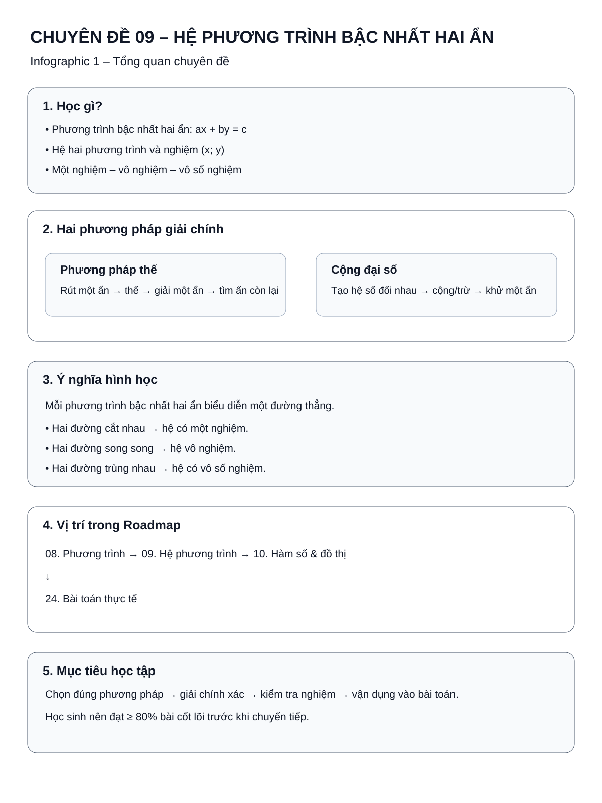
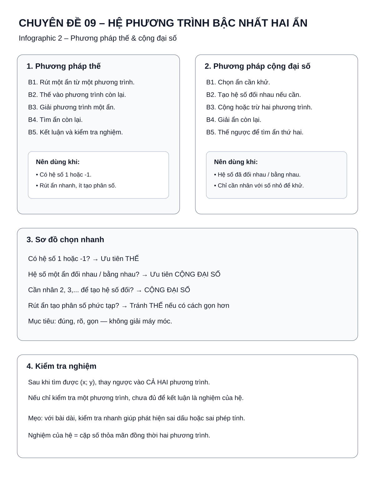
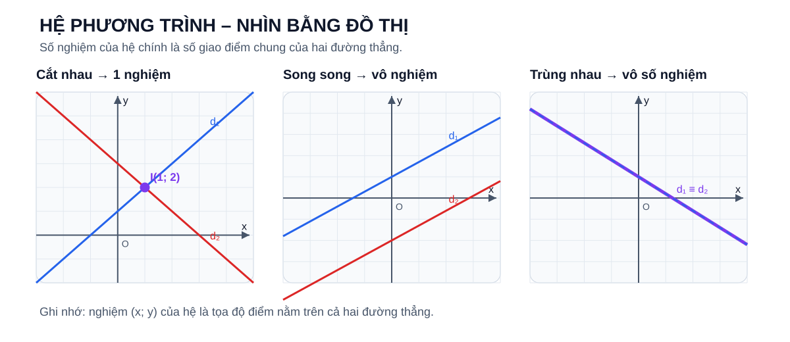
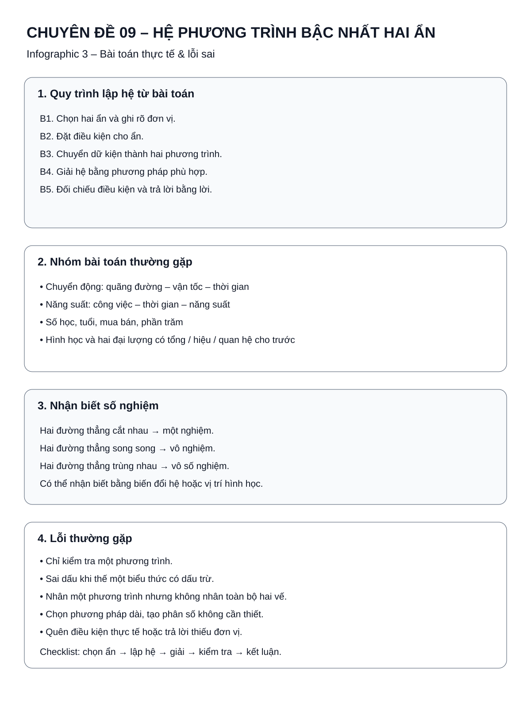

# Chuyên đề 09 – Hệ phương trình bậc nhất hai ẩn


> **Trạng thái:** Đã kiểm định nội dung học thuật; cấu trúc Roadmap chuẩn 11 mục.
>
> **Lớp trọng tâm:** 9
> **Mạch kiến thức:** Đại số
> **Mức ưu tiên:** ⭐⭐⭐⭐⭐

> **Vai trò trong Roadmap:** kết nối trực tiếp từ phương trình một ẩn sang bài toán có hai đại lượng chưa biết; là nền tảng cho bài toán thực tế, hàm số và ôn thi vào lớp 10.

---

## 🧭 1. Bản đồ kiến thức

### Infographic tổng quan



```text
HỆ PHƯƠNG TRÌNH BẬC NHẤT HAI ẨN
│
├── 1. Phương trình bậc nhất hai ẩn
│   ├── Dạng ax + by = c
│   ├── Nghiệm (x; y)
│   └── Biểu diễn hình học bằng đường thẳng
│
├── 2. Hệ hai phương trình bậc nhất hai ẩn
│   ├── Một nghiệm
│   ├── Vô nghiệm
│   └── Vô số nghiệm
│
├── 3. Phương pháp giải
│   ├── Thế
│   ├── Cộng đại số
│   └── Chọn phương pháp phù hợp
│
├── 4. Vận dụng và mở rộng
│   ├── Nhận biết số nghiệm
│   ├── Tham số nhẹ / hệ số chưa biết
│   └── Biện luận tham số mở rộng
│
└── 5. Bài toán thực tế
    ├── Chọn ẩn
    ├── Lập hệ
    ├── Giải hệ
    └── Đối chiếu điều kiện thực tế
```

---

## 🎯 2. Mục tiêu cần đạt

Sau khi hoàn thành chuyên đề, học sinh cần có thể:

- [ ] Hiểu khái niệm phương trình bậc nhất hai ẩn và nghiệm của phương trình.
- [ ] Hiểu nghiệm của hệ là cặp số thỏa mãn đồng thời cả hai phương trình.
- [ ] Giải thành thạo hệ bằng phương pháp thế.
- [ ] Giải thành thạo hệ bằng phương pháp cộng đại số.
- [ ] Biết chọn phương pháp ngắn gọn thay vì giải máy móc.
- [ ] Kiểm tra nghiệm bằng cách thay ngược vào hệ ban đầu.
- [ ] Nhận biết trường hợp hệ có một nghiệm, vô nghiệm hoặc vô số nghiệm.
- [ ] Lập được hệ từ bài toán thực tế đơn giản và trung bình.
- [ ] Làm được bài tham số nhẹ ở mức củng cố; nhận biết bài biện luận tham số đầy đủ là phần ôn thi vào 10.

---

## 📖 3. Kiến thức cốt lõi

### Infographic – Phương pháp thế và cộng đại số



### 3.1. Phương trình bậc nhất hai ẩn

Phương trình bậc nhất hai ẩn có dạng:

$$
ax + by = c
$$

trong đó `a`, `b` không đồng thời bằng 0.

Một cặp số `(x_0; y_0)` là nghiệm nếu:

$$
a x_0 + b y_0 = c.
$$

Ví dụ:

$$
2x + y = 5
$$

có nghiệm `(2;1)` vì:

$$
2\cdot2 + 1 = 5.
$$

Trên tập số thực, một phương trình bậc nhất hai ẩn có **vô số nghiệm**.

---

### 3.2. Hệ hai phương trình bậc nhất hai ẩn

Hệ có dạng:

$$
\begin{cases}
a_1x+b_1y=c_1\\
a_2x+b_2y=c_2
\end{cases}
$$

Nghiệm của hệ là cặp `(x;y)` thỏa mãn **đồng thời cả hai phương trình**.

Ví dụ:

$$
\begin{cases}
x+y=5\\
x-y=1
\end{cases}
$$

có nghiệm `(3;2)`.

---

### 3.3. Ý nghĩa hình học

Mỗi phương trình bậc nhất hai ẩn biểu diễn một đường thẳng trên mặt phẳng tọa độ.

Vì vậy:

- Hai đường thẳng cắt nhau → hệ có **một nghiệm**.
- Hai đường thẳng song song → hệ **vô nghiệm**.
- Hai đường thẳng trùng nhau → hệ có **vô số nghiệm**.

#### Trực quan – số nghiệm của hệ



Có thể đọc hình theo một quy tắc duy nhất:

**số nghiệm của hệ = số điểm chung của hai đường thẳng**.

- cắt nhau tại một điểm → một nghiệm;
- không có điểm chung → vô nghiệm;
- trùng nhau → mọi điểm trên đường thẳng đều là điểm chung, nên có vô số nghiệm.

> Đây không phải một quy tắc mới tách biệt với đại số: nó là cách nhìn hình học của chính điều kiện “một cặp `(x; y)` phải thỏa đồng thời cả hai phương trình”.

#### Ví dụ sâu – nhìn nghiệm hệ trên đồ thị rồi kiểm tra lại bằng đại số

Xét hệ:

$$
\begin{cases}
x+y=4\\
x-y=0
\end{cases}
$$

**Bước 1 – Viết mỗi phương trình dưới dạng dễ vẽ.**

- Đường thẳng thứ nhất: `y=4-x`.
- Đường thẳng thứ hai: `y=x`.

**Bước 2 – Chọn hai điểm cho mỗi đường thẳng.**

| Đường thẳng | Điểm 1 | Điểm 2 |
|---|---|---|
| `y=4-x` | `(0;4)` | `(4;0)` |
| `y=x` | `(0;0)` | `(3;3)` |

Khi biểu diễn trên cùng hệ trục, hai đường thẳng cắt nhau tại `(2;2)`.

**Bước 3 – Đọc ý nghĩa của giao điểm.**

Giao điểm `(2;2)` là nghiệm của hệ vì cùng nằm trên **cả hai** đường thẳng.

**Bước 4 – Kiểm tra bằng đại số.**

$$
2+2=4,\qquad 2-2=0.
$$

Vì `(2;2)` thỏa đồng thời hai phương trình nên nghiệm đọc từ đồ thị là đúng.

!!! tip "Điều cần hiểu"
    Đồ thị không tạo ra một loại nghiệm mới. Nó cho ta **một cách nhìn khác của cùng nghiệm đại số**. Khi hai đường song song sẽ không có giao điểm; khi hai đường trùng nhau sẽ có vô số điểm chung.

Đây là cầu nối quan trọng sang [Chuyên đề 10 – Hàm số và đồ thị](../10-ham-so-do-thi/index.md).

---

### 3.3A. Các phép biến đổi tương đương của hệ

Những thao tác sau giữ nguyên tập nghiệm của hệ:

1. đổi thứ tự hai phương trình;
2. nhân **cả hai vế của một phương trình** với cùng một số khác `0`;
3. thay một phương trình bằng tổng của chính phương trình đó với một bội của phương trình còn lại.

Phương pháp cộng đại số dựa trực tiếp vào thao tác thứ ba. Ví dụ, nếu cộng hai phương trình để khử `y`, ta không tạo ra nghiệm mới và cũng không làm mất nghiệm cũ, miễn là các phép biến đổi được thực hiện trên toàn bộ hai vế.

> Không được chỉ cộng/trừ riêng các hạng tử thuận mắt hoặc nhân một vế mà quên vế còn lại.

### 3.4. Hai phương pháp giải cơ bản

#### Phương pháp thế

Quy trình:

1. Rút một ẩn theo ẩn còn lại từ một phương trình.
2. Thế vào phương trình kia.
3. Giải phương trình một ẩn.
4. Tìm ẩn còn lại.
5. Kết luận nghiệm của hệ.

Ví dụ:

$$
\begin{cases}
x+y=5\\
2x-y=4
\end{cases}
$$

Từ phương trình đầu:

$$
y=5-x.
$$

Thế vào phương trình hai:

$$
2x-(5-x)=4
$$

$$
3x=9 \Rightarrow x=3.
$$

Suy ra:

$$
y=2.
$$

Vậy hệ có nghiệm:

$$
(x;y)=(3;2).
$$

!!! tip "Khi nào nên dùng thế?"
    Ưu tiên phương pháp thế khi một phương trình đã có hệ số `1` hoặc `-1` ở một ẩn, hoặc có thể dễ dàng rút một ẩn.

---

#### Phương pháp cộng đại số

Mục tiêu là làm cho hệ số của một ẩn trở thành hai số đối nhau hoặc bằng nhau để khử ẩn đó.

Ví dụ:

$$
\begin{cases}
2x+3y=7\\
3x-3y=8
\end{cases}
$$

Cộng hai phương trình:

$$
5x=15 \Rightarrow x=3.
$$

Thế vào phương trình đầu:

$$
6+3y=7 \Rightarrow y=\frac13.
$$

Vậy:

$$
(x;y)=\left(3;\frac13\right).
$$

!!! tip "Khi nào nên dùng cộng đại số?"
    Ưu tiên khi hệ số của một ẩn đã đối nhau, bằng nhau, hoặc chỉ cần nhân một phương trình với số nhỏ để khử ẩn.

---

#### Chọn phương pháp nhanh

| Dấu hiệu | Phương pháp nên ưu tiên |
|---|---|
| Có hệ số `1` hoặc `-1` | Thế |
| Hệ số một ẩn đối nhau | Cộng đại số |
| Hệ số một ẩn bằng nhau | Trừ hai phương trình |
| Chỉ cần nhân một phương trình với 2, 3,... | Cộng đại số |
| Rút ẩn tạo phân số phức tạp | Tránh thế nếu có lựa chọn khác |

Không có quy định bắt buộc phải dùng một phương pháp cố định. Mục tiêu là **đúng, rõ và gọn**.

#### Máy tính cầm tay dùng để hỗ trợ, không thay thế phương pháp

SGK/SBT Kết nối tri thức có sử dụng máy tính cầm tay như một công cụ hỗ trợ giải hoặc kiểm tra hệ.

Có thể dùng theo nguyên tắc:

1. nhập đúng các hệ số của hai phương trình theo hướng dẫn của loại máy đang dùng;
2. đọc nghiệm máy trả về;
3. thay nghiệm vào hệ ban đầu để kiểm tra;
4. nếu đang học phương pháp thế/cộng đại số, vẫn phải hiểu và trình bày được cách giải bằng tay.

!!! warning "Đừng để máy tính che mất lỗi mô hình"
    Máy tính chỉ giải **hệ em đã nhập**. Nếu em lập sai phương trình từ bài toán thực tế thì máy vẫn có thể cho ra một cặp số hợp lệ đối với hệ sai đó.

---

### 3.5. Số nghiệm của hệ

Xét hệ:

$$
\begin{cases}
a_1x+b_1y=c_1\\
a_2x+b_2y=c_2
\end{cases}
$$

Ở mức THCS, có thể nhận biết qua biến đổi hoặc qua vị trí tương đối của hai đường thẳng.

#### Một nghiệm

Ví dụ:

$$
\begin{cases}
x+y=3\\
x-y=1
\end{cases}
$$

Hai phương trình độc lập và hệ giải được một cặp duy nhất.

#### Vô nghiệm

Ví dụ:

$$
\begin{cases}
x+y=2\\
2x+2y=5
\end{cases}
$$

Nhân phương trình đầu với 2 được:

$$
2x+2y=4,
$$

mâu thuẫn với `2x+2y=5`.

Vậy hệ vô nghiệm.

#### Vô số nghiệm

Ví dụ:

$$
\begin{cases}
x+y=2\\
2x+2y=4
\end{cases}
$$

Phương trình thứ hai chính là hai lần phương trình thứ nhất.

Vì vậy hai phương trình tương đương và hệ có vô số nghiệm.

#### Mở rộng – kiểm tra nhanh số nghiệm mà không cần chia hệ số

Với hệ

```text
a1 x + b1 y = c1
a2 x + b2 y = c2
```

trong đó mỗi phương trình thực sự là phương trình bậc nhất hai ẩn, đặt:

```text
D = a1*b2 - a2*b1
```

- `D ≠ 0` → hai đường thẳng cắt nhau, hệ có đúng một nghiệm;
- `D = 0`, đồng thời `a1*c2 - a2*c1 = 0` và `b1*c2 - b2*c1 = 0` → hai phương trình biểu diễn cùng một đường thẳng, hệ có vô số nghiệm;
- `D = 0` nhưng ít nhất một trong hai biểu thức còn lại khác `0` → hai đường thẳng song song phân biệt, hệ vô nghiệm.

Cách viết này đặc biệt hữu ích khi một số hệ số bằng `0`, vì tránh việc chia cho một hệ số có thể bằng `0`. Đây là **công cụ kiểm tra/mở rộng**, không bắt buộc phải dùng thay cho thế hoặc cộng đại số.

---

## 🔗 4. Kiến thức liên quan

- **Cần nắm trước:** [08. Phương trình và bất phương trình](../08-phuong-trinh-bat-phuong-trinh/index.md).
- **Hỗ trợ biến đổi:** [04. Biểu thức đại số](../04-bieu-thuc-dai-so/index.md), [06. Phân tích đa thức thành nhân tử](../06-phan-tich-da-thuc/index.md), [07. Phân thức đại số](../07-phan-thuc-dai-so/index.md).
- **Dùng tiếp:** [10. Hàm số và đồ thị](../10-ham-so-do-thi/index.md), [24. Bài toán thực tế và mô hình hóa](../24-bai-toan-thuc-te/index.md).

---

## 🧩 5. Các dạng bài cần nắm vững

### Infographic – Bài toán thực tế và lỗi sai



### Dạng 1 – Kiểm tra một cặp số có là nghiệm không

Thay trực tiếp `(x;y)` vào từng phương trình.

Nếu thỏa mãn **cả hai** thì là nghiệm của hệ.

---

### Dạng 2 – Giải hệ bằng phương pháp thế

Ví dụ:

$$
\begin{cases}
x-2y=1\\
3x+y=11
\end{cases}
$$

Từ phương trình đầu:

$$
x=1+2y.
$$

Thế vào phương trình hai:

$$
3(1+2y)+y=11
$$

$$
7y=8 \Rightarrow y=\frac87.
$$

Suy ra:

$$
x=1+2\cdot\frac87=\frac{23}{7}.
$$

Vậy:

$$
(x;y)=\left(\frac{23}{7};\frac87\right).
$$

---

### Dạng 3 – Giải hệ bằng cộng đại số

Ví dụ:

$$
\begin{cases}
2x+5y=1\\
3x-5y=14
\end{cases}
$$

Cộng hai phương trình:

$$
5x=15 \Rightarrow x=3.
$$

Thế `x=3` vào phương trình đầu:

$$
6+5y=1 \Rightarrow y=-1.
$$

Vậy:

$$
(x;y)=(3;-1).
$$

---

### Dạng 4 – Hệ cần biến đổi trước

Ví dụ:

$$
\begin{cases}
2(x+y)-y=5\\
3x-(x-y)=7
\end{cases}
$$

Phải bỏ ngoặc và thu gọn trước:

$$
\begin{cases}
2x+y=5\\
2x+y=7
\end{cases}
$$

Suy ra hệ vô nghiệm.

---

### Dạng 5 – Hệ có hệ số phân số hoặc biểu thức cần khử mẫu

Với hệ bậc nhất hai ẩn có **hệ số phân số**, có thể:

1. Tìm mẫu chung của các hệ số.
2. Nhân hai vế của từng phương trình với một số khác `0` thích hợp để khử mẫu.
3. Thu gọn thành hệ quen thuộc.
4. Giải hệ.

> Nếu mẫu **chứa biến**, bài toán có thể không còn là hệ phương trình bậc nhất hai ẩn. Khi đó phải tìm điều kiện xác định và xem đây là nội dung kết nối/mở rộng, không áp dụng máy móc quy trình của hệ bậc nhất.

---

### Dạng 6 – Tham số nhẹ / hệ số chưa biết (Củng cố nền tảng)

Ví dụ: tìm `m` để `(2;1)` là nghiệm của hệ.

Phương pháp:

- Thay `x=2`, `y=1` vào các phương trình.
- Giải điều kiện thu được đối với `m`.

> Dạng này giúp em củng cố khái niệm **nghiệm của hệ**. Chỉ cần biết thay dữ kiện và kiểm tra điều kiện đơn giản.

---

### Dạng 7 – Biện luận hệ theo tham số (Ôn thi vào 10)

> **Mức học:** Mở rộng để ôn thi vào 10. Không bắt buộc nếu em đang học phần nền tảng.
>
> **Mức vận dụng:** cần xét cẩn thận các giá trị tham số làm thay đổi hệ số hoặc làm một phương trình suy biến.

Cách làm phù hợp ở THCS:

1. Biến đổi hai phương trình về dạng đơn giản.
2. So sánh các hệ số hoặc đưa về hai phương trình tương đương/mâu thuẫn.
3. Xác định điều kiện của tham số.

Cần đặc biệt chú ý các giá trị tham số làm mất bậc hoặc làm hệ số trở thành 0.

---

### Dạng 8 – Bài toán bằng cách lập hệ phương trình

Quy trình 5 bước:

1. **Chọn hai ẩn** và ghi rõ đơn vị.
2. **Đặt điều kiện** cho ẩn.
3. Chuyển dữ kiện thành **hai phương trình độc lập**.
4. Giải hệ.
5. Đối chiếu điều kiện và trả lời bằng lời.

#### Ví dụ sâu – từ dữ kiện thực tế đến hai phương trình

Một câu lạc bộ mua tổng cộng **28 quyển sổ và bút chì**. Mỗi quyển sổ giá **15 000 đồng**, mỗi bút chì giá **5 000 đồng**. Tổng số tiền là **300 000 đồng**. Hỏi câu lạc bộ mua bao nhiêu quyển sổ và bao nhiêu bút chì?

**Bước 1 – Chọn ẩn và điều kiện.**

Gọi:

- `x` là số quyển sổ;
- `y` là số bút chì.

Vì đây là số lượng đồ vật nên `x,y` là các số nguyên không âm.

**Bước 2 – Tổ chức dữ kiện.**

| Đại lượng | Sổ | Bút chì | Tổng |
|---|---:|---:|---:|
| Số lượng | `x` | `y` | `28` |
| Đơn giá (đồng) | `15 000` | `5 000` |  |
| Thành tiền (đồng) | `15 000x` | `5 000y` | `300 000` |

**Bước 3 – Lập hai quan hệ độc lập.**

Từ tổng số đồ vật:

$$
x+y=28.
$$

Từ tổng số tiền:

$$
15000x+5000y=300000.
$$

Chia phương trình hai cho `5000`:

$$
3x+y=60.
$$

Ta có hệ:

$$
\begin{cases}
x+y=28\\
3x+y=60
\end{cases}
$$

**Bước 4 – Giải hệ.**

Lấy phương trình hai trừ phương trình một:

$$
2x=32\Rightarrow x=16.
$$

Suy ra:

$$
y=28-16=12.
$$

**Bước 5 – Kiểm tra và kết luận.**

`x=16, y=12` thỏa điều kiện và:

$$
16\cdot15000+12\cdot5000=300000.
$$

Vậy câu lạc bộ mua **16 quyển sổ và 12 bút chì**.

!!! danger "Một mô hình sai dễ mắc"
    Viết `15000x+5000y=28` là sai vì hai vế đang khác đơn vị: vế trái là **đồng**, còn `28` là **số đồ vật**. Trước khi lập phương trình, hãy hỏi: *hai vế đang biểu diễn cùng một đại lượng chưa?*

---

## 🚀 6. Liên hệ với thi vào lớp 10

Khi ôn thi vào 10, em nên ưu tiên **hiểu cách lập và giải hệ**, thay vì cố nhớ thật nhiều mẫu đề.

### Nền tảng cần chắc: giải hệ bằng thế và cộng đại số

Hai phương pháp này là công cụ chính để:
- giải hệ trực tiếp;
- xử lý các bài cần biến đổi;
- giải bài toán thực tế sau khi đã lập được hệ;
- kiểm tra và trình bày lời giải tự luận.

### Dạng rất đáng luyện: bài toán thực tế lập hệ hai ẩn

Những bài kiểu **số lượng – giá trị**, **giá – giảm giá**, **chuyển động**, **năng suất**, **hỗn hợp** đều có chung một kỹ năng quan trọng:

1. chọn đúng hai ẩn;
2. xác định đơn vị và điều kiện;
3. tìm hai quan hệ độc lập;
4. lập hệ;
5. giải và kiểm tra kết quả trong bối cảnh bài toán.

### Dạng mở rộng: biến đổi rồi đưa về hệ tuyến tính

Một số bài khó hơn không cho sẵn hệ ở dạng quen thuộc. Em có thể phải:

- nhận ra một biểu thức lặp lại;
- đặt ẩn phụ;
- đưa bài toán về hệ bậc nhất hai ẩn;
- giải hệ rồi quay lại biến ban đầu.

### Hệ có tham số

- **Mức củng cố:** thay giá trị tham số hoặc tìm hệ số để một cặp số là nghiệm.
- **Mức ôn thi vào 10:** biện luận số nghiệm hoặc thêm điều kiện về nghiệm.

### Kết nối với hàm số

Nghiệm của hệ là giao điểm của hai đường thẳng. Hiểu mối liên hệ này sẽ giúp em học Chuyên đề 10 dễ hơn và nhìn rõ vì sao hệ có một nghiệm, vô nghiệm hoặc vô số nghiệm.


## ⚠️ 7. Lỗi sai thường gặp

### ❌ Lỗi 1 – Chỉ kiểm tra một phương trình

Một cặp số là nghiệm của hệ khi nó thỏa **cả hai phương trình**.

### ❌ Lỗi 2 – Sai dấu khi thế

Ví dụ có `y=5-x`, khi thế cần giữ ngoặc nếu biểu thức nằm sau dấu trừ.

### ❌ Lỗi 3 – Nhân một phương trình nhưng không nhân toàn bộ hai vế

Nếu nhân phương trình với `-2`, phải nhân **mọi hạng tử ở cả hai vế**.

### ❌ Lỗi 4 – Cộng đại số nhưng khử sai ẩn

Chỉ khử được khi hệ số của ẩn cần khử là hai số đối nhau sau biến đổi.

### ❌ Lỗi 5 – Quên kết luận cặp nghiệm

Không chỉ viết `x=...` và `y=...`; nên kết luận:

$$
(x;y)=(...;...).
$$

### ❌ Lỗi 6 – Lập hệ nhưng quên điều kiện của ẩn

Trong bài toán thực tế, nghiệm đại số có thể không phù hợp thực tế.

### ❌ Lỗi 7 – Không kiểm tra lại

Thay nghiệm vào hệ ban đầu là cách phát hiện rất nhanh lỗi tính toán.

---

## 📝 8. Luyện tập tiếp theo

Các câu hỏi ngắn ngay trong bài giúp em kiểm tra nhanh sau khi học. Khi muốn luyện nhiều hơn hoặc làm bài tự luận, hãy mở phần **Luyện tập** của chuyên đề.

[🎯 Mở Luyện tập – Chuyên đề 09](bai-tap.md){ .md-button .md-button--primary }

Trong phần Luyện tập:

- **Luyện nhanh tương tác:** làm câu hỏi và xem giải thích khi cần.
- **Luyện tự luận & trình bày:** tự giải trên giấy/vở rồi mở gợi ý hoặc lời giải để đối chiếu.
- Phần nền tảng, ôn thi vào 10 và thử thách được tách riêng để em chọn mức phù hợp.

!!! info "Cách dùng phần luyện tập"
    Câu hỏi ngắn giúp em kiểm tra ngay sau khi học. Practice Room dùng để **luyện sâu hơn** và xem giải thích khi cần.

---

## ✅ 9. Tự kiểm tra

Khi đã luyện tương đối chắc, hãy làm **bài tự kiểm tra**.

[✅ Bắt đầu bài tự kiểm tra](tu-kiem-tra.md){ .md-button .md-button--primary }

Trong bài tự kiểm tra:

- không mở gợi ý hoặc lời giải khi đang làm;
- không báo đúng/sai từng câu;
- chỉ chấm sau khi bấm **Nộp bài**;
- kết quả giúp em biết phần nào nên ôn lại;
- bài kiểm tra không khóa việc học chuyên đề tiếp theo.

---

## 🔄 10. Liên kết Roadmap

- **← Trước:** [08. Phương trình và bất phương trình](../08-phuong-trinh-bat-phuong-trinh/index.md)
- **→ Tiếp theo:** [10. Hàm số và đồ thị](../10-ham-so-do-thi/index.md)
- **Ứng dụng mạnh:** [24. Bài toán thực tế và mô hình hóa](../24-bai-toan-thuc-te/index.md)
- **Nền tảng biến đổi:** [04. Biểu thức đại số](../04-bieu-thuc-dai-so/index.md), [06. Phân tích đa thức](../06-phan-tich-da-thuc/index.md), [07. Phân thức đại số](../07-phan-thuc-dai-so/index.md)

- **✏️ Luyện tập:** [Bài tập Chuyên đề 09](bai-tap.md)
- **✅ Tự kiểm tra:** [Tự kiểm tra Chuyên đề 09](tu-kiem-tra.md)

Xem toàn bộ hệ thống tại [Blueprint 25 chuyên đề](../../roadmap/blueprint-25-chuyen-de.md).

---

## 🏁 11. Điều kiện hoàn thành

Chuyên đề được xem là **đủ sẵn sàng để học tiếp** khi học sinh có phần lớn các bằng chứng sau:

- [ ] Hiểu và giải thích được các kiến thức nền tảng của chuyên đề.
- [ ] Làm tương đối ổn định các dạng bài cơ bản trong phần Luyện tập.
- [ ] Không lặp lại cùng một lỗi nền tảng sau khi đã được chữa.
- [ ] Bài tự kiểm tra đạt khoảng **80%** hoặc em đã hiểu và chữa được các lỗi còn lại.
- [ ] Có thể trình bày một số bài tự luận nền tảng mà không mở lời giải trước.

!!! note "Không cần hoàn hảo mới học tiếp"
    Không cần đạt 100% mới chuyển sang chuyên đề sau. Nếu còn phần chưa chắc, em có thể đánh dấu để quay lại luyện thêm.

!!! warning "Phần mở rộng là tùy chọn"
    Nội dung ôn thi vào 10 và bài thử thách không phải điều kiện bắt buộc để hoàn thành phần kiến thức nền tảng.

---

## ➡️ Tiếp tục học

<div class="topic-workspace-actions" markdown>

[🎯 Sang phần Luyện tập](bai-tap.md){ .md-button .md-button--primary }

[✅ Tự kiểm tra](tu-kiem-tra.md){ .md-button }

[→ 10 – Hàm số và đồ thị](../10-ham-so-do-thi/index.md){ .md-button }

</div>
