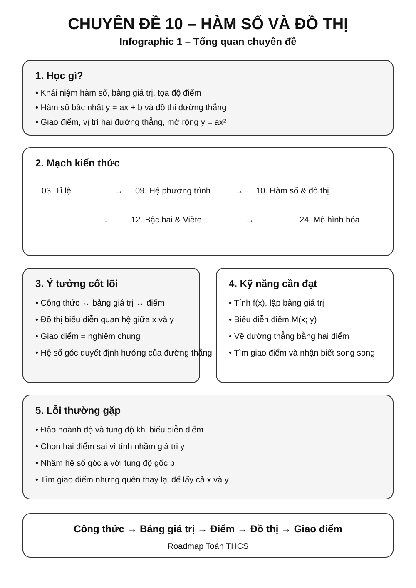
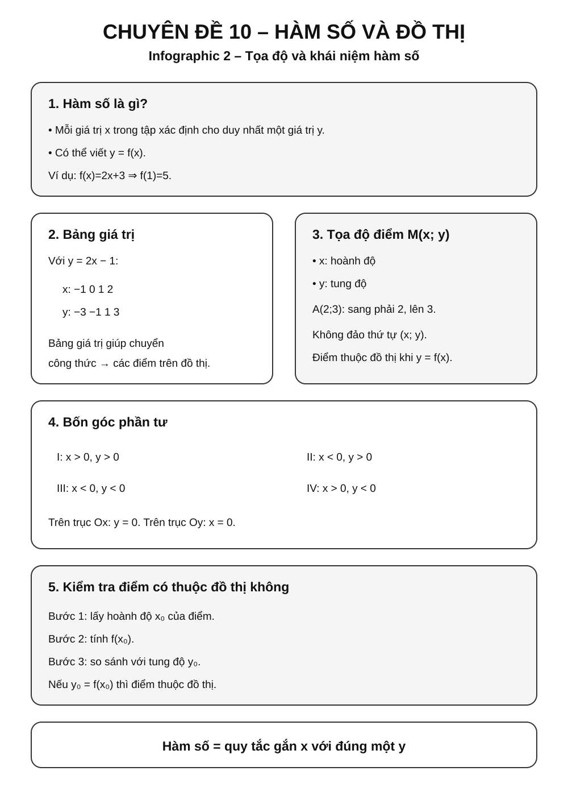
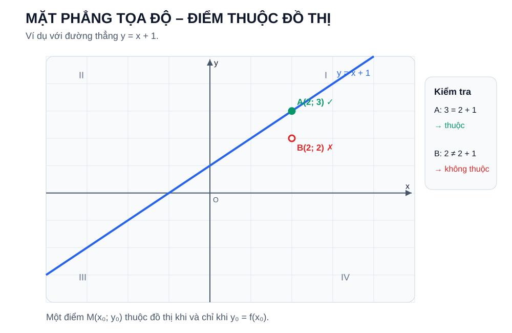
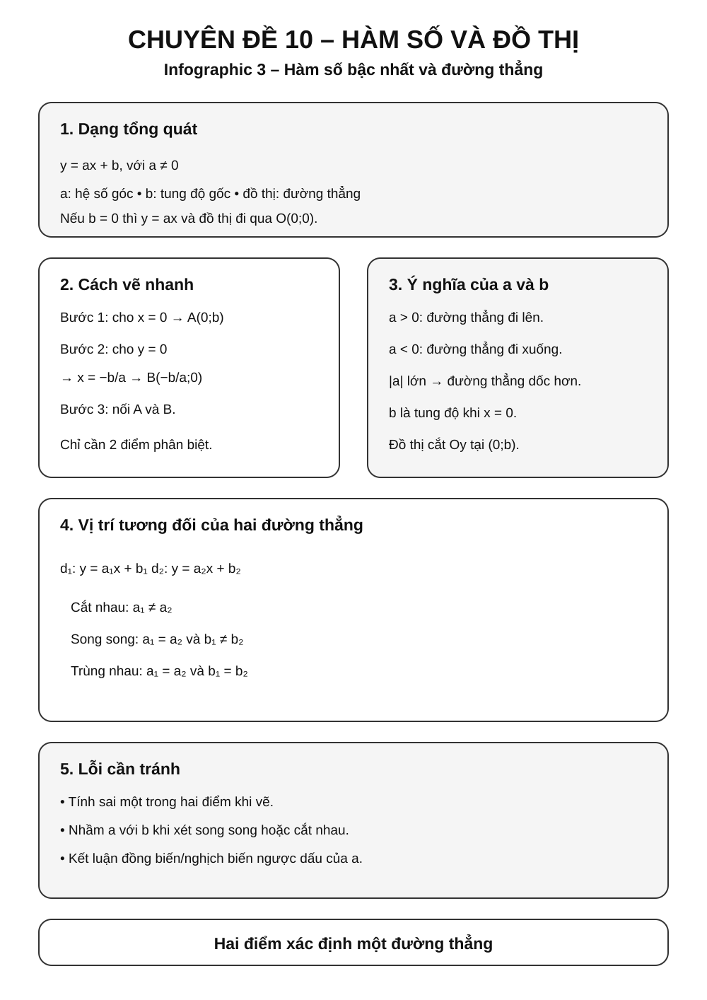
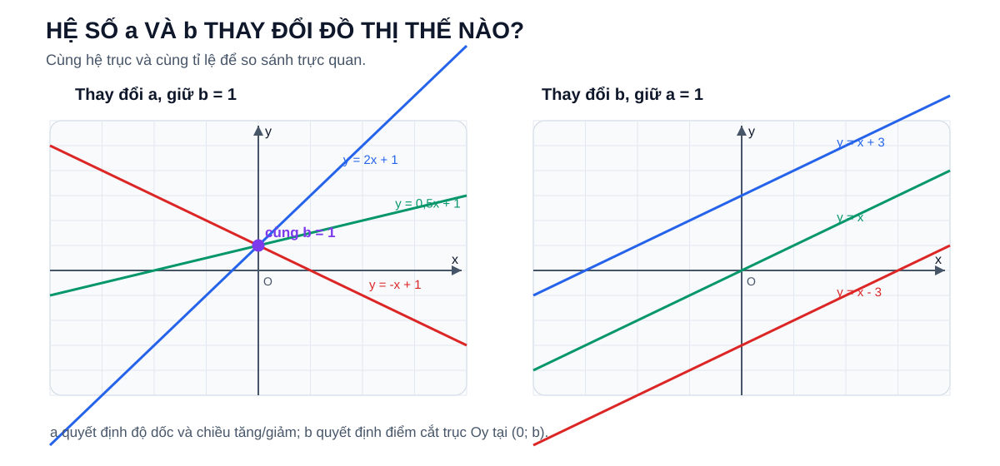
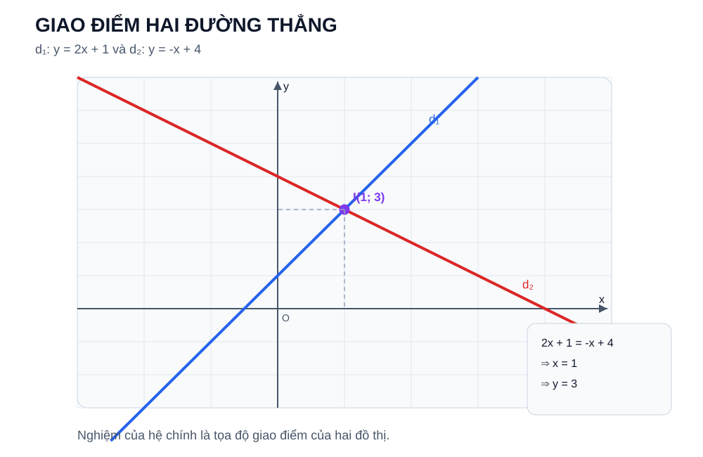
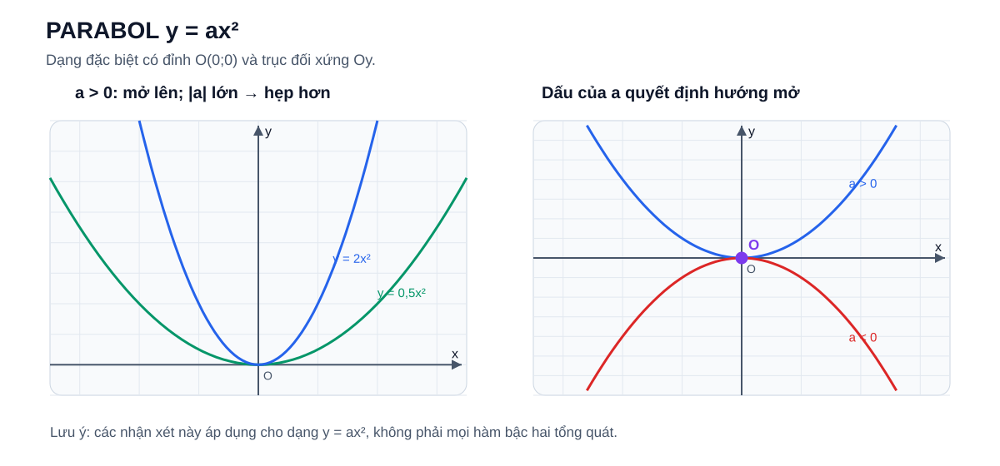
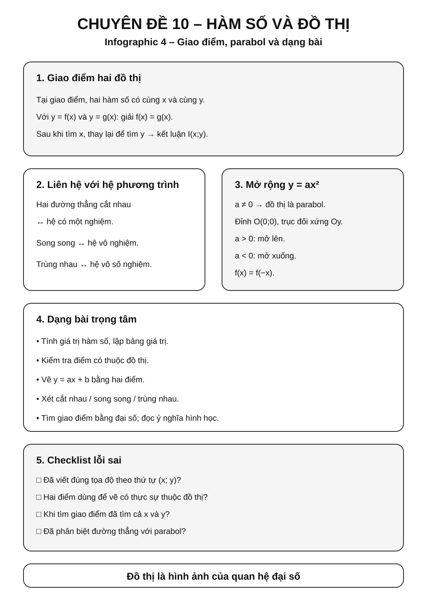
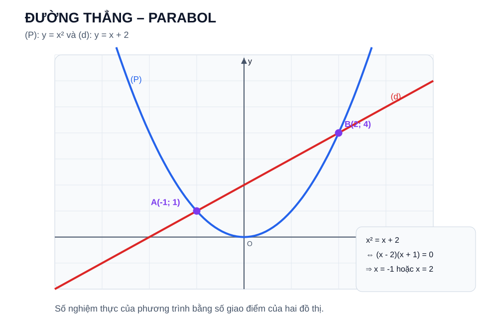

# Chuyên đề 10 – Hàm số và đồ thị


> **Trạng thái:** Đã kiểm định nội dung học thuật; cấu trúc Roadmap chuẩn 11 mục.
>
> **Lớp trọng tâm:** 7–9
> **Mạch kiến thức:** Đại số
> **Mức ưu tiên:** ⭐⭐⭐⭐⭐

> **Vai trò trong Roadmap:** cầu nối giữa đại số và hình học tọa độ; giúp học sinh hiểu quan hệ giữa công thức, bảng giá trị, điểm trên mặt phẳng và hình dạng đồ thị.
>

---

## 🧭 1. Bản đồ kiến thức

### Infographic tổng quan



```text
HÀM SỐ VÀ ĐỒ THỊ
│
├── 1. Quan hệ giữa hai đại lượng
│   ├── Biến số
│   ├── Giá trị của hàm số
│   └── Bảng giá trị
│
├── 2. Mặt phẳng tọa độ
│   ├── Trục Ox, Oy
│   ├── Tọa độ điểm M(x; y)
│   └── Biểu diễn điểm
│
├── 3. Hàm số bậc nhất
│   ├── y = ax + b
│   ├── Hệ số góc a
│   ├── Tung độ gốc b
│   └── Đồ thị là đường thẳng
│
├── 4. Quan hệ hai đường thẳng
│   ├── Cắt nhau
│   ├── Song song
│   └── Trùng nhau
│
├── 5. Giao điểm đồ thị
│   ├── Giải hệ phương trình
│   └── Ý nghĩa hình học
│
└── 6. Mở rộng lớp 9
    ├── y = ax² (a ≠ 0)
    ├── Parabol
    └── Chuẩn bị cho phương trình bậc hai
```

---

## 🎯 2. Mục tiêu cần đạt

Sau khi hoàn thành chuyên đề, học sinh cần có thể:

- [ ] Hiểu khái niệm hàm số theo nghĩa một đại lượng phụ thuộc vào đại lượng khác.
- [ ] Tính được giá trị của hàm số tại một giá trị cho trước của biến.
- [ ] Đọc và lập được bảng giá trị đơn giản.
- [ ] Xác định và biểu diễn đúng tọa độ của điểm trên mặt phẳng.
- [ ] Nhận biết hàm số bậc nhất `y = ax + b` với `a ≠ 0`.
- [ ] Vẽ được đồ thị hàm số bậc nhất bằng hai điểm phù hợp.
- [ ] Hiểu ý nghĩa của hệ số góc `a` và tung độ gốc `b`.
- [ ] Nhận biết hai đường thẳng cắt nhau, song song hoặc trùng nhau từ hệ số.
- [ ] Tìm giao điểm của hai đồ thị bằng phương pháp đại số.
- [ ] Hiểu sự liên hệ giữa giao điểm đồ thị và nghiệm của hệ phương trình.
- [ ] Nhận biết đồ thị `y = ax²` và hình dạng parabol ở mức chuẩn bị cho lớp 9.

---

## 📖 3. Kiến thức cốt lõi

### Infographic – Tọa độ và hàm số



### 3.1. Khái niệm hàm số

Nếu với mỗi giá trị `x` thuộc tập xác định ta xác định được **duy nhất một giá trị tương ứng của `y`**, thì `y` được gọi là hàm số của `x`.

Ví dụ:

`y = 2x + 3`

Khi:

- `x = 0` thì `y = 3`
- `x = 1` thì `y = 5`
- `x = -2` thì `y = -1`

Có thể viết:

`f(x) = 2x + 3`

Khi đó:

`f(1) = 5`

> **Điểm cốt lõi:** với mỗi `x` thuộc tập xác định, hàm số chỉ gán **một** giá trị `y` tương ứng.

---

### 3.2. Bảng giá trị

Với hàm số:

`y = 2x - 1`

Ta có thể lập bảng:

| x | -1 | 0 | 1 | 2 |
|---:|---:|---:|---:|---:|
| y | -3 | -1 | 1 | 3 |

Bảng giá trị giúp chuyển từ **công thức đại số** sang **các điểm trên đồ thị**.

---

### 3.3. Mặt phẳng tọa độ

Mặt phẳng tọa độ gồm hai trục vuông góc:

- trục hoành `Ox`
- trục tung `Oy`

Một điểm `M(x; y)` có:

- `x`: hoành độ
- `y`: tung độ

Ví dụ:

`A(2; 3)` nghĩa là từ gốc `O` đi 2 đơn vị theo chiều dương `Ox`, rồi 3 đơn vị theo chiều dương `Oy`.

### Bốn góc phần tư

- Góc phần tư I: `x > 0, y > 0`
- Góc phần tư II: `x < 0, y > 0`
- Góc phần tư III: `x < 0, y < 0`
- Góc phần tư IV: `x > 0, y < 0`

> ⚠️ Không đảo thứ tự `(x; y)` thành `(y; x)`.

---

### 3.4. Điểm thuộc đồ thị

Điểm `M(x₀; y₀)` thuộc đồ thị của hàm số `y = f(x)` khi và chỉ khi `x₀` thuộc tập xác định của hàm số và:

`y₀ = f(x₀)`

Ví dụ:

Xét `y = 2x + 1`.

Điểm `A(2; 5)` thuộc đồ thị vì:

`2·2 + 1 = 5`

Điểm `B(2; 4)` không thuộc đồ thị vì:

`2·2 + 1 ≠ 4`

#### Trực quan – điểm thuộc và không thuộc đồ thị



Điểm nằm “gần” đường thẳng chưa đủ. Muốn kết luận một điểm thuộc đồ thị, tọa độ của nó phải thỏa **đúng phương trình** của đồ thị.

---

### Infographic – Hàm số bậc nhất và đường thẳng



### 3.5. Hàm số bậc nhất

#### Dạng tổng quát

Hàm số bậc nhất có dạng:

`y = ax + b`, với `a ≠ 0`.

Trong đó:

- `a` là hệ số góc
- `b` là tung độ gốc

Đồ thị là một **đường thẳng**.

---

#### Trường hợp đặc biệt `y = ax`

Khi `b = 0`:

`y = ax`

Đồ thị luôn đi qua gốc tọa độ `O(0; 0)`.

Ví dụ:

`y = 2x`

Chọn hai điểm:

- `O(0; 0)`
- `A(1; 2)`

Nối hai điểm ta được đồ thị.

---

#### Cách vẽ đồ thị `y = ax + b`

Vì đồ thị là đường thẳng, chỉ cần xác định **hai điểm phân biệt**.

Cách thường dùng:

##### Cách 1 – Cho `x = 0`

Ta được:

`y = b`

Điểm thứ nhất là:

`A(0; b)`

##### Cách 2 – Cho `y = 0`

Giải:

`ax + b = 0`

`x = -b/a`

Điểm thứ hai là:

`B(-b/a; 0)`

Sau đó nối `A` và `B`.

##### Ví dụ

Vẽ đồ thị:

`y = 2x - 4`

Cho `x = 0`:

`y = -4`

Ta có `A(0; -4)`.

Cho `y = 0`:

`2x - 4 = 0 ⇒ x = 2`

Ta có `B(2; 0)`.

Đường thẳng `AB` là đồ thị cần vẽ.

---

#### Ý nghĩa của hệ số góc `a`

Trong `y = ax + b`:

- nếu `a > 0`: hàm số đồng biến
- nếu `a < 0`: hàm số nghịch biến

Trên cùng một hệ trục tọa độ và cùng tỉ lệ đơn vị, có thể hiểu trực quan:

- với `a > 0`, `a` càng lớn thì đường thẳng càng dốc lên;
- với `a < 0`, `|a|` càng lớn thì đường thẳng càng dốc xuống.

Ví dụ:

- `y = 3x + 1`: tăng
- `y = -2x + 1`: giảm

---

#### Ý nghĩa của `b`

Trong `y = ax + b`, khi `x = 0`:

`y = b`

Do đó đồ thị luôn cắt trục `Oy` tại:

`(0; b)`

Ví dụ:

`y = 2x - 5`

cắt `Oy` tại `(0; -5)`.

#### Trực quan – vai trò của `a` và `b`



Đọc hình theo hai câu hỏi:

1. **Giữ `b` cố định, đổi `a`:** các đường thẳng vẫn đi qua cùng điểm trên `Oy`, nhưng độ dốc và chiều tăng/giảm thay đổi.
2. **Giữ `a` cố định, đổi `b`:** các đường thẳng song song với nhau và chỉ dịch lên/xuống.

Cách nhìn này giúp tránh học thuộc rời rạc “`a` là hệ số góc, `b` là tung độ gốc”.

---

### 3.6. Vị trí tương đối của hai đường thẳng

Xét:

`d₁: y = a₁x + b₁`

`d₂: y = a₂x + b₂`

#### Hai đường thẳng cắt nhau

Nếu:

`a₁ ≠ a₂`

thì hai đường thẳng cắt nhau tại đúng một điểm.

---

#### Hai đường thẳng song song

Nếu:

`a₁ = a₂`

và:

`b₁ ≠ b₂`

thì hai đường thẳng song song.

---

#### Hai đường thẳng trùng nhau

Nếu:

`a₁ = a₂`

và:

`b₁ = b₂`

thì hai đường thẳng trùng nhau.

##### Bảng ghi nhớ

| Quan hệ | Điều kiện |
|---|---|
| Cắt nhau | `a₁ ≠ a₂` |
| Song song | `a₁ = a₂`, `b₁ ≠ b₂` |
| Trùng nhau | `a₁ = a₂`, `b₁ = b₂` |

---

### 3.7. Giao điểm của hai đồ thị

Giả sử:

`d₁: y = 2x + 1`

`d₂: y = -x + 4`

Tại giao điểm, cùng một `x` phải cho cùng một `y`.

Do đó:

`2x + 1 = -x + 4`

`3x = 3`

`x = 1`

Thay vào:

`y = 3`

Vậy giao điểm là:

`I(1; 3)`

##### Liên hệ với hệ phương trình

Giao điểm trên chính là nghiệm của hệ:

```text
y = 2x + 1
y = -x + 4
```

Hay viết dưới dạng chuẩn của hệ hai phương trình bậc nhất hai ẩn.

> Đây là cầu nối trực tiếp với [Chuyên đề 09 – Hệ phương trình bậc nhất hai ẩn](../09-he-phuong-trinh/index.md).

#### Trực quan – nghiệm hệ là giao điểm đồ thị



Hình cho thấy cùng một kết quả theo hai ngôn ngữ:

- **đại số:** giải `2x + 1 = -x + 4` được `x = 1`, rồi `y = 3`;
- **hình học:** hai đường thẳng gặp nhau tại `I(1; 3)`.

Vì vậy, giải hệ và tìm giao điểm thực chất là hai cách mô tả cùng một bài toán.

---

### 3.8. Mở rộng – Đồ thị `y = ax²`

Với `a ≠ 0`, hàm số:

`y = ax²`

có đồ thị là một **parabol**.

#### Một số tính chất quan trọng

- có đỉnh tại `O(0; 0)`;
- nhận trục `Oy` làm trục đối xứng;
- nếu `a > 0`, parabol mở lên;
- nếu `a < 0`, parabol mở xuống.

#### Trực quan – dấu và độ lớn của `a`



Với dạng đặc biệt `y = ax²`:

- dấu của `a` quyết định parabol mở **lên** hay **xuống**;
- với cùng dấu, `|a|` lớn hơn làm parabol **hẹp hơn**;
- mọi đồ thị dạng này đều đi qua `O(0;0)` và đối xứng qua `Oy`.

Ví dụ:

`y = x²`

Bảng giá trị:

| x | -2 | -1 | 0 | 1 | 2 |
|---:|---:|---:|---:|---:|---:|
| y | 4 | 1 | 0 | 1 | 4 |

Ta thấy các giá trị tại `x` và `-x` bằng nhau.

> Phần này là bước chuẩn bị trực tiếp cho [Chuyên đề 12 – Phương trình bậc hai & Viète](../12-phuong-trinh-bac-hai-viete/index.md).

> **Phạm vi:** các tính chất “đỉnh tại `O`” và “trục đối xứng là `Oy`” ở trên chỉ áp dụng cho dạng đặc biệt `y = ax²`. Không được suy rộng chúng cho mọi hàm bậc hai `y = ax² + bx + c`; dạng tổng quát được dùng như nội dung kết nối ở Chuyên đề 12 và sẽ học sâu hơn ở THPT.

---


## 🔗 4. Kiến thức liên quan

- **Cần nắm trước:** [03 – Tỉ lệ, tỉ lệ thức](../03-ti-le-ti-le-thuc/index.md), [08 – Phương trình và bất phương trình](../08-phuong-trinh-bat-phuong-trinh/index.md), [09 – Hệ phương trình](../09-he-phuong-trinh/index.md).
- **Liên hệ mạnh:** mặt phẳng tọa độ, quan hệ giữa hai đại lượng và ý nghĩa hình học của nghiệm hệ phương trình.
- **Sử dụng tiếp:** [12 – Phương trình bậc hai và Viète](../12-phuong-trinh-bac-hai-viete/index.md), [24 – Bài toán thực tế và mô hình hóa](../24-bai-toan-thuc-te/index.md).

## 🧩 5. Các dạng bài cần nắm vững

### Infographic – Giao điểm, parabol và lỗi sai



### Dạng 1 – Tính giá trị hàm số

#### Dấu hiệu

Đề cho công thức `y = f(x)` và yêu cầu tính `f(a)`.

#### Phương pháp

Thay `x = a` vào công thức.

#### Ví dụ

Cho `f(x) = 3x - 2`.

Tính `f(4)`.

`f(4) = 3·4 - 2 = 10`.

---

### Dạng 2 – Kiểm tra điểm thuộc đồ thị

#### Dấu hiệu

Đề cho điểm `M(x₀; y₀)` và hàm số.

#### Phương pháp

Tính `f(x₀)` rồi so sánh với `y₀`.

#### Ví dụ

Điểm `A(2; 7)` có thuộc `y = 3x + 1` không?

`3·2 + 1 = 7`.

Vậy có.

---

### Dạng 3 – Tìm tham số để điểm thuộc đồ thị

> Khi tham số xuất hiện trong hệ số của `x`, sau khi tìm được tham số cần kiểm tra điều kiện của dạng hàm đang xét, chẳng hạn `a ≠ 0` nếu đề yêu cầu hàm số bậc nhất.

Ví dụ:

Điểm `A(2; 5)` thuộc đường thẳng:

`y = mx + 1`

Ta có:

`5 = 2m + 1`

`2m = 4`

`m = 2`.

---

### Dạng 4 – Vẽ đồ thị hàm số bậc nhất

#### Quy trình

1. Chọn hai giá trị `x` thuận tiện.
2. Tính `y` tương ứng.
3. Xác định hai điểm.
4. Nối hai điểm bằng đường thẳng.

> Khi có thể, ưu tiên hai giao điểm với các trục tọa độ.

---

### Dạng 5 – Tìm giao điểm với các trục

Với:

`y = ax + b`

#### Giao với `Oy`

Cho `x = 0`.

#### Giao với `Ox`

Cho `y = 0`.

---

### Dạng 6 – Xét đồng biến, nghịch biến

Với `y = ax + b`:

- `a > 0` → đồng biến
- `a < 0` → nghịch biến

---

### Dạng 7 – Xét vị trí hai đường thẳng

So sánh `a₁, a₂` và `b₁, b₂`.

Không cần vẽ hình nếu đề chỉ hỏi quan hệ song song/cắt nhau/trùng nhau.

---

### Dạng 8 – Tìm giao điểm hai đường thẳng

Giải phương trình:

`a₁x + b₁ = a₂x + b₂`

Sau đó tính `y`.

---

### Dạng 9 – Tìm tham số để hai đường thẳng song song

Ví dụ:

`d₁: y = (m + 1)x + 2`

`d₂: y = 3x - 5`

Để song song:

`m + 1 = 3`

`m = 2`

và hai tung độ gốc phải khác nhau, ở đây `2 ≠ -5`, nên thỏa mãn.

---

### Dạng 10 – Tìm tham số để hai đường thẳng cắt nhau

Với hai đường thẳng viết dưới dạng `y = a₁x + b₁` và `y = a₂x + b₂`, điều kiện để chúng cắt nhau tại đúng một điểm là:

`a₁ ≠ a₂`

Ví dụ:

`y = (m - 2)x + 1`

và:

`y = 3x + 4`

Cắt nhau khi:

`m - 2 ≠ 3`

`m ≠ 5`.

---

### Dạng 11 – Mở rộng: giao điểm đường thẳng và parabol `y = ax²`

> Nên quay lại dạng này sau khi đã học Chuyên đề 12 về phương trình bậc hai.

Giả sử cần tìm giao điểm của:

```text
(P): y = ax²      (a ≠ 0)
(d): y = mx + n
```

Tại giao điểm, hai giá trị `y` bằng nhau nên:

```text
ax² = mx + n
```

hay:

```text
ax² - mx - n = 0
```

Vì vậy:

- mỗi nghiệm thực `x` cho một giao điểm;
- phương trình có hai nghiệm phân biệt → đường thẳng cắt parabol tại hai điểm;
- có nghiệm kép → đường thẳng tiếp xúc parabol tại một điểm;
- vô nghiệm thực → hai đồ thị không có điểm chung.

Ví dụ với `y = x²` và `y = x + 2`:

```text
x² = x + 2
⇔ x² - x - 2 = 0
⇔ (x - 2)(x + 1) = 0
```

nên có hai giao điểm ứng với `x = 2` và `x = -1`.

Đây là cầu nối trực tiếp giữa **đồ thị** và **phương trình bậc hai**, không phải một kỹ thuật tách rời.

#### Trực quan – đường thẳng và parabol



Ở ví dụ trên, hai giao điểm xuất hiện đúng tại hai nghiệm của:

`x² = x + 2`.

Do đó, số nghiệm thực của phương trình thu được sau khi cho hai biểu thức bằng nhau chính là số giao điểm của hai đồ thị. Đây là cầu nối quan trọng sang Chuyên đề 12.

## 🚀 6. Dạng bài thi vào lớp 10

| Dạng bài | Mức ưu tiên |
|---|:---:|
| Tính giá trị hàm số | ⭐⭐⭐ |
| Kiểm tra điểm thuộc đồ thị | ⭐⭐⭐⭐ |
| Vẽ đường thẳng | ⭐⭐⭐⭐ |
| Tìm giao điểm hai đường thẳng | ⭐⭐⭐⭐⭐ |
| Tìm tham số để đường thẳng qua điểm | ⭐⭐⭐⭐⭐ |
| Song song / cắt nhau / trùng nhau | ⭐⭐⭐⭐⭐ |
| Bài toán tham số với hệ số góc | ⭐⭐⭐⭐⭐ |
| Liên hệ giao điểm với hệ phương trình | ⭐⭐⭐⭐⭐ |
| Đường thẳng và parabol | ⭐⭐⭐⭐⭐ |
| Mô hình hóa bằng đồ thị | ⭐⭐⭐⭐ |

> Mức sao thể hiện mức ưu tiên ôn tập trong Roadmap, không phải cam kết dạng bài xuất hiện trong mọi đề thi.

---

## ⚠️ 7. Lỗi sai thường gặp

### ❌ Lỗi 1 – Đảo tọa độ

Điểm `A(2; -3)` không phải `A(-3; 2)`.

Luôn nhớ:

`(hoành độ; tung độ)`.

---

### ❌ Lỗi 2 – Vẽ đường thẳng chỉ bằng một điểm

Một điểm chưa xác định duy nhất một đường thẳng.

Cần ít nhất **hai điểm phân biệt**.

---

### ❌ Lỗi 3 – Quên rằng `a ≠ 0`

Trong hàm bậc nhất:

`y = ax + b`

phải có:

`a ≠ 0`.

Nếu `a = 0` thì `y = b` là hàm hằng.

---

### ❌ Lỗi 4 – Nhầm điều kiện song song

Chỉ `a₁ = a₂` chưa đủ để kết luận song song.

Nếu thêm `b₁ = b₂`, hai đường thẳng trùng nhau.

---

### ❌ Lỗi 5 – Tìm giao điểm nhưng chỉ tìm `x`

Giao điểm phải có dạng:

`I(x; y)`.

Sau khi tìm `x`, phải tính tiếp `y`.

---

### ❌ Lỗi 6 – Thay tọa độ sai vị trí

Với điểm `M(x₀; y₀)` thuộc `y = ax + b`, phải thay:

`y₀ = ax₀ + b`.

---

### ❌ Lỗi 7 – Nhầm đồng biến và nghịch biến

Dấu của `a` quyết định:

- `a > 0`: đồng biến
- `a < 0`: nghịch biến

Không dùng dấu của `b` để kết luận.

---

## 📝 8. Luyện tập tiếp theo

Micro-practice trong các Learning Cards dùng để kiểm tra nhanh ngay sau khi học. Khi muốn luyện sâu hơn, luyện từng skill hoặc làm bài tự luận, hãy chuyển sang **Practice Room**.

[🎯 Mở Practice Room – Chuyên đề 10](bai-tap.md){ .md-button .md-button--primary }

Trong Practice Room:

- **Luyện nhanh tương tác:** Practice Engine chọn câu từ ngân hàng lớn, có feedback, gợi ý và Tutor.
- **Luyện tự luận & trình bày:** tự giải trên giấy/vở rồi mở gợi ý hoặc lời giải để tự đối chiếu.
- Core / Entrance10 / Challenge được tách rõ.

!!! info "Phân biệt mục đích"
    Micro-practice kiểm tra hiểu ngay; Practice Room dùng để **rèn kỹ năng**. Kết quả luyện tập là formative evidence, không phải điểm kiểm tra cuối chuyên đề.

---

## ✅ 9. Tự kiểm tra mức độ sẵn sàng

Khi đã luyện tương đối chắc, hãy làm **Core Readiness Check**.

[✅ Bắt đầu Core Readiness Check](tu-kiem-tra.md){ .md-button .md-button--primary }

Trong Readiness Check:

- không hint và không Tutor khi đang làm;
- không báo đúng/sai từng câu;
- chỉ chấm sau khi bấm **Nộp bài**;
- kết quả phân tích theo assessed skill;
- là **Soft Mastery**: không khóa chuyên đề tiếp theo;
- Entrance10 / Challenge không tính vào Core readiness.

---

## 🔄 10. Liên kết Roadmap

- **→ Tiếp theo:** [11 – Căn thức và biến đổi căn thức](../11-can-thuc/index.md)

### Kiến thức nên ôn trước

- [03. Tỉ lệ – Tỉ lệ thức – Đại lượng tỉ lệ](../03-ti-le-ti-le-thuc/index.md)
- [08. Phương trình và bất phương trình](../08-phuong-trinh-bat-phuong-trinh/index.md)
- [09. Hệ phương trình bậc nhất hai ẩn](../09-he-phuong-trinh/index.md)

### Chuyên đề sử dụng tiếp

- [12. Phương trình bậc hai & Viète](../12-phuong-trinh-bac-hai-viete/index.md)
- [24. Bài toán thực tế và mô hình hóa](../24-bai-toan-thuc-te/index.md)

### Mạch chính

```text
08. Phương trình
        ↓
09. Hệ phương trình
        ↓
10. HÀM SỐ VÀ ĐỒ THỊ
        ↓
12. Phương trình bậc hai & Viète
        ↓
25. Tổng hợp ôn thi vào 10
```

- **✏️ Luyện tập:** [Bài tập Chuyên đề 10](bai-tap.md)
- **✅ Tự kiểm tra:** [Tự kiểm tra Chuyên đề 10](tu-kiem-tra.md)

Xem toàn bộ hệ thống tại [Blueprint 25 chuyên đề](../../roadmap/blueprint-25-chuyen-de.md).

---

## 🏁 11. Điều kiện hoàn thành

Chuyên đề được xem là **đủ sẵn sàng để học tiếp** khi học sinh có phần lớn các bằng chứng sau:

- [ ] Hiểu và giải thích được các quy tắc Core của chuyên đề.
- [ ] Làm tương đối ổn định các skill Core trong Practice Room.
- [ ] Không lặp lại ổn định cùng một lỗi nền tảng sau khi đã được chữa.
- [ ] Core Readiness Check đạt khoảng **80%** hoặc học sinh đã hiểu và chữa được các lỗi còn lại.
- [ ] Có thể trình bày ít nhất một số bài tự luận Core mà không mở lời giải trước.

!!! note "Soft Mastery"
    Không cần đạt 100% mới được học tiếp. Nếu Readiness Check cho thấy một vài kỹ năng còn yếu, hệ thống khuyến nghị luyện lại đúng kỹ năng đó; học sinh vẫn có thể chuyển sang chuyên đề tiếp theo.

!!! warning "Core độc lập Extension"
    Entrance10 và Specialized-Challenge không phải điều kiện để hoàn thành KNTT Core.

---

## ➡️ Tiếp tục học

<div class="topic-workspace-actions" markdown>

[🎯 Sang Phòng Luyện Tập](bai-tap.md){ .md-button .md-button--primary }

[✅ Kiểm Tra Độ Sẵn Sàng](tu-kiem-tra.md){ .md-button }

[→ 11 – Căn thức và biến đổi căn thức](../11-can-thuc/index.md){ .md-button }

</div>
