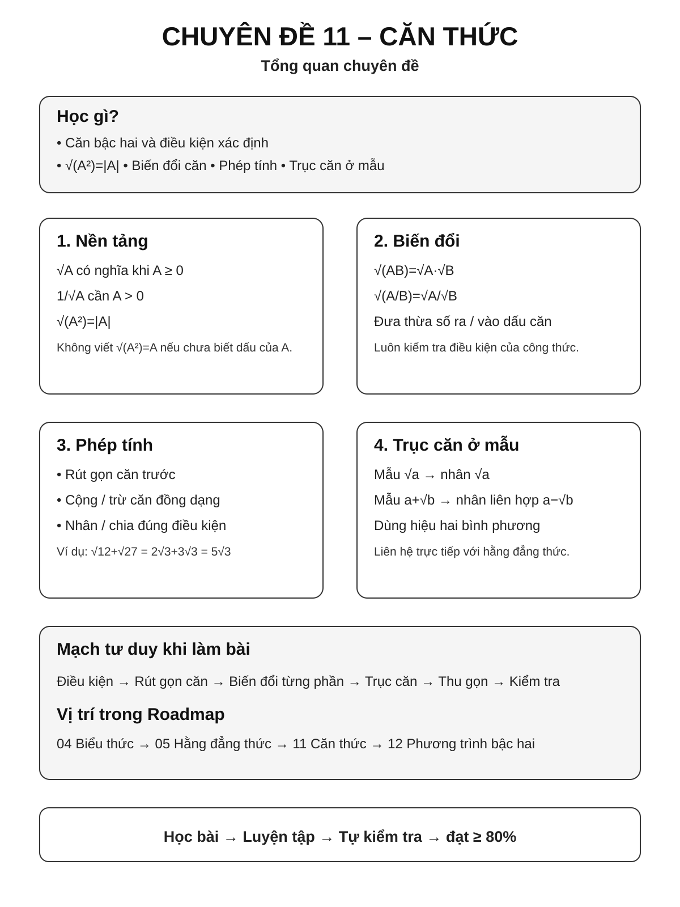
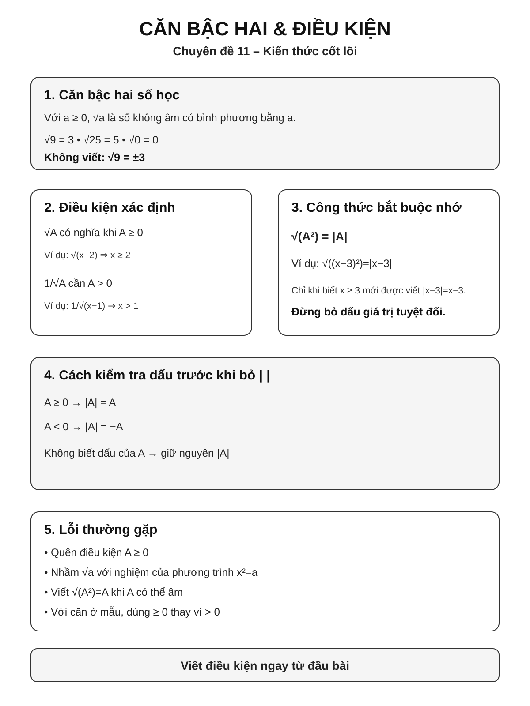
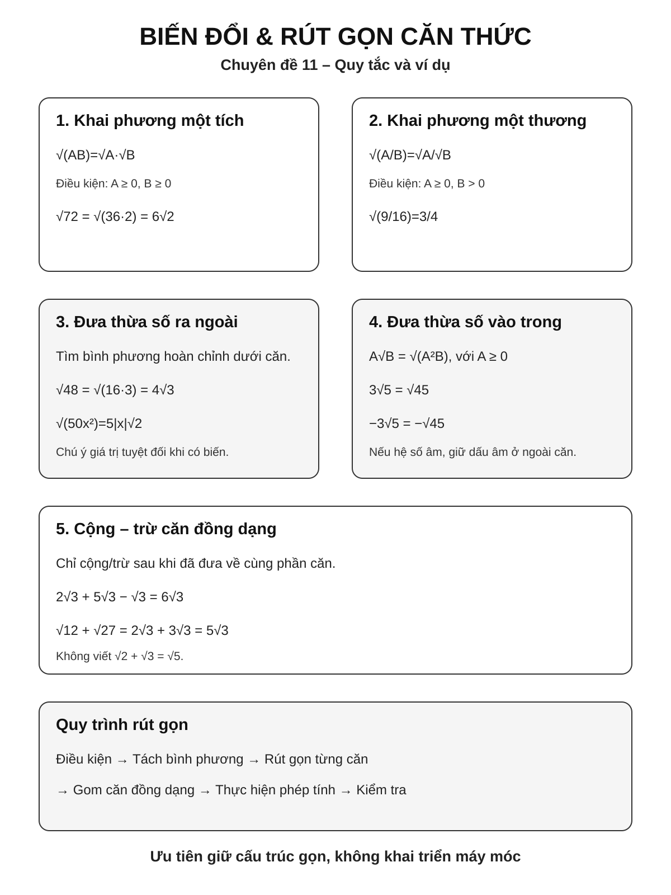
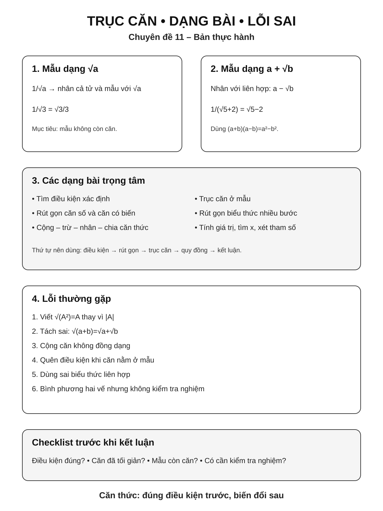

# Chuyên đề 11 – Căn thức và biến đổi căn thức


> **Trạng thái:** Đã kiểm định nội dung học thuật; cấu trúc Roadmap chuẩn 11 mục.
>
> **Lớp trọng tâm:** 9
> **Mạch kiến thức:** Đại số
> **Mức ưu tiên:** ⭐⭐⭐⭐⭐

> **Vai trò trong Roadmap:** cầu nối từ biến đổi đại số sang phương trình bậc hai, bài toán rút gọn biểu thức và các dạng thi vào lớp 10.
>

---

## 🧭 1. Bản đồ kiến thức



```text
CĂN THỨC VÀ BIẾN ĐỔI CĂN THỨC
│
├── 1. Căn bậc hai
│   ├── Căn bậc hai số học
│   ├── Điều kiện xác định
│   └── √(A²) = |A|
│
├── 2. Phép biến đổi căn thức
│   ├── Khai phương một tích
│   ├── Khai phương một thương
│   ├── Đưa thừa số ra ngoài dấu căn
│   └── Đưa thừa số vào trong dấu căn
│
├── 3. Phép tính với căn thức
│   ├── Cộng – trừ căn đồng dạng
│   ├── Nhân – chia
│   └── Rút gọn nhiều bước
│
├── 4. Trục căn thức ở mẫu
│   ├── Mẫu dạng √A
│   ├── Mẫu dạng a + √b
│   └── Mẫu dạng √a + √b
│
├── 5. Căn bậc ba
│   ├── Căn bậc ba của số dương, số 0 và số âm
│   └── ∛(A³) = A với mọi A thực
│
└── 6. Ứng dụng
    ├── Rút gọn biểu thức
    ├── Tính giá trị
    ├── So sánh
    ├── Tìm x
    └── Bài toán tham số / giá trị nguyên
```

---

## 🎯 2. Mục tiêu cần đạt

Sau khi hoàn thành chuyên đề, học sinh cần có thể:

- [ ] Hiểu căn bậc hai số học và điều kiện để căn thức có nghĩa.
- [ ] Sử dụng đúng công thức `√(A²) = |A|`.
- [ ] Biến đổi căn thức bằng các quy tắc tích, thương và đưa thừa số ra/vào dấu căn.
- [ ] Nhận diện và cộng trừ được các căn thức đồng dạng.
- [ ] Trục căn thức ở mẫu trong các dạng cơ bản.
- [ ] Hiểu căn bậc ba, tính được các căn bậc ba cơ bản và nhớ \(\sqrt[3]{A^3}=A\) với mọi số thực \(A\).
- [ ] Rút gọn biểu thức chứa căn theo trình tự hợp lý.
- [ ] Kiểm soát điều kiện xác định trong toàn bộ lời giải.
- [ ] **Entrance10 / mở rộng:** vận dụng vào phương trình chứa căn, so sánh và bài giá trị nguyên sau khi Core đã chắc.

---

## 📖 3. Kiến thức cốt lõi



### 3.1. Căn bậc hai số học

Với `a ≥ 0`, căn bậc hai số học của `a` là số không âm có bình phương bằng `a`, ký hiệu `√a`.

Ví dụ:

- `√9 = 3`
- `√0 = 0`
- `√25 = 5`

> ⚠️ `√9 = 3`, không viết `√9 = ±3`. Dấu `±` chỉ xuất hiện khi giải phương trình kiểu `x² = 9`.

### 3.2. Điều kiện xác định

Căn thức `√A` có nghĩa khi:

`A ≥ 0`

Ví dụ:

`√(x - 2)` xác định khi `x - 2 ≥ 0`, tức `x ≥ 2`.

Với biểu thức có căn ở mẫu, ngoài điều kiện căn có nghĩa còn phải có mẫu khác 0.

Ví dụ:

`1/√(x - 1)` xác định khi `x - 1 > 0`, tức `x > 1`.

### 3.3. Công thức quan trọng nhất

Với mọi giá trị thực của `A`:

`√(A²) = |A|`

Không được viết tùy ý `√(A²) = A`.

Ví dụ:

`√((x - 3)²) = |x - 3|`

Nếu biết thêm `x ≥ 3` thì mới kết luận `|x - 3| = x - 3`.

### 3.3A. Mở rộng / Entrance10 – Bình phương hai vế và phương trình chứa căn

Bình phương hai vế **không phải lúc nào cũng là phép biến đổi tương đương**. Từ `U = V` có thể suy ra `U² = V²`, nhưng chiều ngược lại còn có khả năng `U = -V`.

Với dạng quan trọng:

```text
√A = B
```

trên tập số thực, có thể dùng tương đương:

```text
√A = B  ⇔  B ≥ 0 và A = B²
```

(với các biểu thức ban đầu có nghĩa). Nếu `B < 0` thì phương trình không thể có nghiệm vì căn bậc hai số học luôn không âm.

Tương tự:

```text
√A = √B  ⇔  A = B
```

nhưng phải kèm điều kiện `A ≥ 0`, `B ≥ 0`.

> Khi giải bằng cách bình phương, cách an toàn nhất vẫn là ghi điều kiện, biến đổi, rồi **thay nghiệm trở lại phương trình ban đầu** để loại nghiệm ngoại lai.



### 3.4. Khai phương một tích

Với `A ≥ 0, B ≥ 0`:

`√(AB) = √A · √B`

Ví dụ:

`√72 = √(36·2) = 6√2`

### 3.5. Khai phương một thương

Với `A ≥ 0, B > 0`:

`√(A/B) = √A / √B`

Ví dụ:

`√(9/16) = 3/4`

### 3.6. Đưa thừa số ra ngoài dấu căn

Nếu có một thừa số là bình phương hoàn chỉnh, ta đưa ra ngoài dấu căn.

Ví dụ:

`√(50x²) = √(25·2·x²) = 5|x|√2`

Nếu biết `x ≥ 0`, kết quả là `5x√2`.

### 3.7. Đưa thừa số vào trong dấu căn

Với `A ≥ 0` và `B ≥ 0`:

`A√B = √(A²B)`

Ví dụ:

`3√5 = √45`

> Nếu thừa số đứng ngoài căn âm, phải giữ dấu âm ở ngoài. Chẳng hạn `-3√5 = -√45`, không viết `-3√5 = √45`.

### 3.8. Căn bậc ba

Căn bậc ba của số thực `a` là số thực `b` sao cho `b³ = a`, ký hiệu `∛a`.

Khác với căn bậc hai, **căn bậc ba của số âm vẫn xác định trong tập số thực**.

Ví dụ:

- `∛27 = 3` vì `3³ = 27`;
- `∛0 = 0`;
- `∛(-64) = -4` vì `(-4)³ = -64`.

Với mọi số thực `A`:

`∛(A³) = A`

Ở đây **không cần giá trị tuyệt đối**. Chẳng hạn:

`∛((-5)³) = -5`

> ⚠️ So sánh hai quy tắc dễ nhầm: `√(A²) = |A|`, còn `∛(A³) = A`.

---

## 🔗 4. Kiến thức liên quan

- [02. Số và phép tính](../02-so-va-phep-tinh/index.md): lũy thừa, số thực, thứ tự phép tính.
- [04. Biểu thức và biến đổi đại số](../04-bieu-thuc-dai-so/index.md): thu gọn, điều kiện xác định, biến đổi biểu thức.
- [05. 7 Hằng đẳng thức đáng nhớ](../05-7-hang-dang-thuc/index.md): liên hợp và biến đổi mẫu.
- [06. Phân tích đa thức thành nhân tử](../06-phan-tich-da-thuc/index.md): phân tích trước khi rút gọn.
- [08. Phương trình và bất phương trình](../08-phuong-trinh-bat-phuong-trinh/index.md): nền tảng về phương trình và phép biến đổi; phương trình chứa căn được xem là phần vận dụng/kết nối.
- [12. Phương trình bậc hai & Viète](../12-phuong-trinh-bac-hai-viete/index.md): biểu thức căn xuất hiện trong nghiệm và biến đổi liên quan.

---

## 🧩 5. Các dạng bài cần nắm vững



### Dạng 1 – Tìm điều kiện xác định

Ví dụ:

`A = √(2x - 4)`

Điều kiện:

`2x - 4 ≥ 0 ⇒ x ≥ 2`

Nếu có mẫu:

`B = 1/√(x + 3)`

thì cần:

`x + 3 > 0 ⇒ x > -3`

### Dạng 2 – Rút gọn căn số

Ví dụ:

`√48 = √(16·3) = 4√3`

Kỹ năng chính: tìm bình phương lớn nhất nằm trong số dưới căn.

### Dạng 3 – Cộng trừ căn đồng dạng

Ví dụ:

`2√3 + 5√3 - √3 = 6√3`

Với căn chưa đồng dạng, phải rút gọn trước:

`√12 + √27 = 2√3 + 3√3 = 5√3`

### Dạng 4 – Nhân chia căn thức

Ví dụ:

`√6 · √24 = √144 = 12`

Hoặc:

`√75 / √3 = √25 = 5`

### Dạng 5 – Trục căn thức ở mẫu dạng đơn

Ví dụ:

`1/√3 = √3/3`

`2/√5 = 2√5/5`

### Dạng 6 – Trục căn thức ở mẫu bằng liên hợp

Ví dụ:

`1/(√5 + 2)`

Nhân cả tử và mẫu với `√5 - 2`:

`= (√5 - 2)/(5 - 4)`

`= √5 - 2`

Cốt lõi là hằng đẳng thức:

`(a + b)(a - b) = a² - b²`

### Dạng 7 – Rút gọn biểu thức nhiều bước

Thứ tự nên dùng:

`điều kiện → phân tích/rút gọn từng phần → trục căn → quy đồng → thu gọn`

Không nên mở rộng tất cả ngay từ đầu nếu có thể giữ cấu trúc gọn.

### Dạng 8 – Tính giá trị biểu thức

Sau khi rút gọn mới thay giá trị, nếu điều này làm lời giải ngắn hơn và giảm sai sót.

### Dạng 9 – Tìm x

> **Mức vận dụng/kết nối:** phương trình chứa căn cần kiểm soát điều kiện và kiểm tra nghiệm sau các phép biến đổi có thể làm xuất hiện nghiệm ngoại lai.

Ví dụ:

`√(x + 1) = 3`

Điều kiện `x + 1 ≥ 0`.

Bình phương hai vế:

`x + 1 = 9 ⇒ x = 8`

Kiểm tra lại: đúng.

### Dạng 10 – Tìm giá trị nguyên / tham số

> **Mức vận dụng:** đây là dạng tổng hợp, không phải yêu cầu cơ bản của mọi bài về căn thức.

Sau khi rút gọn, đưa biểu thức về dạng thuận lợi để xét tính nguyên, dấu hoặc điều kiện tham số.

---

## 🚀 6. Dạng bài thi vào lớp 10

| Dạng | Ưu tiên Roadmap |
|---|:---:|
| Điều kiện xác định của biểu thức chứa căn | ⭐⭐⭐⭐⭐ |
| Rút gọn biểu thức chứa căn | ⭐⭐⭐⭐⭐ |
| Tính giá trị sau khi rút gọn | ⭐⭐⭐⭐⭐ |
| Trục căn thức ở mẫu | ⭐⭐⭐⭐ |
| Tìm x từ biểu thức đã rút gọn | ⭐⭐⭐⭐ |
| Chứng minh / so sánh biểu thức căn | ⭐⭐⭐⭐ |
| Tìm giá trị nguyên của biểu thức | ⭐⭐⭐⭐⭐ |
| Bài tham số kết hợp điều kiện | ⭐⭐⭐⭐⭐ |

> Mức sao là mức ưu tiên ôn tập trong Roadmap, không phải cam kết dạng bài xuất hiện trong mọi đề thi.

---

## ⚠️ 7. Lỗi sai thường gặp

### ❌ Lỗi 1: Quên giá trị tuyệt đối

Sai:

`√(x²) = x`

Đúng:

`√(x²) = |x|`

### ❌ Lỗi 2: Tách căn của tổng

Sai:

`√(a + b) = √a + √b`

Công thức này **không đúng** nói chung.

### ❌ Lỗi 3: Cộng căn không đồng dạng

Sai:

`√2 + √3 = √5`

Hai căn này không đồng dạng nên không cộng như số hạng cùng loại.

### ❌ Lỗi 4: Bỏ qua điều kiện xác định

Đặc biệt nguy hiểm khi biểu thức có căn ở mẫu hoặc có phép bình phương hai vế.

### ❌ Lỗi 5: Trục căn bằng cách nhân sai liên hợp

Với `a + √b`, liên hợp là `a - √b`, không phải đổi dấu từng phần tùy ý.

### ❌ Lỗi 6: Bình phương hai vế nhưng không kiểm tra nghiệm

Từ một đẳng thức đúng có thể suy ra đẳng thức sau khi bình phương, nhưng chiều ngược lại không phải lúc nào cũng đúng. Vì vậy bình phương trong quá trình giải phương trình có thể làm xuất hiện nghiệm ngoại lai; luôn đối chiếu nghiệm với phương trình ban đầu.

---

## 📝 8. Luyện tập tiếp theo

Micro-practice trong các Learning Cards dùng để kiểm tra nhanh ngay sau khi học. Khi muốn luyện sâu hơn, hãy chuyển sang **Practice Room**.

[🎯 Mở Practice Room](bai-tap.md){ .md-button .md-button--primary }

Trong Practice Room, luyện tương tác và bài tự luận được tách theo Core / Entrance10 / Challenge.

!!! info "Phân biệt mục đích"
    Micro-practice kiểm tra hiểu ngay; Practice Room dùng để **rèn kỹ năng**. Kết quả luyện tập là formative evidence, không phải điểm kiểm tra cuối chuyên đề.

## ✅ 9. Tự kiểm tra mức độ sẵn sàng

Khi đã luyện tương đối chắc, hãy làm **Core Readiness Check**.

[✅ Bắt đầu Core Readiness Check](tu-kiem-tra.md){ .md-button .md-button--primary }

Readiness Check không hint/Tutor, không báo đúng sai từng câu, chỉ chấm sau khi nộp và không khóa chuyên đề tiếp theo.

## 🔄 10. Liên kết Roadmap

- **← Trước:** [10 – Hàm số và đồ thị](../10-ham-so-do-thi/index.md)

```text
02. Số và phép tính
        │
        ↓
04. Biểu thức đại số
        │
        ↓
11. CĂN THỨC
   ┌────┴────┐
   ↓         ↓
08. PT–BPT   12. PT bậc hai & Viète
```

- **← Nền tảng:** [04. Biểu thức và biến đổi đại số](../04-bieu-thuc-dai-so/index.md)
- **← Liên quan:** [05. 7 Hằng đẳng thức đáng nhớ](../05-7-hang-dang-thuc/index.md), [06. Phân tích đa thức thành nhân tử](../06-phan-tich-da-thuc/index.md)
- **→ Ứng dụng:** [08. Phương trình và bất phương trình](../08-phuong-trinh-bat-phuong-trinh/index.md)
- **→ Tiếp theo:** [12. Phương trình bậc hai & Viète](../12-phuong-trinh-bac-hai-viete/index.md)

- **✏️ Luyện tập:** [Bài tập Chuyên đề 11](bai-tap.md)
- **✅ Tự kiểm tra:** [Tự kiểm tra Chuyên đề 11](tu-kiem-tra.md)

Xem toàn bộ hệ thống tại [Blueprint 25 chuyên đề](../../roadmap/blueprint-25-chuyen-de.md).

---

## 🏁 11. Điều kiện hoàn thành

- [ ] Nắm chắc các skill KNTT Core và điều kiện xác định.
- [ ] Không nhầm \(\sqrt{A^2}\) với A khi chưa xét dấu.
- [ ] Biến đổi/trục căn thức ổn định.
- [ ] Phân biệt chắc căn bậc hai và căn bậc ba.
- [ ] Core Readiness đạt khoảng **80%** hoặc đã chữa hiểu các lỗi còn lại.

!!! note "Soft Mastery"
    Không cần đạt 100% mới được học tiếp.

!!! warning "Core độc lập Extension"
    Entrance10 và Specialized-Challenge không phải điều kiện để hoàn thành Core.

---

## ➡️ Tiếp tục học

<div class="topic-workspace-actions" markdown>

[🎯 Sang Phòng Luyện Tập](bai-tap.md){ .md-button .md-button--primary }

[✅ Kiểm Tra Độ Sẵn Sàng](tu-kiem-tra.md){ .md-button }

[→ 12 – Phương trình bậc hai & Viète](../12-phuong-trinh-bac-hai-viete/index.md){ .md-button }

</div>
