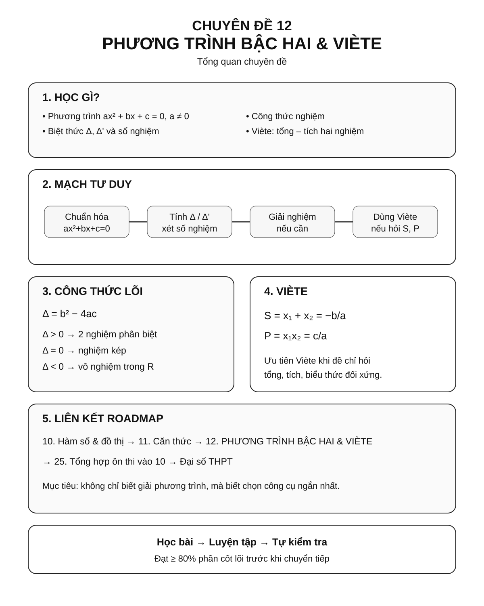
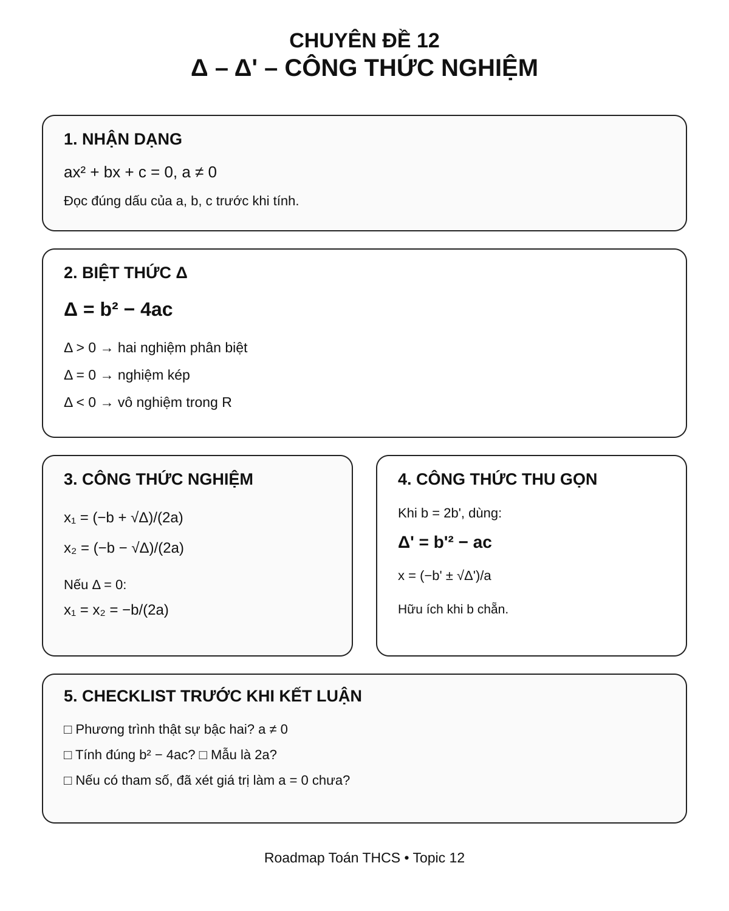
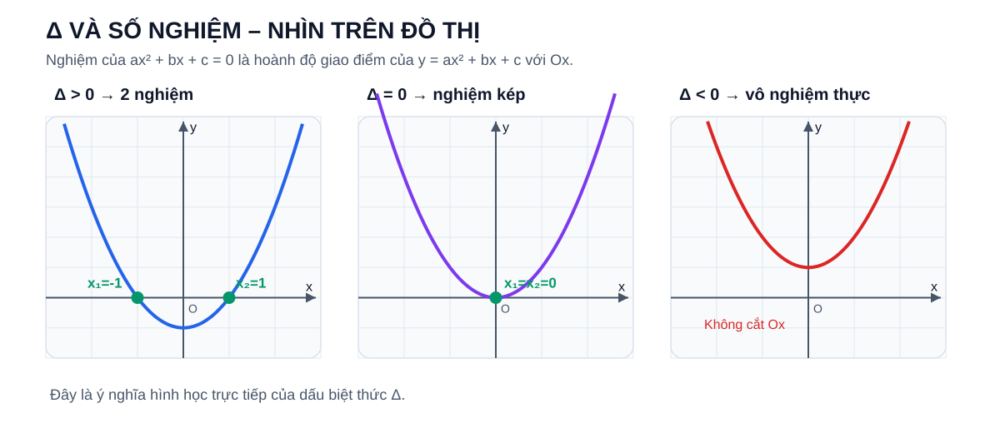
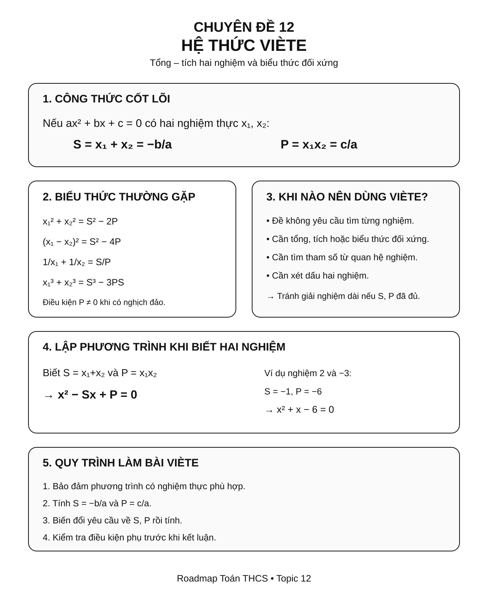
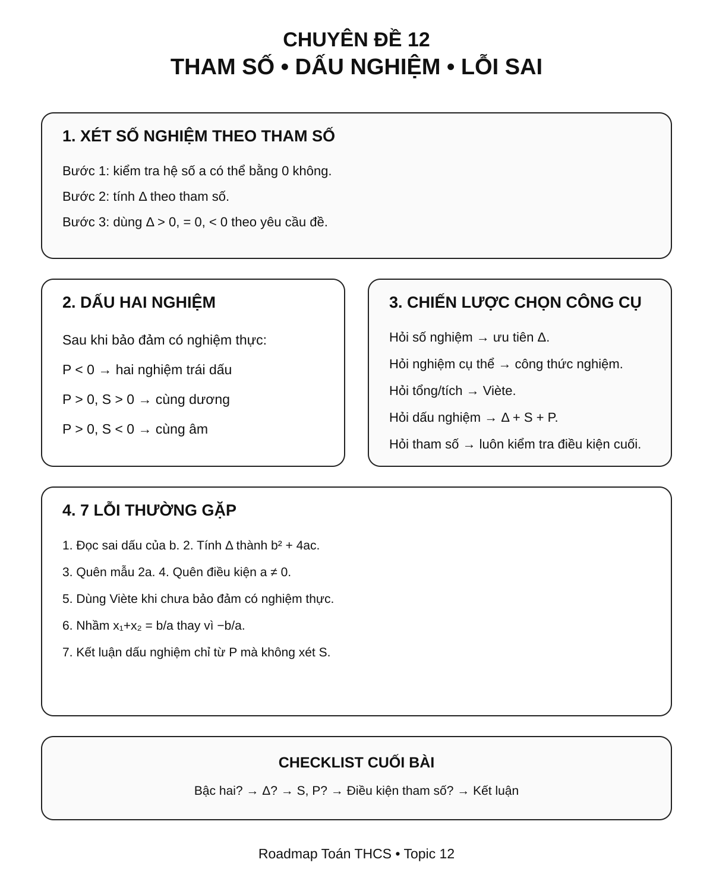

# Chuyên đề 12 – Phương trình bậc hai & Viète – chuẩn bị THPT


> **Trạng thái:** Đã kiểm định nội dung học thuật; cấu trúc Roadmap chuẩn 11 mục.
>
> **Lớp trọng tâm:** 9
> **Mạch kiến thức:** Đại số
> **Mức ưu tiên:** ⭐⭐⭐⭐⭐

> **Vai trò trong Roadmap:** chuyên đề tổng hợp Đại số lớp 9, kết nối phương trình, hàm số, căn thức và chuẩn bị trực tiếp cho Toán THPT.
>

---

## 🧭 1. Bản đồ kiến thức

```text
PHƯƠNG TRÌNH BẬC HAI & VIÈTE
│
├── 1. Phương trình bậc hai ax² + bx + c = 0
│   ├── Điều kiện a ≠ 0
│   ├── Biệt thức Δ = b² - 4ac
│   └── Số nghiệm theo dấu của Δ
│
├── 2. Công thức nghiệm
│   ├── Δ > 0: hai nghiệm phân biệt
│   ├── Δ = 0: nghiệm kép
│   └── Δ < 0: vô nghiệm trong R
│
├── 3. Công thức nghiệm thu gọn
│   └── Δ' = b'² - ac khi b = 2b'
│
├── 4. Hệ thức Viète
│   ├── x₁ + x₂ = -b/a
│   └── x₁x₂ = c/a
│
├── 5. Ứng dụng Viète
│   ├── Nhẩm nghiệm
│   ├── Tính biểu thức đối xứng
│   ├── Tìm tham số
│   └── Lập phương trình khi biết nghiệm
│
└── 6. Mở rộng / cầu nối đồ thị
    ├── y = ax² + bx + c
    └── Nghiệm là hoành độ giao điểm với trục Ox
```

### Infographic 1 – Tổng quan chuyên đề



> Dùng infographic này để nhìn nhanh **cấu trúc chuyên đề, vai trò của Δ và Viète, cùng mạch liên hệ giữa phương trình – nghiệm – hệ số – đồ thị**.

---

## 🎯 2. Mục tiêu cần đạt

Sau khi hoàn thành chuyên đề, học sinh cần có thể:

- [ ] Nhận dạng đúng phương trình bậc hai một ẩn.
- [ ] Tính chính xác `Δ` hoặc `Δ'` và kết luận số nghiệm.
- [ ] Giải thành thạo phương trình bậc hai bằng công thức nghiệm.
- [ ] Biết khi nào có thể nhẩm nghiệm thay vì dùng công thức dài.
- [ ] Sử dụng hệ thức Viète theo cả hai chiều.
- [ ] Tính các biểu thức đối xứng theo hai nghiệm mà không cần giải phương trình.
- [ ] Xử lý bài toán có tham số về số nghiệm, dấu nghiệm và quan hệ giữa hai nghiệm.
- [ ] Lập phương trình bậc hai khi biết tổng và tích hai nghiệm.
- [ ] Hiểu ở mức mở rộng mối liên hệ giữa nghiệm phương trình và giao điểm của đồ thị bậc hai với trục hoành.

---

## 📖 3. Kiến thức cốt lõi

### Infographic 2 – Δ và công thức nghiệm



> Dùng infographic này để ôn nhanh **cách xác định a, b, c; tính Δ/Δ'; kết luận số nghiệm và chọn đúng công thức nghiệm**.

### 3.1. Phương trình bậc hai một ẩn

Dạng tổng quát:

`ax² + bx + c = 0`, với `a ≠ 0`.

Trong đó:

- `a` là hệ số của `x²`;
- `b` là hệ số của `x`;
- `c` là hệ số tự do.

> ⚠️ Nếu `a = 0`, phương trình không còn là phương trình bậc hai.

Ví dụ:

- `2x² - 3x + 1 = 0` là phương trình bậc hai.
- `5x - 2 = 0` không phải phương trình bậc hai.

---

### 3.2. Biệt thức Δ

Với:

`ax² + bx + c = 0`

Ta đặt:

`Δ = b² - 4ac`

Số nghiệm thực phụ thuộc vào dấu của `Δ`:

| Điều kiện | Kết luận |
|---|---|
| `Δ > 0` | Có hai nghiệm phân biệt |
| `Δ = 0` | Có một nghiệm kép |
| `Δ < 0` | Vô nghiệm trong tập số thực |

### Trực quan – vì sao dấu của `Δ` quyết định số nghiệm?



Nếu đặt `y = ax² + bx + c`, thì nghiệm của phương trình

`ax² + bx + c = 0`

chính là **hoành độ các giao điểm của parabol với trục `Ox`**. Vì thế:

- `Δ > 0` → cắt `Ox` tại hai điểm → hai nghiệm phân biệt;
- `Δ = 0` → tiếp xúc `Ox` tại một điểm → nghiệm kép;
- `Δ < 0` → không cắt `Ox` → không có nghiệm thực.

> Đây là cách nhìn hình học của cùng một kết luận đại số, không phải một quy tắc khác cần học thuộc thêm.

---

### 3.3. Công thức nghiệm

Nếu `Δ > 0`:

`x₁ = (-b + √Δ)/(2a)`

`x₂ = (-b - √Δ)/(2a)`

Nếu `Δ = 0`:

`x₁ = x₂ = -b/(2a)`

Nếu `Δ < 0`:

phương trình vô nghiệm trong `R`.

### Ví dụ

Giải:

`x² - 5x + 6 = 0`

Ta có:

`Δ = (-5)² - 4·1·6 = 25 - 24 = 1 > 0`

Suy ra:

`x₁ = (5 + 1)/2 = 3`

`x₂ = (5 - 1)/2 = 2`

Vậy tập nghiệm là `{2; 3}`.

---

### 3.4. Công thức nghiệm thu gọn

Nếu `b = 2b'`, ta có thể dùng:

`Δ' = b'² - ac`

Khi đó:

- `Δ' > 0`: phương trình có hai nghiệm phân biệt:
  `x₁ = (-b' + √Δ')/a`, `x₂ = (-b' - √Δ')/a`;
- `Δ' = 0`: phương trình có nghiệm kép:
  `x₁ = x₂ = -b'/a`;
- `Δ' < 0`: phương trình vô nghiệm trong tập số thực.

Ví dụ:

`2x² - 8x + 6 = 0`

Ta có `b' = -4`:

`Δ' = (-4)² - 2·6 = 16 - 12 = 4`

`x₁ = (4 + 2)/2 = 3`

`x₂ = (4 - 2)/2 = 1`

> 💡 Công thức thu gọn giúp giảm số phép tính khi hệ số `b` chẵn.

---

## 🔗 4. Kiến thức liên quan

### Kiến thức cần ôn trước

- [08. Phương trình và bất phương trình](../08-phuong-trinh-bat-phuong-trinh/index.md)
- [10. Hàm số và đồ thị](../10-ham-so-do-thi/index.md)
- [11. Căn thức và biến đổi căn thức](../11-can-thuc/index.md)

### Kiến thức sử dụng tiếp

- Chuyên đề 25 – Tổng hợp và chiến lược ôn thi vào 10.
- Phương trình, hàm số bậc hai và đại số ở THPT.

---

## 🧩 5. Các dạng bài cần nắm vững

### Dạng 1 – Giải phương trình bậc hai bằng công thức nghiệm

**Dấu hiệu:** phương trình đã ở dạng `ax² + bx + c = 0` và khó phân tích nhanh thành nhân tử.

**Quy trình:**

1. Xác định `a, b, c`.
2. Tính `Δ`.
3. Kết luận số nghiệm.
4. Tính nghiệm nếu có.

Ví dụ:

`2x² + x - 3 = 0`

`Δ = 1 + 24 = 25`

`x₁ = 1`, `x₂ = -3/2`.

---

### Dạng 2 – Nhẩm nghiệm

Một số trường hợp có thể nhận ra nhanh.

Nếu:

`a + b + c = 0`

thì `x = 1` là một nghiệm và nghiệm còn lại là `c/a`.

Nếu:

`a - b + c = 0`

thì `x = -1` là một nghiệm và nghiệm còn lại là `-c/a`.

Ví dụ:

`2x² - 5x + 3 = 0`

Có `2 - 5 + 3 = 0`, nên `x = 1` là một nghiệm.

Nghiệm còn lại:

`x = c/a = 3/2`.

---

### Dạng 3 – Xét số nghiệm theo tham số

Ví dụ:

`x² - 2x + m = 0`

Ta có:

`Δ = 4 - 4m = 4(1 - m)`.

- Hai nghiệm phân biệt khi `m < 1`.
- Nghiệm kép khi `m = 1`.
- Vô nghiệm thực khi `m > 1`.

> ⚠️ Với phương trình chứa tham số ở hệ số `x²`, phải kiểm tra thêm điều kiện để phương trình thực sự là bậc hai.

---

### Infographic 3 – Viète và biểu thức theo nghiệm



> Dùng infographic này khi bài toán hỏi **tổng – tích nghiệm, biểu thức đối xứng hoặc lập phương trình mới** mà không cần tính riêng từng nghiệm.

### Dạng 4 – Hệ thức Viète

Nếu phương trình:

`ax² + bx + c = 0`, `a ≠ 0`

có các nghiệm thực `x₁, x₂` (có thể trùng nhau), thì:

`x₁ + x₂ = -b/a`

`x₁x₂ = c/a`

Đặt:

`S = x₁ + x₂`

`P = x₁x₂`

thì:

`S = -b/a`, `P = c/a`.

---

### Dạng 5 – Tính biểu thức theo hai nghiệm mà không giải phương trình

Với `S = x₁ + x₂`, `P = x₁x₂`:

`x₁² + x₂² = S² - 2P`

`(x₁ - x₂)² = S² - 4P`

`1/x₁ + 1/x₂ = S/P` với `P ≠ 0`.

`x₁³ + x₂³ = S³ - 3PS`.

Ví dụ:

Cho `x² - 5x + 3 = 0` có hai nghiệm `x₁, x₂`.

Theo Viète:

`S = 5`, `P = 3`.

Do đó:

`x₁² + x₂² = 25 - 6 = 19`.

Không cần tính riêng từng nghiệm.

---

### Dạng 6 – Tìm tham số từ điều kiện về nghiệm

Ví dụ:

`x² - (m + 1)x + m = 0`

Có hai nghiệm `x₁, x₂` thỏa:

`x₁ + x₂ = 5`.

Theo Viète:

`m + 1 = 5`

nên `m = 4`.

Sau đó phải kiểm tra phương trình ứng với `m = 4` có nghiệm phù hợp với yêu cầu đề bài.

---

### Infographic 4 – Tham số, dấu nghiệm và lỗi sai



> Dùng infographic này cho các bài **tham số, điều kiện hai nghiệm và lựa chọn nhanh giữa Δ – công thức nghiệm – Viète**, đồng thời kiểm tra các lỗi dễ mắc trước khi kết luận.

### Dạng 7 – Xét dấu của hai nghiệm

Với phương trình bậc hai thực sự (`a ≠ 0`), đặt `S = x₁ + x₂`, `P = x₁x₂`.

Các điều kiện thường dùng:

| Yêu cầu về nghiệm | Điều kiện |
|---|---|
| Hai nghiệm thực cùng dương | `Δ ≥ 0`, `P > 0`, `S > 0` |
| Hai nghiệm thực cùng âm | `Δ ≥ 0`, `P > 0`, `S < 0` |
| Hai nghiệm trái dấu | `P < 0` (khi đó tự động có hai nghiệm thực phân biệt) |
| Có một nghiệm bằng `0` | `P = 0` |

Nếu đề yêu cầu **hai nghiệm phân biệt**, phải thay `Δ ≥ 0` bằng `Δ > 0` ở các trường hợp cùng dấu.

Khi `P = 0`, không được xếp vào “hai nghiệm dương” hoặc “hai nghiệm âm”: một nghiệm bằng `0`, nghiệm còn lại bằng `S` (có thể cũng bằng `0` nếu là nghiệm kép).

> Đây là bộ điều kiện đầy đủ hơn cho bài tham số. Không nên chỉ nhìn `P` rồi kết luận dấu của từng nghiệm.

---

### Dạng 8 – Lập phương trình khi biết hai nghiệm

Nếu muốn lập phương trình có hai nghiệm `x₁, x₂`, đặt:

`S = x₁ + x₂`, `P = x₁x₂`.

Phương trình đơn giản nhất là:

`x² - Sx + P = 0`.

Ví dụ: hai nghiệm là `2` và `-3`.

`S = -1`, `P = -6`.

Phương trình:

`x² + x - 6 = 0`.

---

### Dạng 9 – Biến đổi nghiệm

Nếu `x₁, x₂` là nghiệm của một phương trình và cần lập phương trình có nghiệm mới, hãy tính tổng và tích của nghiệm mới.

Ví dụ, nghiệm mới là:

`y₁ = x₁ + 1`, `y₂ = x₂ + 1`.

Ta có:

`y₁ + y₂ = S + 2`

`y₁y₂ = P + S + 1`.

Sau đó lập:

`y² - (y₁ + y₂)y + y₁y₂ = 0`.

---

### Dạng 10 – Mở rộng / cầu nối với đồ thị

> Phần này dùng để kết nối sang tư duy hàm số bậc hai; không xem là trọng tâm cốt lõi ngang với công thức nghiệm và hệ thức Viète ở THCS.

Phương trình:

`ax² + bx + c = 0`

có thể được hiểu là bài toán tìm hoành độ giao điểm của đồ thị:

`y = ax² + bx + c`

với trục `Ox`.

- `Δ > 0`: parabol cắt `Ox` tại hai điểm.
- `Δ = 0`: parabol tiếp xúc `Ox`.
- `Δ < 0`: parabol không cắt `Ox`.

Đây là cầu nối quan trọng từ Đại số sang tư duy hàm số.

---

## 🚀 6. Dạng bài thi vào lớp 10

| Nhóm dạng | Mức ưu tiên Roadmap |
|---|:---:|
| Giải phương trình bậc hai | ⭐⭐⭐⭐⭐ |
| Tính số nghiệm theo tham số | ⭐⭐⭐⭐⭐ |
| Viète – tính biểu thức theo nghiệm | ⭐⭐⭐⭐⭐ |
| Viète – tìm tham số | ⭐⭐⭐⭐⭐ |
| Điều kiện hai nghiệm dương/âm/trái dấu | ⭐⭐⭐⭐⭐ |
| Lập phương trình từ tổng và tích nghiệm | ⭐⭐⭐⭐ |
| Biến đổi nghiệm | ⭐⭐⭐⭐ |
| Liên hệ đồ thị bậc hai (mở rộng) | ⭐⭐⭐⭐ |

### Chiến lược làm bài

1. Chuẩn hóa phương trình về dạng `ax² + bx + c = 0`.
2. Kiểm tra điều kiện `a ≠ 0` nếu có tham số.
3. Nếu chỉ cần tổng/tích nghiệm, ưu tiên Viète thay vì giải nghiệm cụ thể.
4. Nếu đề hỏi số nghiệm, tập trung vào `Δ`.
5. Nếu đề hỏi dấu nghiệm, kết hợp `Δ`, `S`, `P`.
6. Kiểm tra điều kiện cuối cùng trước khi kết luận tham số.

---

## ⚠️ 7. Lỗi sai thường gặp

### ❌ Lỗi 1 – Xác định sai hệ số

Với:

`x² - 5x + 6 = 0`

phải có `a = 1`, `b = -5`, `c = 6`.

Dấu của `b` rất quan trọng.

### ❌ Lỗi 2 – Tính sai Δ

`Δ = b² - 4ac`, không phải `b² + 4ac`.

### ❌ Lỗi 3 – Quên mẫu `2a`

Công thức nghiệm là:

`x = (-b ± √Δ)/(2a)`.

### ❌ Lỗi 4 – Dùng Viète khi chưa bảo đảm có nghiệm

Trong bài tham số, trước khi áp dụng quan hệ giữa hai nghiệm thực, phải bảo đảm phương trình có nghiệm thực theo yêu cầu.

### ❌ Lỗi 5 – Nhầm dấu trong Viète

`x₁ + x₂ = -b/a`, có dấu âm.

`x₁x₂ = c/a`.

### ❌ Lỗi 6 – Kết luận dấu nghiệm chỉ từ tích

`P > 0` chỉ cho biết hai nghiệm cùng dấu; muốn biết dương hay âm cần xét thêm `S`.

### ❌ Lỗi 7 – Quên kiểm tra phương trình còn bậc hai

Nếu `a` chứa tham số, phải loại trường hợp `a = 0` trước khi dùng `Δ` của phương trình bậc hai.

---

## 📝 8. Luyện tập tiếp theo

Micro-practice trong các Learning Cards dùng để kiểm tra nhanh ngay sau khi học. Khi muốn luyện sâu hơn, hãy chuyển sang **Practice Room**.

[🎯 Mở Practice Room](bai-tap.md){ .md-button .md-button--primary }

Trong Practice Room, luyện tương tác và bài tự luận được tách theo Core / Entrance10 / Challenge.

!!! info "Phân biệt mục đích"
    Micro-practice kiểm tra hiểu ngay; Practice Room dùng để **rèn kỹ năng**. Kết quả luyện tập là formative evidence, không phải điểm kiểm tra cuối chuyên đề.

## ✅ 9. Tự kiểm tra mức độ sẵn sàng

Khi đã luyện tương đối chắc, hãy làm **Core Readiness Check**.

[✅ Bắt đầu Core Readiness Check](tu-kiem-tra.md){ .md-button .md-button--primary }

Readiness Check không hint/Tutor, không báo đúng sai từng câu, chỉ chấm sau khi nộp và không khóa chuyên đề tiếp theo.

## 🔄 10. Liên kết Roadmap

- **→ Tiếp theo:** [13 – Góc và quan hệ đường thẳng](../13-goc-va-duong-thang/index.md)

```text
08. Phương trình
       │
       ├──────────┐
       ↓          ↓
10. Hàm số      11. Căn thức
       │          │
       └────┬─────┘
            ↓
12. PHƯƠNG TRÌNH BẬC HAI & VIÈTE
            │
            ↓
25. Tổng hợp – Ôn thi vào 10
            │
            ↓
          THPT
```

- **← Ôn lại:** [08. Phương trình và bất phương trình](../08-phuong-trinh-bat-phuong-trinh/index.md)
- **← Liên hệ:** [10. Hàm số và đồ thị](../10-ham-so-do-thi/index.md)
- **← Liên hệ:** [11. Căn thức và biến đổi căn thức](../11-can-thuc/index.md)
- **→ Tổng hợp cuối:** [25. Tổng hợp & chiến lược ôn thi vào 10](../25-tong-hop-on-thi-10/index.md)

- **✏️ Luyện tập:** [Bài tập Chuyên đề 12](bai-tap.md)
- **✅ Tự kiểm tra:** [Tự kiểm tra Chuyên đề 12](tu-kiem-tra.md)

Xem toàn bộ kiến trúc tại [Blueprint 25 chuyên đề](../../roadmap/blueprint-25-chuyen-de.md).

---

## 🏁 11. Điều kiện hoàn thành

- [ ] Nhận dạng đúng phương trình bậc hai và hệ số.
- [ ] Tính Δ/Δ' và giải phương trình ổn định.
- [ ] Nhẩm nghiệm khi cấu trúc phù hợp.
- [ ] Dùng Viète đúng và lập được phương trình từ nghiệm.
- [ ] Core Readiness đạt khoảng **80%** hoặc đã chữa hiểu các lỗi còn lại.

!!! note "Soft Mastery"
    Không cần đạt 100% mới được học tiếp.

!!! warning "Core độc lập Extension"
    Tham số, Entrance10 và Specialized-Challenge không phải điều kiện để hoàn thành Core.

---

## ➡️ Tiếp tục học

<div class="topic-workspace-actions" markdown>

[🎯 Sang Phòng Luyện Tập](bai-tap.md){ .md-button .md-button--primary }

[✅ Kiểm Tra Độ Sẵn Sàng](tu-kiem-tra.md){ .md-button }

[→ 13 – Góc và đường thẳng](../13-goc-va-duong-thang/index.md){ .md-button }

</div>
