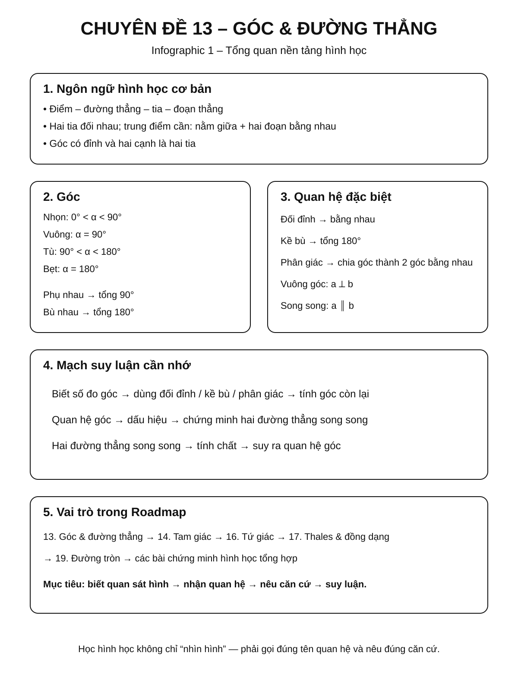
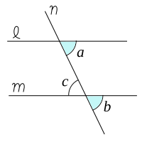
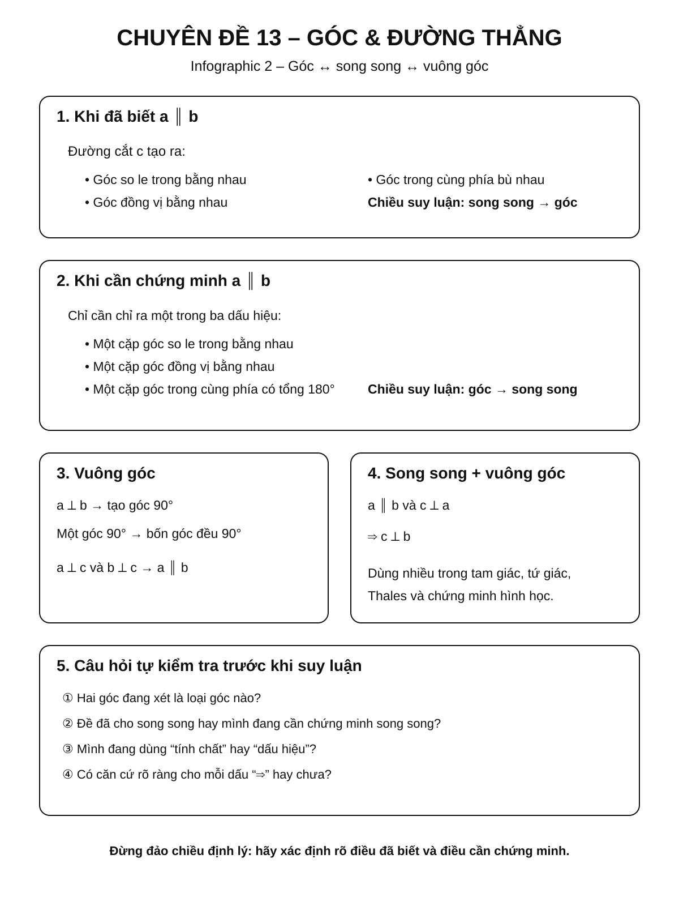
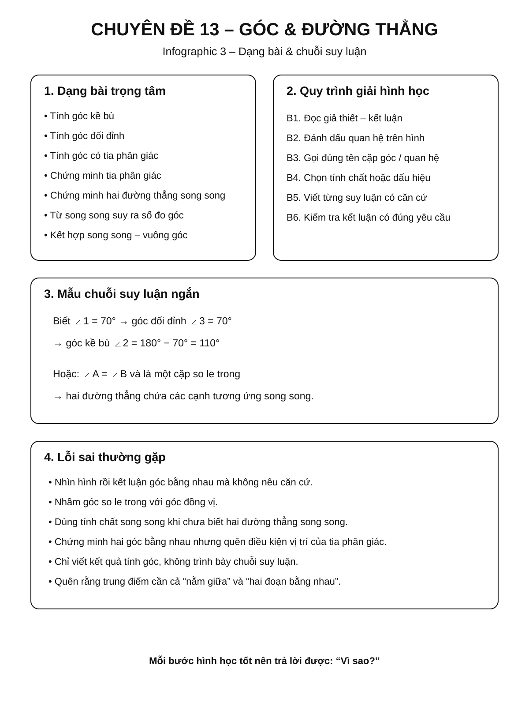

# Chuyên đề 13 – Góc và quan hệ giữa các đường thẳng


> **Trạng thái:** Đã kiểm định nội dung học thuật; cấu trúc Roadmap chuẩn 11 mục.
>
> **Lớp trọng tâm:** 6–7
> **Mạch kiến thức:** Hình học
> **Mức ưu tiên:** ⭐⭐⭐⭐⭐

> **Vai trò trong Roadmap:** nền tảng của toàn bộ mạch Hình học THCS. Chuyên đề này chuẩn hóa ngôn ngữ về điểm, đường thẳng, tia, góc, song song, vuông góc và cách suy luận hình học trước khi học tam giác, tứ giác, Thales và đường tròn.
>

---

## 🧭 1. Bản đồ kiến thức

### Infographic 1 – Tổng quan chuyên đề



```text
GÓC VÀ QUAN HỆ GIỮA CÁC ĐƯỜNG THẲNG
│
├── 1. Điểm – đường thẳng – tia – đoạn thẳng
│   ├── Điểm thuộc / không thuộc đường thẳng
│   ├── Hai tia đối nhau
│   ├── Trung điểm đoạn thẳng
│   └── Độ dài đoạn thẳng
│
├── 2. Góc
│   ├── Đỉnh – cạnh của góc
│   ├── Góc nhọn, vuông, tù, bẹt
│   ├── Hai góc kề nhau
│   ├── Hai góc phụ nhau, bù nhau
│   └── Tia phân giác
│
├── 3. Hai đường thẳng cắt nhau
│   ├── Góc đối đỉnh
│   ├── Góc kề bù
│   └── Hai đường thẳng vuông góc
│
├── 4. Hai đường thẳng song song
│   ├── Góc so le trong
│   ├── Góc đồng vị
│   ├── Góc trong cùng phía
│   └── Dấu hiệu nhận biết song song
│
└── 5. Chuỗi suy luận hình học
    ├── Biết góc → tính góc
    ├── Quan hệ góc → chứng minh song song
    ├── Song song → suy ra quan hệ góc
    └── Kết hợp vuông góc – song song
```

---

## Minh họa trực quan

### 1. Góc đối đỉnh

<p align="center">
  
</p>

> Khi hai đường thẳng cắt nhau, hai góc đối đỉnh bằng nhau.

### 2. Hai đường thẳng song song và một đường cắt

<p align="center">
  
</p>

> Hình này giúp nhận biết cấu hình cơ bản gồm hai đường thẳng song song và một đường thẳng cắt chúng.

### 3. Góc so le trong

<p align="center">
  
</p>

> Khi hai đường thẳng song song bị cắt bởi một đường thẳng, các cặp góc so le trong bằng nhau.


---

## 🎯 2. Mục tiêu cần đạt

Sau khi hoàn thành chuyên đề, học sinh cần có thể:

- [ ] Đọc và sử dụng đúng ký hiệu điểm, đoạn thẳng, tia, đường thẳng và góc.
- [ ] Phân loại được góc theo số đo.
- [ ] Tính được số đo góc từ quan hệ kề bù, phụ nhau, bù nhau, đối đỉnh.
- [ ] Nhận biết và sử dụng đúng tia phân giác.
- [ ] Hiểu ý nghĩa của hai đường thẳng vuông góc và song song.
- [ ] Nhận dạng được góc so le trong, đồng vị, trong cùng phía.
- [ ] Chứng minh được hai đường thẳng song song từ quan hệ góc.
- [ ] Từ hai đường thẳng song song, suy ra được các góc bằng nhau hoặc bù nhau.
- [ ] Biết trình bày một chuỗi suy luận hình học ngắn, rõ căn cứ.
- [ ] Chuẩn bị đủ nền tảng để học tam giác, tứ giác, Thales và hình học chứng minh.

---

## 📖 3. Kiến thức cốt lõi

### Infographic 2 – Góc, song song và vuông góc



## 3.1. Điểm, đường thẳng, tia và đoạn thẳng

### Điểm và đường thẳng

Nếu điểm `A` nằm trên đường thẳng `d`, viết:

`A ∈ d`

Nếu điểm `B` không nằm trên `d`, viết:

`B ∉ d`

Qua hai điểm phân biệt xác định được một và chỉ một đường thẳng.

### Tia

Tia `Ox` có gốc là `O` và kéo dài vô hạn theo một phía.

Hai tia `Ox` và `Oy` là **hai tia đối nhau** nếu:

- cùng gốc `O`;
- nằm trên cùng một đường thẳng;
- đi về hai phía ngược nhau.

### Đoạn thẳng

Đoạn thẳng `AB` gồm hai đầu mút `A`, `B` và các điểm nằm giữa chúng.

Độ dài đoạn thẳng được ký hiệu `AB` khi không gây nhầm lẫn với tên đoạn thẳng.

### Trung điểm

Điểm `M` là trung điểm của `AB` khi đồng thời:

1. `M` nằm giữa `A` và `B`;
2. `MA = MB`.

> ⚠️ Chỉ có `MA = MB` chưa đủ để kết luận `M` là trung điểm nếu chưa biết `M` nằm trên đoạn `AB`.

---

## 3.2. Góc và số đo góc

Góc `xOy` có:

- đỉnh là `O`;
- hai cạnh là các tia `Ox`, `Oy`.

Số đo góc thường viết:

`∠xOy = 60°`

### Phân loại góc

| Loại góc | Điều kiện |
|---|---:|
| Góc nhọn | `0° < α < 90°` |
| Góc vuông | `α = 90°` |
| Góc tù | `90° < α < 180°` |
| Góc bẹt | `α = 180°` |

---

## 3.3. Hai góc kề nhau, phụ nhau, bù nhau

### Hai góc kề nhau

Hai góc có:

- chung một đỉnh;
- chung một cạnh;
- phần trong không giao nhau.

### Hai góc phụ nhau

Hai góc phụ nhau khi tổng số đo bằng `90°`.

Ví dụ:

`35° + 55° = 90°`

### Hai góc bù nhau

Hai góc bù nhau khi tổng số đo bằng `180°`.

### Hai góc kề bù

Nếu hai góc vừa kề nhau vừa có tổng bằng `180°`, chúng là hai góc kề bù.

Nếu `Ox` và `Oy` là hai tia đối nhau, tia `Oz` nằm giữa hai tia đó thì:

`∠xOz + ∠zOy = 180°`

---

## 3.4. Tia phân giác của một góc

Tia `Oz` là tia phân giác của `∠xOy` khi:

1. `Oz` nằm giữa `Ox` và `Oy`;
2. `∠xOz = ∠zOy`.

Khi đó:

`∠xOz = ∠zOy = 1/2 ∠xOy`

Ví dụ:

Nếu `∠xOy = 80°` và `Oz` là tia phân giác thì:

`∠xOz = ∠zOy = 40°`.

---

## 3.5. Góc đối đỉnh

Khi hai đường thẳng cắt nhau, hai góc có các cạnh tương ứng là hai cặp tia đối nhau gọi là **hai góc đối đỉnh**.

### Tính chất

**Hai góc đối đỉnh thì bằng nhau.**

Nếu `∠1` và `∠3` đối đỉnh thì:

`∠1 = ∠3`.

Nếu `∠1 = 70°` thì góc đối đỉnh với nó cũng bằng `70°`; hai góc kề với nó bằng:

`180° - 70° = 110°`.

> Đây là một trong những chuỗi suy luận góc cơ bản nhất của Hình học THCS.

---

## 3.6. Hai đường thẳng vuông góc

Hai đường thẳng `a` và `b` vuông góc nếu chúng cắt nhau và tạo thành một góc vuông.

Ký hiệu:

`a ⟂ b`

Nếu một trong bốn góc tại giao điểm bằng `90°` thì cả bốn góc đều bằng `90°`.

---

## 3.7. Hai đường thẳng song song

Hai đường thẳng phân biệt cùng nằm trong một mặt phẳng và không có điểm chung gọi là hai đường thẳng song song.

Ký hiệu:

`a ∥ b`

Khi một đường thẳng `c` cắt hai đường thẳng `a`, `b`, ta có các cặp góc quan trọng.

### Góc so le trong

Hai góc nằm:

- phía trong giữa `a` và `b`;
- ở hai phía khác nhau của đường cắt.

### Góc đồng vị

Hai góc ở vị trí tương ứng giống nhau tại hai giao điểm.

### Góc trong cùng phía

Hai góc:

- đều nằm phía trong giữa hai đường thẳng;
- cùng nằm một phía của đường cắt.

---

## 3.8. Tính chất của hai đường thẳng song song

Nếu `a ∥ b` và `c` cắt `a`, `b` thì:

- các góc so le trong bằng nhau;
- các góc đồng vị bằng nhau;
- các góc trong cùng phía bù nhau.

Đây là chiều suy luận:

```text
a ∥ b
  ↓
quan hệ góc
```

---

## 3.9. Dấu hiệu nhận biết hai đường thẳng song song

Nếu đường thẳng `c` cắt `a`, `b` và có một trong các điều kiện sau thì `a ∥ b`:

- một cặp góc so le trong bằng nhau;
- một cặp góc đồng vị bằng nhau;
- một cặp góc trong cùng phía bù nhau.

Đây là chiều suy luận ngược:

```text
quan hệ góc
    ↓
a ∥ b
```

> ⚠️ Học sinh cần phân biệt rõ **tính chất** và **dấu hiệu**. Một bên đi từ song song đến góc, bên kia đi từ góc đến song song.

---

## 3.10. Quan hệ giữa vuông góc và song song

### Tính chất 1

Nếu hai đường thẳng phân biệt `a`, `b` cùng vuông góc với đường thẳng `c`:

`a ⟂ c` và `b ⟂ c`

thì:

`a ∥ b`.

### Tính chất 2

Nếu:

`a ∥ b` và `c ⟂ a`

thì:

`c ⟂ b`.

Hai tính chất này được dùng rất nhiều trong chứng minh tam giác, tứ giác và hình học tổng hợp.

## 3.11. Tiên đề Euclid về đường thẳng song song

Qua một điểm \(M\) nằm ngoài đường thẳng \(a\), có **một và chỉ một** đường thẳng đi qua \(M\) và song song với \(a\).

Điểm cần nhớ là **tính duy nhất**: nếu hai đường \(b,c\) cùng đi qua \(M\) và đều song song với \(a\), thì \(b\) và \(c\) phải là cùng một đường thẳng.

## 3.12. Định lí – giả thiết – kết luận – bước đầu chứng minh

Một định lí thường có thể đọc dưới dạng:

\[
\text{Nếu P thì Q}.
\]

- **Giả thiết (GT):** P – những dữ kiện được cho.
- **Kết luận (KL):** Q – điều cần suy ra.

Khi chứng minh, mỗi bước nên viết theo cấu trúc:

\[
\text{mệnh đề} \quad (\text{căn cứ}).
\]

Căn cứ có thể là giả thiết, định nghĩa, tính chất/định lí đã học hoặc một kết quả đã chứng minh ở bước trước.

> ⚠️ Không dùng “nhìn hình thấy” làm căn cứ. Hình vẽ không tạo thêm giả thiết.

---

## 🔗 4. Kiến thức liên quan

## Kiến thức nên biết trước

- Cách đo độ dài và số đo góc.
- Phép cộng, trừ số tự nhiên và số hữu tỉ đơn giản.
- Khái niệm cơ bản về điểm và đoạn thẳng.

## Chuyên đề sử dụng trực tiếp kiến thức này

- [14. Tam giác](../14-tam-giac/index.md)
- [15. Các đường đồng quy trong tam giác](../15-duong-dong-quy/index.md)
- [16. Tứ giác và các hình đặc biệt](../16-tu-giac/index.md)
- [17. Định lý Thales và tam giác đồng dạng](../17-thales-dong-dang/index.md)
- [19. Đường tròn](../19-duong-tron/index.md)

---

## 🧩 5. Các dạng bài cần nắm vững

### Infographic 3 – Dạng bài và chuỗi suy luận



## Dạng 1 – Tính góc kề bù

### Dấu hiệu nhận biết

Có một góc đã biết và hai góc kề nhau tạo thành góc bẹt.

### Phương pháp

Dùng:

`α + β = 180°`

### Ví dụ

Nếu `∠xOz = 125°` và `Ox`, `Oy` là hai tia đối nhau thì:

`∠zOy = 180° - 125° = 55°`.

---

## Dạng 2 – Tính góc đối đỉnh

### Dấu hiệu nhận biết

Hai đường thẳng cắt nhau.

### Phương pháp

- Góc đối đỉnh bằng nhau.
- Góc kề bù có tổng `180°`.

### Ví dụ

Một góc bằng `68°`.

- Góc đối đỉnh: `68°`.
- Hai góc còn lại: `112°`.

---

## Dạng 3 – Tính góc có tia phân giác

Nếu `Oz` là tia phân giác của `∠xOy` thì:

`∠xOz = ∠zOy = 1/2 ∠xOy`.

Ví dụ:

`∠xOy = 124°`

suy ra:

`∠xOz = ∠zOy = 62°`.

---

## Dạng 4 – Chứng minh một tia là phân giác

Muốn chứng minh `Oz` là phân giác của `∠xOy`, cần chứng minh:

1. `Oz` nằm trong góc `xOy`;
2. `∠xOz = ∠zOy`.

Không được chỉ chứng minh hai góc bằng nhau mà bỏ điều kiện vị trí của tia.

---

## Dạng 5 – Tính góc khi có hai đường thẳng song song

### Quy trình

1. Xác định cặp góc cần dùng.
2. Gọi đúng tên quan hệ: so le trong, đồng vị, trong cùng phía.
3. Dùng tính chất song song.
4. Nếu cần, kết hợp kề bù hoặc đối đỉnh.

### Ví dụ

Nếu `a ∥ b` và một góc đồng vị bằng `72°`, góc đồng vị tương ứng cũng bằng `72°`.

Góc kề bù với nó bằng:

`180° - 72° = 108°`.

---

## Dạng 6 – Chứng minh hai đường thẳng song song

### Dấu hiệu thường dùng

- So le trong bằng nhau.
- Đồng vị bằng nhau.
- Trong cùng phía bù nhau.
- Hai đường thẳng phân biệt cùng vuông góc với đường thẳng thứ ba.

### Cách trình bày mẫu

> Ta có `∠A = ∠B`. Hai góc này ở vị trí so le trong. Do đó `a ∥ b`.

Phần quan trọng không chỉ là hai góc bằng nhau mà còn phải **nêu đúng vị trí của chúng**.

---

## Dạng 7 – Chứng minh hai đường thẳng vuông góc

Có thể dùng một trong các hướng:

- chứng minh một góc tạo bởi hai đường thẳng bằng `90°`;
- dùng quan hệ song song với một đường đã biết vuông góc;
- từ các quan hệ góc đã biết, tính được góc tạo bởi hai đường thẳng bằng `90°`.

---

## Dạng 8 – Chuỗi tính nhiều góc

Một bài có thể yêu cầu:

`góc đã biết → đối đỉnh → kề bù → song song → đồng vị`

Cách làm tốt nhất:

1. Không tính tất cả góc cùng lúc.
2. Tìm góc gần dữ kiện nhất.
3. Ghi căn cứ sau mỗi bước.
4. Tiếp tục lan sang góc cần tìm.

---

## Dạng 9 – Bài có tham số

Ví dụ:

Hai góc đồng vị có số đo:

`3x + 10` và `5x - 30`.

Nếu hai đường thẳng song song thì:

`3x + 10 = 5x - 30`

suy ra:

`x = 20`.

Sau đó thay lại để tìm số đo góc.

---

## Dạng 10 – Bài chứng minh tổng hợp ngắn

Thường kết hợp:

- đối đỉnh;
- kề bù;
- song song;
- vuông góc;
- tia phân giác.

Mục tiêu là rèn cách viết:

```text
Dữ kiện
  ↓
quan hệ góc
  ↓
suy luận trung gian
  ↓
kết luận hình học
```

---

## 🚀 6. Dạng bài thi vào lớp 10

Chuyên đề này ít khi xuất hiện độc lập thành một câu lớn, nhưng là **nền tảng bắt buộc** cho hầu hết bài chứng minh hình học.

| Nội dung | Mức ưu tiên Roadmap |
|---|:---:|
| Tính góc cơ bản | ⭐⭐⭐ |
| Song song – góc | ⭐⭐⭐⭐⭐ |
| Chứng minh vuông góc | ⭐⭐⭐⭐⭐ |
| Tia phân giác | ⭐⭐⭐⭐ |
| Chuỗi suy luận góc | ⭐⭐⭐⭐⭐ |
| Kết hợp trong tam giác/tứ giác | ⭐⭐⭐⭐⭐ |

### Dạng 1 – Từ song song suy ra góc

Đây thường là bước đầu để chứng minh hai tam giác bằng nhau hoặc đồng dạng.

### Dạng 2 – Từ góc suy ra song song

Đây là bước quan trọng để tạo cấu hình Thales, hình bình hành hoặc các tứ giác đặc biệt.

### Dạng 3 – Chứng minh vuông góc

Thường xuất hiện dưới dạng bước trung gian trong hình học tổng hợp.

> ⭐⭐⭐⭐⭐ **Chiến lược:** khi gặp bài hình học khó, luôn kiểm tra trước xem có cặp đường song song, vuông góc, góc đối đỉnh hoặc góc tạo bởi đường cắt hay không.

---

## ⚠️ 7. Lỗi sai thường gặp

## ❌ Lỗi 1: Thấy hai góc bằng nhau là kết luận song song

Sai vì cần biết hai góc đó nằm ở vị trí nào.

### Cách tránh

Phải viết rõ:

> Hai góc này là một cặp so le trong / đồng vị.

---

## ❌ Lỗi 2: Nhầm so le trong với đồng vị

### Cách tránh

Quan sát ba yếu tố:

- nằm trong hay ngoài hai đường;
- cùng phía hay khác phía đường cắt;
- vị trí tương ứng tại hai giao điểm.

---

## ❌ Lỗi 3: Quên góc kề bù có tổng 180°

Học sinh đôi khi nhầm với hai góc phụ nhau có tổng `90°`.

---

## ❌ Lỗi 4: Dùng góc đối đỉnh khi hai đường không thực sự cắt nhau

Góc đối đỉnh chỉ xuất hiện khi có **hai đường thẳng cắt nhau**.

---

## ❌ Lỗi 5: Kết luận tia phân giác chỉ vì hai góc bằng nhau

Cần thêm điều kiện tia nằm trong góc.

---

## ❌ Lỗi 6: Nhìn hình để kết luận

Hình vẽ chỉ minh họa, không phải căn cứ chứng minh.

Ví dụ: hai đường nhìn có vẻ song song nhưng đề chưa cho và chưa chứng minh thì không được sử dụng tính chất song song.

---

## ❌ Lỗi 7: Không ghi căn cứ

Không nên viết:

`∠A = ∠B` rồi chuyển ngay sang kết luận.

Nên viết:

`∠A = ∠B` (hai góc so le trong), suy ra `a ∥ b`.

---

## 📝 8. Luyện tập tiếp theo

Micro-practice trong các Learning Cards dùng để kiểm tra nhanh ngay sau khi học. Khi muốn luyện sâu hơn, hãy chuyển sang **Practice Room**.

[🎯 Mở Practice Room](bai-tap.md){ .md-button .md-button--primary }

Practice Room gồm bài tương tác và bài tự luận; Core / Core-Support / Entrance10 / Challenge được tách rõ.

!!! info "Geometry Architecture v1"
    Với bài hình học, hình vẽ không bổ sung giả thiết. Mọi quan hệ dùng trong lời giải phải đến từ đề bài, dựng hình hợp lệ hoặc bước đã chứng minh.

## ✅ 9. Tự kiểm tra mức độ sẵn sàng

Khi đã luyện tương đối chắc, hãy làm **Core Readiness Check**.

[✅ Bắt đầu Core Readiness Check](tu-kiem-tra.md){ .md-button .md-button--primary }

Readiness chỉ kiểm tra KNTT Core, chấm sau khi nộp và không dùng hard gate.

## 🔄 10. Liên kết Roadmap

- **← Trước:** [12 – Phương trình bậc hai & Viète](../12-phuong-trinh-bac-hai-viete/index.md)

```text
01. Bản đồ chương trình
          │
          ↓
13. GÓC & QUAN HỆ ĐƯỜNG THẲNG
          │
   ┌──────┼──────────┐
   ↓      ↓          ↓
  14     16         17
Tam giác Tứ giác   Thales
   │      │          │
   └──────┴────┬─────┘
               ↓
          Hình học tổng hợp
```

### Liên kết trực tiếp

- **← Tổng quan:** [01. Bản đồ chương trình](../01-ban-do-chuong-trinh/index.md)
- **→ Tiếp theo:** [14. Tam giác](../14-tam-giac/index.md)
- **→ Liên hệ:** [16. Tứ giác và các hình đặc biệt](../16-tu-giac/index.md)
- **→ Liên hệ:** [17. Định lý Thales và tam giác đồng dạng](../17-thales-dong-dang/index.md)

- **✏️ Luyện tập:** [Bài tập Chuyên đề 13](bai-tap.md)
- **✅ Tự kiểm tra:** [Tự kiểm tra Chuyên đề 13](tu-kiem-tra.md)

Xem toàn bộ hệ thống tại [Blueprint 25 chuyên đề](../../roadmap/blueprint-25-chuyen-de.md).

---

## 🏁 11. Điều kiện hoàn thành

- [ ] Đọc đúng điểm, tia, đoạn thẳng, góc và quan hệ nằm giữa/trung điểm.
- [ ] Nhận dạng đúng các cặp góc và dùng đúng tính chất/dấu hiệu song song.
- [ ] Hiểu tiên đề Euclid ở mức tính duy nhất đường song song.
- [ ] Viết được GT/KL và một chuỗi chứng minh ngắn theo dạng mệnh đề + căn cứ.
- [ ] Không dùng hình vẽ làm giả thiết.
- [ ] Core Readiness đạt khoảng **80%** hoặc đã chữa hiểu các lỗi còn lại.

!!! note "Soft Mastery"
    Không cần đạt 100% mới được học tiếp.

!!! warning "Core độc lập Extension"
    Core-Support, Entrance10 và Specialized-Challenge không phải điều kiện hoàn thành KNTT Core.

---

## ➡️ Tiếp tục học

<div class="topic-workspace-actions" markdown>

[🎯 Sang Phòng Luyện Tập](bai-tap.md){ .md-button .md-button--primary }

[✅ Kiểm Tra Độ Sẵn Sàng](tu-kiem-tra.md){ .md-button }

[→ 14 – Tam giác](../14-tam-giac/index.md){ .md-button }

</div>
