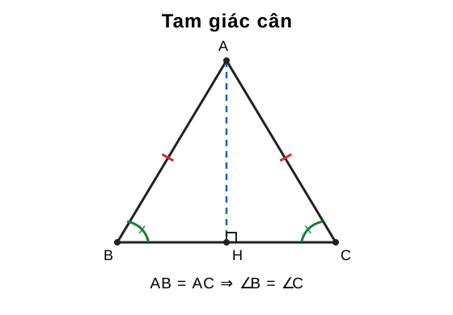
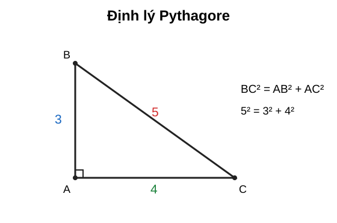

# Chuyên đề 14 – Tam giác


> **Trạng thái:** Nội dung cốt lõi đã hoàn thiện; đang chuẩn hóa cấu trúc Roadmap.
>
> **Lớp trọng tâm:** 7
> **Mạch kiến thức:** Hình học
> **Mức ưu tiên:** ⭐⭐⭐⭐⭐

> **Vai trò trong Roadmap:** nền tảng trung tâm của Hình học THCS, nối trực tiếp từ Chuyên đề 13 sang các chuyên đề 15, 17, 18 và 19.
>

---

## 🧭 1. Bản đồ kiến thức

```text
TAM GIÁC
│
├── 1. Thành phần cơ bản
│   ├── Đỉnh – cạnh – góc
│   ├── Chu vi – diện tích
│   └── Phân loại tam giác
│
├── 2. Quan hệ góc
│   ├── Tổng ba góc bằng 180°
│   ├── Góc ngoài
│   └── So sánh góc – cạnh
│
├── 3. Quan hệ cạnh
│   ├── Bất đẳng thức tam giác
│   ├── So sánh cạnh – góc đối diện
│   └── Điều kiện tồn tại tam giác
│
├── 4. Tam giác đặc biệt
│   ├── Tam giác cân
│   ├── Tam giác đều
│   └── Tam giác vuông
│
└── 5. Hai tam giác bằng nhau
    ├── c.c.c
    ├── c.g.c
    ├── g.c.g
    └── Trường hợp tam giác vuông
```

---

### Minh họa trực quan

#### 1. Tam giác cân

<p align="center">
  
</p>

> Trong tam giác cân, hai cạnh bên bằng nhau thì hai góc ở đáy bằng nhau. Đường từ đỉnh xuống đáy đồng thời là đường cao, trung tuyến và phân giác.

#### 2. Định lý Pythagore

<p align="center">
  
</p>

> Với tam giác vuông, bình phương cạnh huyền bằng tổng bình phương hai cạnh góc vuông: `BC² = AB² + AC²`.

---

## 🎯 2. Mục tiêu cần đạt

Sau khi hoàn thành chuyên đề, học sinh cần:

- [ ] Nhận biết và phân loại được các loại tam giác.
- [ ] Sử dụng thành thạo tổng ba góc trong tam giác và góc ngoài.
- [ ] Hiểu và áp dụng bất đẳng thức tam giác.
- [ ] Biết so sánh cạnh dựa vào góc và ngược lại.
- [ ] Nắm chắc tính chất và dấu hiệu nhận biết tam giác cân, đều, vuông.
- [ ] Nhận dạng đúng các trường hợp bằng nhau của hai tam giác.
- [ ] Biết chọn cặp tam giác thích hợp để chứng minh hai đoạn thẳng hoặc hai góc bằng nhau.
- [ ] Trình bày được một chứng minh hình học theo chuỗi giả thiết → lập luận → kết luận.

---

## 📖 3. Kiến thức cốt lõi

### 3.1. Tam giác và ký hiệu

Tam giác `ABC` được tạo bởi ba điểm `A, B, C` không thẳng hàng và ba đoạn thẳng:

- `AB`
- `BC`
- `CA`

Ba góc tương ứng là:

- `∠A = ∠BAC`
- `∠B = ∠ABC`
- `∠C = ∠ACB`

Chu vi:

`P = AB + BC + CA`

Diện tích:

`S = 1/2 · a · h`

trong đó `a` là độ dài đáy và `h` là chiều cao tương ứng.

---

### 3.2. Phân loại tam giác

#### Theo cạnh

- **Tam giác thường:** ba cạnh không có quan hệ đặc biệt.
- **Tam giác cân:** có hai cạnh bằng nhau.
- **Tam giác đều:** có ba cạnh bằng nhau.

#### Theo góc

- **Tam giác nhọn:** ba góc đều nhỏ hơn `90°`.
- **Tam giác vuông:** có một góc bằng `90°`.
- **Tam giác tù:** có một góc lớn hơn `90°`.

> Một tam giác không thể có hai góc vuông hoặc hai góc tù vì tổng ba góc chỉ bằng `180°`.

---

### 3.3. Tổng ba góc trong tam giác

Với mọi tam giác `ABC`:

`∠A + ∠B + ∠C = 180°`

#### Ví dụ

Nếu `∠A = 50°`, `∠B = 60°` thì:

`∠C = 180° - 50° - 60° = 70°`

---

### 3.4. Góc ngoài của tam giác

Góc ngoài tại một đỉnh bằng tổng hai góc trong không kề với nó.

Ví dụ, kéo dài `BC` qua `C` đến `D`:

`∠ACD = ∠A + ∠B`

Do đó góc ngoài luôn lớn hơn mỗi góc trong không kề với nó.

---

### 3.5. Quan hệ giữa cạnh và góc đối diện

Trong một tam giác:

- Góc lớn hơn đối diện cạnh lớn hơn.
- Cạnh lớn hơn đối diện góc lớn hơn.

Ví dụ:

Nếu `∠A > ∠B` thì `BC > AC`.

Ngược lại, nếu `BC > AC` thì `∠A > ∠B`.

> ⚠️ Khi so sánh phải ghép **đúng cạnh với góc đối diện**.

---

### 3.6. Bất đẳng thức tam giác

Trong một tam giác, tổng độ dài hai cạnh bất kỳ lớn hơn cạnh còn lại:

`AB + AC > BC`

`AB + BC > AC`

`AC + BC > AB`

Tương đương, nếu ba độ dài là `a, b, c`, điều kiện tồn tại tam giác có thể viết gọn:

`|a - b| < c < a + b`

#### Ví dụ

Ba đoạn `3 cm, 4 cm, 8 cm` không lập thành tam giác vì:

`3 + 4 < 8`

---

### 3.7. Tam giác đặc biệt

#### Tam giác cân

Tam giác `ABC` cân tại `A` nếu:

`AB = AC`

Khi đó:

`∠B = ∠C`

##### Dấu hiệu nhận biết

Nếu trong một tam giác có hai góc bằng nhau thì tam giác đó cân.

Tức là:

`∠B = ∠C ⇒ AB = AC`

---

#### Tam giác đều

Tam giác đều có ba cạnh bằng nhau:

`AB = BC = CA`

Suy ra:

`∠A = ∠B = ∠C = 60°`

##### Dấu hiệu thường dùng

- Ba cạnh bằng nhau.
- Ba góc bằng nhau.
- Một tam giác cân có một góc bằng `60°` thì là tam giác đều.

---

#### Tam giác vuông

Tam giác vuông có một góc bằng `90°`.

Nếu `∠A = 90°` thì:

- `BC` là cạnh huyền.
- `AB`, `AC` là hai cạnh góc vuông.

##### Định lý Pythagore

Trong tam giác vuông:

`BC² = AB² + AC²`

##### Định lý Pythagore đảo

Nếu một tam giác có:

`BC² = AB² + AC²`

thì tam giác vuông tại `A`.

##### Ví dụ

Tam giác có các cạnh `3, 4, 5` là tam giác vuông vì:

`3² + 4² = 5²`

---

### 3.8. Hai tam giác bằng nhau

Hai tam giác bằng nhau khi các cạnh và góc tương ứng bằng nhau.

Ký hiệu:

`ΔABC = ΔDEF`

thì thứ tự chữ cái phải thể hiện đúng sự tương ứng:

- `A ↔ D`
- `B ↔ E`
- `C ↔ F`

---

#### Trường hợp cạnh – cạnh – cạnh (c.c.c)

Nếu ba cạnh của tam giác này lần lượt bằng ba cạnh của tam giác kia thì hai tam giác bằng nhau.

`AB = DE`

`BC = EF`

`CA = FD`

⇒ `ΔABC = ΔDEF`

---

#### Trường hợp cạnh – góc – cạnh (c.g.c)

Nếu hai cạnh và góc xen giữa của tam giác này lần lượt bằng hai cạnh và góc xen giữa của tam giác kia thì hai tam giác bằng nhau.

> Từ khóa quan trọng: **góc xen giữa**.

---

#### Trường hợp góc – cạnh – góc (g.c.g)

Nếu một cạnh và hai góc kề cạnh ấy của tam giác này lần lượt bằng một cạnh và hai góc kề cạnh tương ứng của tam giác kia thì hai tam giác bằng nhau.

---

#### Trường hợp tam giác vuông

Một trường hợp quan trọng:

Hai tam giác vuông có cạnh huyền và một cạnh góc vuông tương ứng bằng nhau thì bằng nhau.

Đây là công cụ rất hay dùng trong các bài chứng minh trung điểm, phân giác và vuông góc.

---

## 🔗 4. Kiến thức liên quan

### Kiến thức cần trước

- [13. Góc và quan hệ giữa các đường thẳng](../13-goc-va-duong-thang/index.md)

Học sinh cần chắc:

- góc đối đỉnh;
- góc kề bù;
- song song;
- vuông góc;
- so le trong, đồng vị.

### Kiến thức sử dụng tiếp

- [15. Các đường đồng quy trong tam giác](../15-duong-dong-quy/index.md)
- [17. Định lý Thales và tam giác đồng dạng](../17-thales-dong-dang/index.md)
- [18. Hệ thức lượng trong tam giác vuông](../18-he-thuc-luong/index.md)
- [19. Đường tròn](../19-duong-tron/index.md)

---

## 🧩 5. Các dạng bài cần nắm vững

### Dạng 1 – Tính góc trong tam giác

#### Dấu hiệu

Biết hai góc, hoặc biết quan hệ giữa các góc.

#### Phương pháp

Dùng:

`∠A + ∠B + ∠C = 180°`

#### Ví dụ

Tam giác `ABC` có:

`∠A = 2∠B`, `∠C = 60°`.

Ta có:

`2∠B + ∠B + 60° = 180°`

`3∠B = 120°`

`∠B = 40°`

`∠A = 80°`

---

### Dạng 2 – Tính góc ngoài

Dùng một trong hai cách:

- góc ngoài + góc trong kề = `180°`;
- góc ngoài = tổng hai góc trong không kề.

---

### Dạng 3 – Kiểm tra ba đoạn có tạo thành tam giác không

Sắp xếp `a ≤ b ≤ c`, chỉ cần kiểm tra:

`a + b > c`

Nếu không thỏa, không tồn tại tam giác.

---

### Dạng 4 – Tìm khoảng giá trị của một cạnh

Nếu biết hai cạnh `a, b`, cạnh thứ ba `x` phải thỏa:

`|a - b| < x < a + b`

Ví dụ với hai cạnh `5` và `8`:

`3 < x < 13`

---

### Dạng 5 – So sánh cạnh và góc

Muốn so sánh cạnh → tìm góc đối diện.

Muốn so sánh góc → tìm cạnh đối diện.

---

### Dạng 6 – Nhận biết tam giác cân hoặc đều

#### Chứng minh tam giác cân

Có thể chứng minh:

- hai cạnh bằng nhau;
- hoặc hai góc bằng nhau.

#### Chứng minh tam giác đều

Có thể chứng minh:

- ba cạnh bằng nhau;
- ba góc bằng nhau;
- tam giác cân và có một góc `60°`.

---

### Dạng 7 – Dùng Pythagore

#### Tính cạnh

Nếu vuông tại `A`:

`BC² = AB² + AC²`

#### Nhận biết tam giác vuông

Nếu cạnh lớn nhất là `c` và:

`c² = a² + b²`

thì tam giác vuông.

---

### Dạng 8 – Chứng minh hai tam giác bằng nhau

Quy trình:

1. Chọn đúng hai tam giác cần xét.
2. Ghi các yếu tố đã biết bằng nhau.
3. Nhận dạng trường hợp bằng nhau.
4. Kết luận hai tam giác bằng nhau.
5. Suy ra cặp cạnh/góc cần chứng minh.

#### Mẹo quan trọng

Nếu cần chứng minh `AM = AN`, hãy tìm hai tam giác chứa `AM` và `AN` rồi thử chứng minh chúng bằng nhau.

---

### Dạng 9 – Chứng minh trung điểm

Muốn chứng minh `M` là trung điểm của `AB`, cần hai điều kiện:

1. `M ∈ AB`
2. `MA = MB`

Không được chỉ chứng minh `MA = MB`.

---

### Dạng 10 – Chứng minh phân giác hoặc vuông góc

Thường dùng hai tam giác bằng nhau để suy ra:

- hai góc bằng nhau → tia phân giác;
- hai góc kề bù bằng nhau → mỗi góc `90°` → vuông góc.

---

## 🚀 6. Dạng bài thi vào lớp 10

| Dạng | Mức ưu tiên |
|---|:---:|
| Tính góc từ quan hệ hình học | ⭐⭐⭐⭐ |
| Tam giác cân – tam giác đều | ⭐⭐⭐⭐ |
| Hai tam giác bằng nhau | ⭐⭐⭐⭐⭐ |
| Chứng minh đoạn thẳng bằng nhau | ⭐⭐⭐⭐⭐ |
| Chứng minh góc bằng nhau | ⭐⭐⭐⭐⭐ |
| Pythagore và tam giác vuông | ⭐⭐⭐⭐⭐ |
| Kết hợp tam giác với đường tròn | ⭐⭐⭐⭐⭐ |
| Kết hợp tam giác với đồng dạng | ⭐⭐⭐⭐⭐ |

Trong đề thi vào lớp 10, kiến thức tam giác thường không đứng một mình mà là nền tảng cho chuỗi chứng minh dài hơn.

---

## ⚠️ 7. Lỗi sai thường gặp

#### ❌ Lỗi 1 – Ghép sai cạnh và góc đối diện

Trong `ΔABC`:

- cạnh `BC` đối diện `∠A`;
- cạnh `CA` đối diện `∠B`;
- cạnh `AB` đối diện `∠C`.

---

#### ❌ Lỗi 2 – Dùng bất đẳng thức tam giác thiếu điều kiện

Không được chỉ kiểm tra một tổng bất kỳ nếu chưa xác định cạnh lớn nhất.

---

#### ❌ Lỗi 3 – Dùng c.g.c nhưng góc không xen giữa

Hai cạnh và một góc bất kỳ chưa đủ để kết luận hai tam giác bằng nhau.

---

#### ❌ Lỗi 4 – Viết sai thứ tự hai tam giác bằng nhau

Nếu `A ↔ D`, `B ↔ E`, `C ↔ F` thì phải viết:

`ΔABC = ΔDEF`

Thứ tự sai sẽ dẫn đến suy luận cạnh/góc tương ứng sai.

---

#### ❌ Lỗi 5 – Quên điều kiện thuộc đoạn khi chứng minh trung điểm

`MA = MB` chưa đủ để kết luận `M` là trung điểm của `AB`.

---

#### ❌ Lỗi 6 – Dùng Pythagore cho tam giác chưa chứng minh vuông

Định lý Pythagore chỉ được dùng sau khi biết tam giác vuông.

---

## 📝 8. Luyện tập

### Mức 1 – Nhận biết

1. Tính góc còn lại của tam giác có hai góc `45°` và `65°`.
2. Ba đoạn `4, 5, 6` có lập thành tam giác không?
3. Tam giác có hai cạnh bằng nhau gọi là gì?
4. Tam giác đều có mỗi góc bằng bao nhiêu độ?
5. Xác định cạnh huyền của tam giác vuông tại `A`.

### Mức 2 – Thông hiểu

1. Tam giác `ABC` cân tại `A`, `∠A = 40°`. Tính `∠B`, `∠C`.
2. Hai cạnh của một tam giác dài `6` và `9`. Tìm khoảng giá trị của cạnh còn lại.
3. Tam giác có ba cạnh `6, 8, 10`. Chứng minh tam giác vuông.
4. Trong `ΔABC`, biết `AB > AC`. So sánh `∠C` và `∠B`.
5. Viết các cặp cạnh, góc tương ứng nếu `ΔABC = ΔMNP`.

### Mức 3 – Vận dụng

1. Cho `ΔABC` cân tại `A`. Tia phân giác của `∠A` cắt `BC` tại `M`. Chứng minh `MB = MC`.
2. Cho `ΔABC`, `AB = AC`. Trên `AB`, `AC` lấy `M`, `N` sao cho `AM = AN`. Chứng minh `BN = CM`.
3. Cho tam giác vuông `ABC` tại `A`, `AB = 6`, `AC = 8`. Tính `BC`.
4. Chứng minh một đường thẳng là trung trực bằng cách sử dụng hai tam giác bằng nhau.

### Mức 4 – Tổng hợp

1. Cho `ΔABC` cân tại `A`, kẻ `BD ⟂ AC` và `CE ⟂ AB`. Chứng minh `BD = CE`.
2. Cho tam giác `ABC`, `M` là trung điểm của `BC`. Trên tia đối của `MA` lấy `D` sao cho `MD = MA`. Chứng minh `AB = CD` và `AC = BD`.
3. Một bài tổng hợp có song song, tam giác cân và hai tam giác bằng nhau: hãy chỉ rõ mỗi bước dùng định lý nào.

---

## ✅ 9. Tự kiểm tra

### Mini quiz

#### Câu 1

Tổng ba góc của một tam giác bằng:

A. `90°`
B. `180°`
C. `270°`
D. `360°`

#### Câu 2

Ba độ dài nào **không** tạo thành tam giác?

A. `3, 4, 5`
B. `4, 4, 7`
C. `2, 3, 6`
D. `5, 6, 8`

#### Câu 3

Tam giác cân có:

A. ba cạnh bằng nhau
B. hai cạnh bằng nhau
C. một góc vuông
D. ba góc nhọn bắt buộc

#### Câu 4

Nếu hai tam giác có ba cạnh tương ứng bằng nhau thì chúng bằng nhau theo:

A. c.c.c
B. c.g.c
C. g.c.g
D. Pythagore

#### Câu 5

Tam giác có cạnh `5, 12, 13` là:

A. tam giác cân
B. tam giác đều
C. tam giác vuông
D. không tồn tại

#### Đáp án

1. B
2. C
3. B
4. A
5. C

---

### Checklist tự đánh giá

- [ ] Tôi tính được góc trong và góc ngoài của tam giác.
- [ ] Tôi kiểm tra được điều kiện tồn tại tam giác.
- [ ] Tôi so sánh đúng cạnh và góc đối diện.
- [ ] Tôi nhận biết được tam giác cân, đều, vuông.
- [ ] Tôi sử dụng được định lý Pythagore và định lý đảo.
- [ ] Tôi phân biệt được c.c.c, c.g.c và g.c.g.
- [ ] Tôi viết đúng thứ tự hai tam giác bằng nhau.
- [ ] Tôi biết dùng hai tam giác bằng nhau để chứng minh cạnh hoặc góc bằng nhau.

---

## 🔄 10. Liên kết Roadmap

- **← Trước:** [13. Góc và quan hệ giữa các đường thẳng](../13-goc-va-duong-thang/index.md)
- **→ Tiếp theo:** [15. Các đường đồng quy trong tam giác](../15-duong-dong-quy/index.md)
- **→ Liên hệ mạnh:** [17. Định lý Thales và tam giác đồng dạng](../17-thales-dong-dang/index.md)
- **→ Liên hệ mạnh:** [18. Hệ thức lượng trong tam giác vuông](../18-he-thuc-luong/index.md)

Xem toàn bộ hệ thống tại [Blueprint 25 chuyên đề](../../roadmap/blueprint-25-chuyen-de.md).

---

## 🏁 11. Điều kiện hoàn thành

Chuyên đề được xem là hoàn thành khi học sinh:

- [ ] Đạt ít nhất 4/5 câu mini quiz.
- [ ] Làm chắc bài tính góc và bất đẳng thức tam giác.
- [ ] Nhận dạng đúng tam giác cân, đều và vuông.
- [ ] Giải được bài Pythagore cơ bản mà không nhầm cạnh huyền.
- [ ] Chứng minh được hai tam giác bằng nhau bằng ít nhất ba trường hợp cơ bản.
- [ ] Dùng được kết quả hai tam giác bằng nhau để chứng minh cạnh/góc tương ứng.
- [ ] Trình bày được một bài chứng minh hình học đầy đủ và có căn cứ.

> **Mục tiêu cuối:** không học tam giác như một tập hợp công thức rời rạc. Hãy xem tam giác là “đơn vị cơ bản” của chứng minh hình học; phần lớn hình phức tạp đều có thể được tách thành các tam giác để phân tích.
