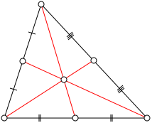
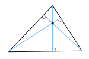
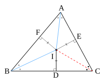
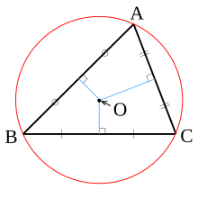

# Chuyên đề 15 – Các đường đồng quy trong tam giác

> **Trạng thái:** Đã kiểm định nội dung học thuật; cấu trúc Roadmap chuẩn 11 mục.
>
> **Lớp trọng tâm:** 7
> **Mạch kiến thức:** Hình học
> **Mức ưu tiên:** ⭐⭐⭐⭐

---

## 🧭 1. Bản đồ kiến thức

```text
Các đường đặc biệt trong tam giác
│
├── Trung tuyến
│   └── Ba trung tuyến đồng quy tại trọng tâm G
│       └── G chia trung tuyến theo tỉ số 2 : 1
│
├── Đường cao
│   └── Ba đường cao đồng quy tại trực tâm H
│
├── Phân giác
│   └── Ba phân giác trong đồng quy tại tâm nội tiếp I
│       └── I cách đều ba cạnh
│
└── Trung trực
    └── Ba trung trực đồng quy tại tâm ngoại tiếp O
        └── O cách đều ba đỉnh
```

Mạch tư duy trọng tâm của chuyên đề:

**nhận dạng đường đặc biệt → xác định tâm tương ứng → dùng tính chất đặc trưng → suy ra độ dài, khoảng cách hoặc quan hệ hình học.**

---

## Minh họa trực quan

### 1. Trung tuyến và trọng tâm

<p align="center">
  
</p>

> Ba đường trung tuyến của một tam giác đồng quy tại một điểm gọi là **trọng tâm**, thường ký hiệu là `G`.

Một tính chất rất quan trọng:

> Trọng tâm chia mỗi đường trung tuyến theo tỉ số `2 : 1`, tính từ đỉnh.

Ví dụ, nếu `AM` là trung tuyến và `G` là trọng tâm thì:

`AG = 2GM`

---

### 2. Đường cao và trực tâm

<p align="center">
  
</p>

> Ba đường cao của một tam giác đồng quy tại một điểm gọi là **trực tâm**, thường ký hiệu là `H`.

Vị trí của trực tâm phụ thuộc vào loại tam giác:

- tam giác nhọn: `H` nằm bên trong tam giác;
- tam giác vuông: `H` chính là đỉnh góc vuông;
- tam giác tù: `H` nằm bên ngoài tam giác.

---

### 3. Phân giác và tâm nội tiếp

<p align="center">
  
</p>

> Ba đường phân giác trong của tam giác đồng quy tại một điểm gọi là **tâm nội tiếp**, thường ký hiệu là `I`.

Điểm `I` cách đều ba cạnh của tam giác.

Vì vậy, `I` là tâm của đường tròn tiếp xúc với cả ba cạnh của tam giác.

---

### 4. Trung trực và tâm ngoại tiếp

<p align="center">
  
</p>

> Ba đường trung trực của ba cạnh tam giác đồng quy tại một điểm gọi là **tâm ngoại tiếp**, thường ký hiệu là `O`.

Điểm `O` cách đều ba đỉnh:

`OA = OB = OC`

Do đó, `O` là tâm của đường tròn đi qua ba đỉnh của tam giác.

---

### Bảng phân biệt bốn tâm quan trọng

| Loại đường | Điểm đồng quy | Ký hiệu | Tính chất nổi bật |
|---|---|---|---|
| Trung tuyến | Trọng tâm | `G` | Chia trung tuyến theo tỉ số `2 : 1` |
| Đường cao | Trực tâm | `H` | Giao điểm của ba đường cao |
| Phân giác | Tâm nội tiếp | `I` | Cách đều ba cạnh |
| Trung trực | Tâm ngoại tiếp | `O` | Cách đều ba đỉnh |

### Mẹo ghi nhớ

- `G` → trọng tâm → trung tuyến.
- `H` → trực tâm → đường cao.
- `I` → nội tiếp → đường tròn nằm trong tam giác.
- `O` → ngoại tiếp → đường tròn đi qua ba đỉnh.

---

## 🎯 2. Mục tiêu cần đạt

Sau khi hoàn thành chuyên đề, học sinh cần:

- [ ] Phân biệt được trung tuyến, đường cao, phân giác và trung trực.
- [ ] Nhận biết đúng trọng tâm `G`, trực tâm `H`, tâm nội tiếp `I`, tâm ngoại tiếp `O`.
- [ ] Vận dụng được tính chất `AG = 2GM` của trọng tâm.
- [ ] Dùng được tính chất cách đều của tâm nội tiếp và tâm ngoại tiếp.
- [ ] Xác định được vị trí trực tâm, tâm ngoại tiếp trong các loại tam giác cơ bản.
- [ ] Giải được các bài chứng minh đồng quy và bài tính độ dài liên quan.
- [ ] Kết nối chuyên đề với tam giác đồng dạng và đường tròn.

---

## 📖 3. Kiến thức cốt lõi

### 3.1. Trung tuyến và trọng tâm

**Trung tuyến** của tam giác là đoạn thẳng nối một đỉnh với trung điểm của cạnh đối diện.

Ba đường trung tuyến của tam giác đồng quy tại **trọng tâm** `G`.

Nếu `AM` là trung tuyến của tam giác `ABC`, `G ∈ AM` là trọng tâm thì:

`AG = 2GM`

hay:

`AG = 2/3 AM`

`GM = 1/3 AM`

### 3.2. Đường cao và trực tâm

**Đường cao** đi qua một đỉnh và vuông góc với cạnh đối diện hoặc đường thẳng chứa cạnh đối diện.

Ba đường cao đồng quy tại **trực tâm** `H`.

Vị trí của `H`:
- tam giác nhọn: nằm trong tam giác;
- tam giác vuông: tại đỉnh góc vuông;
- tam giác tù: nằm ngoài tam giác.

### 3.3. Phân giác và tâm nội tiếp

Ba đường phân giác trong đồng quy tại **tâm nội tiếp** `I`.

`d(I, AB) = d(I, BC) = d(I, CA)`

Do đó `I` là tâm đường tròn nội tiếp tam giác.

### 3.4. Trung trực và tâm ngoại tiếp

Ba đường trung trực của ba cạnh tam giác đồng quy tại **tâm ngoại tiếp** `O`.

`OA = OB = OC`

Do đó `O` là tâm đường tròn ngoại tiếp tam giác `ABC`.

Vị trí của `O`:
- tam giác nhọn: trong tam giác;
- tam giác vuông: trung điểm cạnh huyền;
- tam giác tù: ngoài tam giác.

### 3.5. Cách chọn đúng tính chất

| Nếu đề cho / cần chứng minh | Nên nghĩ tới |
|---|---|
| Trung điểm một cạnh | Trung tuyến |
| Tỉ số `2 : 1` trên trung tuyến | Trọng tâm |
| Vuông góc từ đỉnh | Đường cao / trực tâm |
| Điểm nằm trong tam giác và cách đều ba cạnh | Tâm nội tiếp |
| Cách đều các đỉnh | Tâm ngoại tiếp |
| Điểm nằm trên phân giác | Khoảng cách tới hai cạnh của góc |
| Điểm nằm trên trung trực | Cách đều hai đầu đoạn thẳng |

---

## 🔗 4. Kiến thức liên quan

- **Kiến thức nên ôn trước:** [14 – Tam giác](../14-tam-giac/index.md)
- **Liên hệ mạnh:** đường trung trực, phân giác, trung điểm, vuông góc.
- **Chuyên đề sử dụng tiếp:** [17 – Thales và tam giác đồng dạng](../17-thales-dong-dang/index.md), [19 – Đường tròn](../19-duong-tron/index.md).

---

## 🧩 5. Các dạng bài cần nắm vững

### Dạng 1. Nhận dạng đường đặc biệt và tâm

### Dạng 2. Tính độ dài bằng tính chất trọng tâm

Ví dụ: biết `AM = 12 cm`, `G` là trọng tâm:

`AG = 8 cm`, `GM = 4 cm`.

### Dạng 3. Chứng minh một điểm là tâm nội tiếp

Có thể chứng minh điểm đó là giao của hai đường phân giác trong. Nếu dùng tính chất cách đều, cần biết điểm **nằm trong tam giác** và cách đều ba cạnh; khi đó điểm nằm trên các phân giác trong và là tâm nội tiếp.

### Dạng 4. Chứng minh một điểm là tâm ngoại tiếp

Chứng minh `OA = OB = OC` hoặc điểm nằm trên hai đường trung trực.

### Dạng 5. Xác định vị trí trực tâm / tâm ngoại tiếp

Dựa vào loại tam giác: nhọn, vuông, tù.

### Dạng 6. Bài tổng hợp nhiều đường đặc biệt

Kết hợp trung điểm, vuông góc, phân giác, đường tròn hoặc đồng dạng.

---

## 🚀 6. Dạng bài thi vào lớp 10

Trong Roadmap ôn thi vào lớp 10, chuyên đề này được xem là **kiến thức nền của nhiều bài hình học tổng hợp**.

Các kỹ năng cần chắc:
1. Nhận ra trung điểm → trung tuyến.
2. Nhận ra vuông góc → đường cao.
3. Dùng tính chất cách đều để nhận biết tâm nội tiếp / ngoại tiếp.
4. Kết hợp tâm ngoại tiếp với đường tròn.
5. Kết hợp đường đặc biệt với tam giác đồng dạng.

Mức ưu tiên ôn thi: **⭐⭐⭐⭐**.

---

## ⚠️ 7. Lỗi sai thường gặp

| Lỗi sai | Cách tránh |
|---|---|
| Nhầm trung tuyến với trung trực | Trung tuyến đi từ **đỉnh**; trung trực không nhất thiết đi qua đỉnh |
| Nhầm đường cao với trung trực | Đường cao đi qua **đỉnh** và vuông góc cạnh đối |
| Viết sai tỉ số trọng tâm | Từ đỉnh đến trọng tâm dài gấp đôi từ trọng tâm đến trung điểm |
| Cho rằng trực tâm luôn nằm trong tam giác | Kiểm tra tam giác nhọn / vuông / tù |
| Cho rằng tâm ngoại tiếp luôn nằm trong tam giác | Tam giác tù có tâm ngoại tiếp ở ngoài |
| Nhầm `I` cách đều đỉnh | `I` cách đều **cạnh**; `O` cách đều **đỉnh** |

---

## 📝 8. Luyện tập

### Mức 1 – Nhận biết

1. Trong tam giác `ABC`, `M` là trung điểm `BC`. `AM` là đường gì?
2. Ba đường cao đồng quy tại điểm nào?
3. Điểm nào cách đều ba cạnh của tam giác?
4. Điểm nào cách đều ba đỉnh của tam giác?

### Mức 2 – Thông hiểu

5. `AM = 15 cm`, `G` là trọng tâm. Tính `AG`, `GM`.
6. Tam giác vuông tại `A`. Xác định trực tâm.
7. Tam giác vuông tại `A`, cạnh huyền `BC`. Tâm ngoại tiếp nằm ở đâu?

### Mức 3 – Vận dụng

8. `I` nằm trong tam giác và nằm trên phân giác trong của góc `A` và góc `B`. Chứng minh `I` là tâm nội tiếp.
9. `O` thỏa mãn `OA = OB = OC`. Giải thích vì sao `O` là tâm ngoại tiếp.

### Mức 4 – Tổng hợp

10. Hai trung tuyến `AM`, `BN` cắt nhau tại `G`. Biết `AG = 8 cm`. Tính `AM`.
11. Một điểm `P` nằm trong tam giác và cách đều ba cạnh. Xác định vai trò của `P` và đường tròn tương ứng.

---

## ✅ 9. Tự kiểm tra

Hãy tự trả lời không nhìn tài liệu:

1. Trung tuyến khác trung trực ở điểm nào?
2. Trọng tâm chia trung tuyến theo tỉ số nào?
3. Trực tâm của tam giác vuông nằm ở đâu?
4. Tâm nội tiếp cách đều những đối tượng nào?
5. Tâm ngoại tiếp cách đều những đối tượng nào?
6. Tâm ngoại tiếp tam giác vuông nằm ở đâu?
7. Điểm cách đều ba cạnh gợi đến tâm nào?
8. Điểm cách đều ba đỉnh gợi đến tâm nào?

**Tiêu chí đạt:** đúng ít nhất `7/8` câu và giải được bài trọng tâm ở phần luyện tập.

---

## 🔄 10. Liên kết Roadmap

- **← Trước:** [14 – Tam giác](../14-tam-giac/index.md)
- **→ Tiếp theo:** [16 – Tứ giác và các hình đặc biệt](../16-tu-giac/index.md)
- **→ Liên hệ:** [17 – Thales và tam giác đồng dạng](../17-thales-dong-dang/index.md)
- **→ Liên hệ:** [19 – Đường tròn](../19-duong-tron/index.md)

- **✏️ Luyện tập:** [Bài tập Chuyên đề 15](bai-tap.md)
- **✅ Tự kiểm tra:** [Tự kiểm tra Chuyên đề 15](tu-kiem-tra.md)

Xem toàn bộ hệ thống tại [Blueprint 25 chuyên đề](../../roadmap/blueprint-25-chuyen-de.md).

---

## 🏁 11. Điều kiện hoàn thành

Chuyên đề được xem là hoàn thành khi học sinh:

- [ ] Phân biệt đúng bốn loại đường đặc biệt.
- [ ] Nhớ đúng bốn tâm `G, H, I, O`.
- [ ] Dùng thành thạo tỉ số `2 : 1` của trọng tâm.
- [ ] Vận dụng được tính chất cách đều của `I` và `O`.
- [ ] Xác định đúng vị trí `H`, `O` theo loại tam giác.
- [ ] Đạt tối thiểu **7/10** ở bài Tự kiểm tra, chữa xong các câu sai trước khi chuyển sang Chuyên đề 16.
- [ ] Giải được tối thiểu một bài tổng hợp có sử dụng tâm tam giác.
