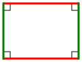
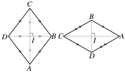
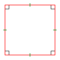

# Chuyên đề 16 – Tứ giác và các hình đặc biệt

> **Trạng thái:** Đã kiểm định nội dung học thuật; cấu trúc Roadmap chuẩn 11 mục.
>
> **Lớp trọng tâm:** 8
> **Mạch kiến thức:** Hình học
> **Mức ưu tiên:** ⭐⭐⭐⭐⭐

---

## 🧭 1. Bản đồ kiến thức

```text
TỨ GIÁC
│
├── Hình thang
│   ├── Một cặp cạnh đối song song
│   └── Hình thang cân
│
├── Hình bình hành
│   ├── Hai cặp cạnh đối song song
│   ├── Cạnh đối bằng nhau
│   └── Hai đường chéo cắt nhau tại trung điểm
│
├── Hình chữ nhật
│   ├── Hình bình hành có 4 góc vuông
│   └── Hai đường chéo bằng nhau
│
├── Hình thoi
│   ├── Hình bình hành có 4 cạnh bằng nhau
│   └── Hai đường chéo vuông góc, phân giác góc
│
└── Hình vuông
    └── Vừa là hình chữ nhật, vừa là hình thoi
```

Mạch tư duy trọng tâm:

**nhận dạng dấu hiệu → gọi đúng tên hình → dùng tính chất → suy ra cạnh, góc, đường chéo hoặc chứng minh hình đặc biệt.**

---

## Minh họa trực quan

### 1. Hình thang

<p align="center">
  
</p>

> Hình thang là tứ giác có **một cặp cạnh đối song song**.

Hai cạnh song song được gọi là **hai đáy**; hai cạnh còn lại là **hai cạnh bên**.

> Theo cách hiểu “có một cặp cạnh đối song song”, điều kiện này không loại trừ trường hợp tứ giác còn có thêm một cặp cạnh đối song song. Trong Roadmap, hình bình hành vẫn được tách thành mục riêng để học các tính chất và dấu hiệu đặc trưng.

---

### 2. Hình bình hành

<p align="center">
  
</p>

> Hình bình hành là tứ giác có **hai cặp cạnh đối song song**.

Các tính chất quan trọng:

- các cạnh đối bằng nhau;
- các góc đối bằng nhau;
- hai đường chéo cắt nhau tại trung điểm của mỗi đường.

---

### 3. Hình chữ nhật

<p align="center">
  
</p>

> Hình chữ nhật là hình bình hành có **bốn góc vuông**.

Ngoài các tính chất của hình bình hành, hình chữ nhật còn có:

- hai đường chéo bằng nhau;
- hai đường chéo cắt nhau tại trung điểm của mỗi đường.

---

### 4. Hình thoi

<p align="center">
  
</p>

> Hình thoi là hình bình hành có **bốn cạnh bằng nhau**.

Các tính chất nổi bật:

- hai đường chéo vuông góc với nhau;
- mỗi đường chéo là phân giác của các góc mà nó đi qua;
- hai đường chéo cắt nhau tại trung điểm của mỗi đường.

---

### 5. Hình vuông

<p align="center">
  
</p>

> Hình vuông vừa là **hình chữ nhật**, vừa là **hình thoi**.

Vì vậy hình vuông có đồng thời:

- bốn cạnh bằng nhau;
- bốn góc vuông;
- hai đường chéo bằng nhau;
- hai đường chéo vuông góc;
- hai đường chéo cắt nhau tại trung điểm;
- hai đường chéo là các đường phân giác của góc.

---

### Quan hệ giữa các tứ giác đặc biệt

Theo quy ước của Roadmap, **hình thang là tứ giác có ít nhất một cặp cạnh đối song song**. Vì vậy hình bình hành là một trường hợp đặc biệt của hình thang.

```text
TỨ GIÁC
   |
   v
HÌNH THANG
   |
   v
HÌNH BÌNH HÀNH
   |          \
   v           v
HÌNH CHỮ NHẬT  HÌNH THOI
        \       /
         \     /
          v   v
        HÌNH VUÔNG
```

Điểm cần nhớ:

- Mọi hình bình hành đều là hình thang theo định nghĩa “ít nhất một cặp cạnh đối song song”.
- Một hình vuông luôn là hình chữ nhật và hình thoi.
- Một hình chữ nhật hoặc hình thoi chưa chắc là hình vuông.

---

### Bảng so sánh nhanh

| Hình | Cạnh đối song song | Cạnh bằng nhau | Góc vuông | Đường chéo |
|---|---|---|---|---|
| Hình thang | Ít nhất 1 cặp | Không nhất thiết | Không nhất thiết | Không có tính chất chung đặc biệt |
| Hình bình hành | 2 cặp | Các cạnh đối bằng nhau | Không nhất thiết | Cắt nhau tại trung điểm |
| Hình chữ nhật | 2 cặp | Các cạnh đối bằng nhau | 4 góc | Bằng nhau và cắt nhau tại trung điểm |
| Hình thoi | 2 cặp | 4 cạnh bằng nhau | Không nhất thiết | Vuông góc, cắt nhau tại trung điểm; mỗi đường chéo phân giác hai góc đối |
| Hình vuông | 2 cặp | 4 cạnh bằng nhau | 4 góc | Bằng nhau, vuông góc, cắt nhau tại trung điểm |

---

### Mẹo nhận dạng

- Có **ít nhất một cặp cạnh đối song song** → nghĩ đến hình thang.
- Có **hai cặp cạnh đối song song** → nghĩ đến hình bình hành.
- Hình bình hành + **4 góc vuông** → hình chữ nhật.
- Hình bình hành + **4 cạnh bằng nhau** → hình thoi.
- Có cả **4 góc vuông + 4 cạnh bằng nhau** → hình vuông.

---

## 🎯 2. Mục tiêu cần đạt

Sau khi hoàn thành chuyên đề, học sinh cần:

- [ ] Phân biệt được hình thang, hình bình hành, hình chữ nhật, hình thoi, hình vuông.
- [ ] Nắm được các tính chất về cạnh, góc và đường chéo của từng hình.
- [ ] Nhận biết được các dấu hiệu để chứng minh một tứ giác là hình đặc biệt.
- [ ] Vận dụng được tính chất đường chéo để tính độ dài và chứng minh.
- [ ] Biết dùng quan hệ bao hàm giữa các hình để suy luận nhanh.
- [ ] Giải được các bài chứng minh tứ giác đặc biệt trong hình học tổng hợp.

---

## 📖 3. Kiến thức cốt lõi

### 3.1. Tổng các góc trong một tứ giác

Tổng bốn góc trong mọi tứ giác bằng:

`360°`

Nếu biết ba góc, có thể tính góc còn lại bằng:

`góc còn lại = 360° - tổng ba góc đã biết`

### 3.2. Hình thang

Hình thang là tứ giác có một cặp cạnh đối song song.

Nếu `AB ∥ CD`, thì `ABCD` là hình thang.

**Hình thang cân** có hai góc kề một đáy bằng nhau.

Tính chất quan trọng của hình thang cân:
- hai cạnh bên bằng nhau;
- hai đường chéo bằng nhau.

### 3.3. Hình bình hành

Dấu hiệu nhận biết thường dùng:
- hai cặp cạnh đối song song;
- hai cặp cạnh đối bằng nhau;
- một cặp cạnh đối vừa song song vừa bằng nhau;
- hai đường chéo cắt nhau tại trung điểm của mỗi đường.

Tính chất:
- cạnh đối bằng nhau;
- góc đối bằng nhau;
- hai góc kề bù nhau;
- hai đường chéo cắt nhau tại trung điểm.

### 3.4. Hình chữ nhật

Hình chữ nhật là hình bình hành có bốn góc vuông.

Dấu hiệu nhận biết:
- tứ giác có ba góc vuông;
- hình bình hành có một góc vuông;
- hình bình hành có hai đường chéo bằng nhau.

Tính chất đặc trưng:
- hai đường chéo bằng nhau;
- hai đường chéo cắt nhau tại trung điểm.

### 3.5. Hình thoi

Hình thoi là hình bình hành có bốn cạnh bằng nhau.

Dấu hiệu nhận biết:
- tứ giác có bốn cạnh bằng nhau;
- hình bình hành có hai cạnh kề bằng nhau;
- hình bình hành có hai đường chéo vuông góc;
- hình bình hành có một đường chéo là phân giác một góc.

Tính chất:
- hai đường chéo vuông góc;
- mỗi đường chéo là phân giác của hai góc đối mà nó đi qua;
- hai đường chéo cắt nhau tại trung điểm.

### 3.6. Hình vuông

Hình vuông vừa là hình chữ nhật vừa là hình thoi.

Dấu hiệu nhận biết:
- hình chữ nhật có hai cạnh kề bằng nhau;
- hình chữ nhật có hai đường chéo vuông góc;
- hình thoi có một góc vuông;
- hình thoi có hai đường chéo bằng nhau.

### 3.7. Bảng chọn tính chất nhanh

| Dấu hiệu | Hình nên nghĩ tới |
|---|---|
| Có ít nhất một cặp cạnh đối song song | Hình thang |
| 2 cặp cạnh đối song song | Hình bình hành |
| Hình bình hành + góc vuông | Hình chữ nhật |
| Hình bình hành + hai cạnh kề bằng nhau | Hình thoi |
| Hình chữ nhật + hai cạnh kề bằng nhau | Hình vuông |
| Hai đường chéo cắt nhau tại trung điểm | Hình bình hành |
| Hai đường chéo bằng nhau trong hình bình hành | Hình chữ nhật |
| Hai đường chéo vuông góc trong hình bình hành | Hình thoi |

---

## 🔗 4. Kiến thức liên quan

- **Kiến thức nên ôn trước:** [13 – Góc và quan hệ giữa các đường thẳng](../13-goc-va-duong-thang/index.md), [14 – Tam giác](../14-tam-giac/index.md)
- **Liên hệ mạnh:** song song, vuông góc, trung điểm, phân giác.
- **Chuyên đề sử dụng tiếp:** [17 – Thales và tam giác đồng dạng](../17-thales-dong-dang/index.md), [20 – Hình học tổng hợp](../20-hinh-hoc-tong-hop/index.md)

---

## 🧩 5. Các dạng bài cần nắm vững

### Dạng 1. Tính góc trong tứ giác

Dùng tổng bốn góc bằng `360°`.

### Dạng 2. Chứng minh hình bình hành

Ưu tiên chọn dấu hiệu phù hợp nhất với giả thiết: song song, bằng nhau hoặc đường chéo.

### Dạng 3. Chứng minh hình chữ nhật

Thường đi theo hướng:
- chứng minh hình bình hành;
- sau đó chứng minh có một góc vuông hoặc hai đường chéo bằng nhau.

### Dạng 4. Chứng minh hình thoi

Thường chứng minh:
- hình bình hành có hai cạnh kề bằng nhau;
- hoặc đường chéo vuông góc.

### Dạng 5. Chứng minh hình vuông

Thường chứng minh một hình vừa là hình chữ nhật vừa là hình thoi.

### Dạng 6. Bài toán đường chéo

Khai thác:
- trung điểm;
- bằng nhau;
- vuông góc;
- phân giác.

### Dạng 7. Bài tổng hợp

Kết hợp trung điểm, song song, tam giác bằng nhau, Thales hoặc đồng dạng để chứng minh tứ giác đặc biệt.

---

## 🚀 6. Dạng bài thi vào lớp 10

Trong Roadmap ôn thi vào lớp 10, các tính chất và dấu hiệu của tứ giác đặc biệt được xem là **công cụ nền cho nhiều bài hình học tổng hợp**, thường được dùng như một bước trung gian trong chuỗi chứng minh.

Các kỹ năng cần chắc:
1. Chứng minh hình bình hành từ trung điểm hoặc song song.
2. Nâng cấp hình bình hành thành hình chữ nhật / hình thoi / hình vuông.
3. Khai thác tính chất đường chéo để suy ra trung điểm, bằng nhau, vuông góc.
4. Kết hợp với Thales và tam giác đồng dạng.

Mức ưu tiên ôn thi: **⭐⭐⭐⭐⭐**.

---

## ⚠️ 7. Lỗi sai thường gặp

| Lỗi sai | Cách tránh |
|---|---|
| Thấy 1 cặp cạnh song song rồi kết luận hình bình hành | Hình bình hành cần đủ dấu hiệu |
| Nhầm đường chéo hình chữ nhật luôn vuông góc | Hình chữ nhật chỉ có đường chéo **bằng nhau**, không nhất thiết vuông góc |
| Nhầm đường chéo hình thoi luôn bằng nhau | Hình thoi có đường chéo **vuông góc**, không nhất thiết bằng nhau |
| Chứng minh hình vuông quá dài | Tìm cách chứng minh vừa là chữ nhật vừa là thoi |
| Dùng tính chất trước khi chứng minh loại hình | Phải xác định hình trước rồi mới dùng tính chất |
| Quên tổng góc tứ giác là `360°` | Ghi công thức ngay khi bài yêu cầu tính góc |

---

## 📝 8. Luyện tập

### Mức 1 – Nhận biết

1. Tổng bốn góc của một tứ giác bằng bao nhiêu?
2. Hình bình hành có tính chất gì về hai đường chéo?
3. Hình chữ nhật có tính chất gì thêm về hai đường chéo?
4. Hình thoi có tính chất gì thêm về hai đường chéo?

### Mức 2 – Thông hiểu

5. Tứ giác có ba góc lần lượt `80°`, `100°`, `90°`. Tính góc còn lại.
6. Hình bình hành `ABCD` có `AB = 6 cm`, `BC = 4 cm`. Tính `CD`, `AD`.
7. Hình chữ nhật có hai đường chéo cắt nhau tại `O`, `AC = 10 cm`. Tính `AO`.

### Mức 3 – Vận dụng

8. Chứng minh một hình bình hành có một góc vuông là hình chữ nhật.
9. Chứng minh một hình bình hành có hai cạnh kề bằng nhau là hình thoi.
10. Chứng minh hình chữ nhật có hai cạnh kề bằng nhau là hình vuông.

### Mức 4 – Tổng hợp

11. Cho tứ giác có hai đường chéo cắt nhau tại trung điểm của mỗi đường và bằng nhau. Chứng minh đó là hình chữ nhật.
12. Cho hình bình hành có hai đường chéo vừa bằng nhau vừa vuông góc. Chứng minh đó là hình vuông.

---

## ✅ 9. Tự kiểm tra

Hãy tự trả lời không nhìn tài liệu:

1. Tổng các góc trong tứ giác bằng bao nhiêu?
2. Nêu hai dấu hiệu nhận biết hình bình hành.
3. Hình chữ nhật có đường chéo như thế nào?
4. Hình thoi có đường chéo như thế nào?
5. Một hình bình hành có một góc vuông là hình gì?
6. Một hình bình hành có hai cạnh kề bằng nhau là hình gì?
7. Một hình vừa là hình chữ nhật vừa là hình thoi là hình gì?
8. Hai đường chéo cắt nhau tại trung điểm gợi đến hình gì?

**Tiêu chí đạt:** đúng ít nhất `7/8` câu và giải được một bài chứng minh hình đặc biệt.

---

## 🔄 10. Liên kết Roadmap

- **← Trước:** [15 – Các đường đồng quy trong tam giác](../15-duong-dong-quy/index.md)

- **← Kiến thức nền:** [13 – Góc và đường thẳng](../13-goc-va-duong-thang/index.md), [14 – Tam giác](../14-tam-giac/index.md)
- **→ Tiếp theo:** [17 – Thales và tam giác đồng dạng](../17-thales-dong-dang/index.md)
- **→ Liên hệ:** [20 – Hình học tổng hợp](../20-hinh-hoc-tong-hop/index.md)

- **✏️ Luyện tập:** [Bài tập Chuyên đề 16](bai-tap.md)
- **✅ Tự kiểm tra:** [Tự kiểm tra Chuyên đề 16](tu-kiem-tra.md)

Xem toàn bộ hệ thống tại [Blueprint 25 chuyên đề](../../roadmap/blueprint-25-chuyen-de.md).

---

## 🏁 11. Điều kiện hoàn thành

Chuyên đề được xem là hoàn thành khi học sinh:

- [ ] Phân biệt đúng 5 loại tứ giác đặc biệt.
- [ ] Nhớ các tính chất cạnh, góc, đường chéo.
- [ ] Thuộc các dấu hiệu nhận biết quan trọng.
- [ ] Chứng minh được hình bình hành, chữ nhật, thoi, vuông.
- [ ] Không nhầm tính chất đường chéo giữa hình chữ nhật và hình thoi.
- [ ] Đạt tối thiểu **7/10** ở bài Tự kiểm tra và chữa xong các câu sai trước khi chuyển sang Chuyên đề 17.
- [ ] Giải được ít nhất một bài tổng hợp chứng minh tứ giác đặc biệt.
