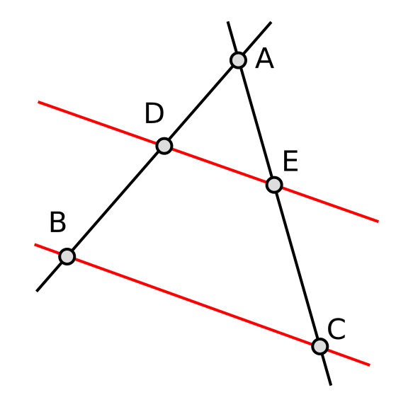
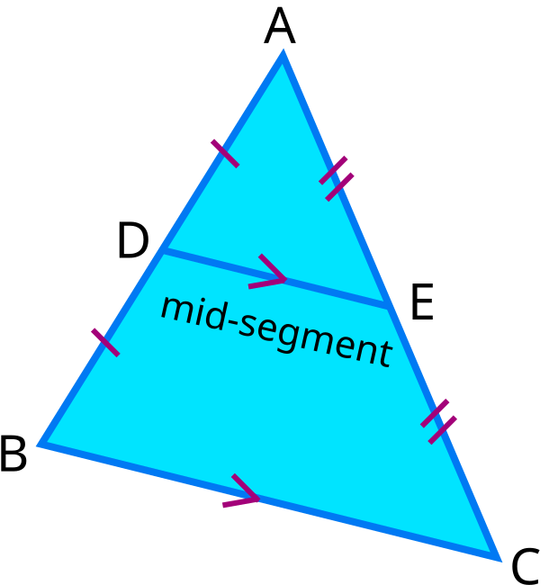
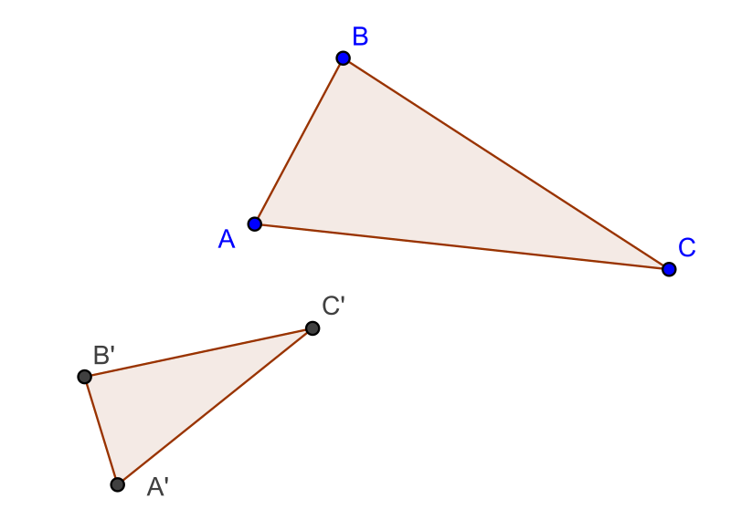

# Chuyên đề 17 – Định lý Thales và tam giác đồng dạng

> **Trạng thái:** Nội dung cốt lõi đã hoàn thiện theo cấu trúc Roadmap.
>
> **Lớp trọng tâm:** 8  
> **Mạch kiến thức:** Hình học  
> **Mức ưu tiên:** ⭐⭐⭐⭐⭐

---

## 🧭 1. Bản đồ kiến thức

```text
THALES & TAM GIÁC ĐỒNG DẠNG
│
├── Định lý Thales thuận
│   └── Đường song song → các đoạn tương ứng tỉ lệ
│
├── Định lý Thales đảo
│   └── Các đoạn tương ứng tỉ lệ → suy ra song song
│
├── Đường trung bình tam giác
│   ├── Song song với cạnh thứ ba
│   └── Bằng một nửa cạnh thứ ba
│
└── Tam giác đồng dạng
    ├── g-g
    ├── c-g-c
    └── c-c-c
```

Mạch tư duy trọng tâm:

**song song ↔ tỉ lệ → đồng dạng → suy ra góc, độ dài và các hệ thức hình học.**

---

## Minh họa trực quan

### 1. Định lý Thales trong tam giác

<p align="center">
  
</p>

> Nếu một đường thẳng song song với một cạnh của tam giác và cắt hai cạnh còn lại, thì nó tạo ra các đoạn thẳng tương ứng tỉ lệ.

Với `DE ∥ BC` trong tam giác `ABC`:

`AD/AB = AE/AC = DE/BC`

Ngoài ra:

`AD/DB = AE/EC`

---

### 2. Đường trung bình trong tam giác

<p align="center">
  
</p>

> Đường trung bình của tam giác là đoạn thẳng nối trung điểm của hai cạnh.

Nếu `M`, `N` lần lượt là trung điểm của `AB`, `AC` thì:

`MN ∥ BC`

và:

`MN = 1/2 BC`

Đây có thể xem là một hệ quả rất quan trọng của định lý Thales.

---

### 3. Tam giác đồng dạng

<p align="center">
  
</p>

> Hai tam giác đồng dạng có các góc tương ứng bằng nhau và các cạnh tương ứng tỉ lệ.

Nếu:

`△ABC ∼ △A'B'C'`

thì:

`AB/A'B' = BC/B'C' = AC/A'C'`

và:

`∠A = ∠A'`, `∠B = ∠B'`, `∠C = ∠C'`

---

### Ba trường hợp đồng dạng cần nhớ

| Trường hợp | Điều kiện nhận biết | Viết tắt |
|---|---|---|
| Góc – góc | Hai góc của tam giác này bằng hai góc tương ứng của tam giác kia | `g-g` |
| Cạnh – góc – cạnh | Hai cặp cạnh tương ứng tỉ lệ và góc xen giữa bằng nhau | `c-g-c` |
| Cạnh – cạnh – cạnh | Ba cặp cạnh tương ứng tỉ lệ | `c-c-c` |

---

### Mối liên hệ giữa Thales và đồng dạng

Một cách nhìn rất quan trọng:

```text
DE ∥ BC
   ↓
Các góc tương ứng bằng nhau
   ↓
△ADE ∼ △ABC
   ↓
Các cạnh tương ứng tỉ lệ
   ↓
Định lý Thales
```

Vì vậy, khi gặp bài toán có **đường thẳng song song trong tam giác**, nên nghĩ ngay đến hai hướng:

- dùng định lý Thales;
- chứng minh hai tam giác đồng dạng.

---

### Mẹo giải bài

- Thấy `∥` → nghĩ đến **Thales** hoặc **góc bằng nhau**.
- Thấy nhiều tỉ số cạnh → nghĩ đến **tam giác đồng dạng**.
- Thấy trung điểm hai cạnh → nghĩ đến **đường trung bình**.
- Khi viết đồng dạng, phải ghi **đúng thứ tự các đỉnh tương ứng**.

Ví dụ:

`△ABC ∼ △DEF`

thì phải hiểu:

`A ↔ D`, `B ↔ E`, `C ↔ F`.

---

## 🎯 2. Mục tiêu cần đạt

Sau khi hoàn thành chuyên đề, học sinh cần:

- [ ] Phát biểu và vận dụng được định lý Thales thuận và đảo.
- [ ] Nhận biết và sử dụng được đường trung bình trong tam giác.
- [ ] Nắm chắc ba trường hợp đồng dạng `g-g`, `c-g-c`, `c-c-c`.
- [ ] Viết đúng thứ tự các đỉnh tương ứng khi lập hai tam giác đồng dạng.
- [ ] Dùng đồng dạng để tính độ dài, chứng minh tỉ số và chứng minh hệ thức.
- [ ] Biết chuyển đổi linh hoạt giữa song song, góc bằng nhau và tỉ lệ cạnh.

---

## 📖 3. Kiến thức cốt lõi

### 3.1. Định lý Thales thuận

Trong tam giác `ABC`, nếu `D ∈ AB`, `E ∈ AC` và `DE ∥ BC` thì:

`AD/AB = AE/AC = DE/BC`

và:

`AD/DB = AE/EC`

Từ đây có thể tính một đoạn chưa biết khi biết các đoạn còn lại.

### 3.2. Định lý Thales đảo

Nếu `D ∈ AB`, `E ∈ AC` và các đoạn tương ứng tỉ lệ phù hợp, ví dụ:

`AD/DB = AE/EC`

thì có thể suy ra:

`DE ∥ BC`

Đây là công cụ rất mạnh để **chứng minh hai đường thẳng song song**.

### 3.3. Đường trung bình của tam giác

Nếu `M`, `N` lần lượt là trung điểm của `AB`, `AC` thì:

`MN ∥ BC`

và:

`MN = 1/2 BC`

Định lý đảo thường dùng:
- một đường đi qua trung điểm của một cạnh và song song với cạnh thứ hai thì đi qua trung điểm cạnh thứ ba.

### 3.4. Tam giác đồng dạng

Nếu `△ABC ∼ △DEF` thì:

`∠A = ∠D`, `∠B = ∠E`, `∠C = ∠F`

và:

`AB/DE = BC/EF = AC/DF`

Điểm rất quan trọng là thứ tự ký hiệu:

`△ABC ∼ △DEF`

nghĩa là:

`A ↔ D`, `B ↔ E`, `C ↔ F`.

### 3.5. Ba trường hợp đồng dạng

**Góc – góc (`g-g`)**

Hai góc tương ứng bằng nhau.

**Cạnh – góc – cạnh (`c-g-c`)**

Hai cặp cạnh tương ứng tỉ lệ và góc xen giữa bằng nhau.

**Cạnh – cạnh – cạnh (`c-c-c`)**

Ba cặp cạnh tương ứng tỉ lệ.

### 3.6. Quy trình chọn công cụ

| Dấu hiệu | Nên nghĩ tới |
|---|---|
| Có đường song song trong tam giác | Thales hoặc đồng dạng |
| Có nhiều tỉ số đoạn thẳng | Thales đảo hoặc đồng dạng |
| Có hai góc bằng nhau | Đồng dạng `g-g` |
| Có trung điểm hai cạnh | Đường trung bình |
| Cần chứng minh song song | Thales đảo |
| Cần tính độ dài | Tỉ lệ từ Thales / đồng dạng |

---

## 🔗 4. Kiến thức liên quan

- **Kiến thức nên ôn trước:** [14 – Tam giác](../14-tam-giac/index.md), [16 – Tứ giác](../16-tu-giac/index.md)
- **Liên hệ mạnh:** góc so le trong, đồng vị, song song, trung điểm.
- **Chuyên đề sử dụng tiếp:** [18 – Hệ thức lượng](../18-he-thuc-luong/index.md), [19 – Đường tròn](../19-duong-tron/index.md), [20 – Hình học tổng hợp](../20-hinh-hoc-tong-hop/index.md)

---

## 🧩 5. Các dạng bài cần nắm vững

### Dạng 1. Tính độ dài bằng định lý Thales

Lập đúng tỉ lệ giữa các đoạn tương ứng rồi giải phương trình.

### Dạng 2. Chứng minh hai đường thẳng song song

Dùng Thales đảo sau khi chứng minh được các tỉ số cần thiết.

### Dạng 3. Đường trung bình

Khai thác trung điểm để suy ra song song và độ dài bằng nửa cạnh thứ ba.

### Dạng 4. Chứng minh hai tam giác đồng dạng

Chọn một trong ba tiêu chuẩn `g-g`, `c-g-c`, `c-c-c`.

### Dạng 5. Tính độ dài bằng đồng dạng

Sau khi có đồng dạng, viết đúng tỉ số các cạnh tương ứng.

### Dạng 6. Chứng minh hệ thức tích

Biến hệ thức tích thành tỉ số, sau đó tìm hai tam giác đồng dạng thích hợp.

### Dạng 7. Bài tổng hợp

Kết hợp song song → góc bằng nhau → đồng dạng → tỉ lệ → kết luận.

---

## 🚀 6. Dạng bài thi vào lớp 10

Đây là một trong những chuyên đề nền tảng nhất của hình học thi vào 10.

Các kỹ năng thường xuất hiện:
1. Chứng minh hai tam giác đồng dạng.
2. Tính hoặc chứng minh tỉ số đoạn thẳng.
3. Chứng minh một hệ thức tích.
4. Chứng minh song song bằng Thales đảo.
5. Dùng đồng dạng làm bước trung gian trong bài đường tròn.

Mức ưu tiên ôn thi: **⭐⭐⭐⭐⭐**.

---

## ⚠️ 7. Lỗi sai thường gặp

| Lỗi sai | Cách tránh |
|---|---|
| Viết sai thứ tự tam giác đồng dạng | Ghép đúng các đỉnh tương ứng trước khi viết |
| Lập tỉ lệ cạnh không tương ứng | Viết sơ đồ `A↔D, B↔E, C↔F` |
| Dùng Thales khi chưa có song song | Kiểm tra giả thiết hoặc chứng minh song song trước |
| Dùng Thales đảo nhưng chọn sai tỉ lệ | Hai điểm phải nằm trên hai cạnh tương ứng |
| Quên điều kiện góc xen giữa trong `c-g-c` | Phải là góc nằm giữa hai cạnh đang xét |
| Tính đúng nhưng kết luận sai đơn vị | Ghi đơn vị ở bước cuối |

---

## 📝 8. Luyện tập

### Mức 1 – Nhận biết

1. Trong `△ABC`, `DE ∥ BC`. Viết một tỉ lệ theo định lý Thales.
2. Nêu ba trường hợp đồng dạng của hai tam giác.
3. Nếu `M`, `N` là trung điểm của `AB`, `AC`, hãy nêu hai kết luận về `MN`.

### Mức 2 – Thông hiểu

4. Trong `△ABC`, `DE ∥ BC`, biết `AD = 3`, `AB = 5`, `AC = 10`. Tính `AE`.
5. Hai tam giác có hai góc tương ứng bằng nhau. Chúng đồng dạng theo trường hợp nào?
6. `MN` là đường trung bình và `BC = 12 cm`. Tính `MN`.

### Mức 3 – Vận dụng

7. Chứng minh hai tam giác đồng dạng từ một cặp góc đối đỉnh và một cặp góc so le trong.
8. Dùng Thales đảo để chứng minh một đoạn thẳng song song với cạnh của tam giác.
9. Từ hai tam giác đồng dạng, chứng minh một hệ thức tích đoạn thẳng.

### Mức 4 – Tổng hợp

10. Trong tam giác có nhiều điểm trên cạnh và một đường song song, hãy tìm chuỗi đồng dạng cần dùng để tính một đoạn chưa biết.
11. Cho một cấu hình có hai tam giác đồng dạng lồng nhau. Hãy chứng minh thêm một cặp đường thẳng song song.

---

## ✅ 9. Tự kiểm tra

Hãy tự trả lời không nhìn tài liệu:

1. Khi nào dùng được định lý Thales thuận?
2. Thales đảo thường dùng để chứng minh điều gì?
3. Đường trung bình của tam giác có hai tính chất nào?
4. Nêu ba trường hợp đồng dạng.
5. Vì sao thứ tự đỉnh trong ký hiệu đồng dạng quan trọng?
6. Khi có `DE ∥ BC`, ngoài Thales còn có thể nghĩ tới công cụ nào?
7. Muốn chứng minh hệ thức tích, có thể biến đổi về dạng gì?
8. Trong `c-g-c`, góc bằng nhau phải là góc nào?

**Tiêu chí đạt:** đúng ít nhất `7/8` câu và giải được một bài tính độ dài bằng đồng dạng.

---

## 🔄 10. Liên kết Roadmap

- **← Trước:** [14 – Tam giác](../14-tam-giac/index.md), [16 – Tứ giác](../16-tu-giac/index.md)
- **→ Tiếp theo:** [18 – Hệ thức lượng](../18-he-thuc-luong/index.md)
- **→ Liên hệ:** [19 – Đường tròn](../19-duong-tron/index.md), [20 – Hình học tổng hợp](../20-hinh-hoc-tong-hop/index.md)

Xem toàn bộ hệ thống tại [Blueprint 25 chuyên đề](../../roadmap/blueprint-25-chuyen-de.md).

---

## 🏁 11. Điều kiện hoàn thành

Chuyên đề được xem là hoàn thành khi học sinh:

- [ ] Phát biểu đúng Thales thuận và đảo.
- [ ] Dùng thành thạo đường trung bình.
- [ ] Nhận diện đúng ba trường hợp đồng dạng.
- [ ] Viết đúng thứ tự các đỉnh tương ứng.
- [ ] Tính được độ dài bằng Thales và đồng dạng.
- [ ] Chứng minh được một hệ thức tích bằng đồng dạng.
- [ ] Đạt ít nhất `7/8` câu tự kiểm tra.
