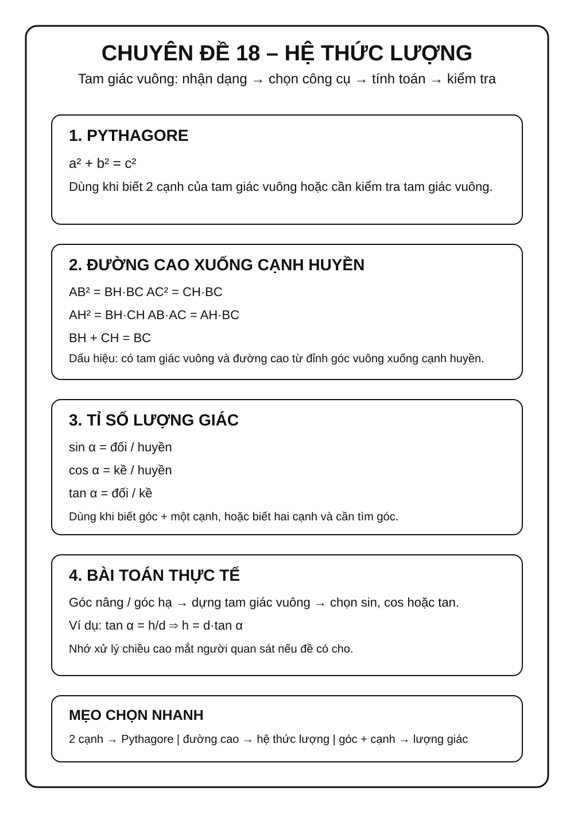
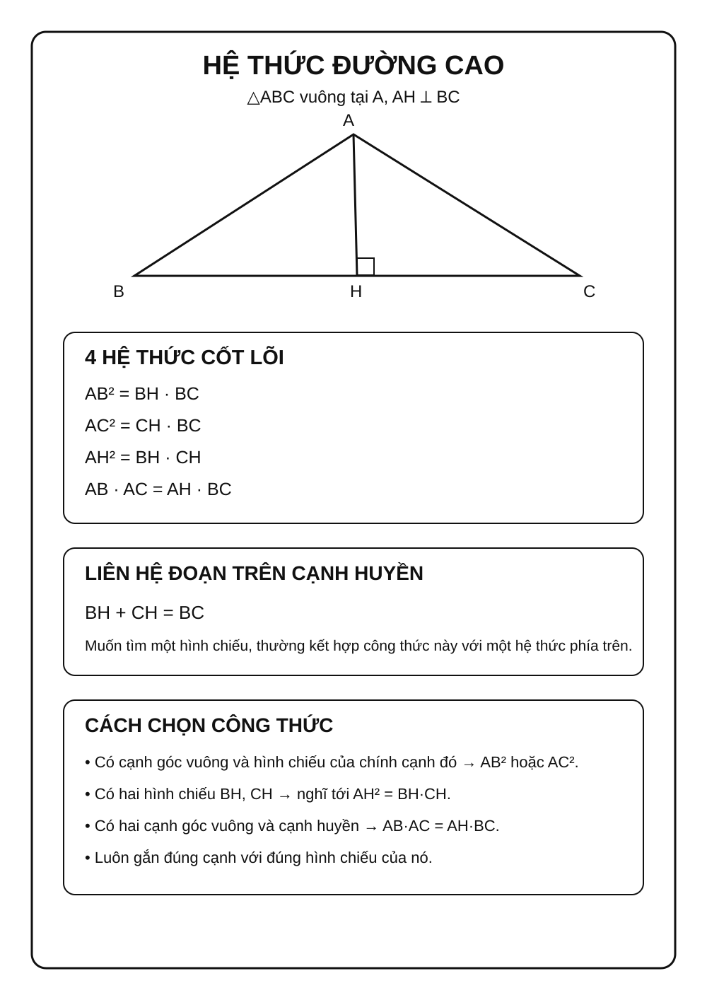
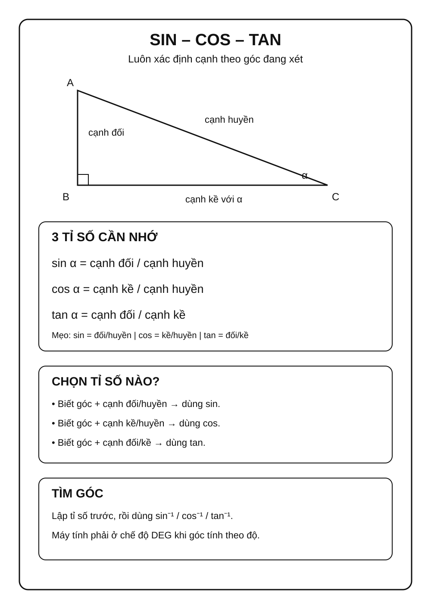
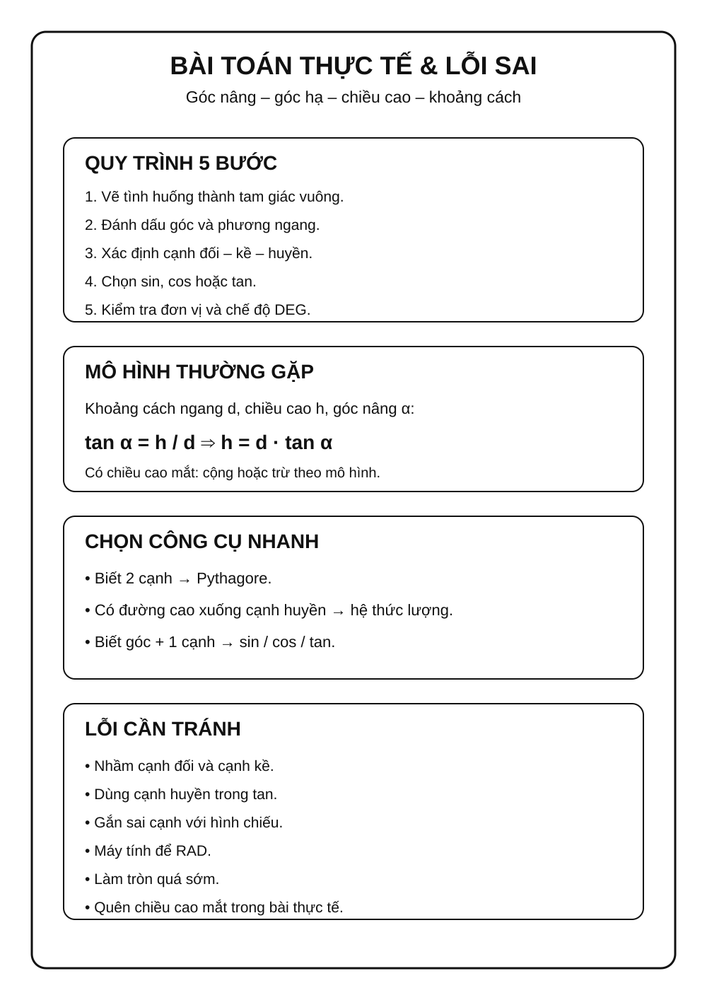

# Chuyên đề 18 – Hệ thức lượng trong tam giác vuông

> **Trạng thái:** Đã kiểm định nội dung học thuật; cấu trúc Roadmap chuẩn 11 mục.
>
> **Lớp trọng tâm:** 9
> **Mạch kiến thức:** Hình học/Đo lường
> **Mức ưu tiên:** ⭐⭐⭐⭐⭐

---

## 🧭 1. Bản đồ kiến thức

```text
HỆ THỨC LƯỢNG TRONG TAM GIÁC VUÔNG
│
├── Định lý Pythagore
│   └── a² + b² = c²
│
├── Đường cao xuống cạnh huyền
│   ├── cạnh góc vuông² = hình chiếu × cạnh huyền
│   ├── đường cao² = tích hai hình chiếu
│   └── tích hai cạnh góc vuông = đường cao × cạnh huyền
│
├── Tỉ số lượng giác
│   ├── sin = đối / huyền
│   ├── cos = kề / huyền
│   ├── tan = đối / kề
│   └── cot = kề / đối
│
└── Bài toán thực tế
    └── góc nâng, góc hạ, chiều cao, khoảng cách
```

Mạch tư duy trọng tâm:

**nhận ra tam giác vuông → chọn hệ thức phù hợp → lập công thức đúng → kiểm tra đơn vị và tính hợp lý.**

### Infographic – Tổng quan chuyên đề



---

## Minh họa trực quan

### 1. Đường cao trong tam giác vuông

<p align="center">
  
</p>

Xét tam giác vuông `ABC`, vuông tại `A`, đường cao `AH` hạ xuống cạnh huyền `BC`.

Các hệ thức quan trọng:

`AB² = BH × BC`

`AC² = CH × BC`

`AH² = BH × CH`

`AB × AC = AH × BC`

> Khi bài toán có tam giác vuông và đường cao xuống cạnh huyền, nên nghĩ ngay đến nhóm hệ thức này.

---

### 2. Tỉ số lượng giác của góc nhọn

<p align="center">
  
</p>

Với một góc nhọn `α` trong tam giác vuông:

| Tỉ số | Công thức |
|---|---|
| Sin | `sin α = cạnh đối / cạnh huyền` |
| Cos | `cos α = cạnh kề / cạnh huyền` |
| Tan | `tan α = cạnh đối / cạnh kề` |
| Cot | `cot α = cạnh kề / cạnh đối` |

Mẹo nhớ:

- `sin` → đối / huyền;
- `cos` → kề / huyền;
- `tan` → đối / kề;
- `cot` → kề / đối.

---

### 3. Góc nâng và góc hạ

<p align="center">
  
</p>

> Góc nâng là góc tạo bởi tia nhìn lên và phương ngang. Góc hạ là góc tạo bởi tia nhìn xuống và phương ngang.

Dạng bài thường gặp:

- tính chiều cao của tòa nhà, cây, cột;
- tính khoảng cách từ người quan sát đến vật;
- tính độ cao khi biết góc nâng và khoảng cách ngang.

Ví dụ, nếu khoảng cách ngang đến chân tòa nhà là `d`, chiều cao cần tìm là `h`, góc nâng là `α` thì:

`tan α = h / d`

suy ra:

`h = d × tan α`

---

### Bảng chọn công cụ nhanh

| Dấu hiệu trong đề | Công cụ nên nghĩ tới |
|---|---|
| Tam giác vuông có đường cao xuống cạnh huyền | Các hệ thức lượng |
| Biết góc và một cạnh, tìm cạnh khác | `sin`, `cos`, `tan` |
| Biết hai cạnh của tam giác vuông | Pythagore |
| Bài toán chiều cao / khoảng cách | Góc nâng, góc hạ + lượng giác |

---

### Mẹo giải bài

- Vẽ hình trước khi thay số.
- Xác định rõ cạnh nào là **đối**, **kề**, **huyền** so với góc đang xét.
- Không dùng nhầm cạnh kề với cạnh huyền.
- Kiểm tra máy tính đang ở chế độ **DEG** khi góc cho theo độ.
- Với bài thực tế, nhớ cộng hoặc trừ chiều cao mắt người quan sát nếu đề có cho.

---

## 🎯 2. Mục tiêu cần đạt

Sau khi hoàn thành chuyên đề, học sinh cần:

- [ ] Nhớ và vận dụng được các hệ thức trong tam giác vuông có đường cao xuống cạnh huyền.
- [ ] Phân biệt đúng cạnh đối, cạnh kề, cạnh huyền theo góc đang xét.
- [ ] Dùng đúng `sin`, `cos`, `tan`, `cot` và quan hệ hai góc phụ nhau để tìm cạnh hoặc góc.
- [ ] Kết hợp Pythagore và lượng giác trong cùng một bài.
- [ ] Giải được bài toán chiều cao, khoảng cách, góc nâng và góc hạ.
- [ ] Biết kiểm tra đơn vị và chế độ DEG trên máy tính.

---

## 📖 3. Kiến thức cốt lõi

### 3.1. Định lý Pythagore

Trong tam giác vuông có hai cạnh góc vuông `a`, `b` và cạnh huyền `c`:

`a² + b² = c²`

Định lý Pythagore đảo: nếu một tam giác có ba cạnh `a`, `b`, `c`, trong đó `c` là cạnh lớn nhất, và:

`a² + b² = c²`

thì tam giác đó vuông, với `c` là cạnh huyền.

### 3.2. Hệ thức với đường cao xuống cạnh huyền

Xét `△ABC` vuông tại `A`, `AH ⟂ BC`.

Ta có:

`AB² = BH × BC`

`AC² = CH × BC`

`AH² = BH × CH`

`AB × AC = AH × BC`

Ngoài ra:

`BH + CH = BC`

Đây là nhóm công thức cần thuộc và nhận ra nhanh.

### Infographic – Hệ thức đường cao



### 3.3. Tỉ số lượng giác của góc nhọn

Với góc nhọn `α`:

`sin α = cạnh đối / cạnh huyền`

`cos α = cạnh kề / cạnh huyền`

`tan α = cạnh đối / cạnh kề`

Từ đó có thể:
- biết góc và một cạnh → tìm cạnh;
- biết hai cạnh → tìm góc.

### 3.4. Quan hệ giữa các tỉ số

Với góc nhọn `α`:

`sin² α + cos² α = 1`

và khi `cos α ≠ 0`:

`tan α = sin α / cos α`

`cot α = cos α / sin α`

`tan α · cot α = 1`

Nếu `α + β = 90°` thì:

- `sin α = cos β`, `cos α = sin β`;
- `tan α = cot β`, `cot α = tan β`.

### 3.4A. Giá trị lượng giác của các góc đặc biệt

| Góc | `sin` | `cos` | `tan` | `cot` |
|---:|---:|---:|---:|---:|
| `30°` | `1/2` | `√3/2` | `√3/3` | `√3` |
| `45°` | `√2/2` | `√2/2` | `1` | `1` |
| `60°` | `√3/2` | `1/2` | `√3` | `√3/3` |

Không nhất thiết học bảng như bốn dòng công thức rời rạc: dùng quan hệ hai góc phụ nhau để kiểm tra chéo `sin ↔ cos` và `tan ↔ cot`.

### Infographic – Tỉ số lượng giác



### 3.5. Góc nâng và góc hạ

Trong bài toán thực tế:
- góc nâng: tia nhìn hướng lên so với phương ngang;
- góc hạ: tia nhìn hướng xuống so với phương ngang.

Ví dụ, với khoảng cách ngang `d`, chiều cao `h`, góc nâng `α`:

`tan α = h/d`

suy ra:

`h = d × tan α`

Nếu điểm quan sát cao hơn mặt đất, cần cộng hoặc trừ chiều cao mắt theo tình huống.

### 3.6. Bảng chọn công cụ

| Dấu hiệu | Công cụ |
|---|---|
| Biết 2 cạnh tam giác vuông | Pythagore |
| Có đường cao xuống cạnh huyền | Nhóm hệ thức lượng |
| Biết góc + 1 cạnh | `sin`, `cos`, `tan` |
| Biết 2 cạnh, cần tìm góc | Lập tỉ số lượng giác rồi dùng phím nghịch đảo (`sin⁻¹`, `cos⁻¹`, `tan⁻¹`) trên máy tính |
| Bài chiều cao / khoảng cách | Góc nâng, góc hạ + lượng giác |

---

## 🔗 4. Kiến thức liên quan

- **Kiến thức nên ôn trước:** [14 – Tam giác](../14-tam-giac/index.md), [17 – Thales và tam giác đồng dạng](../17-thales-dong-dang/index.md)
- **Liên hệ mạnh:** tam giác vuông, Pythagore, đồng dạng.
- **Chuyên đề sử dụng tiếp:** [19 – Đường tròn](../19-duong-tron/index.md), [20 – Hình học tổng hợp](../20-hinh-hoc-tong-hop/index.md), [24 – Bài toán thực tế](../24-bai-toan-thuc-te/index.md)

---

## 🧩 5. Các dạng bài cần nắm vững

### Infographic – Bài toán thực tế và lỗi sai



### Dạng 1. Tính cạnh bằng Pythagore

### Dạng 2. Tính đoạn bằng hệ thức đường cao

Nhận ra ngay cấu hình `AH ⟂ BC` trong tam giác vuông.

### Dạng 3. Tính cạnh bằng `sin`, `cos`, `tan`

Chọn tỉ số chứa đúng cạnh đã biết và cạnh cần tìm.

### Dạng 4. Tìm góc

Lập tỉ số lượng giác phù hợp, sau đó dùng phím nghịch đảo tương ứng (`sin⁻¹`, `cos⁻¹` hoặc `tan⁻¹`) trên máy tính ở chế độ DEG.

> Ký hiệu `sin⁻¹`, `cos⁻¹`, `tan⁻¹` ở đây chỉ **hàm lượng giác ngược**, không phải nghịch đảo theo nghĩa `1/sin`, `1/cos`, `1/tan`.

### Dạng 5. Bài góc nâng – góc hạ

Vẽ lại tam giác vuông từ tình huống thực tế rồi mới thay số.

### Dạng 6. Bài tổng hợp

Kết hợp Pythagore, đồng dạng và lượng giác để tìm nhiều đại lượng liên tiếp.

---

## 🚀 6. Dạng bài thi vào lớp 10

Trong Roadmap ôn thi vào lớp 10, đây là chuyên đề có mức ưu tiên rất cao cho cả hình học và các bài toán thực tế có mô hình tam giác vuông.

Các kỹ năng cần chắc:
1. Nhận diện đúng tam giác vuông và cạnh huyền.
2. Dùng hệ thức đường cao để tính đoạn.
3. Dùng lượng giác để tìm cạnh hoặc góc.
4. Giải bài chiều cao / khoảng cách.
5. Kết hợp lượng giác với đường tròn và hình học tổng hợp.

Mức ưu tiên ôn thi: **⭐⭐⭐⭐⭐**.

---

## ⚠️ 7. Lỗi sai thường gặp

| Lỗi sai | Cách tránh |
|---|---|
| Nhầm cạnh đối và cạnh kề | Xác định theo **góc đang xét** |
| Dùng cạnh huyền trong `tan` | `tan = đối/kề`, không có cạnh huyền |
| Dùng sai hình chiếu trong hệ thức | Gắn đúng cạnh góc vuông với hình chiếu của nó |
| Quên `BH + CH = BC` | Ghi cấu hình đầy đủ trước khi tính |
| Máy tính để RAD | Chuyển sang **DEG** |
| Quên chiều cao mắt | Đọc kỹ mô hình thực tế |
| Làm tròn quá sớm | Giữ đủ số đến bước cuối |

---

## 📝 8. Luyện tập

Phần luyện tập chính đã chuyển sang **Practice Room** để tách rõ Core với Entrance10/Challenge và ghi learner evidence theo skill.

- **→ [Mở Practice Room](bai-tap.md)**

---

## ✅ 9. Tự kiểm tra

Sau khi luyện, làm **Core Readiness Check** 10 câu. Kết quả là **soft mastery**: dùng để gợi ý ôn lại, không khóa lộ trình.

- **→ [Mở Core Readiness Check](tu-kiem-tra.md)**

---

## 🔄 10. Liên kết Roadmap

- **← Trước:** [14 – Tam giác](../14-tam-giac/index.md), [17 – Thales và đồng dạng](../17-thales-dong-dang/index.md)
- **→ Tiếp theo:** [19 – Đường tròn](../19-duong-tron/index.md)
- **→ Liên hệ:** [20 – Hình học tổng hợp](../20-hinh-hoc-tong-hop/index.md), [24 – Bài toán thực tế](../24-bai-toan-thuc-te/index.md)

- **✏️ Luyện tập:** [Bài tập Chuyên đề 18](bai-tap.md)
- **✅ Tự kiểm tra:** [Tự kiểm tra Chuyên đề 18](tu-kiem-tra.md)

Xem toàn bộ hệ thống tại [Blueprint 25 chuyên đề](../../roadmap/blueprint-25-chuyen-de.md).

---

## 🏁 11. Điều kiện hoàn thành

- [ ] Đã học đủ 5 chặng KNTT Core ở đầu trang.
- [ ] Đã luyện Practice Room và chữa lại các câu sai.
- [ ] Đã làm Core Readiness Check; khoảng 80% trở lên là tín hiệu sẵn sàng.
- [ ] Mọi kết luận hình học dựa trên giả thiết/định lí, không dựa vào hình vẽ.

!!! note "Soft Mastery"
    Kết quả không khóa chuyên đề tiếp theo; evidence yếu chỉ tạo gợi ý ôn đúng skill.
