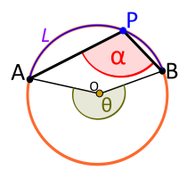
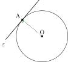
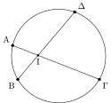
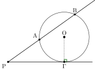

# Chuyên đề 19 – Đường tròn

> **Trạng thái:** Đã kiểm định nội dung học thuật; cấu trúc Roadmap chuẩn 11 mục.
>
> **Lớp trọng tâm:** 9
> **Mạch kiến thức:** Hình học
> **Mức ưu tiên:** ⭐⭐⭐⭐⭐

---

## 🧭 1. Bản đồ kiến thức

```text
ĐƯỜNG TRÒN
│
├── Góc và cung
│   ├── Góc ở tâm
│   ├── Góc nội tiếp
│   └── Góc nội tiếp chắn nửa đường tròn = 90°
│
├── Dây và khoảng cách đến tâm
│   ├── Dây bằng nhau ↔ cách tâm bằng nhau
│   └── Đường kính vuông góc dây → đi qua trung điểm dây
│
├── Tiếp tuyến
│   ├── Bán kính ⟂ tiếp tuyến tại tiếp điểm
│   └── Hai tiếp tuyến từ một điểm ngoài bằng nhau
│
├── Tứ giác nội tiếp
│   └── Tổng hai góc đối = 180°
│
└── Hệ thức độ dài
    ├── Hai dây cắt nhau
    └── Tiếp tuyến – cát tuyến
```

Mạch tư duy trọng tâm:

**nhận dạng cấu hình đường tròn → xác định cung/góc/tiếp tuyến → chọn định lý phù hợp → suy ra góc, độ dài hoặc chứng minh hình học.**

---

## Minh họa trực quan

### 1. Góc ở tâm và góc nội tiếp

<p align="center">
  
</p>

> Trong cùng một đường tròn, **góc nội tiếp chắn một cung bằng nửa góc ở tâm cùng chắn cung đó**.

Nếu góc ở tâm là `∠AOB` và góc nội tiếp là `∠ACB`, cùng chắn cung `AB`, thì:

`∠ACB = 1/2 ∠AOB`

Đây là một trong những tính chất quan trọng nhất của chương đường tròn.

---

### 2. Tiếp tuyến và bán kính

<p align="center">
  
</p>

> Tiếp tuyến của đường tròn vuông góc với bán kính tại tiếp điểm.

Nếu đường thẳng `d` là tiếp tuyến của đường tròn tâm `O` tại điểm `A`, thì:

`OA ⟂ d`

Dấu hiệu đảo cũng rất hay dùng:

> Nếu một đường thẳng vuông góc với bán kính tại một điểm thuộc đường tròn, thì đường thẳng đó là tiếp tuyến của đường tròn.

---

### 3. Hai dây cắt nhau trong đường tròn

<p align="center">
  
</p>

> Nếu hai dây `AB` và `CD` cắt nhau tại `I` bên trong đường tròn, thì tích hai đoạn của dây này bằng tích hai đoạn của dây kia.

Ta có hệ thức:

`IA × IB = IC × ID`

Dạng bài này thường xuất hiện khi đề cho nhiều đoạn thẳng trong cùng một đường tròn và hỏi một độ dài chưa biết.

---

### 4. Tiếp tuyến – cát tuyến

<p align="center">
  
</p>

> Nếu từ một điểm `P` ở ngoài đường tròn kẻ một tiếp tuyến `PT` và một cát tuyến cắt đường tròn tại `A`, `B`, thì:

`PT² = PA × PB`

Đây là hệ thức rất quan trọng trong bài toán độ dài liên quan đến tiếp tuyến.

---

### Bảng công thức trọng tâm

| Dạng kiến thức | Hệ thức / tính chất cần nhớ |
|---|---|
| Góc ở tâm – góc nội tiếp | `góc nội tiếp = 1/2 góc ở tâm` |
| Tiếp tuyến – bán kính | `bán kính ⟂ tiếp tuyến tại tiếp điểm` |
| Hai dây cắt nhau | `IA × IB = IC × ID` |
| Tiếp tuyến – cát tuyến | `PT² = PA × PB` |

---

### Dấu hiệu nhận biết nhanh trong bài

- Thấy **góc trong đường tròn** → nghĩ đến góc nội tiếp, góc ở tâm, cung bị chắn.
- Thấy **vuông góc với bán kính tại tiếp điểm** → nghĩ đến tiếp tuyến.
- Thấy **hai dây cắt nhau** → nghĩ đến tích các đoạn.
- Thấy **điểm ở ngoài đường tròn có tiếp tuyến và cát tuyến** → nghĩ đến `PT² = PA × PB`.

---

### Mẹo giải bài

- Luôn vẽ rõ tâm `O`, tiếp điểm và các giao điểm.
- Khi tính góc, xác định chính xác **cung bị chắn**.
- Khi thấy nhiều tích đoạn thẳng, thử kiểm tra xem có cấu hình dây cắt nhau hoặc tiếp tuyến–cát tuyến hay không.
- Với bài chứng minh tiếp tuyến, thường cần chứng minh một góc vuông với bán kính.

---

## 🎯 2. Mục tiêu cần đạt

Sau khi hoàn thành chuyên đề, học sinh cần:

- [ ] Phân biệt được góc ở tâm, góc nội tiếp và cung bị chắn.
- [ ] Vận dụng được định lý góc nội tiếp bằng nửa góc ở tâm cùng chắn cung.
- [ ] Nhận biết và chứng minh được tiếp tuyến.
- [ ] Sử dụng được tính chất hai tiếp tuyến xuất phát từ một điểm ngoài.
- [ ] Nhận biết và chứng minh được tứ giác nội tiếp.
- [ ] Dùng được hệ thức hai dây cắt nhau và tiếp tuyến – cát tuyến.
- [ ] Kết hợp được đường tròn với tam giác đồng dạng và hệ thức lượng.

---

## 📖 3. Kiến thức cốt lõi

### 3.1. Góc ở tâm và góc nội tiếp

Nếu `∠AOB` là góc ở tâm và `∠ACB` là góc nội tiếp cùng chắn cung `AB`, thì:

`∠ACB = 1/2 ∠AOB`

Hệ quả rất quan trọng:

> Góc nội tiếp chắn nửa đường tròn bằng `90°`.

### 3.2. Quan hệ giữa dây và tâm

Trong một đường tròn:

- hai dây bằng nhau thì cách tâm bằng nhau;
- hai dây cách tâm bằng nhau thì bằng nhau;
- đường kính vuông góc với một dây thì đi qua trung điểm của dây đó;
- đường kính đi qua trung điểm của một dây không đi qua tâm thì vuông góc với dây đó.

### 3.3. Tiếp tuyến

Nếu `d` là tiếp tuyến tại `A` của đường tròn tâm `O` thì:

`OA ⟂ d`

Dấu hiệu nhận biết:

> Một đường thẳng đi qua điểm `A` thuộc đường tròn và vuông góc với bán kính `OA` thì là tiếp tuyến tại `A`.

Nếu từ điểm `P` ngoài đường tròn kẻ hai tiếp tuyến `PA`, `PB` tại `A`, `B`, thì:

`PA = PB`

Ngoài ra, `OP` là đường trung trực của `AB` và là phân giác của `∠APB`. Đây là các tính chất rất hữu ích khi khai thác cấu hình hai tiếp tuyến.

### 3.4. Tứ giác nội tiếp

Một tứ giác nội tiếp là tứ giác có bốn đỉnh cùng thuộc một đường tròn.

Tính chất quan trọng:

`∠A + ∠C = 180°`

`∠B + ∠D = 180°`

Một số dấu hiệu thường dùng để chứng minh tứ giác nội tiếp:

- tổng hai góc đối bằng `180°`;
- nếu hai điểm `C`, `D` nằm cùng phía đối với đường thẳng `AB` và `∠ACB = ∠ADB`, thì bốn điểm `A, B, C, D` cùng thuộc một đường tròn;
- nếu `∠AMB = ∠ANB = 90°` thì `A, M, B, N` cùng thuộc đường tròn có đường kính `AB`.

### 3.5. Hai dây cắt nhau

Nếu hai dây `AB`, `CD` cắt nhau tại `I` bên trong đường tròn:

`IA × IB = IC × ID`

### 3.6. Tiếp tuyến – cát tuyến

Từ điểm `P` ngoài đường tròn, tiếp tuyến `PT` và cát tuyến `PAB` cho:

`PT² = PA × PB`

### 3.7. Bảng chọn công cụ

| Dấu hiệu | Nên nghĩ tới |
|---|---|
| Góc có đỉnh trên đường tròn | Góc nội tiếp |
| Góc có đỉnh tại tâm | Góc ở tâm |
| Cần chứng minh tiếp tuyến | Bán kính vuông góc |
| Hai tiếp tuyến từ một điểm | Hai đoạn tiếp tuyến bằng nhau |
| Bốn điểm cần chứng minh cùng thuộc một đường tròn | Tứ giác nội tiếp |
| Hai dây cắt nhau | Tích các đoạn dây |
| Tiếp tuyến + cát tuyến | `PT² = PA × PB` |

---

## 🔗 4. Kiến thức liên quan

- **Kiến thức nên ôn trước:** [14 – Tam giác](../14-tam-giac/index.md), [17 – Thales và đồng dạng](../17-thales-dong-dang/index.md), [18 – Hệ thức lượng](../18-he-thuc-luong/index.md)
- **Liên hệ mạnh:** vuông góc, đồng dạng, góc, tam giác vuông.
- **Chuyên đề sử dụng tiếp:** [20 – Hình học tổng hợp](../20-hinh-hoc-tong-hop/index.md), [25 – Tổng hợp ôn thi vào 10](../25-tong-hop-on-thi-10/index.md)

---

## 🧩 5. Các dạng bài cần nắm vững

### Dạng 1. Tính góc trong đường tròn

Dùng quan hệ góc ở tâm – góc nội tiếp và các góc cùng chắn một cung.

### Dạng 2. Chứng minh tiếp tuyến

Chứng minh bán kính vuông góc với đường thẳng tại điểm thuộc đường tròn.

### Dạng 3. Hai tiếp tuyến từ một điểm ngoài

Dùng `PA = PB` và khai thác tam giác cân hoặc đối xứng.

### Dạng 4. Chứng minh tứ giác nội tiếp

Ưu tiên các dấu hiệu:
- tổng hai góc đối bằng `180°`;
- hai góc bằng nhau cùng nhìn một đoạn thẳng, với hai đỉnh góc nằm cùng phía đối với đường thẳng chứa đoạn đó;
- hai góc vuông cùng nhìn một đoạn thẳng, từ đó nhận ra đường tròn có đường kính là đoạn ấy.

### Dạng 5. Tính độ dài bằng hai dây cắt nhau

Dùng:

`IA × IB = IC × ID`

### Dạng 6. Tính độ dài bằng tiếp tuyến – cát tuyến

Dùng:

`PT² = PA × PB`

### Dạng 7. Bài tổng hợp đường tròn

Kết hợp tiếp tuyến, nội tiếp, đồng dạng, hệ thức tích và lượng giác.

---

## 🚀 6. Dạng bài thi vào lớp 10

Trong Roadmap ôn thi vào lớp 10, đây là chuyên đề có mức ưu tiên rất cao.

Các kỹ năng cần chắc:
1. Chứng minh tứ giác nội tiếp.
2. Chứng minh tiếp tuyến.
3. Chứng minh hai tam giác đồng dạng trong cấu hình đường tròn.
4. Chứng minh hệ thức tích đoạn thẳng.
5. Tính góc, độ dài hoặc bán kính.
6. Kết hợp nhiều bước để giải bài hình tổng hợp.

Mức ưu tiên ôn thi: **⭐⭐⭐⭐⭐**.

---

## ⚠️ 7. Lỗi sai thường gặp

| Lỗi sai | Cách tránh |
|---|---|
| Nhầm góc nội tiếp với góc ở tâm | Kiểm tra vị trí đỉnh của góc |
| Không xác định đúng cung bị chắn | Đánh dấu hai đầu mút cung trước |
| Chứng minh tiếp tuyến nhưng quên điểm thuộc đường tròn | Cần đủ: điểm trên đường tròn + vuông góc bán kính |
| Dùng sai định lý hai dây cắt nhau | Điểm giao phải nằm bên trong đường tròn |
| Dùng sai tiếp tuyến – cát tuyến | Điểm xuất phát phải ở ngoài đường tròn |
| Kết luận nội tiếp khi mới có một góc vuông | Một góc vuông chỉ cho biết một điểm nằm trên đường tròn có đường kính xác định; cần thêm điều kiện cho điểm còn lại hoặc dùng một dấu hiệu nội tiếp đầy đủ |

---

## 📝 8. Luyện tập

### Mức 1 – Nhận biết

1. Góc nội tiếp chắn nửa đường tròn bằng bao nhiêu độ?
2. Tiếp tuyến vuông góc với đoạn nào tại tiếp điểm?
3. Hai tiếp tuyến từ cùng một điểm ngoài có độ dài như thế nào?

### Mức 2 – Thông hiểu

4. Góc ở tâm chắn cung `AB` bằng `120°`. Tính góc nội tiếp cùng chắn cung đó.
5. Hai dây cắt nhau tại `I`, biết `IA = 3`, `IB = 8`, `IC = 4`. Tính `ID`.
6. Từ `P` ngoài đường tròn, `PT` là tiếp tuyến, cát tuyến cắt tại `A`, `B`. Biết `PA = 4`, `PB = 9`. Tính `PT`.

### Mức 3 – Vận dụng

7. Chứng minh một tứ giác nội tiếp bằng cách chứng minh tổng hai góc đối bằng `180°`.
8. Chứng minh một đường thẳng là tiếp tuyến bằng cách chứng minh vuông góc với bán kính tại tiếp điểm.
9. Từ hai tiếp tuyến `PA`, `PB`, hãy khai thác `PA = PB` để chứng minh một tam giác cân.

### Mức 4 – Tổng hợp

10. Trong một cấu hình có tiếp tuyến và dây cung, hãy chứng minh hai tam giác đồng dạng rồi suy ra một hệ thức tích.
11. Cho bốn điểm tạo thành hai góc vuông. Hãy chứng minh chúng cùng thuộc một đường tròn và tiếp tục tính một góc liên quan.

---

## ✅ 9. Tự kiểm tra

Hãy tự trả lời không nhìn tài liệu:

1. Góc nội tiếp bằng bao nhiêu lần góc ở tâm cùng chắn cung?
2. Góc nội tiếp chắn đường kính bằng bao nhiêu độ?
3. Điều kiện nhận biết một tiếp tuyến tại điểm `A` là gì?
4. Hai tiếp tuyến từ một điểm ngoài có tính chất gì?
5. Nêu một dấu hiệu chứng minh tứ giác nội tiếp.
6. Hệ thức hai dây cắt nhau là gì?
7. Hệ thức tiếp tuyến – cát tuyến là gì?
8. Khi thấy nhiều góc bằng nhau trong đường tròn, nên kiểm tra điều gì?

**Tiêu chí đạt:** đúng ít nhất `7/8` câu và giải được một bài chứng minh nội tiếp hoặc tiếp tuyến.

---

## 🔄 10. Liên kết Roadmap

- **← Trước:** [14 – Tam giác](../14-tam-giac/index.md), [17 – Thales và đồng dạng](../17-thales-dong-dang/index.md), [18 – Hệ thức lượng](../18-he-thuc-luong/index.md)
- **→ Tiếp theo:** [20 – Hình học tổng hợp](../20-hinh-hoc-tong-hop/index.md)
- **→ Liên hệ:** [25 – Tổng hợp ôn thi vào 10](../25-tong-hop-on-thi-10/index.md)

- **✏️ Luyện tập:** [Bài tập Chuyên đề 19](bai-tap.md)
- **✅ Tự kiểm tra:** [Tự kiểm tra Chuyên đề 19](tu-kiem-tra.md)

Xem toàn bộ hệ thống tại [Blueprint 25 chuyên đề](../../roadmap/blueprint-25-chuyen-de.md).

---

## 🏁 11. Điều kiện hoàn thành

Chuyên đề được xem là hoàn thành khi học sinh:

- [ ] Phân biệt đúng góc ở tâm và góc nội tiếp.
- [ ] Chứng minh được một tiếp tuyến.
- [ ] Chứng minh được một tứ giác nội tiếp.
- [ ] Dùng đúng hai hệ thức tích đoạn thẳng.
- [ ] Kết hợp được đường tròn với đồng dạng.
- [ ] Giải được ít nhất một bài hình tổng hợp có đường tròn.
- [ ] Đạt tối thiểu **7/10** ở bài Tự kiểm tra và chữa xong các câu sai trước khi chuyển sang Chuyên đề 20.
