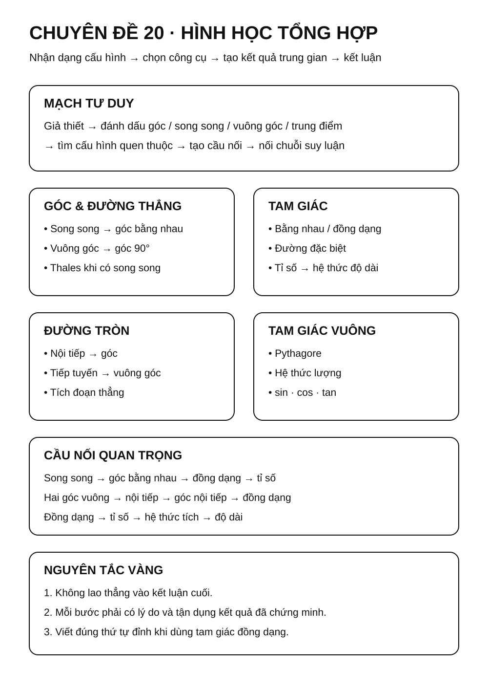
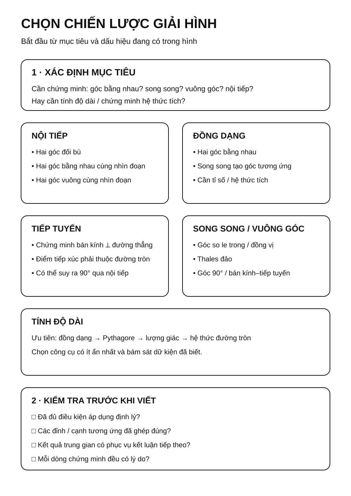
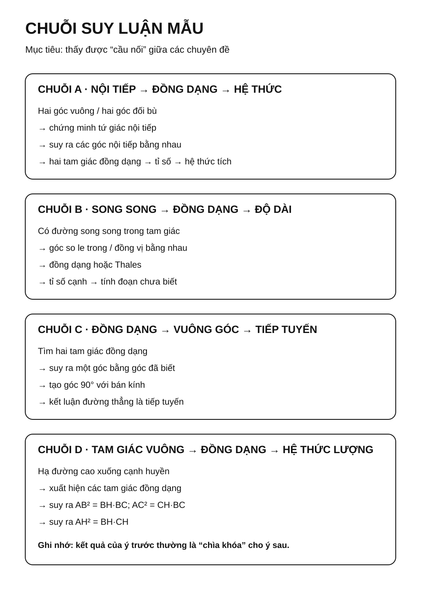
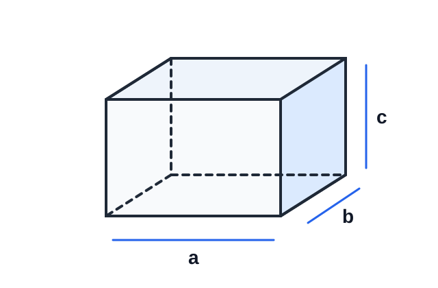
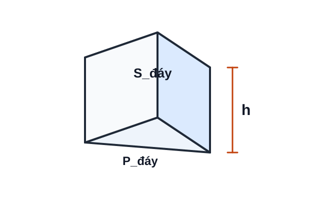
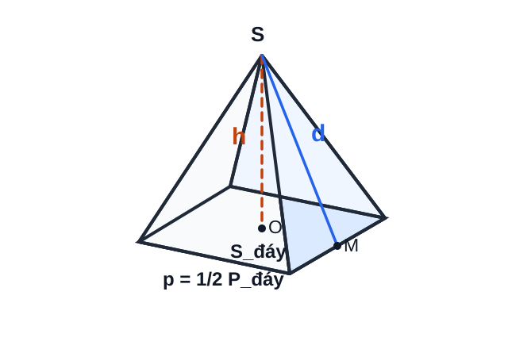
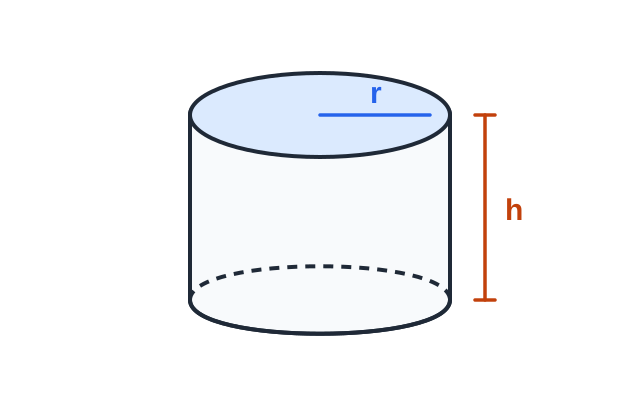
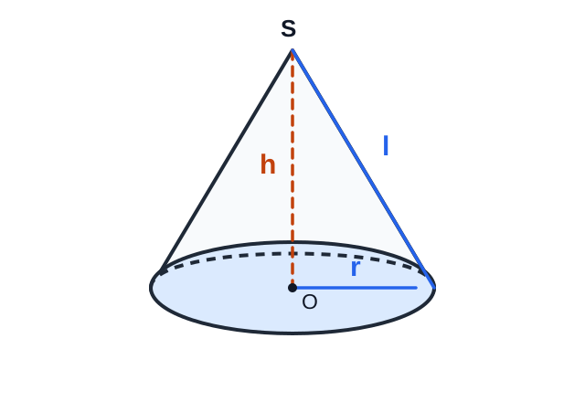
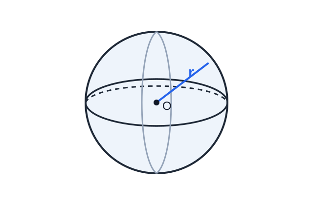
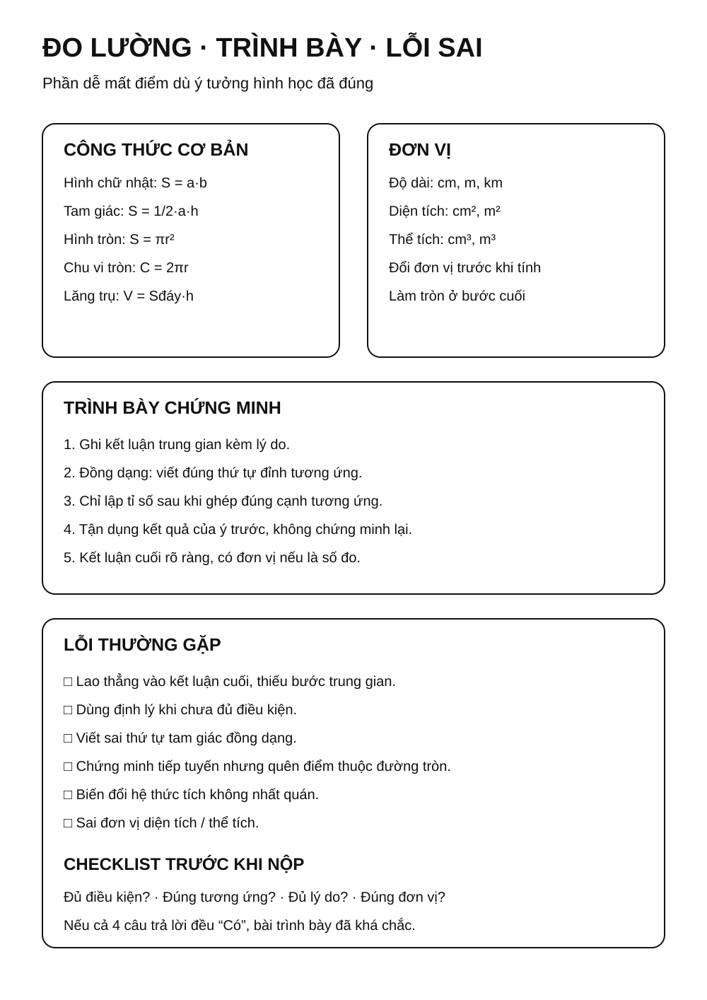

# Chuyên đề 20 – Hình học tổng hợp, đo lường và hình khối

> **Trạng thái:** Đã kiểm định nội dung học thuật; cấu trúc Roadmap chuẩn 11 mục.
>
> **Lớp trọng tâm:** 6–9
> **Mạch kiến thức:** Hình học/Đo lường
> **Mức ưu tiên:** ⭐⭐⭐⭐

---

## 🧭 1. Bản đồ kiến thức

```text
HÌNH HỌC TỔNG HỢP
│
├── Góc và đường thẳng
│   └── song song • vuông góc • góc bằng nhau
│
├── Tam giác
│   ├── bằng nhau
│   ├── đồng dạng
│   └── đường đặc biệt
│
├── Tứ giác
│   └── bình hành • chữ nhật • thoi • vuông • nội tiếp
│
├── Tam giác vuông
│   └── Pythagore • hệ thức lượng • lượng giác
│
├── Đường tròn
│   └── góc nội tiếp • tiếp tuyến • hệ thức tích
│
└── Hình khối & đo lường
    └── diện tích • thể tích • bài toán thực tế
```

Mạch tư duy trọng tâm:

**đọc giả thiết → đánh dấu quan hệ → tìm cấu hình quen thuộc → tạo kết quả trung gian → nối các kết quả thành chuỗi chứng minh.**

### Infographic tổng quan



---

## Minh họa trực quan

### 1. Tứ giác nội tiếp

<p align="center">
  
</p>

> Một tứ giác có bốn đỉnh cùng nằm trên một đường tròn được gọi là **tứ giác nội tiếp**.

Tính chất rất quan trọng:

`∠A + ∠C = 180°`

`∠B + ∠D = 180°`

Các dấu hiệu thường dùng để chứng minh một tứ giác nội tiếp:

- tổng hai góc đối bằng `180°`;
- nếu hai đỉnh nằm cùng phía đối với đường thẳng chứa một đoạn và cùng nhìn đoạn đó dưới hai góc bằng nhau, thì bốn điểm tương ứng cùng thuộc một đường tròn;
- nếu hai góc cùng bằng `90°` và cùng nhìn một đoạn thẳng, thì các đỉnh của hai góc nằm trên đường tròn có đường kính là đoạn ấy.

---

### 2. Tam giác đồng dạng trong bài toán tổng hợp

<p align="center">
  
</p>

Tam giác đồng dạng thường là “cầu nối” giữa phần góc và phần độ dài.

Nếu:

`△ABC ∼ △DEF`

thì:

`AB/DE = BC/EF = AC/DF`

và các góc tương ứng bằng nhau.

Trong bài hình học tổng hợp, đồng dạng thường được dùng để:

- suy ra tỉ số đoạn thẳng;
- chứng minh hai tích đoạn thẳng bằng nhau;
- chứng minh một hệ thức độ dài;
- tạo bước trung gian để chứng minh tiếp tuyến hoặc nội tiếp.

---

### 3. Đồng dạng trong tam giác vuông

<p align="center">
  
</p>

Khi từ góc vuông hạ đường cao xuống cạnh huyền, thường xuất hiện ba tam giác đồng dạng.

Đây là cấu hình đặc biệt quan trọng vì từ đồng dạng có thể suy ra các hệ thức lượng như:

`AH² = BH × CH`

`AB² = BH × BC`

`AC² = CH × BC`

Vì vậy, khi gặp tam giác vuông có đường cao xuống cạnh huyền, nên kiểm tra ngay các cặp tam giác đồng dạng.

---

### Quy trình giải bài hình học tổng hợp

```text
Đọc kỹ giả thiết
      ↓
Đánh dấu góc bằng nhau, vuông góc, song song
      ↓
Tìm tam giác đồng dạng
      ↓
Suy ra góc hoặc tỉ số đoạn thẳng
      ↓
Kiểm tra khả năng có tứ giác nội tiếp / tiếp tuyến
      ↓
Kết hợp các kết quả trung gian
      ↓
Hoàn thành chứng minh hoặc tính toán
```

---

### Bảng chiến lược nhận dạng

| Dấu hiệu trong hình | Hướng suy nghĩ ưu tiên |
|---|---|
| Có nhiều góc bằng nhau | Tam giác đồng dạng |
| Có hai góc vuông | Tứ giác nội tiếp |
| Có tổng hai góc đối bằng `180°` | Tứ giác nội tiếp |
| Có tiếp tuyến | Bán kính vuông góc tiếp tuyến, góc tạo bởi tiếp tuyến và dây |
| Có đường tròn + nhiều đoạn cắt nhau | Tích đoạn thẳng, đồng dạng |
| Có đường cao trong tam giác vuông | Đồng dạng + hệ thức lượng |
| Có song song | Thales + góc bằng nhau + đồng dạng |

---

### Mẹo trình bày bài chứng minh

1. Mỗi kết luận nên có lý do ngay sau đó.
2. Khi chứng minh hai tam giác đồng dạng, ghi đúng thứ tự các đỉnh tương ứng.
3. Không viết tỉ số trước khi xác định đúng cặp cạnh tương ứng.
4. Nếu cần chứng minh một tích đoạn thẳng, thử biến đổi về tỉ số rồi tìm tam giác đồng dạng.
5. Nếu cần chứng minh bốn điểm cùng thuộc một đường tròn, ưu tiên tìm hai góc đối bù nhau; hoặc tìm hai góc bằng nhau cùng nhìn một đoạn với điều kiện vị trí phù hợp.

---

### Một chuỗi suy luận mẫu

Ví dụ trong một bài có đường tròn và tam giác:

```text
∠ABC = ∠ADC
      ↓
A, B, C, D cùng thuộc một đường tròn
      ↓
Khai thác các góc nội tiếp cùng chắn một cung
      ↓
Tìm được hai tam giác đồng dạng
      ↓
Suy ra tỉ số cạnh
      ↓
Chứng minh hệ thức cần tìm
```

> Hình học tổng hợp không yêu cầu nhớ một “công thức duy nhất”. Quan trọng nhất là nhận ra **chuỗi liên kết giữa các kiến thức**.

---

## 🎯 2. Mục tiêu cần đạt

Sau khi hoàn thành chuyên đề, học sinh cần:

- [ ] Nhận ra được cấu hình hình học quen thuộc trong một bài tổng hợp.
- [ ] Biết chọn công cụ phù hợp giữa đồng dạng, nội tiếp, tiếp tuyến, Thales và hệ thức lượng.
- [ ] Xây dựng được chuỗi suy luận gồm nhiều bước trung gian.
- [ ] Chứng minh được quan hệ góc, song song, vuông góc, đồng dạng, nội tiếp.
- [ ] Chứng minh và tính được các hệ thức độ dài.
- [ ] Giải được bài đo lường và hình khối cơ bản, gồm lăng trụ đứng, hình chóp đều, hình trụ, hình nón và hình cầu.
- [ ] Trình bày bài chứng minh có lý do rõ ràng ở từng bước.

---

## 📖 3. Kiến thức cốt lõi

### 3.0. KNTT Core nền tảng hình phẳng và đối xứng

Trước phần tổng hợp, cần chắc các nội dung Core lớp 6:

- nhận biết tam giác đều, hình vuông, lục giác đều và các tứ giác đặc biệt;
- tính chu vi, diện tích các hình phẳng quen thuộc trong bài đo lường thực tế;
- **trục đối xứng:** đường thẳng mà phép đối xứng qua đó biến hình thành chính nó;
- **tâm đối xứng:** điểm mà phép đối xứng tâm qua đó biến hình thành chính nó.

### 3.1. Nguyên tắc giải bài hình học tổng hợp

Một bài tổng hợp thường không dùng một định lý duy nhất. Cần ghép nhiều mảnh kiến thức.

Quy trình nên dùng:

1. Đọc kỹ giả thiết và kết luận.
2. Đánh dấu song song, vuông góc, trung điểm, tiếp tuyến, đường kính.
3. Tìm tam giác có khả năng đồng dạng.
4. Kiểm tra khả năng xuất hiện tứ giác nội tiếp.
5. Tìm các tỉ số hoặc hệ thức trung gian.
6. Chỉ sau đó mới hướng tới kết luận cuối.

### Infographic – Chọn chiến lược



### 3.2. Các “cầu nối” thường gặp

**Từ song song đến đồng dạng**

`DE ∥ BC`

→ góc tương ứng bằng nhau

→ hai tam giác đồng dạng

→ suy ra tỉ số cạnh.

**Từ hai góc vuông đến nội tiếp**

Nếu:

`∠AEB = ∠AFB = 90°`

thì `E`, `F` cùng nằm trên đường tròn đường kính `AB`.

**Từ đồng dạng đến hệ thức tích**

Nếu:

`AB/AC = AD/AE`

thì có thể biến đổi thành:

`AB × AE = AC × AD`

### 3.3. Chiến lược chứng minh tứ giác nội tiếp

Các dấu hiệu ưu tiên:

- tổng hai góc đối bằng `180°`;
- hai góc bằng nhau cùng nhìn một đoạn, với hai đỉnh góc nằm cùng phía đối với đường thẳng chứa đoạn đó;
- hai góc vuông cùng nhìn một đoạn, từ đó nhận ra đường tròn có đường kính là đoạn ấy;
- bốn điểm cùng nằm trên một đường tròn đã xác định.

### 3.4. Chiến lược chứng minh tiếp tuyến

Muốn chứng minh đường thẳng `d` là tiếp tuyến tại `A`, thường chứng minh:

`OA ⟂ d`

với `A` thuộc đường tròn tâm `O`.

Trong bài khó, quan hệ vuông góc này thường được suy ra từ:
- góc nội tiếp;
- tam giác đồng dạng;
- tổng góc;
- tứ giác nội tiếp.

### 3.5. Chiến lược chứng minh hệ thức độ dài

Nếu cần chứng minh dạng:

`AB × CD = EF × GH`

hãy thử:

1. biến thành một tỉ lệ;
2. tìm hai tam giác đồng dạng tạo ra tỉ lệ đó;
3. hoặc kiểm tra cấu hình hai dây cắt nhau / tiếp tuyến – cát tuyến.

### Infographic – Chuỗi suy luận



### 3.6. Đo lường và hình khối

Phần hình khối cần được học như một mạch xuyên suốt lớp 6–9, không chỉ là một công thức thể tích.

**Hình chữ nhật**

`S = a × b`

**Tam giác**

`S = 1/2 × a × h`

**Hình tròn**

`S = πr²`

`C = 2πr`

#### Hình hộp chữ nhật

<p align="center">
  
</p>

Nếu ba kích thước của hình hộp chữ nhật là `a`, `b`, `c` thì:

`V = a × b × c`

> Ba kích thước phải được đổi về **cùng đơn vị độ dài** trước khi tính thể tích.

#### Lăng trụ đứng

<p align="center">
  
</p>

Với chu vi đáy `P_đáy`, diện tích đáy `S_đáy`, chiều cao `h`:

`S_xq = P_đáy × h`

`V = S_đáy × h`

> Hình hộp chữ nhật là một trường hợp của lăng trụ đứng; công thức `V = S_đáy × h` vẫn áp dụng.

#### Hình chóp tam giác đều và hình chóp tứ giác đều

<p align="center">
  
</p>

Với `p` là **nửa chu vi đáy**, `d` là trung đoạn của hình chóp đều, `h` là chiều cao:

`S_xq = p × d`

`V = 1/3 × S_đáy × h`

> Không nhầm `d` (trung đoạn nằm trên mặt bên) với `h` (đường cao vuông góc với mặt đáy).

#### Hình trụ

<p align="center">
  
</p>

Với bán kính đáy `r`, chiều cao `h`:

`S_xq = 2πrh`

`S_tp = 2πrh + 2πr² = 2πr(h + r)`

`V = πr²h`

#### Hình nón

<p align="center">
  
</p>

Với bán kính đáy `r`, chiều cao `h`, đường sinh `l`:

`S_xq = πrl`

`S_tp = πrl + πr² = πr(l + r)`

`V = 1/3 πr²h`

Trong hình nón tròn xoay vuông, `l² = r² + h²`.

#### Hình cầu

<p align="center">
  
</p>

Với bán kính `r`:

`S_mặt cầu = 4πr²`

`V_hình cầu = 4/3 πr³`

#### Kiểm tra đơn vị

- độ dài: `cm`, `m`, ...;
- diện tích: `cm²`, `m²`, ...;
- thể tích: `cm³`, `m³`, ... .

Khi bài cho nhiều đơn vị khác nhau, phải đổi về cùng một đơn vị **trước khi** thay vào công thức.

### 3.7. Bảng chọn chiến lược

| Mục tiêu | Hướng ưu tiên |
|---|---|
| Chứng minh hai góc bằng nhau | Nội tiếp, đồng dạng |
| Chứng minh song song | Góc so le trong, Thales đảo |
| Chứng minh vuông góc | Góc 90°, bán kính – tiếp tuyến |
| Chứng minh nội tiếp | Hai góc đối bù / hai góc bằng nhau cùng nhìn một đoạn với điều kiện vị trí phù hợp |
| Chứng minh hệ thức tích | Đồng dạng / hai dây / tiếp tuyến–cát tuyến |
| Tính độ dài | Đồng dạng / Pythagore / lượng giác |
| Tính diện tích, thể tích | Chọn đúng công thức và đơn vị |

---

## 🔗 4. Kiến thức liên quan

- **Kiến thức nên ôn trước:** [14 – Tam giác](../14-tam-giac/index.md), [15 – Các đường đồng quy](../15-duong-dong-quy/index.md), [16 – Tứ giác](../16-tu-giac/index.md), [17 – Thales và đồng dạng](../17-thales-dong-dang/index.md), [18 – Hệ thức lượng](../18-he-thuc-luong/index.md), [19 – Đường tròn](../19-duong-tron/index.md)
- **Chuyên đề sử dụng tiếp:** [24 – Bài toán thực tế](../24-bai-toan-thuc-te/index.md), [25 – Tổng hợp ôn thi vào 10](../25-tong-hop-on-thi-10/index.md)

---

## 🧩 5. Các dạng bài cần nắm vững

### Infographic – Đo lường, trình bày và lỗi sai



### Dạng 1. Chứng minh tứ giác nội tiếp

Tìm hai góc đối bù; hoặc hai góc bằng nhau cùng nhìn một đoạn với điều kiện vị trí phù hợp; hoặc hai góc vuông cùng nhìn một đoạn để nhận ra đường tròn có đường kính chung.

### Dạng 2. Chứng minh hai tam giác đồng dạng

Thường xuất hiện sau khi đã có các góc bằng nhau từ nội tiếp hoặc song song.

### Dạng 3. Chứng minh tiếp tuyến

Đưa bài toán về chứng minh vuông góc với bán kính tại tiếp điểm.

### Dạng 4. Chứng minh hệ thức tích

Đưa tích về tỉ số và tìm cặp tam giác đồng dạng.

### Dạng 5. Chứng minh song song / vuông góc

Dùng góc bằng nhau, Thales đảo, tính chất tiếp tuyến hoặc nội tiếp.

### Dạng 6. Tính độ dài và góc

Kết hợp đồng dạng, Pythagore, lượng giác, hệ thức đường tròn.

### Dạng 7. Đo lường và hình khối

Tính diện tích xung quanh, diện tích toàn phần, thể tích và đổi đơn vị cho lăng trụ đứng, hình chóp đều, hình trụ, hình nón và hình cầu. Với hình ghép, tách vật thể thành các khối quen thuộc rồi cộng/trừ thể tích hoặc diện tích phù hợp.

### Dạng 8. Bài hình tổng hợp nhiều ý

Mỗi ý thường tạo dữ kiện cho ý sau. Cần tận dụng kết quả đã chứng minh thay vì làm lại từ đầu.

---

## 🚀 6. Dạng bài thi vào lớp 10

Trong Roadmap ôn thi vào lớp 10, đây là chuyên đề tổng hợp giúp kết nối các công cụ hình học đã học.

Các nhóm kỹ năng cần chắc:
1. Chứng minh tứ giác nội tiếp.
2. Chứng minh hai tam giác đồng dạng.
3. Chứng minh tiếp tuyến.
4. Chứng minh một hệ thức tích.
5. Tính độ dài, góc hoặc diện tích.
6. Câu cuối phân hóa cần nối nhiều kết quả trung gian.

Mức ưu tiên ôn thi: **⭐⭐⭐⭐**.

---

## ⚠️ 7. Lỗi sai thường gặp

| Lỗi sai | Cách tránh |
|---|---|
| Lao ngay vào kết luận cuối | Tìm các kết quả trung gian trước |
| Viết tam giác đồng dạng sai thứ tự | Đánh dấu đỉnh tương ứng |
| Dùng kết quả chưa chứng minh | Mỗi bước cần lý do |
| Thấy hai góc vuông nhưng không nghĩ đến nội tiếp | Kiểm tra đường tròn đường kính chung |
| Chứng minh tiếp tuyến thiếu điều kiện điểm thuộc đường tròn | Phải đủ cả hai điều kiện |
| Biến đổi hệ thức tích không nhất quán | Viết về một tỉ lệ rõ ràng trước |
| Sai đơn vị diện tích / thể tích | Ghi `cm²`, `m²`, `cm³`, `m³` đúng loại |

---

## 📝 8. Luyện tập

Phần luyện tập chính đã chuyển sang **Practice Room** để tách rõ KNTT Core với Entrance10/Challenge và ghi learner evidence theo skill.

- **→ [Mở Practice Room](bai-tap.md)**

---

## ✅ 9. Tự kiểm tra

Sau khi luyện, làm **Core Readiness Check**. Kết quả là **soft mastery**: dùng để gợi ý ôn lại, không khóa lộ trình.

- **→ [Mở Core Readiness Check](tu-kiem-tra.md)**

---

## 🔄 10. Liên kết Roadmap

- **→ Tiếp theo:** [21 – Thống kê và thu thập dữ liệu](../21-thong-ke/index.md)

- **← Kiến thức nền:** [14 – Tam giác](../14-tam-giac/index.md) → [19 – Đường tròn](../19-duong-tron/index.md)
- **→ Ứng dụng tiếp:** [24 – Bài toán thực tế](../24-bai-toan-thuc-te/index.md)
- **→ Tổng hợp cuối:** [25 – Ôn thi vào 10](../25-tong-hop-on-thi-10/index.md)

- **✏️ Luyện tập:** [Bài tập Chuyên đề 20](bai-tap.md)
- **✅ Tự kiểm tra:** [Tự kiểm tra Chuyên đề 20](tu-kiem-tra.md)

Xem toàn bộ hệ thống tại [Blueprint 25 chuyên đề](../../roadmap/blueprint-25-chuyen-de.md).

---

## 🏁 11. Điều kiện hoàn thành

- [ ] Đã học đủ 5 chặng KNTT Core ở đầu trang.
- [ ] Đã luyện Practice Room và chữa lại các câu sai.
- [ ] Đã làm Core Readiness Check; khoảng 80% trở lên là tín hiệu sẵn sàng.
- [ ] Không suy dữ kiện từ hình vẽ; công thức đo lường dùng đúng đại lượng và đơn vị.

!!! note "Soft Mastery"
    Kết quả không khóa chuyên đề tiếp theo; evidence yếu chỉ tạo gợi ý ôn đúng skill.
