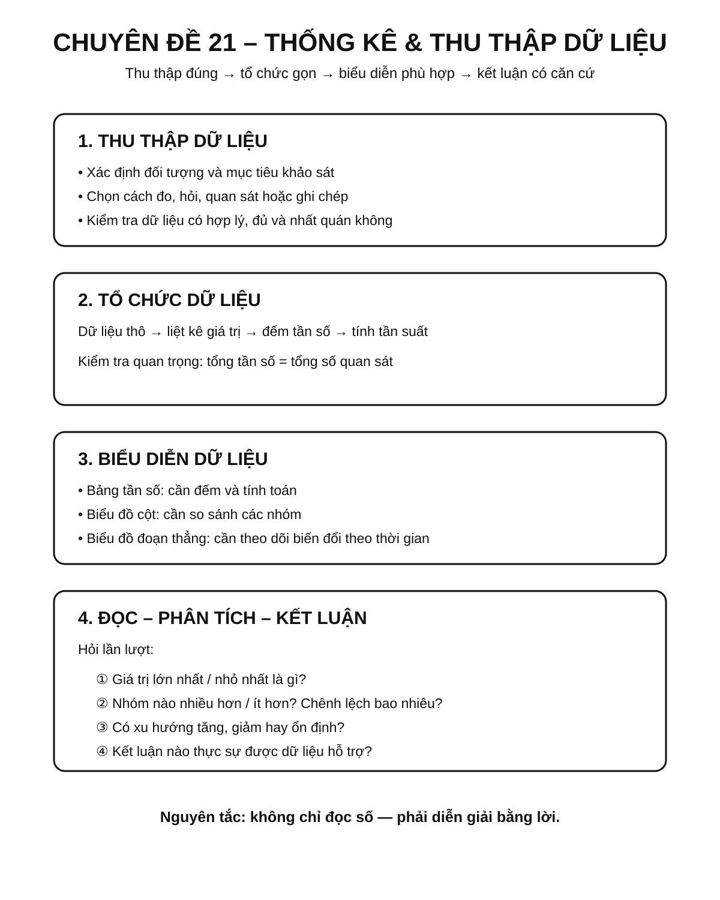
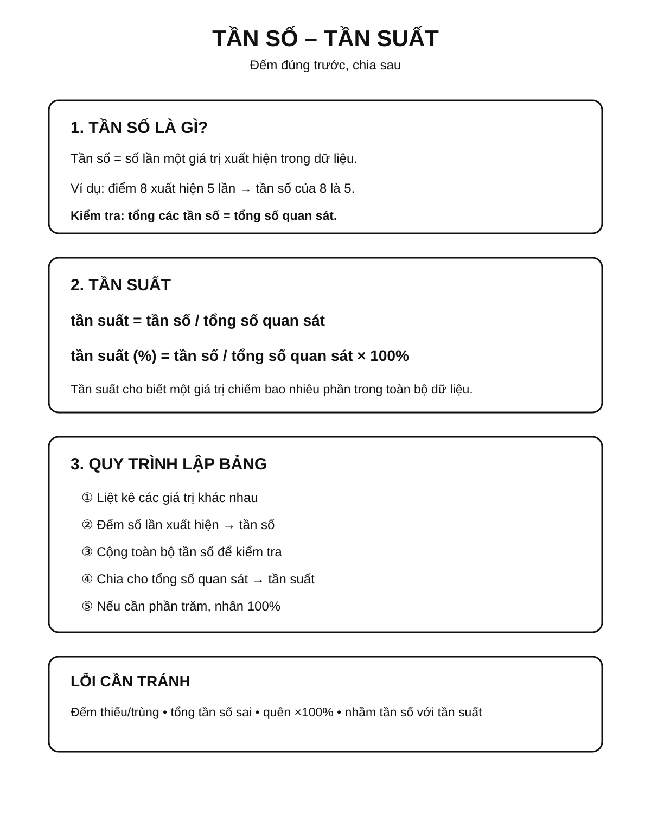
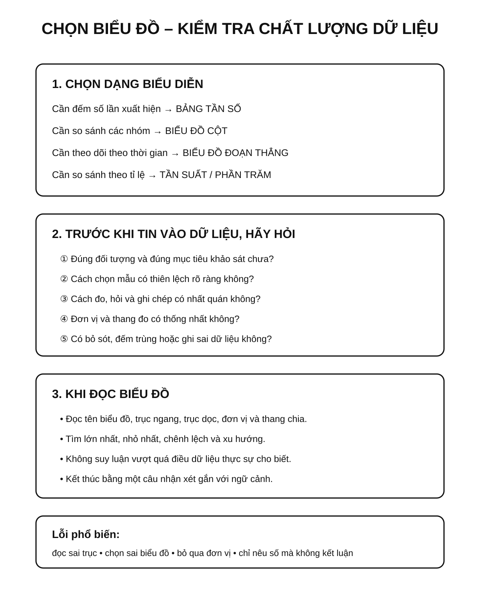

# Chuyên đề 21 – Thống kê và thu thập dữ liệu

> **Trạng thái:** Đã kiểm định nội dung học thuật; cấu trúc Roadmap chuẩn 11 mục.
>
> **Lớp trọng tâm:** 6–9
> **Mạch kiến thức:** Thống kê
> **Mức ưu tiên:** ⭐⭐⭐⭐

---

## 🧭 1. Bản đồ kiến thức

### Infographic tổng quan



```text
THỐNG KÊ & THU THẬP DỮ LIỆU
│
├── Thu thập dữ liệu
│   ├── xác định đối tượng
│   ├── chọn cách thu thập
│   └── kiểm tra tính hợp lý
│
├── Tổ chức dữ liệu
│   ├── bảng dữ liệu
│   ├── bảng tần số
│   ├── bảng tần suất / tần số tương đối
│   └── bảng tần số ghép nhóm
│
├── Biểu diễn dữ liệu
│   ├── biểu đồ cột / cột kép
│   ├── biểu đồ đoạn thẳng
│   ├── biểu đồ hình quạt tròn
│   └── biểu đồ cho dữ liệu ghép nhóm
│
└── Đọc và phân tích
    ├── lớn nhất / nhỏ nhất
    ├── xu hướng
    └── kết luận từ dữ liệu
```

Mạch tư duy trọng tâm:

**thu thập đúng → tổ chức gọn → biểu diễn phù hợp → đọc chính xác → kết luận có căn cứ.**

---

## Minh họa trực quan

### 1. Bảng tần số

<p align="center">
  
</p>

> Bảng tần số giúp ta sắp xếp dữ liệu theo từng giá trị và đếm số lần xuất hiện của mỗi giá trị.

Các khái niệm cần nhớ:

- **Dữ liệu**: các số liệu hoặc thông tin thu thập được;
- **Giá trị dữ liệu**: các giá trị cụ thể xuất hiện trong bộ dữ liệu;
- **Tần số**: số lần một giá trị xuất hiện;
- **Tần suất**: tỉ lệ giữa tần số và tổng số quan sát.

Ví dụ trong bảng trên:

- điểm `8` xuất hiện `5` lần;
- tổng số quan sát là `14`;
- tần suất của điểm `8` là `5/14 ≈ 35,7%`.

---

### 2. Biểu đồ cột

<p align="center">
  
</p>

> Biểu đồ cột thường dùng để so sánh số lượng hoặc tần số giữa các nhóm giá trị khác nhau.

Cách đọc:

1. nhìn tên các cột trên trục ngang;
2. nhìn chiều cao cột;
3. đối chiếu với trục dọc để đọc giá trị;
4. so sánh cột cao nhất, thấp nhất và chênh lệch giữa các cột.

Trong ví dụ:

- cột `8 điểm` cao nhất, nghĩa là xuất hiện nhiều nhất;
- cột `6 điểm` thấp nhất, nghĩa là xuất hiện ít nhất.

---

### 3. Biểu đồ đoạn thẳng

<p align="center">
  
</p>

> Biểu đồ đoạn thẳng phù hợp khi ta muốn theo dõi sự thay đổi của dữ liệu theo thời gian.

Cách đọc:

- xác định từng mốc thời gian trên trục ngang;
- đọc giá trị tương ứng trên trục dọc;
- quan sát xu hướng tăng, giảm hoặc giữ nguyên.

Trong ví dụ:

- nhiệt độ tăng từ ngày 1 đến ngày 3;
- giảm ở ngày 4;
- tăng mạnh ở ngày 5.

---

### Khi nào dùng dạng biểu diễn nào?

| Dạng biểu diễn | Phù hợp khi nào? | Điểm mạnh |
|---|---|---|
| Bảng tần số | Cần thống kê dữ liệu gốc | Gọn, dễ tính toán |
| Biểu đồ cột | Cần so sánh các nhóm | Dễ nhìn, trực quan |
| Biểu đồ đoạn thẳng | Cần theo dõi sự thay đổi theo thời gian | Thể hiện xu hướng rõ |

---

### Mẹo làm bài thống kê

- Đọc kỹ đề để xác định **dữ liệu là gì**.
- Khi lập bảng, phải kiểm tra **tổng tần số** có đúng bằng số quan sát hay không.
- Khi đọc biểu đồ, luôn xem rõ **trục ngang**, **trục dọc** và **đơn vị**.
- Không chỉ đọc từng giá trị riêng lẻ, mà còn nên nhận xét **lớn nhất**, **nhỏ nhất**, **xu hướng chung**.
- Với bài thực tế, nên viết kết luận bằng lời sau khi đọc xong số liệu.

---

### Quy trình xử lý dữ liệu cơ bản

```text
Thu thập dữ liệu
      ↓
Sắp xếp dữ liệu
      ↓
Lập bảng tần số / tần suất
      ↓
Vẽ biểu đồ phù hợp
      ↓
Đọc, nhận xét và rút ra kết luận
```

---

## 🎯 2. Mục tiêu cần đạt

Sau khi hoàn thành chuyên đề, học sinh cần:

- [ ] Phân biệt được dữ liệu, giá trị, tần số và tần suất.
- [ ] Biết thu thập và kiểm tra dữ liệu cơ bản.
- [ ] Lập được bảng tần số và tần suất.
- [ ] Đọc và lập được biểu đồ cột kép, biểu đồ hình quạt tròn trong tình huống phù hợp.
- [ ] Nhận biết được dữ liệu ghép nhóm; lập được bảng tần số và tần số tương đối ghép nhóm ở mức THCS.
- [ ] Đọc chính xác biểu đồ cột và biểu đồ đoạn thẳng.
- [ ] Chọn được dạng biểu diễn phù hợp với mục tiêu.
- [ ] Nhận xét được xu hướng, giá trị lớn nhất, nhỏ nhất và chênh lệch.
- [ ] Viết được kết luận bằng lời từ dữ liệu đã cho.

---

## 📖 3. Kiến thức cốt lõi

### 3.1. Dữ liệu và giá trị dữ liệu

**Dữ liệu** là thông tin thu thập được từ quan sát, đo đạc, khảo sát hoặc ghi chép.

Ví dụ:
- điểm kiểm tra của một lớp;
- chiều cao của học sinh;
- nhiệt độ theo ngày;
- số sản phẩm bán được theo tháng.

Một dữ liệu có thể là số hoặc phân loại.

### 3.2. Tần số

**Tần số** của một giá trị là số lần giá trị đó xuất hiện.

Nếu giá trị `8` xuất hiện `5` lần thì tần số của `8` là:

`n = 5`

Tổng các tần số phải bằng tổng số quan sát.

### 3.3. Tần suất (tần số tương đối)

Tần suất, hay **tần số tương đối**, cho biết một giá trị chiếm bao nhiêu phần trong toàn bộ dữ liệu:

`tần suất = tần số / tổng số quan sát`

Nếu muốn biểu diễn theo phần trăm:

`tần suất (%) = tần số / tổng số quan sát × 100%`

### 3.4. Bảng tần số và bảng tần suất

Quy trình:
1. liệt kê các giá trị khác nhau;
2. đếm số lần xuất hiện;
3. kiểm tra tổng tần số;
4. nếu cần, tính tần suất.

### Infographic – Tần số và tần suất



### 3.5. Biểu đồ cột

Phù hợp khi cần:
- so sánh các nhóm;
- nhìn nhanh nhóm lớn nhất, nhỏ nhất;
- so sánh chênh lệch.

Khi đọc biểu đồ cột phải kiểm tra:
- tên biểu đồ;
- trục ngang;
- trục dọc;
- đơn vị;
- thang chia.

### 3.6. Biểu đồ đoạn thẳng

Phù hợp khi dữ liệu thay đổi theo thời gian.

Cần quan sát:
- xu hướng tăng;
- xu hướng giảm;
- điểm cao nhất, thấp nhất;
- đoạn thay đổi mạnh.


### 3.6A. Biểu đồ cột kép và biểu đồ hình quạt tròn

**Biểu đồ cột kép** phù hợp khi cần so sánh **hai dãy số liệu theo cùng các nhóm**. Khi đọc phải đối chiếu đúng chú giải, vì hai cột đứng cạnh nhau nhưng biểu diễn hai đối tượng khác nhau.

**Biểu đồ hình quạt tròn** phù hợp khi cần mô tả **cơ cấu các phần trong một tổng thể**. Toàn bộ hình tròn tương ứng `100%` hay `360°`.

Nếu một nhóm chiếm `p%` thì góc ở tâm của hình quạt tương ứng là:

`góc = p/100 × 360° = 3,6p°`

> Chỉ dùng biểu đồ quạt tròn khi các phần thuộc cùng một tổng thể. Tổng các tỉ lệ phải bằng `100%` (sai khác rất nhỏ có thể xuất hiện do làm tròn).

### 3.6B. Dữ liệu ghép nhóm, tần số và tần số tương đối ghép nhóm

Khi có nhiều số liệu số và cần trình bày gọn, có thể chia dữ liệu thành các **nhóm không chồng lấn** như:

`[a₁; a₂), [a₂; a₃), ..., [aₖ; aₖ₊₁)`

Mỗi giá trị chỉ được thuộc **một** nhóm.

- **Tần số của một nhóm**: số giá trị nằm trong nhóm đó.
- **Tần số tương đối của một nhóm**: `tần số nhóm / cỡ mẫu`.

Luôn kiểm tra:

`∑ tần số nhóm = N`

và:

`∑ tần số tương đối = 1` (hoặc `100%`).

Khi cần biểu diễn dữ liệu ghép nhóm bằng biểu đồ đoạn thẳng, có thể dùng **giá trị đại diện của nhóm**, thường là trung điểm của khoảng:

`xᵢ = (aᵢ + aᵢ₊₁)/2`

> Các nhóm phải bao phủ toàn bộ dữ liệu và quy ước đầu mút phải nhất quán; nếu nhóm bị chồng lấn, một giá trị ở biên có thể bị đếm hai lần.

### 3.7. Chất lượng dữ liệu

Khi đánh giá dữ liệu cần xem xét:
- dữ liệu có đúng đối tượng và đúng mục tiêu khảo sát hay không;
- cách chọn đối tượng có hợp lý, tránh thiên lệch rõ ràng hay không;
- số lượng quan sát có phù hợp với mục tiêu mô tả hay không;
- cách đo, hỏi và ghi chép có nhất quán hay không;
- đơn vị có thống nhất hay không;
- có bỏ sót, đếm trùng hoặc ghi sai dữ liệu hay không.

> Một bảng số liệu được ghi đúng chưa chắc đã đại diện tốt cho toàn bộ nhóm cần nghiên cứu nếu cách chọn mẫu bị thiên lệch.

### 3.8. Bảng chọn cách biểu diễn

| Mục tiêu | Cách biểu diễn phù hợp |
|---|---|
| Đếm số lần xuất hiện | Bảng tần số |
| So sánh các nhóm | Biểu đồ cột |
| Theo dõi theo thời gian | Biểu đồ đoạn thẳng |
| So sánh theo tỉ lệ | Bảng tần suất / phần trăm |

---

## 🔗 4. Kiến thức liên quan

- **Kiến thức nên ôn trước:** tỉ số, phần trăm và kỹ năng đọc bảng số liệu; có thể xem lại [03 – Tỉ lệ và tỉ lệ thức](../03-ti-le-ti-le-thuc/index.md).
- **Liên hệ mạnh:** phần trăm, đọc bảng, biểu đồ và diễn giải dữ liệu.
- **Chuyên đề sử dụng tiếp:** [22 – Các đại lượng đặc trưng của dữ liệu](../22-dai-luong-dac-trung/index.md), [24 – Bài toán thực tế](../24-bai-toan-thuc-te/index.md)

---

## 🧩 5. Các dạng bài cần nắm vững

### Infographic – Biểu đồ, chất lượng dữ liệu và lỗi sai



### Dạng 1. Đọc bảng dữ liệu

Xác định số quan sát, giá trị lớn nhất, nhỏ nhất và số lần xuất hiện.

### Dạng 2. Lập bảng tần số

Đếm chính xác số lần mỗi giá trị xuất hiện và kiểm tra tổng.

### Dạng 3. Tính tần suất

Dùng:

`tần suất = tần số / tổng số quan sát`

### Dạng 4. Đọc biểu đồ cột

So sánh các nhóm, tính chênh lệch và rút ra nhận xét.

### Dạng 5. Đọc biểu đồ đoạn thẳng

Mô tả xu hướng theo thời gian và xác định các giai đoạn tăng/giảm.

### Dạng 6. Chuyển đổi giữa bảng và biểu đồ

Từ bảng → vẽ biểu đồ, hoặc từ biểu đồ → lập lại bảng.

### Dạng 6A. Biểu đồ cột kép và biểu đồ hình quạt tròn

So sánh đúng hai dãy số liệu trên cột kép; với quạt tròn, kiểm tra tổng tỉ lệ và đổi `p% ↔ 3,6p°` khi cần.

### Dạng 6B. Dữ liệu ghép nhóm

Chọn các khoảng nhóm không chồng lấn, đếm tần số từng nhóm, tính tần số tương đối và đọc/vẽ biểu đồ tương ứng.

### Dạng 7. Bài toán thực tế từ dữ liệu

Đọc dữ liệu, tính toán rồi viết kết luận phù hợp với ngữ cảnh.

---

## 🚀 6. Dạng bài thi vào lớp 10

Trong Roadmap ôn thi vào lớp 10, thống kê được xếp ở mức ưu tiên cao vừa phải và cần chắc kỹ năng đọc, tính toán và diễn giải dữ liệu.

Các kỹ năng cần chắc:
1. Đọc đúng bảng hoặc biểu đồ.
2. Tính tần số, tần suất/tần số tương đối, phần trăm.
3. Đọc biểu đồ cột kép, quạt tròn và dữ liệu ghép nhóm khi xuất hiện.
4. So sánh hai nhóm dữ liệu và nhận xét xu hướng.
5. Kết hợp với số trung bình, trung vị ở Chuyên đề 22.

Mức ưu tiên ôn thi: **⭐⭐⭐⭐**.

---

## ⚠️ 7. Lỗi sai thường gặp

| Lỗi sai | Cách tránh |
|---|---|
| Đếm sai tần số | Đánh dấu từng dữ liệu khi đếm |
| Tổng tần số không bằng số quan sát | Luôn kiểm tra dòng tổng |
| Quên nhân `100%` khi tính tần suất phần trăm | Phân biệt tần suất dạng số và dạng % |
| Đọc sai trục biểu đồ | Xem kỹ đơn vị và thang chia |
| Nhầm biểu đồ cột với biểu đồ theo thời gian | Xác định mục tiêu dữ liệu trước |
| Đọc cột kép nhưng quên chú giải | Xác định rõ mỗi màu/cột thuộc dãy số liệu nào |
| Chia nhóm bị chồng lấn hoặc bỏ hở | Dùng các khoảng liên tiếp và thống nhất quy ước đầu mút |
| Biểu đồ quạt tròn có tổng tỉ lệ khác xa `100%` | Kiểm tra lại phần trăm trước khi vẽ/đọc |
| Chỉ nêu số mà không kết luận | Viết một câu nhận xét theo ngữ cảnh |

---

## 📝 8. Luyện tập

### Mức 1 – Nhận biết

1. Tần số là gì?
2. Tần suất được tính như thế nào?
3. Biểu đồ đoạn thẳng phù hợp nhất với loại dữ liệu nào?

### Mức 2 – Thông hiểu

4. Dữ liệu: `6, 7, 8, 8, 9, 8, 7`. Hãy lập bảng tần số.
5. Trong 20 học sinh có 6 học sinh chọn phương án A. Tính tần suất phần trăm.
6. Một biểu đồ cột có các giá trị `12, 18, 15, 20`. Xác định lớn nhất và nhỏ nhất.

### Mức 3 – Vận dụng

7. Từ một bảng tần số, hãy chọn dạng biểu đồ phù hợp và giải thích lựa chọn.
8. Một biểu đồ nhiệt độ theo 7 ngày có xu hướng tăng rồi giảm. Hãy mô tả bằng lời.
9. Từ biểu đồ cột, tính chênh lệch giữa hai nhóm.

### Mức 4 – Tổng hợp

10. Cho dữ liệu khảo sát của một lớp. Hãy lập bảng tần số, tính tần suất, chọn biểu đồ và viết hai nhận xét.
11. Phát hiện một bảng thống kê có tổng tần số không khớp tổng quan sát và nêu cách kiểm tra.

---

## ✅ 9. Tự kiểm tra

Hãy tự trả lời không nhìn tài liệu:

1. Tần số khác tần suất ở điểm nào?
2. Tổng tần số phải bằng đại lượng nào?
3. Công thức tính tần suất phần trăm là gì?
4. Khi nào nên dùng biểu đồ cột?
5. Khi nào nên dùng biểu đồ đoạn thẳng?
6. Khi đọc biểu đồ cần kiểm tra những thành phần nào?
7. Dữ liệu có thể sai do những nguyên nhân nào?
8. Sau khi đọc dữ liệu có nên viết kết luận bằng lời không?

**Tiêu chí đạt:** đúng ít nhất `7/8` câu và hoàn thành được một bài từ dữ liệu thô đến bảng/biểu đồ.

---

## 🔄 10. Liên kết Roadmap

- **← Trước:** [20 – Hình học tổng hợp, đo lường và hình khối](../20-hinh-hoc-tong-hop/index.md)
- **→ Tiếp theo:** [22 – Các đại lượng đặc trưng](../22-dai-luong-dac-trung/index.md)
- **→ Kiến thức nền liên hệ:** [03 – Tỉ lệ và tỉ lệ thức](../03-ti-le-ti-le-thuc/index.md)
- **→ Liên hệ:** [24 – Bài toán thực tế](../24-bai-toan-thuc-te/index.md)

- **✏️ Luyện tập:** [Bài tập Chuyên đề 21](bai-tap.md)
- **✅ Tự kiểm tra:** [Tự kiểm tra Chuyên đề 21](tu-kiem-tra.md)

Xem toàn bộ hệ thống tại [Blueprint 25 chuyên đề](../../roadmap/blueprint-25-chuyen-de.md).

---

## 🏁 11. Điều kiện hoàn thành

Chuyên đề được xem là hoàn thành khi học sinh:

- [ ] Phân biệt đúng dữ liệu, tần số và tần suất.
- [ ] Lập đúng bảng tần số.
- [ ] Tính đúng tần suất và phần trăm.
- [ ] Đọc chính xác biểu đồ cột, cột kép, đoạn thẳng và hình quạt tròn.
- [ ] Lập được bảng tần số/tần số tương đối ghép nhóm cơ bản.
- [ ] Chọn đúng dạng biểu diễn dữ liệu.
- [ ] Viết được nhận xét có căn cứ.
- [ ] Đạt tối thiểu **7/10** ở bài Tự kiểm tra và chữa xong các câu sai trước khi chuyển sang Chuyên đề 22.
