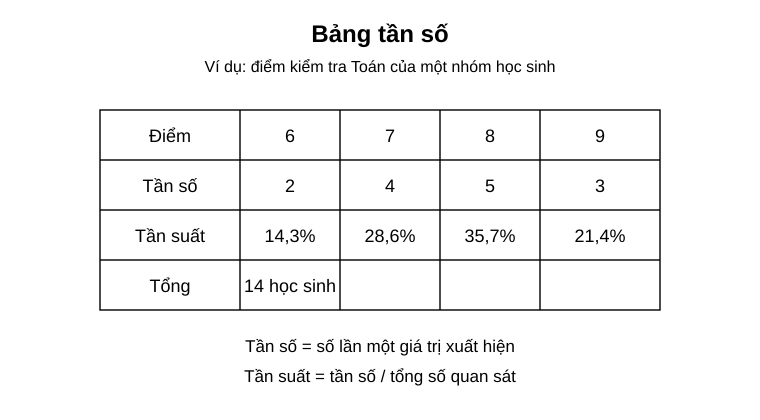
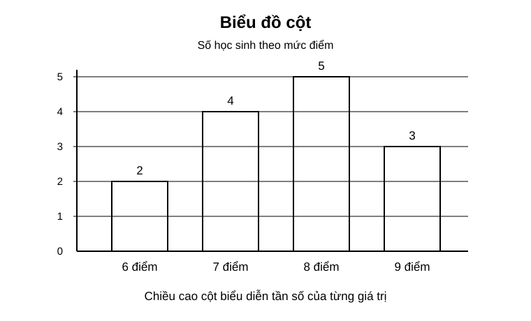
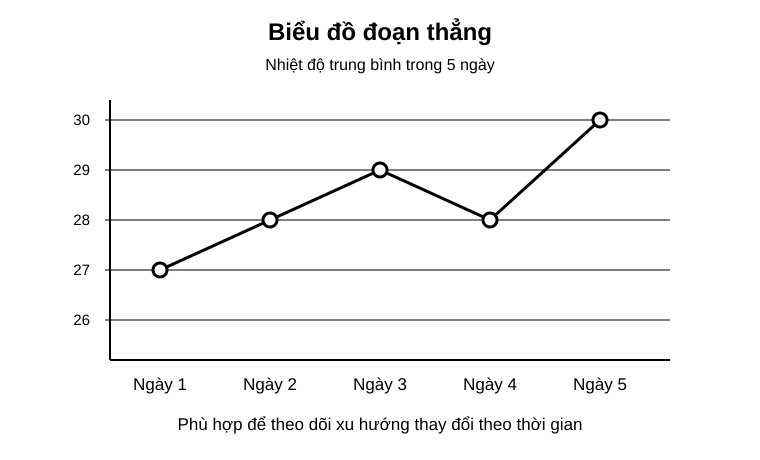

# Chuyên đề 21 – Thống kê và thu thập dữ liệu

> **Trạng thái:** Khung chuẩn đã được tạo. Nội dung chi tiết sẽ được hoàn thiện theo thứ tự ưu tiên của Roadmap.
>
> **Lớp trọng tâm:** 6–9  
> **Mạch kiến thức:** Thống kê  
> **Mức ưu tiên:** ⭐⭐⭐⭐

---

## 🧭 1. Bản đồ kiến thức

Bản đồ kiến thức chi tiết của chuyên đề sẽ được bổ sung trong giai đoạn biên soạn nội dung.

---

## Minh họa trực quan

### 1. Bảng tần số

<p align="center">
  
</p>

> Bảng tần số giúp ta sắp xếp dữ liệu theo từng giá trị và đếm số lần xuất hiện của mỗi giá trị.

Các khái niệm cần nhớ:

- **Dữ liệu**: các số liệu hoặc thông tin thu thập được;
- **Giá trị của dấu hiệu**: các giá trị cụ thể xuất hiện trong dữ liệu;
- **Tần số**: số lần một giá trị xuất hiện;
- **Tần suất**: tỉ lệ giữa tần số và tổng số quan sát.

Ví dụ trong bảng trên:

- điểm `8` xuất hiện `5` lần;
- tổng số quan sát là `14`;
- tần suất của điểm `8` là `5/14 ≈ 35,7%`.

---

### 2. Biểu đồ cột

<p align="center">
  
</p>

> Biểu đồ cột thường dùng để so sánh số lượng hoặc tần số giữa các nhóm giá trị khác nhau.

Cách đọc:

1. nhìn tên các cột trên trục ngang;
2. nhìn chiều cao cột;
3. đối chiếu với trục dọc để đọc giá trị;
4. so sánh cột cao nhất, thấp nhất và chênh lệch giữa các cột.

Trong ví dụ:

- cột `8 điểm` cao nhất, nghĩa là xuất hiện nhiều nhất;
- cột `6 điểm` thấp nhất, nghĩa là xuất hiện ít nhất.

---

### 3. Biểu đồ đoạn thẳng

<p align="center">
  
</p>

> Biểu đồ đoạn thẳng phù hợp khi ta muốn theo dõi sự thay đổi của dữ liệu theo thời gian.

Cách đọc:

- xác định từng mốc thời gian trên trục ngang;
- đọc giá trị tương ứng trên trục dọc;
- quan sát xu hướng tăng, giảm hoặc giữ nguyên.

Trong ví dụ:

- nhiệt độ tăng từ ngày 1 đến ngày 3;
- giảm ở ngày 4;
- tăng mạnh ở ngày 5.

---

### Khi nào dùng dạng biểu diễn nào?

| Dạng biểu diễn | Phù hợp khi nào? | Điểm mạnh |
|---|---|---|
| Bảng tần số | Cần thống kê dữ liệu gốc | Gọn, dễ tính toán |
| Biểu đồ cột | Cần so sánh các nhóm | Dễ nhìn, trực quan |
| Biểu đồ đoạn thẳng | Cần theo dõi sự thay đổi theo thời gian | Thể hiện xu hướng rõ |

---

### Mẹo làm bài thống kê

- Đọc kỹ đề để xác định **dữ liệu là gì**.
- Khi lập bảng, phải kiểm tra **tổng tần số** có đúng bằng số quan sát hay không.
- Khi đọc biểu đồ, luôn xem rõ **trục ngang**, **trục dọc** và **đơn vị**.
- Không chỉ đọc từng giá trị riêng lẻ, mà còn nên nhận xét **lớn nhất**, **nhỏ nhất**, **xu hướng chung**.
- Với bài thực tế, nên viết kết luận bằng lời sau khi đọc xong số liệu.

---

### Quy trình xử lý dữ liệu cơ bản

```text
Thu thập dữ liệu
      ↓
Sắp xếp dữ liệu
      ↓
Lập bảng tần số / tần suất
      ↓
Vẽ biểu đồ phù hợp
      ↓
Đọc, nhận xét và rút ra kết luận
```

---

## 🎯 2. Mục tiêu cần đạt

Sau khi hoàn thành chuyên đề, học sinh cần:

- [ ] Nắm được các khái niệm và tính chất cốt lõi.
- [ ] Nhận dạng được các dạng bài cơ bản và trọng tâm.
- [ ] Biết lựa chọn phương pháp giải phù hợp.
- [ ] Trình bày lời giải rõ ràng và kiểm tra được kết quả.
- [ ] Biết liên hệ kiến thức với các chuyên đề trước và sau.

---

## 📖 3. Kiến thức cốt lõi

Nội dung cốt lõi sẽ được biên soạn theo chương trình Toán THCS và chuẩn cấu trúc của Roadmap.

---

## 🔗 4. Kiến thức liên quan

- **Kiến thức nên ôn trước:** 01
- **Chuyên đề sử dụng tiếp:** 22, 24

---

## 🧩 5. Các dạng bài cần nắm vững

Danh mục dạng bài sẽ được bổ sung khi chuyên đề được biên soạn đầy đủ.

---

## 🚀 6. Dạng bài thi vào lớp 10

Các dạng bài liên quan đến thi vào lớp 10 sẽ được đánh dấu theo mức độ ưu tiên và liên kết sang khu vực ôn thi khi hoàn thiện.

---

## ⚠️ 7. Lỗi sai thường gặp

Mục này sẽ tổng hợp các lỗi sai điển hình, nguyên nhân và cách tự kiểm tra.

---

## 📝 8. Luyện tập

Bài tập sẽ được chia theo 4 mức:

1. Nhận biết
2. Thông hiểu
3. Vận dụng
4. Vận dụng cao / tổng hợp

---

## ✅ 9. Tự kiểm tra

Bộ câu hỏi tự kiểm tra và tiêu chí đạt sẽ được bổ sung cùng nội dung chi tiết.

---

## 🔄 10. Liên kết Roadmap

- **← Trước:** 01
- **→ Tiếp theo:** 22, 24

Xem toàn bộ hệ thống tại [Blueprint 25 chuyên đề](../../roadmap/blueprint-25-chuyen-de.md).

---

## 🏁 11. Điều kiện hoàn thành

Chuyên đề được xem là hoàn thành khi học sinh:

- [ ] Hiểu kiến thức cốt lõi.
- [ ] Làm chắc các dạng bài nền tảng.
- [ ] Nhận diện và tránh được lỗi sai thường gặp.
- [ ] Đạt yêu cầu phần tự kiểm tra.
- [ ] Biết chuyên đề này kết nối với kiến thức nào trong Roadmap.
