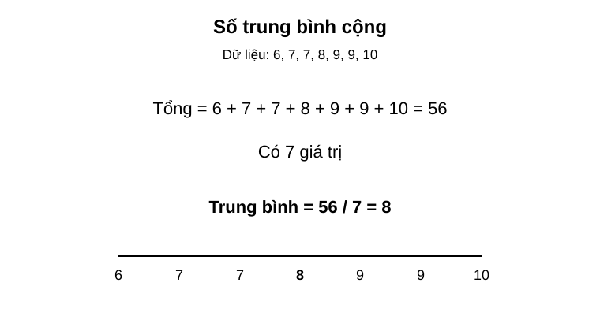
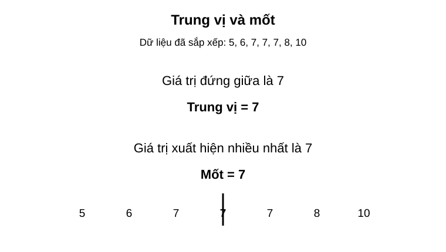
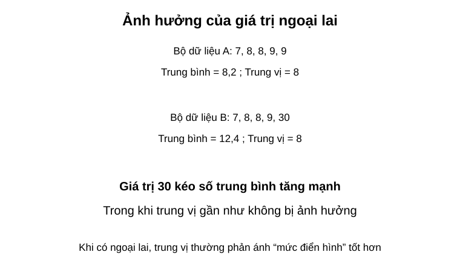

# Chuyên đề 22 – Các đại lượng đặc trưng của dữ liệu

> **Trạng thái:** Nội dung cốt lõi đã hoàn thiện theo cấu trúc Roadmap.
>
> **Lớp trọng tâm:** 7–9  
> **Mạch kiến thức:** Thống kê  
> **Mức ưu tiên:** ⭐⭐⭐⭐

---

## 🧭 1. Bản đồ kiến thức

```text
ĐẠI LƯỢNG ĐẶC TRƯNG CỦA DỮ LIỆU
│
├── Số trung bình cộng
│   ├── dữ liệu thô
│   └── dữ liệu có tần số
│
├── Trung vị
│   ├── số phần tử lẻ
│   └── số phần tử chẵn
│
├── Mốt
│   └── giá trị xuất hiện nhiều nhất
│
├── Mức độ phân tán đơn giản
│   └── khoảng biến thiên = lớn nhất - nhỏ nhất
│
└── Chọn đại lượng phù hợp
    ├── dữ liệu ổn định → trung bình
    ├── có ngoại lai → cân nhắc trung vị
    └── cần giá trị phổ biến → mốt
```

Mạch tư duy trọng tâm:

**sắp xếp dữ liệu → tính đúng đại lượng → so sánh → chọn đại lượng đại diện hợp lý → giải thích bằng ngữ cảnh.**

---

## Minh họa trực quan

### 1. Số trung bình cộng

<p align="center">
  
</p>

> Số trung bình cộng cho biết mức “trung bình” của một bộ dữ liệu.

Công thức:

`Số trung bình = tổng các giá trị / số lượng giá trị`

Ví dụ trong hình:

- tổng các giá trị là `56`;
- có `7` giá trị;
- nên số trung bình là `56 / 7 = 8`.

---

### 2. Trung vị và mốt

<p align="center">
  
</p>

> **Trung vị** là giá trị đứng giữa sau khi dữ liệu đã được sắp xếp theo thứ tự.

> **Mốt** là giá trị xuất hiện nhiều nhất trong bộ dữ liệu.

Trong ví dụ:

- dữ liệu đã sắp xếp là `5, 6, 7, 7, 7, 8, 10`;
- giá trị ở giữa là `7` nên **trung vị = 7**;
- giá trị xuất hiện nhiều nhất cũng là `7` nên **mốt = 7**.

Lưu ý:

- muốn tìm trung vị, luôn phải **sắp xếp dữ liệu trước**;
- một bộ dữ liệu có thể có **một mốt, nhiều mốt hoặc không có mốt rõ ràng**.

---

### 3. Ảnh hưởng của giá trị ngoại lai

<p align="center">
  
</p>

> **Giá trị ngoại lai** là một giá trị quá lớn hoặc quá nhỏ so với phần còn lại của dữ liệu.

Trong hình:

- Bộ A: `7, 8, 8, 9, 9` có trung bình `8,2` và trung vị `8`;
- Bộ B: `7, 8, 8, 9, 30` có trung bình `12,4` nhưng trung vị vẫn là `8`.

Nhận xét quan trọng:

> Giá trị ngoại lai có thể làm **số trung bình thay đổi mạnh**, nhưng thường **ít ảnh hưởng hơn đến trung vị**.

---

### Khi nào nên dùng đại lượng nào?

| Đại lượng | Ý nghĩa | Phù hợp khi nào? |
|---|---|---|
| Số trung bình cộng | Giá trị trung bình chung | Dữ liệu khá ổn định, không có ngoại lai quá lớn |
| Trung vị | Giá trị đứng giữa | Dữ liệu có ngoại lai hoặc cần mức “điển hình” |
| Mốt | Giá trị xuất hiện nhiều nhất | Cần biết giá trị phổ biến nhất |

---

### Bảng so sánh nhanh

| Đại lượng | Cách tìm | Ưu điểm | Hạn chế |
|---|---|---|---|
| Trung bình | Cộng tất cả rồi chia cho số phần tử | Dễ tính, dùng nhiều | Nhạy với ngoại lai |
| Trung vị | Sắp xếp rồi lấy giá trị giữa | Ít bị ảnh hưởng bởi ngoại lai | Không phản ánh hết mọi giá trị |
| Mốt | Tìm giá trị xuất hiện nhiều nhất | Dễ hiểu, trực quan | Có thể có nhiều mốt |

---

### Mẹo làm bài

- Với **trung bình**, nhớ tính đúng tổng rồi chia đúng số phần tử.
- Với **trung vị**, phải sắp xếp dữ liệu trước.
- Với **mốt**, kiểm tra giá trị nào lặp lại nhiều nhất.
- Khi đề bài có một giá trị quá lớn hoặc quá nhỏ, hãy nghĩ ngay đến **ngoại lai**.
- Nếu đề yêu cầu “giá trị đại diện hợp lý hơn”, nhiều khi **trung vị** là lựa chọn tốt hơn trung bình.

---

### Quy trình xử lý dữ liệu trong bài toán thực tế

```text
Thu thập dữ liệu
      ↓
Sắp xếp dữ liệu
      ↓
Tính trung bình / tìm trung vị / tìm mốt
      ↓
So sánh các kết quả
      ↓
Chọn đại lượng phù hợp để nhận xét
```

---

## 🎯 2. Mục tiêu cần đạt

Sau khi hoàn thành chuyên đề, học sinh cần:

- [ ] Tính đúng số trung bình cộng của một bộ dữ liệu.
- [ ] Tính được số trung bình khi dữ liệu được cho bằng bảng tần số.
- [ ] Tìm đúng trung vị khi số phần tử là lẻ hoặc chẵn.
- [ ] Xác định đúng mốt của dữ liệu.
- [ ] Nhận biết ảnh hưởng của giá trị ngoại lai.
- [ ] Biết dùng khoảng biến thiên để mô tả mức độ phân tán đơn giản.
- [ ] Chọn và giải thích được đại lượng đại diện phù hợp với tình huống.

---

## 📖 3. Kiến thức cốt lõi

### 3.1. Số trung bình cộng

Với dữ liệu:

`x₁, x₂, ..., xₙ`

số trung bình cộng là:

`x̄ = (x₁ + x₂ + ... + xₙ) / n`

Số trung bình sử dụng **tất cả giá trị** trong bộ dữ liệu nên phản ánh mức chung khá tốt khi dữ liệu không có ngoại lai quá mạnh.

### 3.2. Số trung bình từ bảng tần số

Nếu giá trị `xᵢ` xuất hiện `nᵢ` lần thì:

`x̄ = (x₁n₁ + x₂n₂ + ... + xₖnₖ) / (n₁ + n₂ + ... + nₖ)`

Ví dụ:

| Điểm | 6 | 7 | 8 |
|---|---:|---:|---:|
| Tần số | 2 | 3 | 5 |

Khi đó:

`x̄ = (6×2 + 7×3 + 8×5) / 10 = 7,3`

### 3.3. Trung vị

Trước tiên phải **sắp xếp dữ liệu** theo thứ tự tăng hoặc giảm.

- Nếu có số phần tử lẻ, trung vị là giá trị chính giữa.
- Nếu có số phần tử chẵn, trung vị là trung bình cộng của hai giá trị chính giữa.

Ví dụ:

`4, 6, 7, 8, 10`

→ trung vị là `7`.

Với:

`4, 6, 7, 8, 10, 12`

→ trung vị là:

`(7 + 8)/2 = 7,5`

### 3.4. Mốt

Mốt là giá trị xuất hiện nhiều nhất.

Một bộ dữ liệu:
- có thể có một mốt;
- có thể có nhiều mốt;
- có thể không có mốt nếu không có giá trị nào nổi bật về tần số.

### 3.5. Khoảng biến thiên

Một cách đơn giản để mô tả độ phân tán của dữ liệu là:

`R = giá trị lớn nhất - giá trị nhỏ nhất`

Khoảng biến thiên càng lớn thì dữ liệu trải rộng hơn.

Ví dụ:

`5, 6, 7, 8, 9`

có:

`R = 9 - 5 = 4`

### 3.6. Giá trị ngoại lai

Một giá trị quá lớn hoặc quá nhỏ so với phần còn lại có thể làm số trung bình thay đổi mạnh.

Ví dụ:

`7, 8, 8, 9, 30`

trung bình là `12,4`, nhưng trung vị vẫn là `8`.

Vì vậy, trong dữ liệu có ngoại lai, **trung vị thường mô tả mức điển hình tốt hơn trung bình**.

### 3.7. Chọn đại lượng nào?

| Mục tiêu | Đại lượng ưu tiên |
|---|---|
| Mức chung của dữ liệu ổn định | Trung bình |
| Giá trị điển hình khi có ngoại lai | Trung vị |
| Giá trị phổ biến nhất | Mốt |
| Mức trải rộng đơn giản | Khoảng biến thiên |

Không nên chỉ tính toán; cần giải thích vì sao đại lượng đó phù hợp với ngữ cảnh.

---

## 🔗 4. Kiến thức liên quan

- **Kiến thức nên ôn trước:** [21 – Thống kê và thu thập dữ liệu](../21-thong-ke/index.md)
- **Liên hệ mạnh:** bảng tần số, tần suất, phần trăm.
- **Chuyên đề sử dụng tiếp:** [24 – Bài toán thực tế](../24-bai-toan-thuc-te/index.md), [25 – Tổng hợp ôn thi vào 10](../25-tong-hop-on-thi-10/index.md)

---

## 🧩 5. Các dạng bài cần nắm vững

### Dạng 1. Tính số trung bình của dữ liệu thô

Cộng tất cả giá trị rồi chia đúng số phần tử.

### Dạng 2. Tính số trung bình từ bảng tần số

Nhân từng giá trị với tần số trước khi cộng.

### Dạng 3. Tìm trung vị

Sắp xếp dữ liệu, sau đó xác định vị trí giữa.

### Dạng 4. Tìm mốt

Đếm tần số và chọn giá trị xuất hiện nhiều nhất.

### Dạng 5. Tính khoảng biến thiên

Dùng:

`R = max - min`

### Dạng 6. So sánh hai bộ dữ liệu

So sánh trung bình, trung vị, mốt hoặc khoảng biến thiên tùy câu hỏi.

### Dạng 7. Chọn đại lượng đại diện hợp lý

Đặc biệt chú ý dữ liệu có ngoại lai; không mặc định trung bình luôn là lựa chọn tốt nhất.

---

## 🚀 6. Dạng bài thi vào lớp 10

Trong đề thi vào 10, nhóm bài này thường ở mức cơ bản đến vận dụng vừa và có thể gắn với bảng hoặc biểu đồ.

Các kỹ năng cần chắc:
1. Tính số trung bình từ dữ liệu hoặc bảng tần số.
2. Tìm trung vị sau khi sắp xếp.
3. Nhận biết mốt.
4. So sánh các đại lượng giữa hai nhóm.
5. Giải thích ảnh hưởng của ngoại lai.
6. Chọn đại lượng đại diện phù hợp với ngữ cảnh.

Mức ưu tiên ôn thi: **⭐⭐⭐⭐**.

---

## ⚠️ 7. Lỗi sai thường gặp

| Lỗi sai | Cách tránh |
|---|---|
| Chia tổng cho sai số phần tử | Đếm lại số quan sát hoặc tổng tần số |
| Tính trung bình từ bảng nhưng quên nhân tần số | Dùng `giá trị × tần số` |
| Tìm trung vị khi chưa sắp xếp | Luôn sắp xếp trước |
| Số phần tử chẵn nhưng lấy một giá trị giữa | Phải lấy trung bình của hai giá trị giữa |
| Nhầm mốt với trung bình | Mốt là giá trị có tần số lớn nhất |
| Bỏ qua ngoại lai khi nhận xét | So sánh trung bình và trung vị |
| Chỉ nêu con số mà không giải thích | Kết luận theo ngữ cảnh dữ liệu |

---

## 📝 8. Luyện tập

### Mức 1 – Nhận biết

1. Nêu công thức tính số trung bình cộng.
2. Muốn tìm trung vị phải làm gì trước?
3. Mốt là gì?
4. Khoảng biến thiên được tính như thế nào?

### Mức 2 – Thông hiểu

5. Tính trung bình của `6, 7, 8, 8, 9`.
6. Tìm trung vị của `3, 5, 7, 8, 10`.
7. Tìm trung vị của `2, 4, 6, 8, 10, 12`.
8. Tìm mốt của `4, 5, 5, 6, 7, 5, 8`.

### Mức 3 – Vận dụng

9. Bảng tần số có các giá trị `6, 7, 8` với tần số `2, 3, 5`. Tính số trung bình.
10. So sánh hai bộ dữ liệu có cùng trung bình nhưng khoảng biến thiên khác nhau.
11. Với dữ liệu `7, 8, 8, 9, 30`, hãy tính trung bình, trung vị và nhận xét đại lượng nào đại diện hợp lý hơn.

### Mức 4 – Tổng hợp

12. Cho bảng điểm của hai lớp. Hãy tính trung bình và trung vị rồi đưa ra nhận xét có căn cứ.
13. Một bộ dữ liệu bị nhập nhầm một giá trị rất lớn. Hãy phân tích đại lượng nào bị ảnh hưởng mạnh nhất và giải thích.

---

## ✅ 9. Tự kiểm tra

Hãy tự trả lời không nhìn tài liệu:

1. Công thức số trung bình là gì?
2. Khi dữ liệu có tần số, phải tính trung bình như thế nào?
3. Trung vị của dữ liệu có số phần tử chẵn được xác định ra sao?
4. Mốt là đại lượng nào?
5. Khoảng biến thiên cho biết điều gì?
6. Ngoại lai ảnh hưởng mạnh hơn đến trung bình hay trung vị?
7. Khi nào trung vị có thể phù hợp hơn trung bình?
8. Một bộ dữ liệu có thể có nhiều mốt không?

**Tiêu chí đạt:** đúng ít nhất `7/8` câu và giải được một bài so sánh hai bộ dữ liệu.

---

## 🔄 10. Liên kết Roadmap

- **← Trước:** [21 – Thống kê và thu thập dữ liệu](../21-thong-ke/index.md)
- **→ Tiếp theo:** [24 – Bài toán thực tế](../24-bai-toan-thuc-te/index.md)
- **→ Tổng hợp:** [25 – Ôn thi vào 10](../25-tong-hop-on-thi-10/index.md)

Xem toàn bộ hệ thống tại [Blueprint 25 chuyên đề](../../roadmap/blueprint-25-chuyen-de.md).

---

## 🏁 11. Điều kiện hoàn thành

Chuyên đề được xem là hoàn thành khi học sinh:

- [ ] Tính đúng trung bình từ dữ liệu thô và bảng tần số.
- [ ] Tìm đúng trung vị với cả số phần tử lẻ và chẵn.
- [ ] Xác định đúng mốt.
- [ ] Tính được khoảng biến thiên.
- [ ] Nhận biết được ảnh hưởng của ngoại lai.
- [ ] Chọn được đại lượng đại diện phù hợp và giải thích được lý do.
- [ ] Đạt ít nhất `7/8` câu tự kiểm tra.
