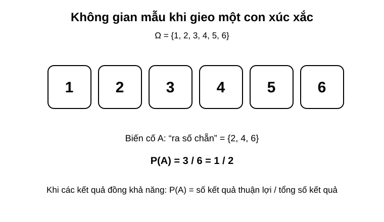
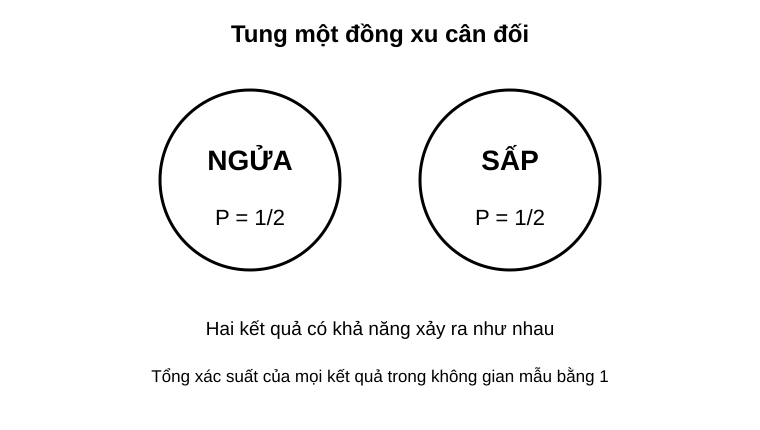
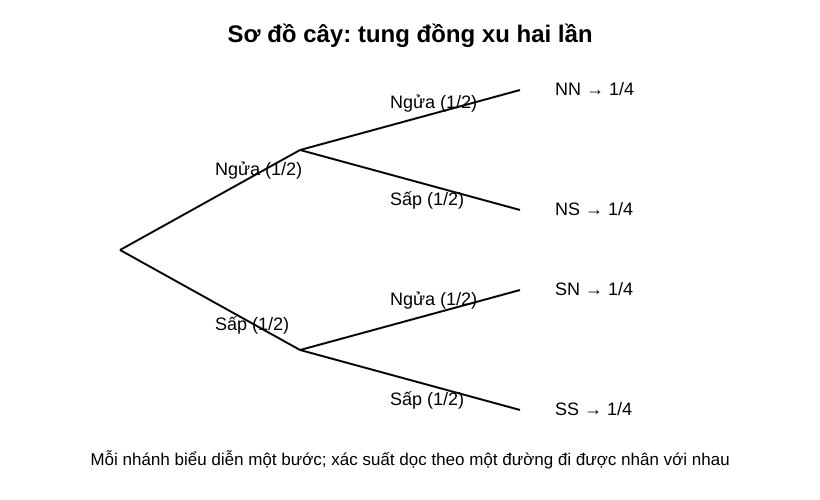

# Chuyên đề 23 – Xác suất

> **Trạng thái:** Đã kiểm định nội dung học thuật; cấu trúc Roadmap chuẩn 11 mục.
>
> **Lớp trọng tâm:** 6–9
> **Mạch kiến thức:** Xác suất
> **Mức ưu tiên:** ⭐⭐⭐⭐

---

## 🧭 1. Bản đồ kiến thức

```text
XÁC SUẤT
│
├── Phép thử ngẫu nhiên
│   └── kết quả không biết trước
│
├── Không gian mẫu Ω
│   └── tập hợp mọi kết quả có thể
│
├── Biến cố
│   ├── biến cố chắc chắn
│   ├── biến cố không thể
│   └── biến cố ngẫu nhiên
│
├── Xác suất cổ điển
│   └── P(A) = n(A) / n(Ω)
│
└── Thí nghiệm nhiều bước
    ├── bảng liệt kê
    └── sơ đồ cây
```

Mạch tư duy trọng tâm:

**xác định phép thử → liệt kê đúng không gian mẫu → mô tả biến cố → đếm kết quả thuận lợi → tính xác suất → kiểm tra kết quả nằm trong `[0,1]`.**

---

## Minh họa trực quan

### 1. Không gian mẫu và biến cố

<p align="center">
  
</p>

> **Không gian mẫu** là tập hợp tất cả các kết quả có thể xảy ra của một phép thử ngẫu nhiên.

Ví dụ, khi gieo một con xúc xắc một lần:

`Ω = {1, 2, 3, 4, 5, 6}`

Nếu xét biến cố `A`: “ra số chẵn”, thì:

`A = {2, 4, 6}`

Vì có `3` kết quả thuận lợi trên `6` kết quả có thể, nên:

`P(A) = 3/6 = 1/2`

---

### 2. Xác suất của một biến cố đơn giản

<p align="center">
  
</p>

> Với một phép thử có các kết quả **đồng khả năng**, xác suất của biến cố được tính bằng:

`P(A) = số kết quả thuận lợi / tổng số kết quả có thể`

Ví dụ, khi tung một đồng xu cân đối:

- không gian mẫu gồm `Ngửa`, `Sấp`;
- mỗi kết quả có khả năng như nhau;
- nên:

`P(Ngửa) = 1/2`

`P(Sấp) = 1/2`

Lưu ý quan trọng:

> Xác suất của một biến cố luôn nằm trong khoảng từ `0` đến `1`.

---

### 3. Sơ đồ cây cho thí nghiệm nhiều bước

<p align="center">
  
</p>

> Khi thí nghiệm có nhiều bước liên tiếp, **sơ đồ cây** là công cụ rất hữu ích để liệt kê kết quả.

Ví dụ, tung đồng xu hai lần:

Không gian mẫu là:

`{NN, NS, SN, SS}`

Nếu đồng xu cân đối, mỗi kết quả có xác suất:

`1/4`

Ví dụ:

- `NN` nghĩa là lần 1 ngửa, lần 2 ngửa;
- `NS` nghĩa là lần 1 ngửa, lần 2 sấp.

Khi đi theo một nhánh trong sơ đồ cây, ta nhân các xác suất của từng bước trên nhánh đó. Với các bước độc lập, có thể nhân trực tiếp các xác suất riêng của từng bước; nếu các bước phụ thuộc nhau thì phải dùng xác suất phù hợp với điều kiện đã xảy ra trước đó.

---

### Các khái niệm cần nhớ

| Khái niệm | Ý nghĩa |
|---|---|
| Phép thử ngẫu nhiên | Thao tác có nhiều kết quả không biết trước |
| Không gian mẫu `Ω` | Tập hợp tất cả các kết quả có thể xảy ra |
| Biến cố | Một tập con của không gian mẫu |
| Xác suất của biến cố `A` | Mức độ có thể xảy ra của `A` |

---

### Tính chất cơ bản của xác suất

- `0 ≤ P(A) ≤ 1`
- Biến cố chắc chắn có xác suất bằng `1`
- Biến cố không thể xảy ra có xác suất bằng `0`

Nếu mọi kết quả đều đồng khả năng:

`P(A) = n(A) / n(Ω)`

trong đó:

- `n(A)` là số kết quả thuận lợi cho biến cố `A`;
- `n(Ω)` là số phần tử của không gian mẫu.

---

### Khi nào nên dùng sơ đồ cây?

Sơ đồ cây đặc biệt hữu ích khi:

- thí nghiệm có **nhiều bước liên tiếp**;
- cần liệt kê **toàn bộ kết quả**;
- dễ nhầm nếu chỉ liệt kê bằng lời;
- cần tính xác suất của các biến cố như “ít nhất một lần”, “cả hai lần”, “đúng một lần”.

---

### Mẹo làm bài xác suất

- Luôn xác định **phép thử** trước.
- Viết rõ **không gian mẫu**.
- Xác định đúng **biến cố cần tính**.
- Kiểm tra xem các kết quả có **đồng khả năng** hay không.
- Với bài nhiều bước, ưu tiên dùng **sơ đồ cây** hoặc bảng liệt kê.

---

### Quy trình giải bài xác suất

```text
Xác định phép thử
      ↓
Lập không gian mẫu
      ↓
Xác định biến cố cần xét
      ↓
Đếm số kết quả thuận lợi
      ↓
Áp dụng công thức xác suất
      ↓
Kết luận
```

---

## 🎯 2. Mục tiêu cần đạt

Sau khi hoàn thành chuyên đề, học sinh cần:

- [ ] Phân biệt được phép thử ngẫu nhiên, không gian mẫu và biến cố.
- [ ] Lập đúng không gian mẫu trong các phép thử đơn giản.
- [ ] Tính được xác suất cổ điển khi các kết quả đồng khả năng.
- [ ] Nhận biết biến cố chắc chắn và biến cố không thể.
- [ ] Dùng được bảng hoặc sơ đồ cây cho thí nghiệm nhiều bước.
- [ ] Giải được các bài “ít nhất một”, “đúng một”, “cả hai”.
- [ ] Biết kiểm tra tính hợp lý của kết quả xác suất.

---

## 📖 3. Kiến thức cốt lõi

### 3.1. Phép thử ngẫu nhiên

Phép thử ngẫu nhiên là một thao tác mà ta biết các kết quả có thể xảy ra nhưng **không biết chắc kết quả nào sẽ xuất hiện trước khi thực hiện**.

Ví dụ:
- tung đồng xu;
- gieo xúc xắc;
- rút một thẻ từ hộp.

### 3.2. Không gian mẫu

Không gian mẫu, ký hiệu `Ω`, là tập hợp tất cả các kết quả có thể xảy ra.

Ví dụ gieo một xúc xắc:

`Ω = {1, 2, 3, 4, 5, 6}`

Do đó:

`n(Ω) = 6`

### 3.3. Biến cố

Biến cố là một tập con của không gian mẫu.

Ví dụ:
- `A`: “ra số chẵn”
- `A = {2, 4, 6}`

Có:
- biến cố chắc chắn: luôn xảy ra;
- biến cố không thể: không thể xảy ra;
- biến cố ngẫu nhiên: có thể xảy ra hoặc không.

### 3.4. Xác suất cổ điển

Khi không gian mẫu hữu hạn và các kết quả trong không gian mẫu **đồng khả năng**:

`P(A) = n(A) / n(Ω)`

Trong đó:
- `n(A)` là số kết quả thuận lợi;
- `n(Ω)` là tổng số kết quả có thể.

Luôn có:

`0 ≤ P(A) ≤ 1`

### 3.5. Biến cố đối

Nếu `A` là một biến cố thì biến cố đối của `A` là biến cố “A không xảy ra”.

Khi đó:

`P(không A) = 1 - P(A)`

Công thức này đặc biệt hữu ích với các bài “ít nhất một”.

Ví dụ:

`P(ít nhất một lần ngửa) = 1 - P(không có lần nào ngửa)`

### 3.6. Thí nghiệm nhiều bước

Với nhiều bước liên tiếp, có thể dùng:
- bảng liệt kê;
- sơ đồ cây.

Ví dụ tung đồng xu hai lần:

`Ω = {NN, NS, SN, SS}`

Nếu đồng xu cân đối thì mỗi kết quả có xác suất `1/4`.

### 3.7. Quy tắc nhân trên sơ đồ cây

Xác suất của một nhánh nhiều bước được tính bằng tích các xác suất tương ứng trên đường đi.

- Nếu các bước **độc lập**, dùng trực tiếp xác suất của từng bước.
- Nếu bước sau **phụ thuộc** vào kết quả trước, xác suất ở bước sau phải là xác suất ứng với điều kiện đã xảy ra.

Ví dụ, khi tung một đồng xu cân đối hai lần độc lập:

`P(NN) = 1/2 × 1/2 = 1/4`

### 3.8. Bảng chọn chiến lược

| Dạng câu hỏi | Hướng xử lý |
|---|---|
| Một phép thử đơn giản | Liệt kê không gian mẫu |
| Các kết quả đồng khả năng | Dùng `P(A)=n(A)/n(Ω)` |
| Hai hoặc nhiều bước | Dùng bảng hoặc sơ đồ cây |
| “Ít nhất một” | Cân nhắc dùng biến cố đối |
| “Đúng một” | Liệt kê các trường hợp phù hợp |
| “Cả hai” | Xét nhánh thỏa đồng thời hai điều kiện |

---

## 🔗 4. Kiến thức liên quan

- **Kiến thức nên ôn trước:** [22 – Các đại lượng đặc trưng của dữ liệu](../22-dai-luong-dac-trung/index.md); đồng thời cần chắc phân số, tỉ lệ và kỹ năng đếm trường hợp từ [02 – Số và phép tính](../02-so-va-phep-tinh/index.md).
- **Liên hệ mạnh:** phân số, tỉ lệ, đếm trường hợp.
- **Chuyên đề sử dụng tiếp:** [24 – Bài toán thực tế](../24-bai-toan-thuc-te/index.md), [25 – Tổng hợp ôn thi vào 10](../25-tong-hop-on-thi-10/index.md)

---

## 🧩 5. Các dạng bài cần nắm vững

### Dạng 1. Lập không gian mẫu

Liệt kê đầy đủ, không bỏ sót và không trùng.

### Dạng 2. Tính xác suất một biến cố đơn giản

Dùng:

`P(A) = n(A)/n(Ω)`

khi các kết quả đồng khả năng.

### Dạng 3. Biến cố chắc chắn và không thể

Nhận biết nhanh qua điều kiện của phép thử.

### Dạng 4. Tung đồng xu / gieo xúc xắc nhiều lần

Dùng bảng hoặc sơ đồ cây để liệt kê kết quả.

### Dạng 5. Bài “ít nhất một”

Thường nhanh hơn nếu dùng:

`1 - P(không xảy ra lần nào)`

### Dạng 6. Bài “đúng một”

Liệt kê các trường hợp thỏa đúng một điều kiện.

### Dạng 7. Bài toán thực tế

Mô hình hóa tình huống thành phép thử, không gian mẫu và biến cố.

---

## 🚀 6. Dạng bài thi vào lớp 10

Trong Roadmap ôn thi vào lớp 10, xác suất được xếp ở mức ưu tiên cao vừa phải và nên luyện cùng các bài đếm trường hợp, sơ đồ cây và tình huống thực tế.

Các kỹ năng cần chắc:
1. Lập đúng không gian mẫu.
2. Đếm đúng số kết quả thuận lợi.
3. Dùng xác suất cổ điển đúng điều kiện.
4. Dùng sơ đồ cây cho nhiều bước.
5. Xử lý các câu “ít nhất một”, “đúng một”.
6. Viết kết luận phù hợp ngữ cảnh.

Mức ưu tiên ôn thi: **⭐⭐⭐⭐**.

---

## ⚠️ 7. Lỗi sai thường gặp

| Lỗi sai | Cách tránh |
|---|---|
| Bỏ sót kết quả trong không gian mẫu | Liệt kê có hệ thống |
| Đếm trùng một kết quả | Dùng ký hiệu rõ từng bước |
| Dùng `n(A)/n(Ω)` khi kết quả không đồng khả năng | Kiểm tra điều kiện trước |
| Nhầm “ít nhất một” với “đúng một” | Viết lại bằng lời đơn giản |
| Quên kiểm tra `0 ≤ P ≤ 1` | Kiểm tra sau khi tính |
| Sơ đồ cây thiếu một nhánh | Mỗi nút phải có đủ khả năng xảy ra |

---

## 📝 8. Luyện tập

### Mức 1 – Nhận biết

1. Gieo một xúc xắc. Viết không gian mẫu.
2. Tung một đồng xu. Nêu biến cố chắc chắn và một biến cố không thể.
3. Xác suất của một biến cố luôn nằm trong khoảng nào?

### Mức 2 – Thông hiểu

4. Gieo xúc xắc một lần. Tính xác suất ra số lớn hơn `4`.
5. Tung đồng xu hai lần. Liệt kê không gian mẫu.
6. Tung đồng xu hai lần. Tính xác suất có đúng một lần ngửa.

### Mức 3 – Vận dụng

7. Gieo hai xúc xắc. Tính xác suất tổng bằng `7`.
8. Tung đồng xu ba lần. Tính xác suất có ít nhất một lần ngửa.
9. Một hộp có các thẻ đánh số `1` đến `10`. Rút ngẫu nhiên một thẻ. Tính xác suất rút được số chia hết cho `3`.

### Mức 4 – Tổng hợp

10. Một phép thử gồm tung đồng xu rồi gieo xúc xắc. Lập không gian mẫu và tính xác suất đồng xu ngửa, xúc xắc ra số chẵn.
11. Một trò chơi gồm hai bước độc lập. Hãy vẽ sơ đồ cây và tính xác suất đạt đúng một lần thành công.

---

## ✅ 9. Tự kiểm tra

Hãy tự trả lời không nhìn tài liệu:

1. Không gian mẫu là gì?
2. Biến cố là gì?
3. Khi nào dùng được `P(A)=n(A)/n(Ω)`?
4. Biến cố chắc chắn có xác suất bằng bao nhiêu?
5. Biến cố không thể có xác suất bằng bao nhiêu?
6. Công thức xác suất của biến cố đối là gì?
7. Khi nào nên dùng sơ đồ cây?
8. Với câu “ít nhất một”, chiến lược nào thường ngắn hơn?

**Tiêu chí đạt:** đúng ít nhất `7/8` câu và giải được một bài xác suất nhiều bước.

---

## 🔄 10. Liên kết Roadmap

- **← Trước:** [22 – Các đại lượng đặc trưng của dữ liệu](../22-dai-luong-dac-trung/index.md)
- **→ Tiếp theo:** [24 – Bài toán thực tế](../24-bai-toan-thuc-te/index.md)
- **→ Kiến thức nền liên hệ:** [02 – Số và phép tính](../02-so-va-phep-tinh/index.md), [21 – Thống kê](../21-thong-ke/index.md)
- **→ Tổng hợp:** [25 – Ôn thi vào 10](../25-tong-hop-on-thi-10/index.md)

- **✏️ Luyện tập:** [Bài tập Chuyên đề 23](bai-tap.md)
- **✅ Tự kiểm tra:** [Tự kiểm tra Chuyên đề 23](tu-kiem-tra.md)

Xem toàn bộ hệ thống tại [Blueprint 25 chuyên đề](../../roadmap/blueprint-25-chuyen-de.md).

---

## 🏁 11. Điều kiện hoàn thành

Chuyên đề được xem là hoàn thành khi học sinh:

- [ ] Lập đúng không gian mẫu.
- [ ] Xác định đúng biến cố.
- [ ] Dùng đúng công thức xác suất cổ điển.
- [ ] Giải được bài nhiều bước bằng bảng hoặc sơ đồ cây.
- [ ] Dùng được biến cố đối cho bài “ít nhất một”.
- [ ] Kiểm tra được tính hợp lý của kết quả.
- [ ] Đạt tối thiểu **7/10** ở bài Tự kiểm tra và chữa xong các câu sai trước khi chuyển sang Chuyên đề 24.
