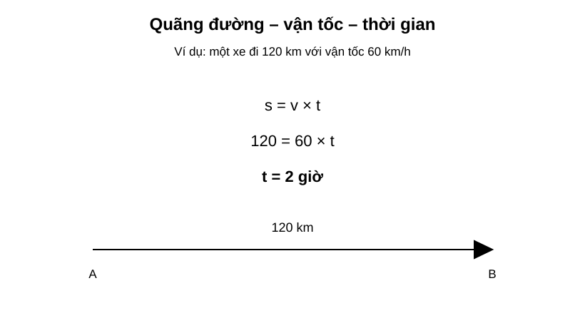
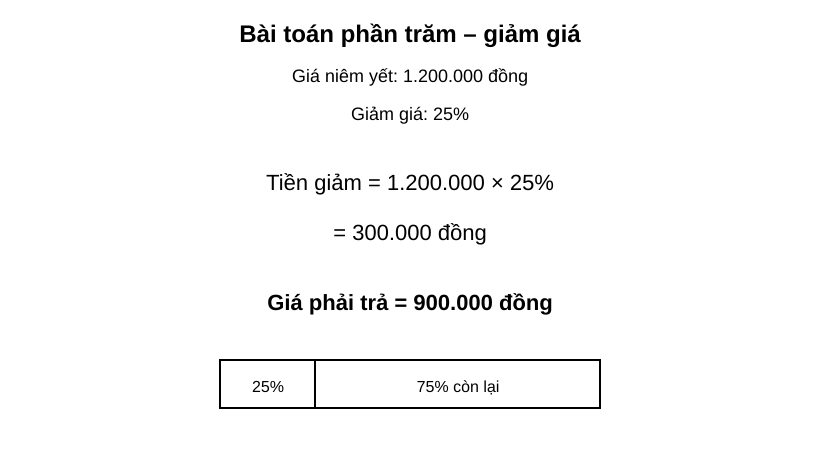
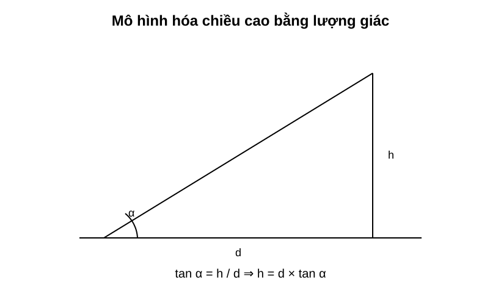

# Chuyên đề 24 – Bài toán thực tế và mô hình hóa

> **Trạng thái:** Nội dung cốt lõi đã hoàn thiện theo cấu trúc Roadmap.
>
> **Lớp trọng tâm:** 6–9  
> **Mạch kiến thức:** Liên môn/tổng hợp  
> **Mức ưu tiên:** ⭐⭐⭐⭐⭐

---

## 🧭 1. Bản đồ kiến thức

```text
BÀI TOÁN THỰC TẾ & MÔ HÌNH HÓA
│
├── Đọc và phân tích đề
│   ├── đại lượng đã biết
│   ├── đại lượng cần tìm
│   └── đơn vị / điều kiện
│
├── Chọn mô hình
│   ├── công thức
│   ├── phương trình / hệ phương trình
│   ├── lượng giác / hình học
│   └── thống kê / xác suất
│
├── Giải mô hình
│   └── biến đổi và tính toán
│
├── Kiểm tra
│   ├── điều kiện nghiệm
│   ├── đơn vị
│   └── tính hợp lý
│
└── Diễn giải kết quả
    └── trả lời đúng ngữ cảnh thực tế
```

Mạch tư duy trọng tâm:

**tình huống thực tế → mô hình toán học → lời giải → kiểm tra → kết luận thực tế.**

---

## Minh họa trực quan

### 1. Bài toán quãng đường – vận tốc – thời gian

<p align="center">
  
</p>

Ba công thức cơ bản:

`S = v × t`

`v = S / t`

`t = S / v`

Trong ví dụ:

- quãng đường `S = 120 km`;
- vận tốc `v = 60 km/h`;
- thời gian:

`t = 120 / 60 = 2 giờ`

> Khi giải bài chuyển động, phải đổi các đơn vị về cùng hệ trước khi tính.

---

### 2. Bài toán phần trăm – giảm giá

<p align="center">
  
</p>

Ví dụ một sản phẩm giá `1.200.000 đồng`, giảm `25%`.

Tiền giảm:

`1.200.000 × 25% = 300.000 đồng`

Giá phải trả:

`1.200.000 - 300.000 = 900.000 đồng`

Có thể tính nhanh:

`Giá sau giảm = giá ban đầu × (100% - tỉ lệ giảm)`

Trong ví dụ:

`1.200.000 × 75% = 900.000 đồng`

---

### 3. Mô hình hóa chiều cao bằng lượng giác

<p align="center">
  
</p>

Nếu biết:

- khoảng cách ngang `d`;
- góc nâng `α`;
- chiều cao cần tìm `h`;

thì:

`tan α = h / d`

suy ra:

`h = d × tan α`

Trong bài toán thực tế, nếu góc được đo từ tầm mắt người quan sát thì có thể cần **cộng thêm chiều cao mắt** vào kết quả.

---

### Mô hình hóa toán học là gì?

> Mô hình hóa toán học là quá trình chuyển một tình huống thực tế thành bài toán toán học, giải bài toán đó rồi diễn giải kết quả trở lại thực tế.

Một bài toán thực tế thường gồm ba lớp:

```text
Tình huống thực tế
      ↓
Mô hình toán học
      ↓
Kết quả toán học
      ↓
Kết luận trong thực tế
```

---

### Quy trình giải bài toán thực tế

```text
1. Đọc đề và xác định đại lượng cần tìm
              ↓
2. Đặt ẩn và ghi rõ đơn vị
              ↓
3. Chuyển thông tin thành phương trình / công thức / hình vẽ
              ↓
4. Giải mô hình toán học
              ↓
5. Kiểm tra điều kiện và đơn vị
              ↓
6. Trả lời bằng câu kết luận phù hợp thực tế
```

---

### Bảng chọn công cụ toán học

| Dấu hiệu trong đề | Công cụ nên nghĩ tới |
|---|---|
| Quãng đường, vận tốc, thời gian | `S = v × t` |
| Năng suất, khối lượng công việc, thời gian | Phương trình / hệ phương trình |
| Giá gốc, tăng giá, giảm giá | Tỉ lệ và phần trăm |
| Tuổi, số lượng, quan hệ giữa hai đại lượng | Lập phương trình |
| Hai đại lượng chưa biết | Hệ phương trình |
| Chiều cao, khoảng cách, góc nâng | Lượng giác |
| Diện tích, thể tích, vật liệu | Công thức hình học |
| Số liệu thực tế | Thống kê / trung bình / biểu đồ |

---

### Ba bước quan trọng khi đặt ẩn

1. **Chọn đại lượng hợp lý** để đặt ẩn.
2. **Ghi điều kiện của ẩn** ngay khi đặt.
3. **Ghi đơn vị** nếu đại lượng có đơn vị.

Ví dụ:

`Gọi x (km/h) là vận tốc của xe, x > 0.`

Không nên chỉ viết:

`Gọi x là vận tốc.`

---

### Kiểm tra tính hợp lý của kết quả

Sau khi tính xong, cần tự hỏi:

- kết quả có đúng đơn vị không?
- có thỏa mãn điều kiện của ẩn không?
- có hợp lý với tình huống thực tế không?
- có cần làm tròn số không?
- đề yêu cầu trả lời theo đơn vị nào?

Ví dụ:

Nếu tính được thời gian đi `120 km` với vận tốc `60 km/h` là `-2 giờ`, kết quả chắc chắn sai vì thời gian không thể âm.

---

### Mẹo đọc đề dài

Khi gặp đề nhiều chữ, có thể lập bảng:

| Đại lượng | Đã biết | Chưa biết |
|---|---:|---:|
| Quãng đường | ... | ... |
| Vận tốc | ... | ... |
| Thời gian | ... | ... |

Hoặc gạch chân:

- **số liệu**;
- **đơn vị**;
- **quan hệ giữa các đại lượng**;
- **câu hỏi cuối cùng**.

---

### Sai lầm thường gặp

- Không đổi đơn vị trước khi tính.
- Đặt ẩn nhưng quên điều kiện.
- Lập đúng phương trình nhưng trả lời sai đại lượng đề hỏi.
- Tính phần trăm theo sai giá trị gốc.
- Có nghiệm toán học nhưng nghiệm không phù hợp thực tế.
- Quên làm tròn theo yêu cầu.

---

## 🎯 2. Mục tiêu cần đạt

Sau khi hoàn thành chuyên đề, học sinh cần:

- [ ] Tách được dữ kiện, đại lượng cần tìm và quan hệ trong một đề thực tế.
- [ ] Đặt ẩn đúng, có điều kiện và đơn vị.
- [ ] Chọn được mô hình phù hợp: công thức, phương trình, hệ, lượng giác, thống kê hoặc xác suất.
- [ ] Lập và giải được mô hình toán học.
- [ ] Kiểm tra nghiệm theo điều kiện và bối cảnh thực tế.
- [ ] Đổi đơn vị và làm tròn đúng yêu cầu.
- [ ] Viết câu trả lời cuối cùng đúng đại lượng đề hỏi.

---

## 📖 3. Kiến thức cốt lõi

### 3.1. Mô hình hóa toán học

Mô hình hóa là quá trình biến một tình huống thực tế thành ngôn ngữ toán học.

Một lời giải đầy đủ thường có 4 lớp:

1. **Tình huống thực tế**
2. **Mô hình toán học**
3. **Giải mô hình**
4. **Diễn giải kết quả**

### 3.2. Đọc đề theo đại lượng

Với đề nhiều chữ, hãy lập bảng:

| Đại lượng | Đã biết | Chưa biết | Đơn vị |
|---|---:|---:|---|
| Quãng đường | ... | ... | km |
| Vận tốc | ... | ... | km/h |
| Thời gian | ... | ... | h |

Cách này giúp tránh bỏ sót dữ kiện.

### 3.3. Đặt ẩn

Một cách đặt ẩn tốt cần có:
- đại lượng rõ ràng;
- đơn vị;
- điều kiện.

Ví dụ:

`Gọi x (km/h) là vận tốc của xe, x > 0.`

### 3.4. Bài toán chuyển động

Ba công thức cơ bản:

`S = v × t`

`v = S/t`

`t = S/v`

Luôn đổi đơn vị trước khi lập phương trình.

### 3.5. Bài toán năng suất

Mô hình cơ bản:

`Công việc = năng suất × thời gian`

Nếu hoàn thành toàn bộ công việc thì có thể quy ước:

`Công việc = 1`

Ví dụ một người làm một mình hết `a` giờ thì năng suất là:

`1/a`

### 3.6. Bài toán phần trăm

Nếu tăng `p%`:

`giá mới = giá cũ × (1 + p%)`

Nếu giảm `p%`:

`giá mới = giá cũ × (1 - p%)`

Cần đặc biệt chú ý **giá trị gốc** mà phần trăm được tính trên đó.

### 3.7. Bài toán lập phương trình / hệ

Dùng phương trình khi có một đại lượng chưa biết chính.

Dùng hệ phương trình khi có hai đại lượng chưa biết liên hệ với nhau.

Quy trình:
1. đặt ẩn;
2. lập quan hệ;
3. giải;
4. kiểm tra điều kiện;
5. kết luận.

### 3.8. Bài toán hình học thực tế

Các công cụ thường dùng:
- diện tích;
- thể tích;
- Pythagore;
- lượng giác;
- đồng dạng.

Ví dụ tính chiều cao:

`h = d × tan α`

### 3.9. Bài toán dữ liệu

Có thể cần:
- đọc bảng / biểu đồ;
- tính trung bình;
- tính phần trăm;
- so sánh dữ liệu;
- đưa ra nhận xét.

### 3.10. Kiểm tra kết quả

Sau khi có đáp số, cần kiểm tra:
- có đúng đơn vị không;
- có thỏa điều kiện của ẩn không;
- có hợp lý về độ lớn không;
- có cần làm tròn không;
- câu trả lời có đúng đại lượng đề hỏi không.

### 3.11. Bảng chọn mô hình

| Dấu hiệu trong đề | Mô hình nên dùng |
|---|---|
| quãng đường – vận tốc – thời gian | `S = vt` |
| năng suất – thời gian | `A = nt` |
| tăng/giảm giá | phần trăm |
| một đại lượng chưa biết | phương trình |
| hai đại lượng chưa biết | hệ phương trình |
| chiều cao – khoảng cách – góc | lượng giác |
| diện tích – thể tích | công thức hình học |
| bảng / biểu đồ / số liệu | thống kê |
| khả năng xảy ra | xác suất |

---

## 🔗 4. Kiến thức liên quan

- **Kiến thức nên ôn trước:** các chuyên đề nền từ [02 – Số và phép tính](../02-so-hoc/) đến [23 – Xác suất](../23-xac-suat/)
- **Liên hệ mạnh:** phương trình, hệ phương trình, phần trăm, lượng giác, thống kê, xác suất.
- **Chuyên đề sử dụng tiếp:** [25 – Tổng hợp ôn thi vào 10](../25-tong-hop-on-thi-10/)

---

## 🧩 5. Các dạng bài cần nắm vững

### Dạng 1. Chuyển động

Dùng `S = vt`, lập phương trình từ thời gian hoặc quãng đường.

### Dạng 2. Năng suất – công việc

Dùng `công việc = năng suất × thời gian`.

### Dạng 3. Phần trăm – tăng giảm giá

Xác định đúng giá trị gốc rồi áp dụng tỉ lệ phần trăm.

### Dạng 4. Tuổi – số lượng – quan hệ đại lượng

Đặt ẩn rồi lập phương trình hoặc hệ.

### Dạng 5. Hình học thực tế

Tính chiều cao, khoảng cách, diện tích, thể tích bằng công thức phù hợp.

### Dạng 6. Dữ liệu thực tế

Đọc bảng, biểu đồ, tính trung bình hoặc phần trăm và rút ra kết luận.

### Dạng 7. Xác suất thực tế

Xác định phép thử, không gian mẫu và biến cố.

### Dạng 8. Bài tổng hợp nhiều bước

Kết hợp nhiều chuyên đề, ví dụ:
- phần trăm + phương trình;
- lượng giác + hình học;
- thống kê + phần trăm.

---

## 🚀 6. Dạng bài thi vào lớp 10

Đây là nhóm bài có mức độ xuất hiện cao trong đề thi vào 10 vì kiểm tra khả năng vận dụng toán học vào tình huống thực tế.

Các kỹ năng cần chắc:
1. Đọc đề dài và tóm tắt dữ kiện.
2. Đặt ẩn có điều kiện.
3. Lập đúng phương trình hoặc hệ.
4. Chọn đúng công thức hình học / lượng giác.
5. Xử lý phần trăm và đơn vị.
6. Kiểm tra nghiệm và trả lời theo ngữ cảnh.

Mức ưu tiên ôn thi: **⭐⭐⭐⭐⭐**.

---

## ⚠️ 7. Lỗi sai thường gặp

| Lỗi sai | Cách tránh |
|---|---|
| Không đổi đơn vị trước khi tính | Đưa tất cả về cùng hệ đơn vị |
| Đặt ẩn không có điều kiện | Ghi điều kiện ngay khi đặt |
| Lập phương trình đúng nhưng giải sai đại lượng đề hỏi | Đọc lại câu hỏi cuối |
| Tính phần trăm trên sai giá trị gốc | Xác định rõ “phần trăm của cái gì” |
| Nhận nghiệm không phù hợp thực tế | Thế lại điều kiện |
| Làm tròn quá sớm | Chỉ làm tròn ở bước cuối |
| Quên đơn vị ở đáp số | Ghi đơn vị trong kết luận |
| Có kết quả nhưng không viết câu trả lời | Luôn kết thúc bằng một câu theo ngữ cảnh |

---

## 📝 8. Luyện tập

### Mức 1 – Nhận biết

1. Viết ba công thức liên hệ `S, v, t`.
2. Một sản phẩm giảm `20%`. Viết công thức tính giá mới từ giá cũ.
3. Khi đặt ẩn cho vận tốc, cần ghi điều kiện gì?

### Mức 2 – Thông hiểu

4. Một xe đi `150 km` với vận tốc `50 km/h`. Tính thời gian.
5. Một sản phẩm giá `800.000 đồng`, giảm `15%`. Tính giá phải trả.
6. Một công việc làm một mình hết `5 giờ`. Năng suất mỗi giờ là bao nhiêu phần công việc?

### Mức 3 – Vận dụng

7. Một xe đi nhanh hơn xe khác `10 km/h` và đến sớm hơn trong cùng quãng đường. Hãy đặt ẩn và lập phương trình.
8. Một tòa nhà được nhìn từ điểm cách chân `30 m` dưới góc nâng `40°`. Lập biểu thức tính chiều cao.
9. Hai loại vé có tổng số vé và tổng doanh thu đã biết. Hãy đặt hai ẩn và lập hệ phương trình.

### Mức 4 – Tổng hợp

10. Một cửa hàng giảm giá rồi tiếp tục giảm thêm một tỉ lệ khác. Tính giá cuối và giải thích vì sao không cộng trực tiếp hai tỉ lệ.
11. Một bài chuyển động có hai giai đoạn với vận tốc khác nhau. Hãy lập mô hình và tính thời gian tổng.
12. Một bài thực tế yêu cầu dùng lượng giác để tìm độ dài rồi dùng công thức diện tích để tính chi phí.

---

## ✅ 9. Tự kiểm tra

Hãy tự trả lời không nhìn tài liệu:

1. Mô hình hóa toán học gồm những bước chính nào?
2. Khi nào nên dùng phương trình? Khi nào nên dùng hệ?
3. Vì sao phải ghi điều kiện của ẩn?
4. Công thức cơ bản của bài chuyển động là gì?
5. Công thức cơ bản của bài năng suất là gì?
6. Khi tính phần trăm, cần xác định điều gì trước?
7. Sau khi giải xong, cần kiểm tra những gì?
8. Vì sao câu trả lời cuối cùng phải quay lại ngữ cảnh thực tế?

**Tiêu chí đạt:** đúng ít nhất `7/8` câu và giải được một bài thực tế có đầy đủ đặt ẩn – lập mô hình – kiểm tra – kết luận.

---

## 🔄 10. Liên kết Roadmap

- **← Trước:** [02 – Số và phép tính](../02-so-hoc/) → [23 – Xác suất](../23-xac-suat/)
- **→ Tiếp theo:** [25 – Tổng hợp ôn thi vào 10](../25-tong-hop-on-thi-10/)

Xem toàn bộ hệ thống tại [Blueprint 25 chuyên đề](../../roadmap/blueprint-25-chuyen-de.md).

---

## 🏁 11. Điều kiện hoàn thành

Chuyên đề được xem là hoàn thành khi học sinh:

- [ ] Đọc và tóm tắt đúng dữ kiện.
- [ ] Đặt ẩn có điều kiện và đơn vị.
- [ ] Chọn đúng mô hình toán học.
- [ ] Giải và kiểm tra được nghiệm.
- [ ] Đổi đơn vị và làm tròn đúng yêu cầu.
- [ ] Viết được câu kết luận đúng ngữ cảnh.
- [ ] Đạt ít nhất `7/8` câu tự kiểm tra.
