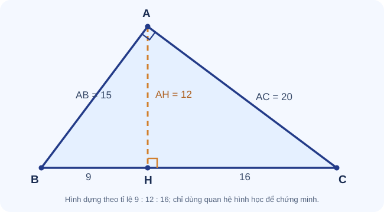

# Bài mỏ neo A25-004 – Đường cao trong tam giác vuông

> **Mạch:** Đồng dạng → hệ thức lượng · **Lớp:** 8–9 · **Vai trò:** Hình học học thuật, không phải mẹo thi.  
> **Đề tương ứng:** Đề luyện 01 – Bài IV.

## Đề gốc

Tam giác \(ABC\) vuông tại \(A\), đường cao \(AH\perp BC\), \(H\in BC\). Cho \(BH=9\), \(HC=16\). Tính \(BC, AH, AB, AC\) và diện tích tam giác \(ABC\).

*Hình có cấu trúc dựng đúng tỉ lệ 9–12–16. Hãy quan sát ba tam giác nhỏ/lớn; không dùng việc đo độ dài trên màn hình làm chứng minh.*

## Vì sao nên nghĩ tới đồng dạng?

Dữ kiện nằm trên **cạnh huyền** nhưng đại lượng hỏi nằm ở **đường cao và hai cạnh góc vuông**. Định lý Pythagore trực tiếp chưa đủ, vì chưa biết hai cạnh góc vuông. Đường cao \(AH\) tạo thành **ba tam giác đồng dạng**; đây là chiếc cầu nối dữ kiện với mục tiêu.

Chuỗi suy luận tiến: \(BH,HC\rightarrow BC\rightarrow\) đồng dạng \(\rightarrow AH^2=BH\cdot HC\rightarrow AB,AC\).

Suy luận lùi từ đích: Muốn tính \(AH\), hãy tìm một hệ thức chứa \(AH\) và hai đoạn đã biết. Muốn có \(AH^2=BH\cdot HC\), cần hai tam giác nhỏ đồng dạng.

## Ba mức gợi ý

Gợi ý 1 – Nhìn hình

Xác định cặp góc vuông và một cặp góc nhọn bằng nhau trong \(\triangle ABH\) và \(\triangle CAH\).

Gợi ý 2 – Lập quan hệ

Viết đúng thứ tự \(\triangle ABH\sim\triangle CAH\), suy ra \(\dfrac{BH}{AH}=\dfrac{AH}{CH}\).

Gợi ý 3 – Tính

Trước hết \(BC=BH+HC=25\). Sau đó tính \(AH\), rồi dùng \(AB^2=BH\cdot BC\), \(AC^2=CH\cdot BC\).

## Lời giải chi tiết

**Bước 1.** Vì \(B,H,C\) thẳng hàng, \(BC=BH+HC=9+16=25\).

**Bước 2.** Do \(AH\perp BC\), ta có \(\angle AHB=\angle CHA=90^\circ\). Mặt khác \(\angle ABH=\angle CAH\) vì cùng phụ với \(\angle ACB\). Suy ra theo góc–góc:
\[
\triangle ABH\sim\triangle CAH.
\]
Thứ tự tương ứng là \(A\leftrightarrow C\), \(B\leftrightarrow A\), \(H\leftrightarrow H\); do đó
\[
\frac{BH}{AH}=\frac{AH}{CH}\quad\Rightarrow\quad AH^2=BH\cdot CH.
\]
Suy ra \(AH^2=9\cdot16=144\). Vì \(AH\) là độ dài nên \(AH=12\).

**Bước 3.** Từ \(\triangle ABH\sim\triangle CBA\), có \(AB^2=BH\cdot BC\); tương tự \(AC^2=CH\cdot BC\). Vì vậy
\[
AB=\sqrt{9\cdot25}=15,\qquad AC=\sqrt{16\cdot25}=20.
\]

**Bước 4.** Kiểm tra bằng Pythagore: \(15^2+20^2=625=25^2\). Diện tích:
\[
S_{ABC}=\frac12 AB\cdot AC=\frac12\cdot15\cdot20=150.
\]
Cũng có thể kiểm tra bằng \(S_{ABC}=\frac12 BC\cdot AH=150\).

## Tư duy tổng kết

- Đừng **nhớ hệ thức nhưng không biết vì sao đúng**: các hệ thức lượng là hệ quả của đồng dạng.
- **Thứ tự tam giác** quyết định tỷ số cạnh; viết sai thứ tự dễ sinh hệ thức sai.
- Với số liệu mới \(BH=p,CH=q>0\), công thức khái quát:
\[
BC=p+q,\quad AH=\sqrt{pq},\quad AB=\sqrt{p(p+q)},\quad AC=\sqrt{q(p+q)}.
\]
- Hình vẽ giúp nhận diện tam giác tương ứng; lập luận hình học mới tạo thành chứng minh.

## Biến thể tự luyện

1. \(BH=4,CH=9\). Tính \(AH,BC\). **Đối chiếu:** \(6,13\).
2. \(AH=6,BH=4\). Tính \(CH,BC\). **Đối chiếu:** \(9,13\).
3. Chứng minh \(AH\le BC/2\) và chỉ ra dấu bằng. **Gợi ý:** \(4BH\cdot CH\le(BH+CH)^2\). Dấu bằng khi \(BH=CH\).

[Trở về kho bài mỏ neo](kho-bai-mo-neo.md) · [CĐ17 Đồng dạng](../17-thales-dong-dang/index.md) · [CĐ18 Hệ thức lượng](../18-he-thuc-luong/index.md) · [Đề 01](de-luyen-01.md)
