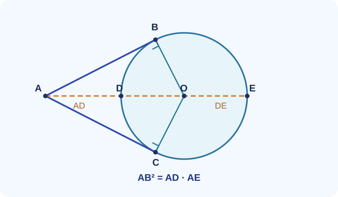

# Bài mỏ neo A25-008 – Tiếp tuyến và cát tuyến

> **Mạch:** Đường tròn – đồng dạng · **Lớp:** 9 · **Đề tương ứng:** Đề luyện 02 – Bài IV.

## Đề gốc

Từ \(A\) ngoài đường tròn \((O)\), kẻ các tiếp tuyến \(AB,AC\) tại \(B,C\). Cát tuyến qua \(A\) cắt đường tròn tại \(D,E\) theo đúng thứ tự \(A,D,E\); cát tuyến không qua \(B,C\). Chứng minh \(AB=AC\), tứ giác \(ABOC\) nội tiếp và
\[
AB^2=AD\cdot AE.
\]
Nếu \(AB=6\), \(AD=4\), tính \(AE\).

*Đường cam là cát tuyến. \(A,D,E\) thẳng hàng theo thứ tự đó; \(OB\perp AB\), \(OC\perp AC\). Hình chỉ minh họa cấu hình, không biểu diễn tỉ lệ 6:4:9 của câu số.*

## Tư duy tiến và tư duy lùi

**Tiến từ dữ kiện:** tiếp tuyến \(\rightarrow\) bán kính vuông góc \(\rightarrow\) hai tam giác vuông \(ABO,ACO\) bằng nhau, và hai góc đối tứ giác bù nhau.

**Lùi từ mục tiêu:** muốn có \(AB^2=AD\cdot AE\), hãy tìm hai tam giác có tỷ số \(AB/AE=AD/AB\). Dấu hiệu “bình phương tiếp tuyến = tích hai đoạn cát tuyến” dẫn tới \(\triangle ABD\) và \(\triangle AEB\).

## Ba mức gợi ý

Gợi ý 1

Tô góc \(\angle ABD\) giữa tiếp tuyến \(BA\) và dây \(BD\), rồi tìm góc nội tiếp cùng chắn dây \(BD\).

Gợi ý 2

Vì \(A,D,E\) thẳng hàng và \(A\) nằm ngoài trước \(D\), tia \(EA\) trùng hướng tia \(ED\); dùng \(\angle ABD=\angle BEA\).

Gợi ý 3

Viết \(\triangle ABD\sim\triangle AEB\), kiểm tra tương ứng \(A\leftrightarrow A\), \(B\leftrightarrow E\), \(D\leftrightarrow B\).

## Lời giải chi tiết

**1. Hai tiếp tuyến bằng nhau.** Vì \(OB\perp AB\), \(OC\perp AC\), hai tam giác \(ABO\) và \(ACO\) đều vuông; có cạnh huyền \(AO\) chung và \(OB=OC\) (bán kính). Hai tam giác bằng nhau theo cạnh huyền–cạnh góc vuông, suy ra \(AB=AC\).

**2. Tứ giác nội tiếp.** \(\angle ABO=\angle ACO=90^\circ\). Hai góc đối bù nhau, nên \(A,B,O,C\) cùng thuộc đường tròn đường kính \(AO\). Lưu ý đây **không phải** đường tròn \((O)\) ban đầu.

**3. Hệ thức tiếp tuyến–cát tuyến.** Do \(A,D,E\) thẳng hàng,
\[
\angle BAD=\angle EAB.
\]
Theo định lý góc giữa tiếp tuyến và dây cung \(BD\),
\[
\angle ABD=\angle BED=\angle BEA.
\]
Vì hai cặp góc tương ứng bằng nhau, \(\triangle ABD\sim\triangle AEB\). Viết tỷ số theo đúng thứ tự:
\[
\frac{AB}{AE}=\frac{AD}{AB}.
\]
Nhân chéo: \(AB^2=AD\cdot AE\).

**4. Thay số và kiểm tra vị trí.** \(AE=AB^2/AD=36/4=9\) cm. Vì \(9>4>0\), kết quả phù hợp với thứ tự \(A,D,E\).

## Tổng hợp về mặt tư duy

Tại sao bài này có nhiều ý? **Một hình vẽ – hai nguồn góc:** bán kính–tiếp tuyến tạo góc vuông để chứng minh nội tiếp; tiếp tuyến–dây cung tạo góc bằng nhau để chứng minh đồng dạng. Khi gặp yêu cầu tích đoạn thẳng, đừng bắt đầu bằng phép tính: hãy **truy ngược mục tiêu thành một tỷ số cạnh**.

Không dùng hình vẽ để suy ra góc bằng nhau nếu chưa chỉ rõ góc cùng chắn cung hoặc một định lý hợp lệ. Tránh lẫn đường tròn \((O)\) với đường tròn đường kính \(AO\).

## Biến thể tự luyện

1. \(AB=8,AD=4\), tính \(AE\). **Đối chiếu:** \(16\).
2. \(AD=5,AE=20\), tính \(AB\). **Đối chiếu:** \(10\).
3. Giải thích vì sao \(AD<AB<AE\) với cát tuyến không tiếp xúc ở \(D\) hay \(E\). **Gợi ý:** \(AB^2=AD\cdot AE\) và \(0<AD<AE\).

[Trở về kho bài mỏ neo](kho-bai-mo-neo.md) · [CĐ19 Đường tròn](../19-duong-tron/index.md) · [Đề 02](de-luyen-02.md)
