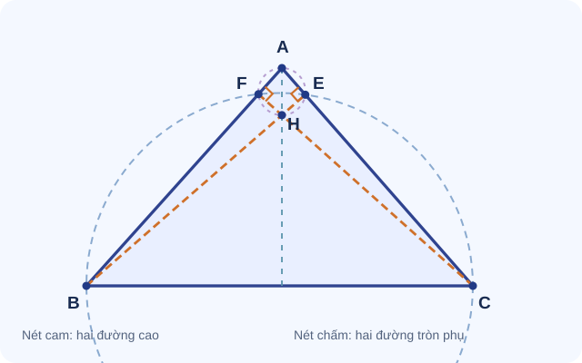

# Bài mỏ neo A25-009 – Trực tâm và hai đường tròn phụ

> **Mạch:** Đường cao → góc vuông → tứ giác nội tiếp → góc bằng nhau · **Lớp:** 9 · **Đề tương ứng:** Đề luyện 03 – Bài IV.

## Đề gốc

Trong tam giác nhọn \(ABC\), các đường cao \(BE\perp AC\), \(CF\perp AB\) cắt nhau tại \(H\), với \(E\in AC,F\in AB\).

1. Chứng minh \(B,E,C,F\) nội tiếp.
2. Chứng minh \(A,E,H,F\) nội tiếp.
3. Suy ra \(\angle BEF=\angle BCF\).

*Nét cam là hai đường cao; đường tròn nét chấm xanh đi qua \(B,E,C,F\), đường tròn nét chấm tím đi qua \(A,E,H,F\). Chúng là đường tròn **phụ**, không mặc nhiên là đường tròn ngoại tiếp tam giác \(ABC\).*

## Phân tích ngược từ mục tiêu

Muốn chứng minh \(\angle BEF=\angle BCF\), nhận thấy hai góc có chung cặp điểm đầu mút \(B,F\), nhưng đỉnh nằm ở \(E\) và \(C\). Hãy tự hỏi: **liệu \(B,E,C,F\) có nằm trên cùng một đường tròn không?**

Muốn chứng minh nội tiếp: tìm hai góc \(\angle BEC,\angle BFC\) cùng bằng \(90^\circ\). Hai đường cao đã cho đúng hai góc đó.

Điều này tạo thành chuỗi: **đường cao → góc vuông → đường tròn đường kính → hai góc nội tiếp cùng chắn dây**.

## Gợi ý có kiểm soát

Gợi ý 1 – Nhìn đường cao

Từ \(BE\perp AC\) và \(CF\perp AB\), đánh dấu hai góc vuông nào?

Gợi ý 2 – Nhận diện hai đường tròn

Các điểm nhìn đoạn \(BC\) dưới góc vuông nằm trên đường tròn đường kính \(BC\); tương tự với đoạn \(AH\).

Gợi ý 3 – Chứng minh góc

Viết \(\angle BEF,\angle BCF\) và xác định cả hai cùng chắn dây \(BF\) trên đường tròn thứ nhất.

## Lời giải chi tiết

**Bước 1 – Chứng minh \(B,E,C,F\) nội tiếp.** Vì \(E\in AC\), \(BE\perp AC\) nên \(\angle BEC=90^\circ\). Vì \(F\in AB\), \(CF\perp AB\) nên \(\angle BFC=90^\circ\). Hai điểm \(E,F\) cùng nhìn đoạn \(BC\) dưới góc vuông, vì thế chúng cùng nằm trên đường tròn đường kính \(BC\) (với \(B,C\) là hai đầu đường kính). Vậy \(B,E,C,F\) nội tiếp.

**Bước 2 – Chứng minh \(A,E,H,F\) nội tiếp.** Các điểm \(B,E,H\) thẳng hàng, \(A,E,C\) thẳng hàng nên \(\angle AEH=90^\circ\). Tương tự, \(C,F,H\) thẳng hàng, \(A,F,B\) thẳng hàng nên \(\angle AFH=90^\circ\). Suy ra \(E,F\) cùng thuộc đường tròn đường kính \(AH\); do đó \(A,E,H,F\) nội tiếp.

**Bước 3 – Suy ra góc.** Trên đường tròn đường kính \(BC\), hai góc nội tiếp \(\angle BEF\) và \(\angle BCF\) cùng chắn cung \(BF\) không chứa hai đỉnh \(E,C\). Vì vậy
\[
\boxed{\angle BEF=\angle BCF}.
\]

## Tư duy tổng kết

- **Không phải cứ có trực tâm là lập tức dùng đường tròn ngoại tiếp tam giác ABC.** Đường cao tạo ra hai đường tròn phụ dễ nhìn hơn.
- Khi đích là hai góc bằng nhau, hãy **đọc tên các điểm đầu mút**: chúng gợi ý dây/cung cần tìm.
- Hai đường tròn chỉ có thể được suy ra sau khi đã xác định đúng cặp góc vuông; hình ảnh không thay chứng minh.
- Với tam giác nhọn và chân đường cao nằm trong cạnh, ta tránh các trường hợp điểm trên phần kéo dài dễ làm đổi hướng tia/góc.

## Biến thể

1. Chỉ chứng minh \(B,E,C,F\) nội tiếp, không dùng \(H\). **Đáp án:** dùng hai góc vuông.
2. Tìm thêm một cặp góc bằng nhau cùng chắn dây \(EF\). **Gợi ý:** \(\angle EBF=\angle ECF\) (nếu chọn đúng đỉnh trên cùng đường tròn).
3. Nếu tam giác không nhọn, hãy xét lại vị trí chân đường cao và dùng góc định hướng để viết các hệ thức; **không áp dụng máy móc kết luận góc không định hướng**.

[Trở về kho bài mỏ neo](kho-bai-mo-neo.md) · [CĐ19 Đường tròn](../19-duong-tron/index.md) · [Đề 03](de-luyen-03.md)
