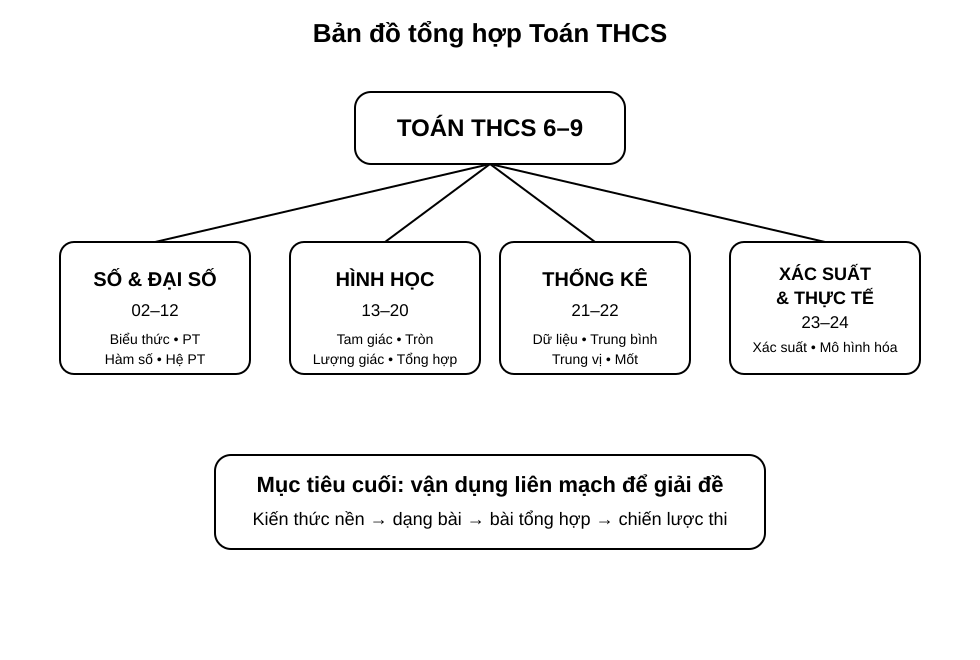
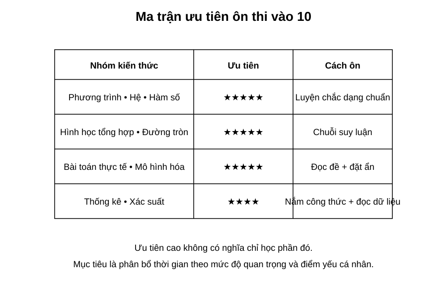
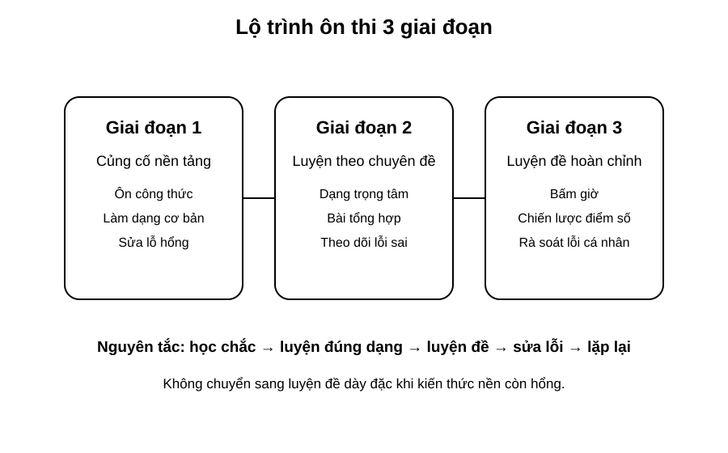

# Chuyên đề 25 – Bản đồ tổng hợp & chiến lược ôn thi vào 10

> **Trạng thái:** Nội dung tổng hợp và chiến lược ôn thi đã hoàn thiện theo cấu trúc Roadmap.
>
> **Lớp trọng tâm:** 9  
> **Mạch kiến thức:** Tổng hợp/Thi vào 10  
> **Mức ưu tiên:** ⭐⭐⭐⭐⭐

---

## 🧭 1. Bản đồ kiến thức

```text
TỔNG HỢP ÔN THI VÀO 10
│
├── Số & Đại số
│   ├── số và phép tính
│   ├── biểu thức – hằng đẳng thức
│   ├── phương trình – bất phương trình
│   ├── hệ phương trình
│   └── hàm số – đồ thị
│
├── Hình học
│   ├── góc – tam giác – tứ giác
│   ├── Thales – đồng dạng
│   ├── hệ thức lượng
│   ├── đường tròn
│   └── hình học tổng hợp
│
├── Thống kê & xác suất
│   ├── bảng – biểu đồ
│   ├── đại lượng đặc trưng
│   └── xác suất
│
└── Bài toán thực tế
    └── mô hình hóa – kiểm tra – kết luận
```

Mạch tư duy trọng tâm:

**hệ thống hóa kiến thức → xác định ưu tiên → luyện theo chuyên đề → luyện đề có bấm giờ → phân tích lỗi → quay lại đúng chuyên đề yếu.**

> **Lưu ý:** Cấu trúc đề, thang điểm và mức độ ưu tiên có thể khác theo tỉnh/thành và từng năm. Khi ôn giai đoạn cuối, luôn lấy **đề minh họa hoặc đề chính thức mới nhất của địa phương dự thi** làm căn cứ ưu tiên cuối cùng.

---

## Minh họa trực quan

### 1. Bản đồ tổng hợp Toán THCS

<p align="center">
  
</p>

> Đây là bức tranh tổng thể của toàn bộ lộ trình Toán THCS từ lớp 6 đến lớp 9.

Bốn mạch lớn cần nắm:

- **Số và Đại số**: biểu thức, hằng đẳng thức, phương trình, hệ phương trình, hàm số;
- **Hình học**: góc, tam giác, tứ giác, đường tròn, hệ thức lượng, bài hình tổng hợp;
- **Thống kê**: bảng số liệu, biểu đồ, số trung bình, trung vị, mốt;
- **Xác suất và bài toán thực tế**: không gian mẫu, biến cố, mô hình hóa.

Mục tiêu cuối cùng không phải chỉ “học hết từng chuyên đề”, mà là:

> kết nối kiến thức giữa các mạch để giải bài tổng hợp và bài thi hoàn chỉnh.

---

### 2. Ma trận ưu tiên ôn thi vào 10

<p align="center">
  
</p>

Ma trận này giúp phân bổ thời gian hợp lý.

Nhóm cần ưu tiên rất cao:

- phương trình, hệ phương trình, hàm số;
- hình học tổng hợp, đường tròn;
- bài toán thực tế và mô hình hóa.

Nhóm cũng rất quan trọng:

- thống kê;
- xác suất.

Lưu ý:

> Ưu tiên cao không có nghĩa là bỏ qua phần còn lại. Ý nghĩa của ma trận là giúp ta biết nên dành **nhiều thời gian hơn** cho những phần thường xuất hiện và dễ quyết định điểm số.

---

### 3. Lộ trình ôn thi 3 giai đoạn

<p align="center">
  
</p>

Ba giai đoạn nên đi theo thứ tự:

#### Giai đoạn 1 – Củng cố nền tảng
- ôn lại công thức và khái niệm;
- làm các dạng cơ bản;
- phát hiện lỗ hổng kiến thức.

#### Giai đoạn 2 – Luyện theo chuyên đề
- luyện bài trọng tâm của từng mạch;
- làm bài tổng hợp mức vừa;
- ghi lại lỗi sai thường gặp.

#### Giai đoạn 3 – Luyện đề hoàn chỉnh
- làm đề đủ thời gian;
- rèn chiến lược phân bổ thời gian;
- phân tích lỗi sau mỗi đề.

Nguyên tắc xuyên suốt:

> học chắc → luyện đúng dạng → luyện đề → sửa lỗi → lặp lại

---

### Chiến lược ôn thi vào 10

Một kế hoạch ôn tập hiệu quả thường có 4 trục:

| Trục ôn tập | Mục tiêu |
|---|---|
| Kiến thức nền | Nhớ đúng công thức, định lý, quy tắc |
| Dạng bài | Nhận diện nhanh bài thuộc chuyên đề nào |
| Kỹ năng trình bày | Làm bài rõ ràng, đủ bước, hạn chế mất điểm |
| Chiến lược phòng thi | Phân bổ thời gian, chọn câu làm trước |

---

### Phân bổ thời gian ôn tập gợi ý

Nếu đang ở giai đoạn ôn tập tổng lực, có thể tham khảo:

| Mảng nội dung | Tỉ lệ thời gian gợi ý |
|---|---:|
| Đại số trọng tâm | 30% |
| Hình học trọng tâm | 30% |
| Bài toán thực tế / mô hình hóa | 20% |
| Thống kê và xác suất | 10% |
| Rà soát lỗi, chữa đề | 10% |

Tỉ lệ này có thể điều chỉnh theo điểm mạnh – yếu cá nhân.

---

### Quy trình luyện một đề thi

```text
Làm đề trong thời gian thật
          ↓
Chấm và đánh dấu lỗi
          ↓
Phân loại lỗi:
- sai kiến thức
- sai kỹ năng
- sai do cẩu thả
          ↓
Ôn lại chuyên đề liên quan
          ↓
Làm lại câu sai
          ↓
Ghi vào sổ lỗi cá nhân
```

---

### Cách dùng “sổ lỗi sai”

Sau mỗi buổi học hoặc mỗi đề thi, nên ghi lại:

- câu sai thuộc chuyên đề nào;
- sai vì không nhớ kiến thức hay vì trình bày;
- cách sửa đúng;
- dấu hiệu nhận biết để lần sau tránh lặp lại.

Ví dụ bảng ghi nhanh:

| Câu sai | Chuyên đề | Nguyên nhân | Cách sửa |
|---|---|---|---|
| Câu 3 | Hệ phương trình | Thế sai dấu | Viết rõ từng bước biến đổi |
| Câu 5 | Đường tròn | Quên tính chất tiếp tuyến | Ôn lại bán kính vuông góc tiếp tuyến |

---

### Chiến lược làm bài trong phòng thi

1. Đọc nhanh toàn bộ đề để ước lượng độ khó.
2. Làm trước các câu chắc chắn lấy điểm.
3. Không dừng quá lâu ở một câu khó.
4. Với hình học, luôn vẽ hình cẩn thận và ghi giả thiết.
5. Chừa vài phút cuối để rà soát dấu, đơn vị, điều kiện.

---

### Checklist trước kỳ thi

- [ ] Ôn lại toàn bộ công thức trọng tâm.
- [ ] Làm lại các dạng bài thường sai.
- [ ] Có ít nhất một sổ lỗi sai cá nhân.
- [ ] Luyện vài đề hoàn chỉnh có bấm giờ.
- [ ] Chuẩn bị máy tính, dụng cụ học tập đầy đủ.
- [ ] Ngủ đủ và giữ tâm lý ổn định trước ngày thi.

---

### Điều quan trọng nhất ở chuyên đề cuối

> Chuyên đề 25 không bổ sung quá nhiều kiến thức mới. Vai trò chính là **hệ thống hóa**, **ưu tiên hóa**, và **biến kiến thức đã học thành chiến lược hành động rõ ràng**.

Nếu học sinh thực hiện tốt chuyên đề này, việc ôn thi sẽ:

- bớt rối;
- có thứ tự rõ ràng;
- tập trung đúng chỗ;
- tăng hiệu quả luyện đề.

---

## 🎯 2. Mục tiêu cần đạt

Sau khi hoàn thành chuyên đề, học sinh cần:

- [ ] Nhìn được toàn bộ 25 chuyên đề như một hệ thống liên kết.
- [ ] Xác định được nhóm kiến thức mạnh, yếu và mức ưu tiên ôn tập.
- [ ] Lập được kế hoạch ôn theo ba giai đoạn.
- [ ] Nhận diện nhanh dạng bài và chuyên đề liên quan khi đọc đề.
- [ ] Biết phân bổ thời gian làm bài theo cấu trúc đề thực tế.
- [ ] Có quy trình chữa đề và sổ lỗi sai cá nhân.
- [ ] Biết điều chỉnh chiến lược theo đề chính thức của địa phương dự thi.

---

## 📖 3. Kiến thức cốt lõi

### 3.1. Bốn mạch kiến thức lớn

**Số và Đại số**

Tập trung vào:
- số và phép tính;
- biểu thức;
- hằng đẳng thức và phân tích nhân tử;
- phương trình, bất phương trình;
- hệ phương trình;
- hàm số và đồ thị.

**Hình học**

Tập trung vào:
- góc và quan hệ đường thẳng;
- tam giác và các đường đặc biệt;
- tứ giác;
- Thales và đồng dạng;
- hệ thức lượng;
- đường tròn;
- hình học tổng hợp.

**Thống kê – xác suất**

Tập trung vào:
- bảng và biểu đồ;
- trung bình, trung vị, mốt;
- xác suất đơn giản và nhiều bước.

**Bài toán thực tế**

Tập trung vào:
- đọc đề dài;
- đặt ẩn;
- lập mô hình;
- kiểm tra nghiệm;
- trả lời theo ngữ cảnh.

### 3.2. Ba giai đoạn ôn tập

**Giai đoạn 1 – Củng cố nền**

Mục tiêu:
- lấp lỗ hổng;
- nhớ lại công thức;
- làm chắc bài cơ bản.

**Giai đoạn 2 – Luyện chuyên đề**

Mục tiêu:
- nhận diện dạng;
- tăng tốc độ;
- xử lý bài vận dụng vừa;
- hình thành sổ lỗi.

**Giai đoạn 3 – Luyện đề**

Mục tiêu:
- làm đề trong thời gian thật;
- quản lý thời gian;
- phát hiện lỗi hệ thống;
- điều chỉnh chiến lược.

### 3.3. Ma trận ưu tiên cá nhân

Không nên ôn mọi chuyên đề với thời lượng giống nhau.

Có thể phân loại:

| Nhóm | Ý nghĩa | Hành động |
|---|---|---|
| A | Hay thi + đang yếu | Ưu tiên cao nhất |
| B | Hay thi + đang khá | Luyện duy trì |
| C | Ít thi hơn + đang yếu | Bổ sung có chọn lọc |
| D | Ít thi hơn + đang chắc | Ôn rà soát |

Ma trận trên chỉ là khung. Cần điều chỉnh theo cấu trúc đề chính thức của địa phương.

### 3.4. Quy trình luyện một đề

1. Làm đề đúng thời gian quy định.
2. Chấm điểm khách quan.
3. Phân loại lỗi.
4. Tìm chuyên đề gốc gây ra lỗi.
5. Ôn lại kiến thức liên quan.
6. Làm lại câu sai không nhìn lời giải.
7. Ghi vào sổ lỗi.
8. Sau vài ngày, làm lại một câu tương tự.

### 3.5. Phân loại lỗi

Ba nhóm quan trọng:

**Sai kiến thức**
- quên công thức;
- dùng sai định lý;
- không nhận ra dạng bài.

**Sai kỹ năng**
- biến đổi chậm;
- trình bày thiếu bước;
- chọn phương pháp dài.

**Sai cẩu thả**
- sai dấu;
- sai số;
- quên điều kiện;
- quên đơn vị.

Mỗi loại lỗi cần một cách sửa khác nhau.

### 3.6. Chiến lược làm bài

Nguyên tắc chung:
- đọc toàn đề trước;
- làm câu chắc điểm trước;
- không mắc kẹt quá lâu;
- chừa thời gian kiểm tra;
- với hình học, ghi rõ giả thiết và kết luận;
- với bài thực tế, kiểm tra đơn vị và điều kiện.

### 3.7. Phân bổ thời gian

Tỉ lệ `30% – 30% – 20% – 10% – 10%` trong phần minh họa là **gợi ý tham khảo**, không phải công thức cố định.

Cần điều chỉnh theo:
- điểm mạnh/yếu cá nhân;
- thời gian còn lại;
- cấu trúc đề địa phương;
- kết quả các đề luyện gần nhất.

### 3.8. Chỉ số theo dõi tiến bộ

Sau mỗi tuần có thể theo dõi:

| Chỉ số | Cách đo |
|---|---|
| Điểm trung bình đề | Trung bình 3–5 đề gần nhất |
| Tỉ lệ câu cơ bản đúng | % câu nền tảng làm đúng |
| Số lỗi cẩu thả | Đếm mỗi đề |
| Số chuyên đề yếu | Danh sách A |
| Thời gian hoàn thành | So với thời gian quy định |

Mục tiêu không chỉ là tăng điểm mà còn là **giảm lỗi lặp lại**.

---

## 🔗 4. Kiến thức liên quan

- **Kiến thức nên ôn trước:** toàn bộ hệ thống từ [01 – Bản đồ chương trình](../01-ban-do-chuong-trinh/index.md) đến [24 – Bài toán thực tế](../24-bai-toan-thuc-te/index.md)
- **Vai trò:** tổng hợp, kết nối và chuyển toàn bộ kiến thức thành chiến lược ôn thi.
- **Chuyên đề sử dụng tiếp:** không có; đây là chuyên đề kết thúc Roadmap.

---

## 🧩 5. Các dạng bài cần nắm vững

### Dạng 1. Rà soát kiến thức nền

Tự kiểm tra công thức, định lý và quy tắc trọng tâm của từng mạch.

### Dạng 2. Nhận diện chuyên đề từ một câu hỏi

Đọc đề và xác định:
- chuyên đề chính;
- chuyên đề phụ;
- công cụ cần dùng.

### Dạng 3. Bài tổng hợp Đại số

Kết hợp biểu thức, phương trình, hệ, hàm số hoặc bài toán thực tế.

### Dạng 4. Bài tổng hợp Hình học

Kết hợp nội tiếp, đồng dạng, tiếp tuyến, hệ thức lượng và chứng minh hệ thức.

### Dạng 5. Thống kê – xác suất

Đọc bảng/biểu đồ, tính đại lượng đặc trưng hoặc xác suất.

### Dạng 6. Bài toán thực tế

Đặt ẩn, lập mô hình, kiểm tra nghiệm và kết luận.

### Dạng 7. Luyện đề hoàn chỉnh

Mục tiêu:
- tốc độ;
- độ chính xác;
- phân bổ thời gian;
- chiến lược bỏ qua/tạm hoãn câu khó.

### Dạng 8. Chữa đề và tái luyện

Không dừng ở việc xem đáp án. Phải:
- tự làm lại;
- ghi nguyên nhân sai;
- tìm bài tương tự;
- kiểm tra lại sau vài ngày.

---

## 🚀 6. Dạng bài thi vào lớp 10

Toàn bộ chuyên đề này hướng trực tiếp tới thi vào lớp 10.

Nhóm thường có vai trò lớn:
1. Đại số nền và phương trình/hệ.
2. Hàm số – đồ thị.
3. Bài toán thực tế.
4. Hình học tổng hợp và đường tròn.
5. Thống kê và xác suất.

Tuy nhiên:

> **Không nên coi một ma trận ưu tiên chung là cố định cho mọi địa phương.** Cấu trúc đề có thể khác theo tỉnh/thành và năm học.

Trước kỳ thi, cần đối chiếu:
- đề minh họa mới nhất;
- đề chính thức các năm gần đây;
- hướng dẫn hoặc cấu trúc do cơ quan giáo dục địa phương công bố.

Mức ưu tiên tổng thể của chuyên đề: **⭐⭐⭐⭐⭐**.

---

## ⚠️ 7. Lỗi sai thường gặp

| Lỗi sai | Cách tránh |
|---|---|
| Ôn dàn trải, không có ưu tiên | Dùng ma trận A–B–C–D |
| Chỉ làm đề mà không chữa | Bắt buộc phân loại lỗi sau mỗi đề |
| Xem lời giải rồi tưởng đã hiểu | Tự làm lại không nhìn lời giải |
| Dồn quá nhiều thời gian vào câu khó | Có giới hạn thời gian cho từng câu |
| Học thuộc nhưng không nhận dạng được dạng | Luyện bước “đọc đề → gọi tên chuyên đề” |
| Lặp lại lỗi cẩu thả | Ghi lỗi vào sổ và kiểm tra trước khi nộp |
| Dùng một chiến lược cho mọi tỉnh/thành | Điều chỉnh theo cấu trúc đề địa phương |
| Không theo dõi tiến bộ | Ghi điểm, thời gian và lỗi sau từng đề |

---

## 📝 8. Luyện tập

### Mức 1 – Nhận biết

1. Liệt kê bốn mạch kiến thức lớn của Roadmap.
2. Nêu ba giai đoạn ôn thi.
3. Nêu ba nhóm lỗi sau khi làm đề.

### Mức 2 – Thông hiểu

4. Một học sinh hay sai dấu nhưng nhớ đúng kiến thức. Đây là loại lỗi nào? Cách sửa?
5. Một học sinh yếu hình học tổng hợp nhưng đề địa phương thường có phần này lớn. Nên xếp vào nhóm ưu tiên nào?
6. Vì sao không nên chỉ làm đề mà không chữa đề?

### Mức 3 – Vận dụng

7. Lập ma trận A–B–C–D cho 8 chuyên đề dựa trên kết quả cá nhân.
8. Sau một đề thi thử, hãy phân loại 5 câu sai thành lỗi kiến thức, kỹ năng hoặc cẩu thả.
9. Lập kế hoạch 7 ngày gồm ôn chuyên đề, luyện đề và chữa lỗi.

### Mức 4 – Tổng hợp

10. Chọn một đề thi hoàn chỉnh, bấm giờ, chấm điểm và tạo báo cáo gồm: điểm, thời gian, lỗi, chuyên đề yếu, hành động sửa.
11. Sau 3 đề liên tiếp, so sánh các chỉ số và điều chỉnh kế hoạch tuần tiếp theo.
12. Dựa vào đề minh họa địa phương, điều chỉnh lại ma trận ưu tiên cá nhân.

---

## ✅ 9. Tự kiểm tra

Hãy tự trả lời không nhìn tài liệu:

1. Bốn mạch kiến thức lớn là gì?
2. Ba giai đoạn ôn thi là gì?
3. Sau mỗi đề cần phân loại những nhóm lỗi nào?
4. Vì sao cần sổ lỗi sai?
5. Nhóm A trong ma trận ưu tiên có đặc điểm gì?
6. Tỉ lệ thời gian gợi ý có phải cố định không?
7. Căn cứ nào nên dùng để điều chỉnh chiến lược theo địa phương?
8. Sau khi xem lời giải câu sai, bước tiếp theo quan trọng nhất là gì?

**Tiêu chí đạt:** đúng ít nhất `7/8` câu, có một ma trận ưu tiên cá nhân và hoàn thành ít nhất một chu trình `làm đề → chữa → làm lại → ghi lỗi`.

---

## 🔄 10. Liên kết Roadmap

- **← Hệ thống kiến thức:** [01 – Bản đồ chương trình](../01-ban-do-chuong-trinh/index.md) → [24 – Bài toán thực tế](../24-bai-toan-thuc-te/index.md)
- **→ Tiếp theo:** quay lại các chuyên đề được xếp nhóm ưu tiên A/B theo kết quả luyện đề.
- **🏁 Kết thúc Roadmap:** dùng chuyên đề này như bảng điều khiển ôn tập.

Xem toàn bộ hệ thống tại [Blueprint 25 chuyên đề](../../roadmap/blueprint-25-chuyen-de.md).

---

## 🏁 11. Điều kiện hoàn thành

Chuyên đề được xem là hoàn thành khi học sinh:

- [ ] Có bản đồ tổng hợp các mạch kiến thức.
- [ ] Có ma trận ưu tiên cá nhân.
- [ ] Có kế hoạch ôn theo ba giai đoạn.
- [ ] Có sổ lỗi sai và quy trình chữa đề.
- [ ] Biết phân loại lỗi kiến thức – kỹ năng – cẩu thả.
- [ ] Biết điều chỉnh chiến lược theo cấu trúc đề địa phương.
- [ ] Đạt ít nhất `7/8` câu tự kiểm tra.
- [ ] Hoàn thành được một đề có bấm giờ và phân tích lại đầy đủ.
